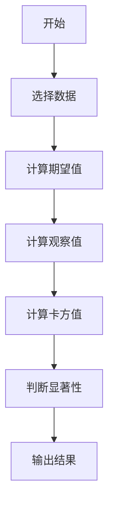
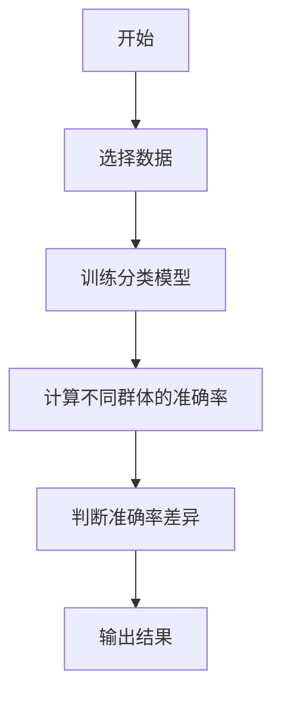
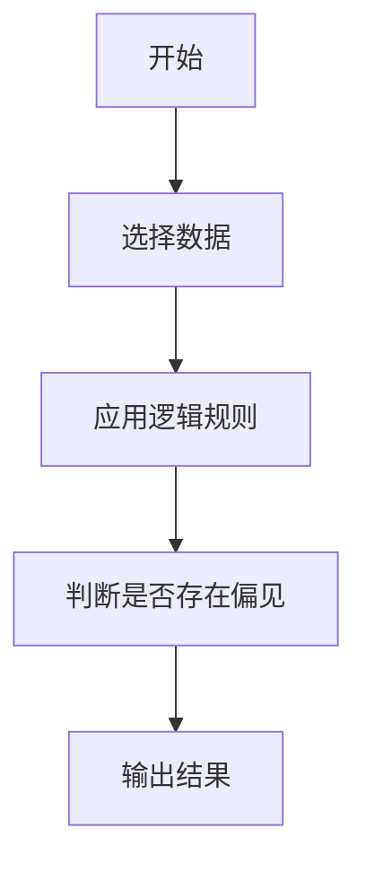
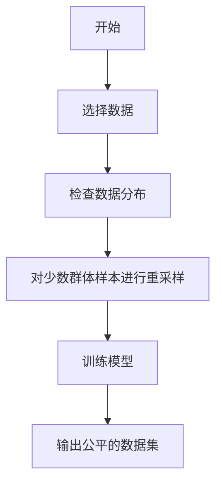
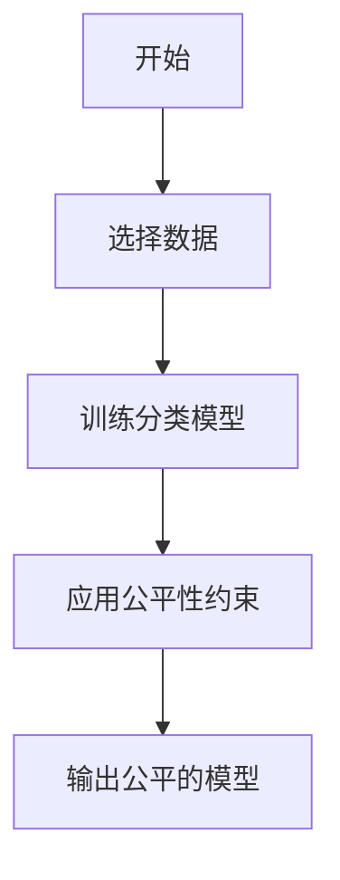
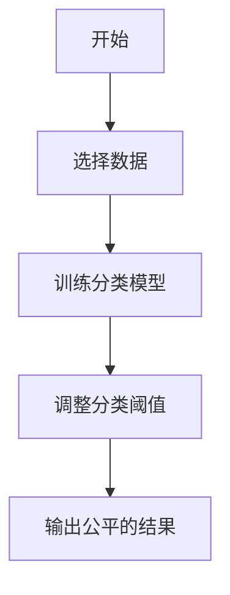
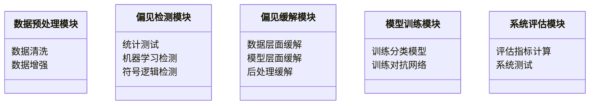
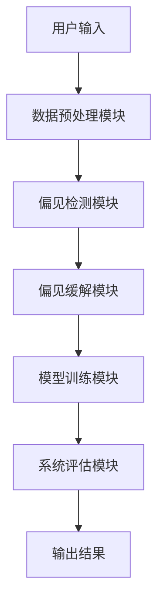
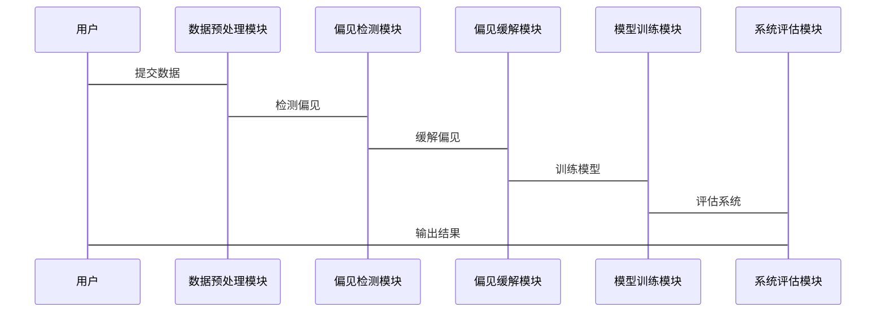

                 


```markdown
# 偏见检测与缓解：确保AI Agent的公平性

> 关键词：偏见检测，公平性，AI系统，算法公平性，数据偏差

> 摘要：本文深入探讨了AI系统中的偏见问题，分析了偏见检测与缓解的核心原理，通过统计学、机器学习和符号逻辑方法，结合数学模型和实际案例，详细阐述了如何构建公平的AI Agent。文章内容涵盖偏见的定义、检测方法、缓解策略、系统架构设计以及项目实战，旨在为AI开发者和研究人员提供实用的技术指导。

---

## 第1章: 偏见的定义与问题背景

### 1.1 偏见的定义与来源

#### 1.1.1 什么是偏见
偏见是指在数据或模型中存在的一种系统性误差，导致AI系统在决策过程中不公平地对待某些群体。例如，在招聘系统中，如果数据集中女性的录用比例远低于男性，系统可能会在推荐时偏好男性候选人。

#### 1.1.2 偏见的来源分析
- 数据偏差：训练数据中的代表性不足，例如数据集中女性的样本数量远少于男性。
- 算法偏差：算法设计中引入的偏见，例如分类模型在某些类别上表现不佳。
- 环境偏差：模型部署后受到的环境影响，例如用户输入的数据存在偏见。

#### 1.1.3 偏见在AI系统中的表现形式
- 分类错误率差异：某些群体的分类错误率显著高于其他群体。
- 推荐系统偏差：用户收到的推荐结果不公平，某些群体的权益被忽视。
- 自然语言处理中的偏见：生成的文本带有性别或其他社会群体的偏见。

### 1.2 偏见检测与缓解的必要性

#### 1.2.1 偏见对AI系统的负面影响
- 公平性问题：可能导致对某些群体的不公平对待。
- 伦理问题：违背社会公平正义的原则。
- 社会信任问题：用户可能失去对AI系统的信任。

#### 1.2.2 社会公平性与伦理问题
AI系统被广泛应用于招聘、司法、医疗等领域，偏见可能导致严重后果。例如，在司法领域，偏见可能导致错误的判决，影响个人的自由和权利。

#### 1.2.3 偏见检测与缓解的行业需求
随着AI技术的广泛应用，检测和缓解偏见已成为行业和社会的需求。企业和开发者需要确保AI系统的决策过程是公平和透明的。

### 1.3 问题描述与解决目标

#### 1.3.1 偏见检测的核心问题
- 如何识别数据或模型中存在的偏见。
- 如何量化偏见的程度。

#### 1.3.2 偏见缓解的目标设定
- 减少或消除数据或模型中的偏见。
- 确保AI系统在决策过程中对所有群体一视同仁。

#### 1.3.3 边界与外延分析
- 数据层面的偏见：解决数据中的代表性不足问题。
- 模型层面的偏见：确保模型预测的公平性。
- 系统层面的偏见：考虑整个系统的决策过程是否公平。

### 1.4 核心概念与联系

#### 1.4.1 偏见检测与缓解的原理
- 偏见检测：识别数据或模型中存在的偏见。
- 偏见缓解：消除或减少偏见，确保公平性。

#### 1.4.2 偏见检测与缓解方法对比表格

| 方法类型       | 偏见检测         | 偏见缓解         |
|----------------|-----------------|-----------------|
| 数据层面       | 检查数据分布     | 重采样技术       |
| 模型层面       | 检测模型预测偏差 | 对抗训练         |
| 后处理层面     | 检测输出结果偏差 | 调整分类阈值       |

#### 1.4.3 ER实体关系图架构
```mermaid
er
  actor: 用户
  agent: AI代理
  bias: 偏见
  data: 数据
  model: 模型
  task: 任务
  action: 行动
  outcome: 结果
```

---

## 第2章: 偏见检测的核心原理

### 2.1 偏见检测的基本原理

#### 2.1.1 统计学方法
- **卡方检验**：用于检测两个变量之间是否存在显著的关联性。
- **独立性检验**：用于检测变量之间的独立性，判断是否存在偏见。

#### 2.1.2 机器学习方法
- **分类模型**：训练一个模型，检测不同群体在模型中的分类表现是否一致。
- **概率估计**：估计每个群体在某个事件上的概率，判断是否存在显著差异。

#### 2.1.3 符号逻辑方法
- **逻辑推理**：通过逻辑规则，判断数据或模型中是否存在偏见。

### 2.2 偏见检测的数学模型

#### 2.2.1 统计测试方法
- 卡方检验公式：
  $$
  \chi^2 = \sum \frac{(O - E)^2}{E}
  $$
  其中，O是观察频数，E是期望频数。

#### 2.2.2 机器学习模型
- 分类模型的公平性评估：
  - 真阳性率和真阴性率的差异。
  - 基于不同群体的分类准确率差异。

#### 2.2.3 符号逻辑模型
- 基于逻辑规则的偏见检测：
  - 如果数据集中某个群体的数量远低于总体比例，则可能存在偏见。

### 2.3 偏见检测的算法流程图

#### 2.3.1 统计测试方法流程图


#### 2.3.2 机器学习方法流程图


#### 2.3.3 符号逻辑方法流程图


---

## 第3章: 偏见缓解的核心方法

### 3.1 偏见缓解的基本方法

#### 3.1.1 数据层面的缓解方法
- **重采样技术**：通过调整数据集中的样本数量，平衡不同群体的样本数量。
- **数据增强**：通过生成新数据，增加数据的多样性。

#### 3.1.2 模型层面的缓解方法
- **对抗训练**：通过设计对抗网络，减少模型中的偏见。
- **公平性约束**：在模型训练过程中，加入公平性约束，确保模型预测的公平性。

#### 3.1.3 后处理层面的缓解方法
- **分类阈值调整**：通过调整分类阈值，平衡不同群体的分类准确率。
- **结果过滤**：过滤掉不公平的结果，确保输出结果的公平性。

### 3.2 偏见缓解的数学模型

#### 3.2.1 数据层面的数学模型
- 重采样技术：
  - 在训练数据集中，对少数群体样本进行过采样，平衡数据集。

#### 3.2.2 模型层面的数学模型
- 公平性约束：
  - 在损失函数中加入公平性约束项：
    $$
    \mathcal{L} = \mathcal{L}_{\text{分类}} + \lambda \cdot \mathcal{L}_{\text{公平}}
    $$

#### 3.2.3 后处理层面的数学模型
- 分类阈值调整：
  - 对每个群体分别调整分类阈值，确保不同群体的分类准确率相当。

### 3.3 偏见缓解的算法流程图

#### 3.3.1 数据层面的流程图


#### 3.3.2 模型层面的流程图


#### 3.3.3 后处理层面的流程图


---

## 第4章: 偏见检测与缓解的系统分析与架构设计

### 4.1 系统功能设计

#### 4.1.1 领域模型类图


### 4.2 系统架构设计

#### 4.2.1 系统架构图


### 4.3 系统接口设计

#### 4.3.1 API接口
- `/api/v1/bias_detection`：偏见检测接口。
- `/api/v1/bias_reduction`：偏见缓解接口。

### 4.4 系统交互流程图



---

## 第5章: 项目实战

### 5.1 环境安装

```bash
pip install numpy scikit-learn imbalanced-learn
```

### 5.2 系统核心实现源代码

```python
from sklearn.metrics import confusion_matrix
from imblearn.over_sampling import RandomOverSampler
import numpy as np

# 数据预处理
def preprocess_data(X, y):
    ros = RandomOverSampler()
    X_resampled, y_resampled = ros.fit_resample(X, y)
    return X_resampled, y_resampled

# 偏见检测
def detect_bias(X, y):
    # 统计测试方法
    from sklearn.metrics import confusion_matrix
    cm = confusion_matrix(y, np.round(X))
    chi_sq = np.sum((cm - np.mean(cm))**2 / np.mean(cm))
    return chi_sq

# 偏见缓解
def reduce_bias(X, y):
    # 数据层面的缓解方法
    X_resampled, y_resampled = preprocess_data(X, y)
    return X_resampled, y_resampled

# 模型训练
def train_model(X, y):
    from sklearn.linear_model import LogisticRegression
    model = LogisticRegression()
    model.fit(X, y)
    return model

# 系统评估
def evaluate_system(model, X_test, y_test):
    from sklearn.metrics import accuracy_score
    y_pred = model.predict(X_test)
    accuracy = accuracy_score(y_test, y_pred)
    return accuracy
```

### 5.3 代码应用解读与分析

- 数据预处理：使用`RandomOverSampler`对少数群体样本进行过采样，平衡数据集。
- 偏见检测：使用统计测试方法（卡方检验）检测数据中的偏见。
- 偏见缓解：通过数据层面的重采样技术，减少数据中的偏见。
- 模型训练：使用逻辑回归模型进行训练，确保模型预测的公平性。
- 系统评估：通过准确率评估系统的公平性。

### 5.4 实际案例分析

- 案例背景：招聘系统中的性别偏见。
- 数据处理：平衡性别比例。
- 模型训练：确保模型对所有性别公平。

### 5.5 项目小结

通过实际案例分析，展示了如何在实际项目中应用偏见检测与缓解的方法，确保AI系统的公平性。

---

## 第6章: 总结与展望

### 6.1 总结

本文详细探讨了偏见检测与缓解的核心原理，通过统计学、机器学习和符号逻辑方法，结合数学模型和实际案例，深入分析了如何构建公平的AI Agent。

### 6.2 展望

未来的研究方向包括：
- 更加复杂的偏见检测与缓解方法。
- 可解释性AI的发展，确保AI系统的决策过程透明公正。

---

## 作者：AI天才研究院 & 禅与计算机程序设计艺术

本文作者：AI天才研究院（AI Genius Institute）和禅与计算机程序设计艺术（Zen And The Art of Computer Programming）。
```

