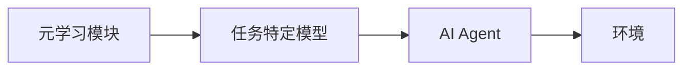
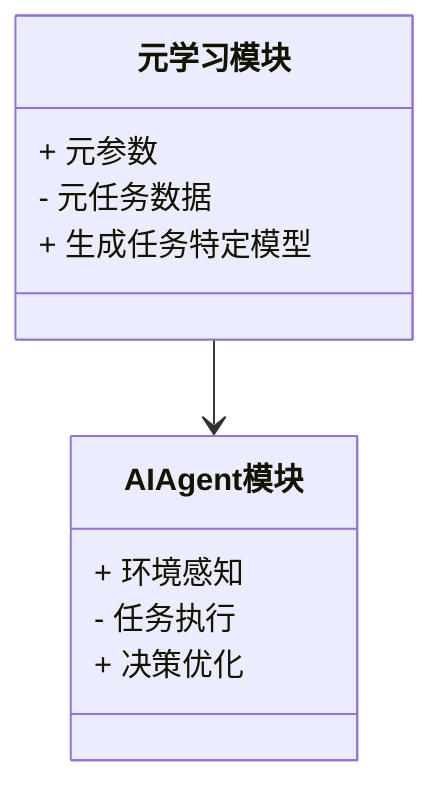
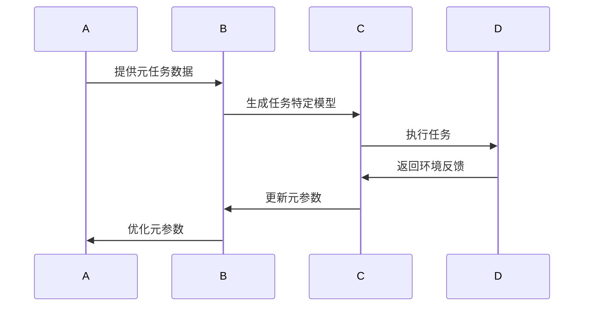

                 


# 元学习在AI Agent快速适应中的应用

## 关键词：元学习, AI Agent, 快速适应, Meta-Learning, 强化学习, 任务通用性

## 摘要：  
元学习是一种新兴的机器学习范式，旨在通过学习如何学习来快速适应新任务。本文深入探讨了元学习在AI Agent快速适应中的应用，分析了元学习的核心概念、算法原理以及其在AI Agent系统中的具体实现。通过结合实际案例和系统架构设计，本文详细阐述了元学习如何帮助AI Agent在复杂环境中实现快速适应和决策优化。最终，本文总结了元学习在AI Agent应用中的优势，并展望了其未来发展方向。

---

# 第一部分：元学习与AI Agent基础

## 第1章：元学习与AI Agent概述

### 1.1 元学习的基本概念

#### 1.1.1 元学习的定义与背景
元学习（Meta-Learning）是一种机器学习范式，旨在通过学习如何学习来快速适应新任务。与传统机器学习不同，元学习关注的是模型的元适应能力，即模型能够在有限的数据和时间内快速掌握新任务。  

元学习的背景源于机器学习在实际应用中的局限性：传统模型在面对新任务时，通常需要大量的数据和时间进行重新训练，这在动态变化的环境中效率低下。元学习通过预训练模型的元参数，使其能够快速调整以适应新任务。

#### 1.1.2 元学习的核心特点
1. **快速适应**：元学习模型能够在少量数据和时间内快速适应新任务。
2. **任务通用性**：元学习模型设计时考虑了任务间的相似性，能够在多个任务间共享知识。
3. **元参数**：元学习模型通过优化元参数（Meta-parameters）来实现快速调整，而不是直接优化任务特定参数。

#### 1.1.3 元学习与传统机器学习的对比
| 对比维度 | 传统机器学习 | 元学习 |
|----------|--------------|--------|
| 数据需求 | 需要大量数据 | 数据需求较少 |
| 适应速度 | 适应新任务较慢 | 能够快速适应新任务 |
| 知识复用 | 任务间知识复用有限 | 高度关注任务间知识复用 |
| 应用场景 | 稳定环境 | 动态变化环境 |

---

### 1.2 AI Agent的基本概念

#### 1.2.1 AI Agent的定义与分类
AI Agent（人工智能代理）是一种智能系统，能够感知环境、自主决策并执行任务。AI Agent可以根据智能水平分为以下几类：
1. **反应式AI Agent**：基于当前感知做出反应，不依赖历史信息。
2. **认知式AI Agent**：具备复杂推理和规划能力，能够处理长期任务。
3. **学习型AI Agent**：能够通过经验改进自身性能。

#### 1.2.2 AI Agent的核心功能与特点
1. **自主性**：AI Agent能够在没有外部干预的情况下自主决策。
2. **反应性**：能够实时感知环境并做出响应。
3. **学习能力**：通过经验或数据优化自身性能。
4. **任务通用性**：能够在多种任务和环境中灵活切换。

#### 1.2.3 AI Agent在不同领域的应用
- **游戏AI**：在复杂游戏中实现智能决策（如AlphaGo）。
- **机器人控制**：实现自主导航和人机交互。
- **智能推荐系统**：根据用户行为推荐个性化内容。
- **自动驾驶**：实时感知环境并做出驾驶决策。

---

### 1.3 元学习在AI Agent中的应用背景

#### 1.3.1 AI Agent快速适应的需求
在动态变化的环境中，AI Agent需要快速适应新任务，例如：
- 新的环境条件变化。
- 用户行为模式的改变。
- 新任务的快速部署。

#### 1.3.2 元学习如何解决AI Agent的适应问题
元学习通过预训练模型的元参数，使其能够在新任务中快速调整，从而实现快速适应。例如：
- 在元学习框架下，AI Agent可以通过少量新任务数据快速更新参数，而不必从头开始训练。

#### 1.3.3 元学习与AI Agent结合的潜在价值
元学习为AI Agent提供了以下优势：
1. **快速部署**：在新任务上线时，AI Agent能够快速调整以适应新需求。
2. **高效学习**：通过元学习预训练，AI Agent能够在有限数据下实现高性能。
3. **多任务处理**：元学习模型具备任务通用性，能够在多个任务间切换。

---

## 第2章：元学习的核心概念与原理

### 2.1 元学习的核心概念

#### 2.1.1 元学习的定义与目标
元学习的目标是通过优化元参数，使得模型能够快速适应新任务。元参数是用于优化任务特定参数的参数，而任务特定参数是直接用于解决具体任务的参数。

#### 2.1.2 元学习的层次结构
元学习的层次结构通常包括以下两个层次：
1. **元任务**：多个相关任务的集合，用于训练元学习模型。
2. **目标任务**：单个具体任务，元学习模型需要通过调整元参数来解决。

#### 2.1.3 元学习的数学模型与公式
元学习的数学模型通常可以表示为：
$$
\theta = \text{Meta-Optimizer}(\theta, D_{\text{meta}})
$$
其中，$\theta$ 是模型参数，$D_{\text{meta}}$ 是元任务数据集，Meta-Optimizer 是元优化器。

---

### 2.2 元学习的算法原理

#### 2.2.1 Meta-SGD算法
Meta-SGD是一种经典的元学习算法，其核心思想是通过优化元参数来调整任务特定参数。具体步骤如下：
1. **预训练阶段**：在元任务上优化元参数。
2. **适应阶段**：在目标任务上优化任务特定参数。

Meta-SGD的优化目标函数为：
$$
\min_{\theta} \sum_{i=1}^{N} \mathcal{L}_i(\theta, x_i)
$$
其中，$\mathcal{L}_i$ 是目标任务的损失函数，$x_i$ 是目标任务的数据。

#### 2.2.2 MAML算法
MAML（Meta-Algorithm for Transfer Learning）是一种基于梯度的元学习算法，其核心思想是通过最小化目标任务的梯度变化来优化元参数。

MAML的目标函数为：
$$
\min_{\theta} \sum_{i=1}^{N} \mathcal{L}_i(g(\theta), x_i)
$$
其中，$g(\theta)$ 是通过元参数$\theta$生成的任务特定参数。

---

### 2.3 元学习的核心要素

#### 2.3.1 元任务与元数据
元任务是用于训练元学习模型的多个相关任务的集合，元数据是这些任务的数据集。

#### 2.3.2 元模型与元参数
元模型是用于生成任务特定模型的模型，元参数是元模型的参数。

#### 2.3.3 元学习的训练与推理过程
1. **训练阶段**：优化元参数，使得元模型能够在多个元任务上表现良好。
2. **推理阶段**：利用元参数生成目标任务的模型，并在目标任务上进行微调。

---

## 第3章：元学习与AI Agent的结合

### 3.1 AI Agent快速适应的需求分析

#### 3.1.1 AI Agent在动态环境中的适应问题
在动态环境中，AI Agent需要快速适应新的环境条件或任务需求。

#### 3.1.2 快速适应的核心挑战
- **数据稀缺性**：新任务的数据量有限。
- **任务多样性**：任务类型多样，难以通用化。

#### 3.1.3 元学习如何解决快速适应问题
元学习通过预训练模型的元参数，使得AI Agent能够在新任务中快速调整参数。

---

### 3.2 元学习在AI Agent中的应用

#### 3.2.1 元学习如何提升AI Agent的适应能力
通过元学习，AI Agent可以在新任务中快速更新参数，而不必从头开始训练。

#### 3.2.2 元学习在AI Agent决策中的作用
元学习帮助AI Agent在复杂环境中做出更高效的决策。

#### 3.2.3 元学习与AI Agent结合的实现方式
1. **预训练元模型**：在元任务上训练元模型。
2. **目标任务适应**：在目标任务上微调任务特定参数。

---

### 3.3 元学习与AI Agent的系统架构

#### 3.3.1 元学习驱动的AI Agent架构


#### 3.3.2 元学习模块与AI Agent模块的交互
- 元学习模块负责生成任务特定模型。
- AI Agent模块负责与环境交互并执行任务。

#### 3.3.3 系统架构的优缺点分析
优点：
- 快速适应新任务。
- 任务通用性强。
缺点：
- 元学习训练需要大量计算资源。
- 系统复杂性较高。

---

## 第4章：元学习算法的数学模型与公式

### 4.1 Meta-SGD算法

#### 4.1.1 Meta-SGD的数学模型
$$
\theta = \text{Meta-Optimizer}(\theta, D_{\text{meta}})
$$

#### 4.1.2 Meta-SGD的优化过程
1. **预训练阶段**：在元任务上优化元参数。
2. **适应阶段**：在目标任务上优化任务特定参数。

---

### 4.2 MAML算法

#### 4.2.1 MAML的数学模型
$$
\min_{\theta} \sum_{i=1}^{N} \mathcal{L}_i(g(\theta), x_i)
$$

#### 4.2.2 MAML的优化过程
1. **预训练阶段**：在元任务上优化元参数。
2. **适应阶段**：在目标任务上优化任务特定参数。

---

## 第5章：系统分析与架构设计方案

### 5.1 项目背景与目标
本项目旨在通过元学习提升AI Agent的快速适应能力，使其能够在复杂环境中高效执行任务。

### 5.2 系统功能设计


### 5.3 系统架构设计


### 5.4 系统接口设计
- 元学习模块接口：
  - 输入：元任务数据。
  - 输出：元参数。
- AI Agent模块接口：
  - 输入：环境数据。
  - 输出：任务执行结果。

### 5.5 系统交互设计


---

## 第6章：项目实战

### 6.1 环境安装与配置
1. **安装依赖**：
   ```bash
   pip install numpy matplotlib tensorflow
   ```
2. **配置训练环境**：
   - 设置GPU/CPU模式。
   - 配置训练参数（如学习率、训练次数等）。

### 6.2 系统核心实现

#### 6.2.1 元学习模块实现
```python
class MetaLearner:
    def __init__(self, meta_params):
        self.meta_params = meta_params

    def forward(self, task_data):
        # 生成任务特定模型
        task_model = self.generate_task_model(task_data)
        return task_model

    def generate_task_model(self, task_data):
        # 通过元参数生成任务特定模型
        pass
```

#### 6.2.2 AI Agent模块实现
```python
class AI-Agent:
    def __init__(self, meta_learner):
        self.meta_learner = meta_learner

    def perceive_environment(self, environment_data):
        # 感知环境数据
        pass

    def make_decision(self, environment_data):
        # 基于环境数据做出决策
        task_model = self.meta_learner.forward(environment_data)
        decision = self.execute_task(task_model)
        return decision

    def execute_task(self, task_model):
        # 执行具体任务
        pass
```

### 6.3 代码应用解读与分析
1. **元学习模块**：负责生成任务特定模型。
2. **AI Agent模块**：负责感知环境并执行任务。

### 6.4 实际案例分析
假设我们有一个AI Agent需要在不同的迷宫环境中导航。通过元学习，AI Agent可以在新环境中快速调整参数，实现高效的导航策略。

### 6.5 项目小结
通过元学习，AI Agent能够在新任务中快速适应，显著提升任务执行效率。

---

## 第7章：总结与展望

### 7.1 元学习在AI Agent中的优势
1. **快速适应**：元学习使AI Agent能够在新任务中快速调整。
2. **任务通用性**：元学习模型适用于多种任务。

### 7.2 未来展望
1. **更高效的元学习算法**：研究更高效的元学习算法，降低计算成本。
2. **多模态元学习**：探索多模态数据的元学习方法，提升AI Agent的感知能力。
3. **强化学习与元学习结合**：将元学习应用于强化学习，提升AI Agent的决策能力。

---

## 作者：AI天才研究院/AI Genius Institute & 禅与计算机程序设计艺术 /Zen And The Art of Computer Programming

