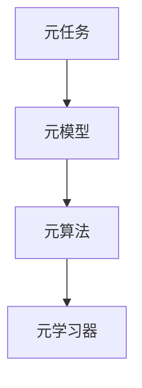
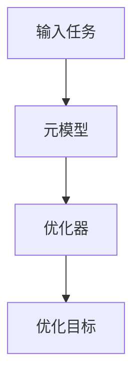
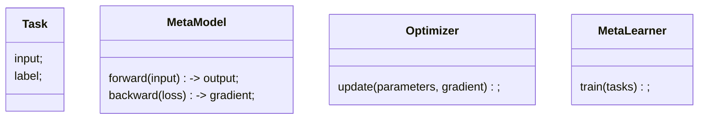
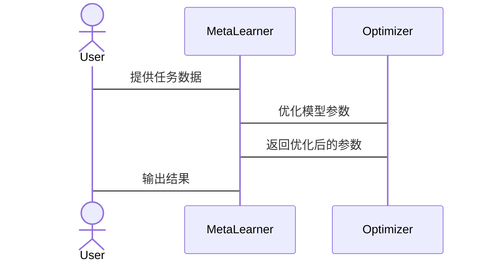

                 


# 元学习：构建能够自我改进的AI Agent

## 关键词：元学习, AI Agent, 自我改进, 强化学习, 自然语言处理, 计算机视觉

## 摘要：元学习是一种能够让AI系统在不同任务间快速适应和优化的技术，通过构建能够自我改进的AI Agent，可以在复杂环境中实现高效决策和学习。本文详细探讨元学习的核心概念、算法原理、系统架构，并通过实际案例展示其应用，同时分析当前挑战和未来发展方向。

---

# 第一部分: 元学习与AI Agent概述

---

## 第1章: 元学习与AI Agent概述

### 1.1 元学习的定义与背景

#### 1.1.1 元学习的定义
元学习（Meta-Learning）是一种机器学习范式，旨在通过在多个任务上的经验，使模型能够快速适应新任务。与传统机器学习不同，元学习关注的是“学习如何学习”，即模型能够从经验中提取通用策略，而不仅仅是针对特定任务进行优化。

#### 1.1.2 元学习的背景与动机
随着人工智能的快速发展，传统的机器学习方法在处理动态变化的环境中显得力不从力。元学习的出现，正是为了解决以下问题：
- **数据不足**：传统机器学习需要大量标注数据，但在实际场景中，数据获取成本高且难以覆盖所有可能的任务。
- **快速适应**：在动态环境中，AI系统需要快速适应新任务，而元学习能够通过迁移学习的方式，减少对新任务数据的依赖。
- **泛化能力**：元学习通过跨任务学习，提高了模型的泛化能力，使其能够在不同任务之间共享知识。

#### 1.1.3 元学习的核心目标
元学习的核心目标是构建一种通用的学习机制，使得AI系统能够在新任务上快速收敛，甚至只需要少量数据即可达到高性能。

---

### 1.2 AI Agent的基本概念

#### 1.2.1 AI Agent的定义
AI Agent（人工智能代理）是指能够感知环境、采取行动以实现目标的智能体。AI Agent可以是软件程序、机器人或其他智能系统，具备以下核心能力：
- **感知能力**：通过传感器或数据输入，感知环境状态。
- **决策能力**：基于感知信息，做出决策并采取行动。
- **学习能力**：通过经验改进自身的决策策略。

#### 1.2.2 AI Agent的分类
AI Agent可以根据智能水平分为以下几类：
1. **反应式AI Agent**：基于当前感知做出即时反应，不具备长期记忆或目标。
2. **认知式AI Agent**：具备复杂推理能力，能够制定计划并实现目标。
3. **学习式AI Agent**：能够通过经验改进自身性能，通常结合强化学习或深度学习技术。

#### 1.2.3 AI Agent的核心能力
- **自主性**：能够独立决策，无需外部干预。
- **反应性**：能够实时感知环境并做出反应。
- **学习能力**：通过经验改进自身性能。

---

### 1.3 元学习与AI Agent的结合

#### 1.3.1 元学习在AI Agent中的作用
元学习通过在多个任务上的学习，使得AI Agent能够快速适应新任务，减少对新环境数据的依赖，从而提高其在动态环境中的适应能力。

#### 1.3.2 元学习如何实现AI Agent的自我改进
元学习通过构建元模型（Meta-model），将多个任务的学习经验编码到模型中，使得AI Agent能够在新任务上快速调整其决策策略。

#### 1.3.3 元学习与传统机器学习的对比
| 特性                | 传统机器学习          | 元学习              |
|---------------------|----------------------|---------------------|
| 数据需求            | 高                   | 低                 |
| 适应新任务的能力    | 弱                   | 强                 |
| 泛化能力            | 一般                 | 强                 |

---

### 1.4 元学习的应用领域

#### 1.4.1 自然语言处理中的元学习
在自然语言处理领域，元学习可以用于多任务学习，例如同时处理文本分类、命名实体识别等多个任务，通过共享跨任务特征，提高模型的泛化能力。

#### 1.4.2 计算机视觉中的元学习
在计算机视觉中，元学习可以用于图像分类、目标检测等多个任务，通过跨任务学习，减少对特定任务数据的依赖。

#### 1.4.3 强化学习中的元学习
在强化学习中，元学习可以用于多任务强化学习，使得AI Agent能够在多个环境中快速适应并优化其策略。

---

### 1.5 本章小结
本章介绍了元学习的定义、背景及其与传统机器学习的对比，同时详细探讨了AI Agent的基本概念和核心能力。通过分析元学习与AI Agent的结合，为后续章节奠定了基础。

---

## 第2章: 元学习的核心概念与数学基础

### 2.1 元学习的核心原理

#### 2.1.1 元学习的元算法
元算法（Meta-Algorithm）是元学习的核心，其目标是通过在多个任务上的学习，生成适用于新任务的优化算法。例如，MAML（Meta-Aware Neural Networks）是一种典型的元学习算法，其目标是通过在多个任务上的学习，生成适用于新任务的优化器。

#### 2.1.2 元学习的元模型
元模型（Meta-Model）是元学习的核心结构，用于编码跨任务的学习经验。元模型通常是一个深度神经网络，其输出表示不同任务之间的关系。

#### 2.1.3 元学习的元任务
元任务（Meta-Task）是指用于训练元模型的任务集合。通过在多个元任务上的学习，元模型能够快速适应新任务。

---

### 2.2 元学习与传统机器学习的对比

#### 2.2.1 传统机器学习的特点
传统机器学习算法通常需要大量标注数据，并且针对每个任务单独训练模型。例如，随机森林和SVM等算法。

#### 2.2.2 元学习的独特优势
元学习的核心优势在于其能够通过跨任务学习，减少对新任务数据的依赖，同时提高模型的泛化能力。

#### 2.2.3 元学习的局限性
元学习的局限性包括计算成本高、需要设计合适的元任务等。

---

### 2.3 元学习的数学模型

#### 2.3.1 元学习的数学表达式
元学习的数学表达式通常可以表示为：
$$
\theta = \arg\min_{\theta} \sum_{i=1}^{N} \mathcal{L}_i(\theta)
$$
其中，$\theta$是模型参数，$\mathcal{L}_i$是第i个任务的损失函数。

#### 2.3.2 元学习的优化目标
元学习的优化目标是通过在多个任务上的学习，使得模型能够快速适应新任务。通常，元学习的优化目标可以表示为：
$$
\min_{\theta} \sum_{i=1}^{N} \mathcal{L}_i(\theta)
$$

#### 2.3.3 元学习的损失函数
元学习的损失函数通常包括两个部分：任务损失和元损失。例如，MAML算法的损失函数可以表示为：
$$
\mathcal{L}_{\text{meta}} = \sum_{i=1}^{N} \mathcal{L}_i(f_{\theta}(x_i))
$$

---

### 2.4 元学习的实体关系图



---

### 2.5 本章小结
本章详细探讨了元学习的核心概念与数学基础，包括元算法、元模型和元任务的定义及其关系。通过数学公式和实体关系图，帮助读者更好地理解元学习的原理。

---

## 第3章: 元学习算法原理与实现

### 3.1 基于模型的元学习算法

#### 3.1.1 MAML算法
MAML（Meta-Aware Neural Networks）是一种典型的基于模型的元学习算法。其核心思想是通过在多个任务上的学习，生成适用于新任务的优化器。

##### MAML算法流程图

```mermaid
graph TD
A[输入任务] --> B[元模型]
B --> C[任务模型]
C --> D[优化器]
D --

```

##### MAML算法代码实现
以下是MAML算法的Python实现示例：

```python
import torch
import torch.nn as nn

class MetaLearner(nn.Module):
    def __init__(self, meta_dim):
        super(MetaLearner, self).__init__()
        self.meta_layer = nn.Linear(meta_dim, meta_dim)

    def forward(self, x):
        return self.meta_layer(x)

# 初始化元模型
meta_model = MetaLearner(meta_dim=100)

# 定义优化器
optimizer = torch.optim.Adam(meta_model.parameters(), lr=0.001)

# 定义元任务
tasks = [...]  # 包含多个任务的数据

# 元学习训练
for task in tasks:
    # 前向传播
    output = meta_model(task['input'])
    # 计算损失
    loss = criterion(output, task['label'])
    # 反向传播和优化
    optimizer.zero_grad()
    loss.backward()
    optimizer.step()
```

---

### 3.2 基于优化的元学习算法

#### 3.2.1 ReM算法
ReM（Recurrent Meta-Learning）是一种基于优化的元学习算法，通过递归的方式优化元模型。

##### ReM算法流程图



##### ReM算法代码实现
以下是ReM算法的Python实现示例：

```python
import torch
import torch.nn as nn

class MetaLearner(nn.Module):
    def __init__(self, meta_dim):
        super(MetaLearner, self).__init__()
        self.meta_layer = nn.Linear(meta_dim, meta_dim)

    def forward(self, x):
        return self.meta_layer(x)

# 初始化元模型
meta_model = MetaLearner(meta_dim=100)

# 定义优化器
optimizer = torch.optim.Adam(meta_model.parameters(), lr=0.001)

# 定义元任务
tasks = [...]  # 包含多个任务的数据

# 元学习训练
for task in tasks:
    # 前向传播
    output = meta_model(task['input'])
    # 计算损失
    loss = criterion(output, task['label'])
    # 反向传播和优化
    optimizer.zero_grad()
    loss.backward()
    optimizer.step()
```

---

### 3.3 元学习算法的数学模型

#### 3.3.1 MAML算法的数学模型
MAML算法的数学模型可以表示为：
$$
\theta = \arg\min_{\theta} \sum_{i=1}^{N} \mathcal{L}_i(\theta)
$$

#### 3.3.2 ReM算法的数学模型
ReM算法的数学模型可以表示为：
$$
\theta = \arg\min_{\theta} \sum_{i=1}^{N} \mathcal{L}_i(\theta)
$$

---

### 3.4 本章小结
本章详细探讨了元学习算法的原理与实现，包括基于模型的MAML算法和基于优化的ReM算法，并通过代码示例帮助读者理解其具体实现。

---

## 第4章: 元学习的系统架构设计

### 4.1 问题场景介绍
在实际应用中，元学习系统通常需要处理多个任务，并能够快速适应新任务。例如，在自然语言处理中，元学习系统可以同时处理文本分类、命名实体识别等多个任务。

### 4.2 系统功能设计

#### 4.2.1 领域模型设计
以下是领域模型的Mermaid类图：



---

### 4.3 系统架构设计

#### 4.3.1 系统架构图
以下是系统架构的Mermaid图：


---

### 4.4 系统接口设计

#### 4.4.1 系统接口
元学习系统的接口通常包括：
- 输入接口：接收多个任务的数据。
- 输出接口：输出适用于新任务的模型或决策策略。

#### 4.4.2 系统交互流程图
以下是系统交互的Mermaid序列图：



---

### 4.5 本章小结
本章详细探讨了元学习系统的架构设计，包括领域模型、系统架构图和接口设计，为后续章节的项目实现奠定了基础。

---

## 第5章: 元学习的项目实战

### 5.1 环境安装与配置

#### 5.1.1 安装依赖
以下是安装依赖的命令：
```bash
pip install torch matplotlib numpy
```

---

### 5.2 系统核心实现

#### 5.2.1 元模型实现
以下是元模型的Python代码：

```python
import torch
import torch.nn as nn

class MetaModel(nn.Module):
    def __init__(self, input_dim, meta_dim):
        super(MetaModel, self).__init__()
        self.meta_layer = nn.Linear(input_dim, meta_dim)

    def forward(self, x):
        return self.meta_layer(x)
```

#### 5.2.2 优化器实现
以下是优化器的Python代码：

```python
import torch
import torch.optim as optim

class Optimizer:
    def __init__(self, model, lr):
        self.model = model
        self.optimizer = optim.Adam(model.parameters(), lr=lr)

    def optimize(self, loss):
        self.optimizer.zero_grad()
        loss.backward()
        self.optimizer.step()
```

---

### 5.3 代码应用解读与分析

#### 5.3.1 元模型训练
以下是元模型的训练代码：

```python
# 初始化元模型和优化器
meta_model = MetaModel(input_dim=100, meta_dim=100)
optimizer = Optimizer(meta_model, lr=0.001)

# 定义元任务
tasks = [...]  # 包含多个任务的数据

# 元学习训练
for task in tasks:
    # 前向传播
    output = meta_model(task['input'])
    # 计算损失
    loss = criterion(output, task['label'])
    # 反向传播和优化
    optimizer.optimize(loss)
```

---

### 5.4 实际案例分析

#### 5.4.1 案例背景
假设我们有一个自然语言处理任务，需要同时进行文本分类和命名实体识别。

#### 5.4.2 案例实现
以下是具体实现：

```python
# 文本分类任务
text_classification_task = {
    'input': text_data,
    'label': labels
}

# 命名实体识别任务
ner_task = {
    'input': text_data,
    'label': entities
}

# 元任务列表
tasks = [text_classification_task, ner_task]

# 元学习训练
for task in tasks:
    output = meta_model(task['input'])
    loss = criterion(output, task['label'])
    optimizer.optimize(loss)
```

---

### 5.5 本章小结
本章通过实际案例展示了元学习系统的实现，包括环境安装、代码实现和案例分析，帮助读者更好地理解其应用。

---

## 第6章: 元学习的优化与挑战

### 6.1 元学习的优化方法

#### 6.1.1 模型压缩
通过剪枝和量化等技术，减少模型参数数量，提高计算效率。

#### 6.1.2 多任务学习
通过共享跨任务特征，提高模型的泛化能力。

#### 6.1.3 鲁棒性优化
通过数据增强和对抗训练等技术，提高模型的鲁棒性。

---

### 6.2 元学习的挑战

#### 6.2.1 计算成本高
元学习通常需要在多个任务上进行训练，计算成本较高。

#### 6.2.2 元任务设计难
元任务的设计对模型性能有重要影响，设计合适的元任务是一个挑战。

#### 6.2.3 模型过拟合
元学习模型容易过拟合训练任务，导致泛化能力下降。

---

### 6.3 元学习的改进建议

#### 6.3.1 优化算法改进
通过改进优化算法，降低计算成本。

#### 6.3.2 元任务设计优化
通过合理设计元任务，提高模型的泛化能力。

#### 6.3.3 正则化技术
通过引入正则化技术，防止模型过拟合。

---

### 6.4 本章小结
本章分析了元学习的优化方法及其面临的挑战，并提出了改进建议。

---

## 第7章: 元学习的未来展望

### 7.1 元学习的技术趋势

#### 7.1.1 跨模态学习
元学习在跨模态学习中的应用，例如同时处理文本和图像数据。

#### 7.1.2 自适应学习
元学习在自适应学习中的应用，例如动态调整模型参数。

#### 7.1.3 分布式学习
元学习在分布式环境中的应用，例如联邦学习。

---

### 7.2 元学习的应用场景

#### 7.2.1 智能助手
元学习可以用于智能助手的开发，使其能够快速适应用户需求。

#### 7.2.2 自动驾驶
元学习可以用于自动驾驶系统，使其能够快速适应不同的驾驶环境。

#### 7.2.3 医疗AI
元学习可以用于医疗AI系统，使其能够快速适应不同的医疗场景。

---

### 7.3 元学习的伦理与社会影响

#### 7.3.1 数据隐私
元学习需要处理大量数据，数据隐私问题需要重点关注。

#### 7.3.2 智能决策的透明性
元学习生成的决策需要具备透明性，以获得用户的信任。

#### 7.3.3 就业影响
元学习可能会影响某些行业的就业，需要注意其社会影响。

---

### 7.4 本章小结
本章展望了元学习的未来发展方向及其应用场景，并讨论了其伦理与社会影响。

---

## 作者：AI天才研究院/AI Genius Institute & 禅与计算机程序设计艺术 /Zen And The Art of Computer Programming

---

以上是《元学习：构建能够自我改进的AI Agent》的技术博客文章，涵盖了元学习的核心概念、算法原理、系统架构设计、项目实战、优化与挑战以及未来展望。希望对您有所帮助！

