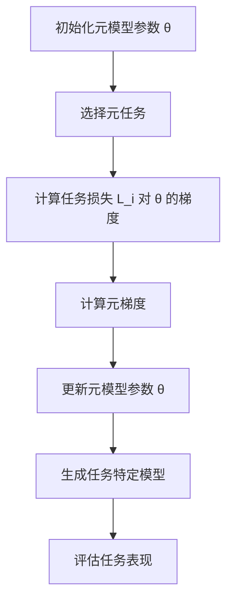
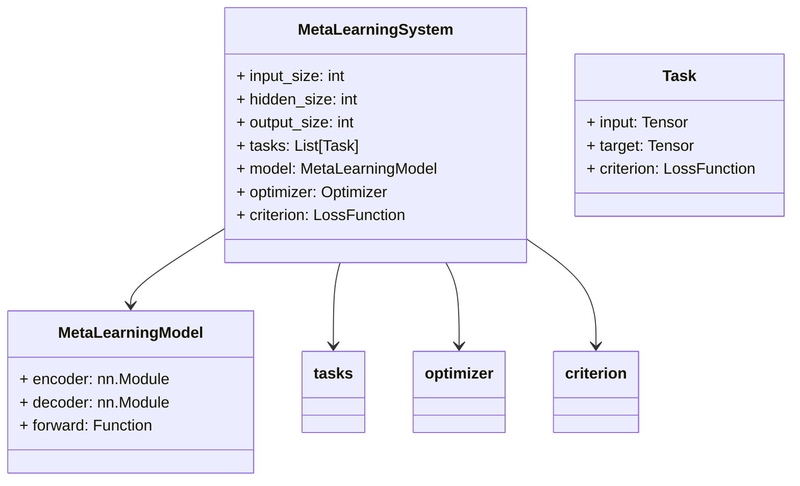
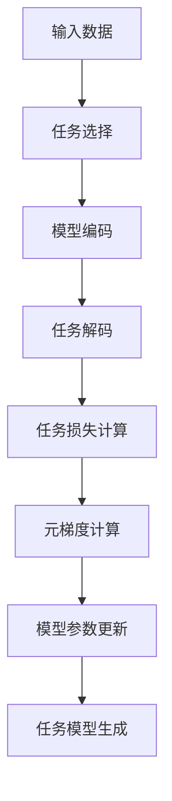
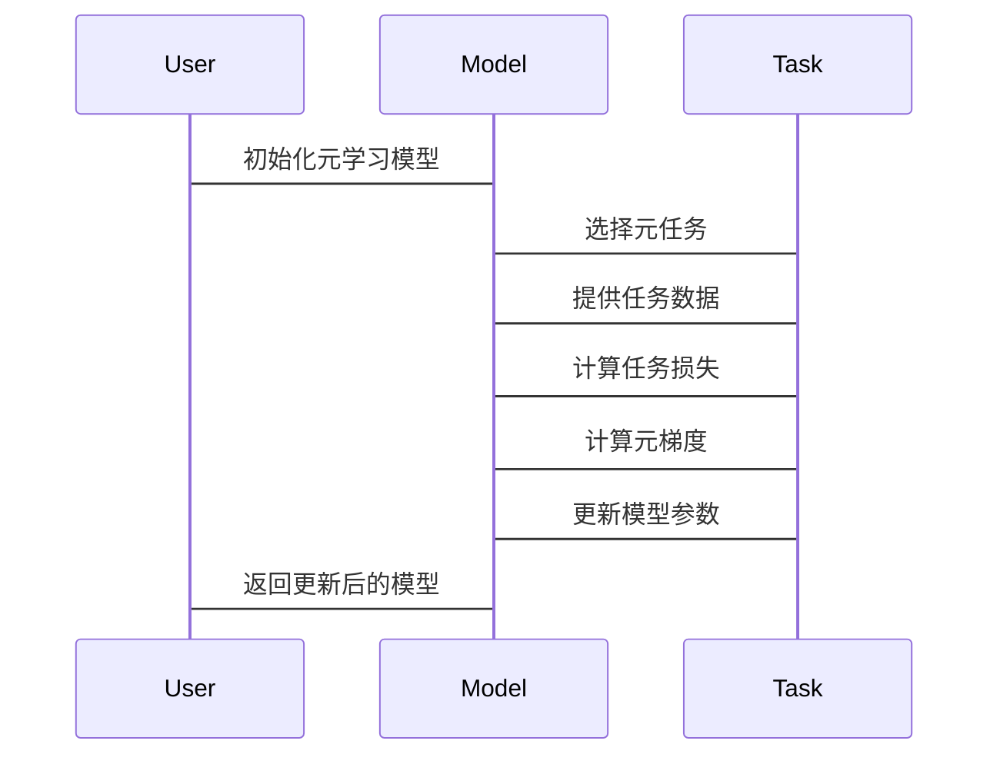

                 


# 元学习：让AI Agent学会如何学习

> **关键词**：元学习、AI Agent、迁移学习、算法原理、系统架构、项目实战

> **摘要**：  
元学习是一种能够让AI Agent在不同任务间快速迁移学习的核心技术。本文从元学习的背景、核心概念、算法原理、系统架构到实际项目实战，全面解析元学习的原理与应用。通过数学公式、流程图和实际案例，帮助读者深入理解元学习的实现机制，并掌握如何在实际项目中应用元学习技术。

---

## 第一部分：元学习背景与核心概念

### 第1章：元学习的背景与问题背景

#### 1.1 元学习的定义与核心概念
元学习（Meta-Learning）是一种机器学习范式，旨在让模型能够快速适应新任务，而无需从头开始训练。其核心在于通过元学习算法，模型能够在多个任务间迁移知识，从而提升学习效率和泛化能力。

- **定义**：元学习是通过优化元学习目标函数，使得模型在多个任务间共享知识，快速适应新任务的学习方法。
- **核心要素**：元学习模型、元任务、元梯度、任务间迁移。
- **概念结构**：元学习通过优化元任务（meta-task）的损失函数，生成适用于新任务的策略或模型。

元学习与传统机器学习的主要区别在于，传统机器学习模型依赖大量任务特定数据，而元学习模型能够在任务间共享学习经验，减少数据依赖。

---

#### 1.2 元学习的背景与问题背景
随着人工智能技术的发展，AI Agent需要在动态环境中快速适应新任务。传统机器学习方法在面对新任务时，通常需要重新训练模型，效率较低。元学习的出现，为AI Agent提供了快速学习和适应的能力。

- **问题背景**：传统机器学习模型在新任务中表现不佳，因为它们无法有效利用已有任务的知识。元学习通过在元任务空间中优化模型，使得模型能够在新任务中快速调整策略。
- **问题解决**：元学习通过优化元任务目标函数，生成适用于新任务的模型或策略，从而实现快速学习和适应。
- **边界与外延**：元学习的边界在于其元任务的定义，外延则包括迁移学习、自适应学习和多任务学习。

---

#### 1.3 元学习的必要性与应用前景
元学习的必要性体现在其能够显著提升AI Agent的学习效率和适应能力。其应用前景广阔，涵盖多个领域。

- **必要性**：元学习使得AI Agent能够在任务间共享知识，减少数据需求，提升学习效率。
- **应用前景**：元学习在自动驾驶、智能助手、机器人控制等领域具有重要应用潜力。例如，自动驾驶系统需要快速适应不同道路环境和驾驶场景。

---

### 第2章：元学习的核心概念与联系

#### 2.1 元学习的核心原理
元学习的核心在于通过元任务空间的优化，生成适用于新任务的模型或策略。

- **核心原理**：元学习通过优化元任务目标函数，使得模型在新任务中能够快速调整参数，生成适用于该任务的策略。
- **元学习模型**：元学习模型通常包括编码器（encoder）和解码器（decoder），用于提取任务特征和生成任务特定模型。
- **元梯度优化**：元学习通过计算元梯度（meta-gradient），优化元任务目标函数，从而生成适用于新任务的模型。

---

#### 2.2 元学习的核心概念对比
元学习与其他AI技术的核心概念对比：

| **核心概念** | **传统机器学习** | **迁移学习** | **元学习** |
|--------------|------------------|--------------|------------|
| **目标**     | 优化单任务模型   | 任务间迁移   | 快速适应新任务 |
| **依赖**     | 任务特定数据     | 预先训练数据 | 元任务数据 |
| **适用场景** | 固定任务         | 多任务        | 多任务快速适应 |

---

#### 2.3 元学习的ER实体关系图
元学习的ER实体关系图如下：

```mermaid
erDiagram
    meta_task <--- meta_learning_model
    meta_learning_model --> task
    task --> task_data
    task_data --> task_model
    task_model --> task_performance
    meta_learning_model --> task_model
    task_performance --> meta_learning_objective
```

- **解释**：元学习模型通过优化元任务目标函数，生成适用于新任务的模型（task_model），并评估其在任务中的表现（task_performance）。

---

## 第二部分：元学习的算法原理

### 第3章：元学习的核心算法原理

#### 3.1 元学习的数学模型与公式
元学习的核心算法通常涉及元梯度（meta-gradient）的计算。

- **元梯度公式**：$$ \text{meta-gradient} = \frac{d}{d\theta} \left( \frac{dL}{d\theta} \right) $$
- **元任务目标函数**：$$ \mathcal{L}_{\text{meta}}(\theta) = \sum_{i=1}^{N} \mathcal{L}_i(\theta, \phi_i) $$
- **任务特定损失函数**：$$ \mathcal{L}_i(\theta, \phi_i) = -\sum_{j=1}^{K} y_{ij} \log p_{ij} + \text{交叉熵} $$

---

#### 3.2 元学习算法的流程图
以下是元学习算法的mermaid流程图：



---

#### 3.3 元学习算法的Python实现
以下是元学习算法的Python实现示例：

```python
import torch
import torch.nn as nn
import torch.optim as optim

class MetaLearningModel(nn.Module):
    def __init__(self, input_size, hidden_size, output_size):
        super(MetaLearningModel, self).__init__()
        self.encoder = nn.Linear(input_size, hidden_size)
        self.decoder = nn.Linear(hidden_size, output_size)

    def forward(self, x):
        encoded = self.encoder(x)
        output = self.decoder(encoded)
        return output

# 初始化模型和优化器
model = MetaLearningModel(input_size=10, hidden_size=5, output_size=1)
optimizer = optim.Adam(model.parameters(), lr=0.001)

# 元任务目标函数
def meta_objective(model, tasks):
    total_loss = 0
    for task in tasks:
        task_loss = model(task.input).loss(task.target)
        total_loss += task_loss
    return total_loss

# 元梯度计算
for epoch in range(num_epochs):
    optimizer.zero_grad()
    meta_loss = meta_objective(model, tasks)
    meta_loss.backward()
    optimizer.step()
```

---

### 第4章：主流元学习算法详解

#### 4.1 MAML算法
MAML（Meta-Anti Gradients）是一种经典的元学习算法。

- **原理**：通过计算任务特定梯度的梯度（即元梯度），优化元模型参数。
- **数学模型**：$$ \theta_{\text{new}} = \theta - \alpha \cdot \nabla_{\theta} \mathcal{L}_i(\theta, \phi_i) $$

```python
def maml_update(model, tasks, alpha=0.1):
    for task in tasks:
        # 前向传播
        outputs = model(task.input)
        # 计算任务损失
        loss = task.criterion(outputs, task.target)
        # 计算任务梯度
        task_gradients = torch.autograd.grad(loss, model.parameters())
        # 计算元梯度
        meta_gradients = [torch.zeros_like(g) for g in model.parameters()]
        for g, meta_g in zip(task_gradients, meta_gradients):
            meta_g.data = alpha * g.data
        # 更新模型参数
        for p, meta_g in zip(model.parameters(), meta_gradients):
            p.data = p.data - meta_g
```

---

#### 4.2 ReMAML算法
ReMAML是对MAML的改进，通过引入重放机制，提升元学习的稳定性。

- **改进**：引入重放机制，通过重放历史任务梯度，优化当前任务的梯度估计。
- **公式**：$$ \theta_{\text{new}} = \theta - \alpha \cdot \mathbb{E}_{i \sim \text{重放分布}} \left[ \nabla_{\theta} \mathcal{L}_i(\theta, \phi_i) \right] $$

---

#### 4.3 Meta-SGD算法
Meta-SGD是一种基于SGD的元学习算法。

- **原理**：通过优化任务特定的SGD步长，实现快速适应新任务。
- **公式**：$$ \theta_{\text{new}} = \theta - \sum_{i=1}^{N} \alpha_i \cdot \nabla_{\theta} \mathcal{L}_i(\theta, \phi_i) $$

---

## 第三部分：元学习的系统架构与设计

### 第5章：元学习的系统架构与设计

#### 5.1 问题场景介绍
元学习系统需要解决的任务包括：快速适应新任务、多任务学习和任务间知识共享。

#### 5.2 系统功能设计
以下是系统的功能模块设计：



---

#### 5.3 系统架构设计
以下是系统的架构设计：



---

#### 5.4 系统交互设计
以下是系统的交互设计：



---

## 第四部分：元学习的项目实战

### 第6章：元学习的项目实战

#### 6.1 环境安装与配置
以下是项目所需的环境配置：

```bash
pip install torch==1.9.0+cu111
pip install numpy
pip install matplotlib
pip install scikit-learn
```

#### 6.2 数据准备与任务定义
以下是数据准备和任务定义的代码：

```python
import torch
import torch.utils.data as data_utils
import numpy as np

# 数据准备
class SyntheticDataset(data_utils.Dataset):
    def __init__(self, input_size, num_samples):
        self.input_size = input_size
        self.num_samples = num_samples
        self.x = np.random.randn(num_samples, input_size)
        self.y = np.random.randn(num_samples, 1)

    def __len__(self):
        return self.num_samples

    def __getitem__(self, idx):
        return torch.FloatTensor(self.x[idx]), torch.FloatTensor(self.y[idx])

# 任务定义
class Task:
    def __init__(self, dataset, batch_size=32):
        self.dataset = dataset
        self.batch_size = batch_size
        self.dataloader = data_utils.DataLoader(self.dataset, batch_size=self.batch_size, shuffle=True)

    def get_batch(self):
        return next(iter(self.dataloader))
```

---

#### 6.3 模型实现与训练
以下是模型实现与训练的代码：

```python
class MetaLearningModel(nn.Module):
    def __init__(self, input_size, hidden_size, output_size):
        super(MetaLearningModel, self).__init__()
        self.encoder = nn.Linear(input_size, hidden_size)
        self.decoder = nn.Linear(hidden_size, output_size)

    def forward(self, x):
        encoded = self.encoder(x)
        output = self.decoder(encoded)
        return output

# 模型训练
def train_meta_learning(model, tasks, optimizer, criterion, num_epochs=100):
    for epoch in range(num_epochs):
        optimizer.zero_grad()
        total_loss = 0
        for task in tasks:
            x, y = task.get_batch()
            outputs = model(x)
            loss = criterion(outputs, y)
            total_loss += loss.item()
        total_loss.backward()
        optimizer.step()
    return model
```

---

## 第五部分：总结与展望

### 第7章：总结与展望

#### 7.1 总结
元学习是一种能够让AI Agent快速适应新任务的核心技术。通过元学习算法，模型能够在任务间共享知识，减少数据依赖，提升学习效率。

---

#### 7.2 展望
元学习在多个领域具有广阔的应用前景。未来的研究方向包括：

1. **高效元学习算法**：优化元学习算法的计算效率，降低训练成本。
2. **元学习与强化学习结合**：将元学习应用于强化学习，提升智能体的适应能力。
3. **元学习的可解释性**：研究元学习的可解释性，提升模型的透明度和可信度。

---

## 作者信息

**作者**：AI天才研究院（AI Genius Institute） & 禅与计算机程序设计艺术（Zen And The Art of Computer Programming）

--- 

感谢您的阅读！如果对元学习感兴趣，欢迎关注我们的技术博客，获取更多深度技术解析！

