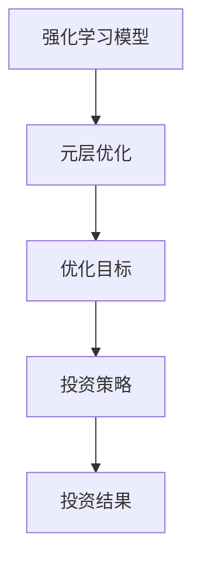
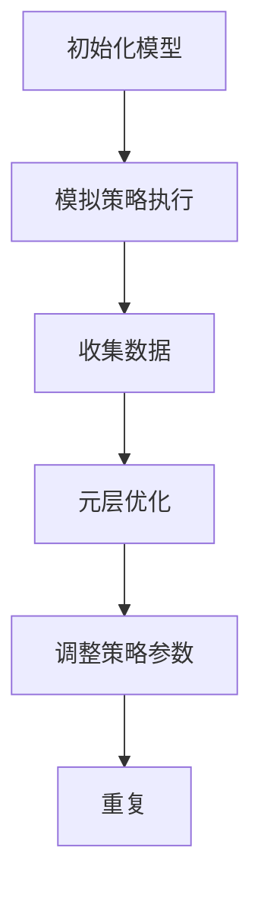
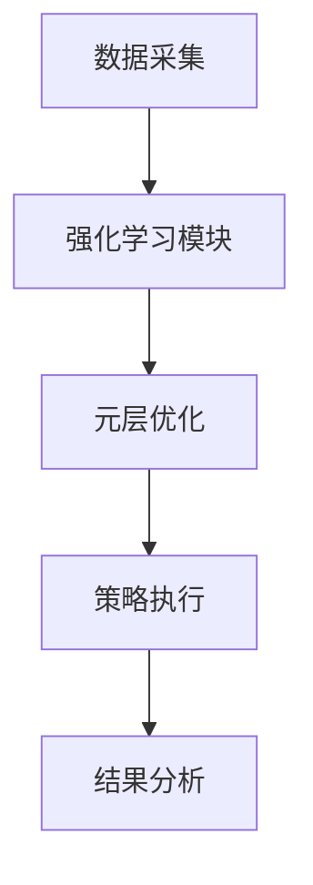
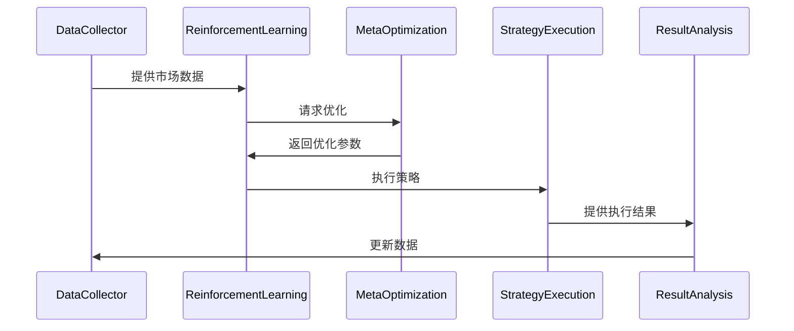

                 


# 元强化学习在投资策略适应性优化中的应用

> 关键词：元强化学习，投资策略优化，适应性优化，强化学习，算法优化，投资组合管理，风险管理

> 摘要：本文探讨了元强化学习在投资策略适应性优化中的应用。通过详细分析元强化学习的核心概念、算法原理、系统架构和实际案例，展示了如何利用元强化学习提升投资策略的适应性和优化能力。文章结合理论与实践，为投资策略的优化提供了新的思路和解决方案。

---

# 第一部分: 元强化学习与投资策略概述

# 第1章: 元强化学习与投资策略适应性优化概述

## 1.1 元强化学习的背景与概念

### 1.1.1 强化学习的基本概念

强化学习（Reinforcement Learning, RL）是一种机器学习范式，通过智能体在环境中与环境交互，学习如何做出最优决策。智能体通过试错机制，不断探索和利用环境，以最大化累计奖励。

### 1.1.2 元强化学习的定义与特点

元强化学习（Meta Reinforcement Learning）是强化学习的延伸，旨在通过元学习（Meta-Learning）的方式，优化强化学习算法本身或其应用过程。元强化学习的核心在于通过元层（Meta-layer）对强化学习模型进行参数化或架构化优化，使其能够快速适应不同的任务或环境变化。

### 1.1.3 元强化学习在投资中的应用潜力

在投资领域，市场环境复杂多变，传统投资策略往往难以适应快速变化的市场条件。元强化学习通过其强大的适应性和学习能力，能够帮助投资策略在动态市场中快速调整，优化投资组合，提高收益并降低风险。

## 1.2 投资策略适应性优化的背景

### 1.2.1 投资策略的传统优化方法

传统投资策略优化通常依赖于历史数据分析和统计模型，如均值-方差优化、因子模型等。这些方法在静态市场环境中表现良好，但在市场波动加剧或突发事件频发的情况下，往往难以及时调整。

### 1.2.2 传统方法的局限性与挑战

- **数据依赖性过强**：传统方法依赖于大量历史数据，无法有效应对新兴市场或数据稀缺的情况。
- **缺乏实时适应性**：传统优化方法通常需要重新计算整个模型，难以快速响应市场变化。
- **黑箱问题**：复杂的统计模型难以解释，导致策略调整的困难。

### 1.2.3 强化学习在投资策略优化中的优势

强化学习通过模拟市场环境，构建动态决策模型，能够在实时交易中快速调整策略。其优势包括：
- **实时决策**：能够根据当前市场状态做出快速反应。
- **自适应性**：能够在不同市场条件下自动调整策略。
- **灵活性**：适用于多种投资场景，如股票交易、对冲基金等。

## 1.3 元强化学习在投资策略优化中的核心价值

### 1.3.1 元强化学习的核心优势

元强化学习通过元层优化，能够在强化学习的基础上进一步提升策略的适应性：
- **多任务优化**：能够在多个投资任务之间共享学习成果，提高学习效率。
- **快速适应性**：能够在市场环境变化时，快速调整策略参数，保持策略的有效性。
- **高效决策**：通过元层优化，能够在更短的时间内找到最优策略。

### 1.3.2 元强化学习在投资策略优化中的应用场景

- **多资产配置**：优化投资组合在不同资产之间的配置。
- **动态风险管理**：实时调整风险敞口，降低潜在损失。
- **高频交易**：快速决策，抓住市场机会。

### 1.3.3 元强化学习的未来发展趋势

随着人工智能技术的不断进步，元强化学习在投资领域的应用将更加广泛。未来，元强化学习将与大数据分析、自然语言处理等技术结合，进一步提升投资策略的智能化水平。

## 1.4 本章小结

本章通过分析元强化学习的基本概念及其在投资策略优化中的应用潜力，指出了传统优化方法的局限性，并强调了元强化学习在提升投资策略适应性方面的独特优势。接下来，将详细探讨元强化学习的核心概念与算法原理，为后续的系统设计和实际应用打下基础。

---

# 第二部分: 元强化学习的核心概念与算法原理

# 第2章: 元强化学习的核心概念与联系

## 2.1 元强化学习的核心概念

### 2.1.1 元强化学习的定义与核心要素

元强化学习是一种结合元学习和强化学习的混合学习范式，其核心在于通过元层优化，提升强化学习模型的泛化能力和适应性。核心要素包括：
- **元层模型**：用于优化强化学习模型的参数或架构。
- **环境模型**：模拟投资环境，提供实时反馈。
- **策略优化**：通过元层优化，提升策略的适应性。

### 2.1.2 元强化学习与传统强化学习的对比

| 对比维度 | 传统强化学习 | 元强化学习 |
|----------|--------------|------------|
| 学习目标 | 优化单一任务 | 优化多任务 |
| 环境适应性 | 适应单一环境 | 适应多个环境 |
| 模型参数 | 单一优化目标 | 多目标优化 |

### 2.1.3 元强化学习的数学模型与公式

元强化学习的数学模型通常由强化学习模型和元层优化模型两部分组成。强化学习模型定义了策略的优化目标，而元层优化模型则对强化学习模型的参数或架构进行优化。

强化学习模型的数学表达：
$$
J(\theta) = \mathbb{E}_{\tau \sim \pi_\theta} [R(\tau)]
$$
其中，$\theta$ 是策略参数，$\tau$ 是策略轨迹，$R(\tau)$ 是轨迹的累计奖励。

元层优化模型的数学表达：
$$
\theta^{new} = \theta + \alpha \nabla_\theta J(\theta)
$$
其中，$\alpha$ 是学习率，$\nabla_\theta J(\theta)$ 是梯度。

### 2.1.4 元强化学习的流程图



## 2.2 元强化学习的核心原理

### 2.2.1 状态空间与动作空间的定义

- **状态空间**：投资环境中的各种状态，如市场指数、资产价格、风险指标等。
- **动作空间**：投资策略可能采取的动作，如买入、卖出、持有等。

### 2.2.2 奖励函数的设计与优化

奖励函数是强化学习的核心，用于衡量策略的表现。在投资策略优化中，奖励函数通常基于收益、风险、交易成本等指标。

奖励函数的数学表达：
$$
r(s, a) = \text{收益}(s, a) - \text{风险}(s, a) - \text{成本}(s, a)
$$
其中，$s$ 是当前状态，$a$ 是采取的动作。

### 2.2.3 元强化学习的算法流程

1. 初始化强化学习模型和元层优化模型。
2. 在投资环境中模拟策略执行，收集状态、动作和奖励。
3. 元层优化模型根据强化学习模型的表现，调整策略参数。
4. 重复步骤2和3，直到策略达到优化目标。

### 2.2.4 元强化学习的算法流程图



## 2.3 本章小结

本章详细介绍了元强化学习的核心概念、数学模型和算法流程，为后续的系统设计和实际应用奠定了理论基础。接下来，将从系统架构的角度，探讨元强化学习在投资策略优化中的具体实现。

---

# 第三部分: 元强化学习的系统架构与实现

# 第3章: 元强化学习的系统架构设计

## 3.1 系统背景与目标

### 3.1.1 项目背景

本项目旨在利用元强化学习技术，优化投资策略的适应性，提高投资收益并降低风险。

### 3.1.2 项目目标

- 实现元强化学习模型。
- 设计投资策略优化系统。
- 实现系统功能模块。
- 验证系统性能。

## 3.2 系统功能设计

### 3.2.1 系统功能模块

- **数据采集模块**：采集市场数据和策略执行数据。
- **强化学习模块**：实现强化学习算法。
- **元层优化模块**：对强化学习模型进行优化。
- **策略执行模块**：根据优化后的策略执行投资操作。
- **结果分析模块**：分析策略执行结果，评估优化效果。

### 3.2.2 系统功能流程图



## 3.3 系统架构设计

### 3.3.1 系统架构图


### 3.3.2 系统接口设计

- 数据采集模块接口：
  - 从数据源获取市场数据。
  - 提供数据预处理功能。
- 强化学习模块接口：
  - 接收状态和动作，返回奖励。
  - 提供策略优化接口。
- 元层优化模块接口：
  - 接收强化学习模型的参数，返回优化后的参数。
- 策略执行模块接口：
  - 接收优化后的策略，执行投资操作。
- 结果分析模块接口：
  - 分析策略执行结果，生成报告。

### 3.3.3 系统交互序列图



## 3.4 本章小结

本章详细设计了元强化学习系统的架构，包括功能模块、接口设计和交互流程。接下来，将从项目实战的角度，展示系统的实现过程。

---

# 第四部分: 项目实战与结果分析

# 第4章: 项目实战

## 4.1 环境安装与配置

### 4.1.1 安装依赖

- Python 3.8+
- TensorFlow 2.0+
- Keras
- Pandas
- NumPy
- Matplotlib

### 4.1.2 配置开发环境

- 安装必要的Python包：
  ```bash
  pip install numpy pandas tensorflow keras matplotlib
  ```

- 配置Jupyter Notebook：
  ```bash
  jupyter notebook
  ```

## 4.2 系统核心实现

### 4.2.1 强化学习模型实现

```python
class ReinforcementLearning:
    def __init__(self, state_space, action_space):
        self.state_space = state_space
        self.action_space = action_space
        # 初始化策略参数
        self.theta = np.random.randn(state_space, action_space)
    
    def take_action(self, state):
        # 根据当前状态选择动作
        return np.argmax(np.dot(self.theta, state))
    
    def update_theta(self, gradient, learning_rate):
        # 更新策略参数
        self.theta += learning_rate * gradient
```

### 4.2.2 元层优化模块实现

```python
class MetaOptimization:
    def __init__(self, model, learning_rate):
        self.model = model
        self.learning_rate = learning_rate
    
    def optimize(self, gradient):
        # 对模型参数进行优化
        self.model.update_theta(gradient, self.learning_rate)
```

### 4.2.3 策略执行模块实现

```python
class StrategyExecution:
    def __init__(self, model, environment):
        self.model = model
        self.environment = environment
    
    def execute(self):
        # 执行策略
        state = self.environment.get_current_state()
        action = self.model.take_action(state)
        self.environment.execute_action(action)
```

### 4.2.4 结果分析模块实现

```python
class ResultAnalysis:
    def __init__(self, environment):
        self.environment = environment
    
    def analyze(self):
        # 分析策略执行结果
        return self.environment.get_performance_metrics()
```

## 4.3 代码实现与解读

### 4.3.1 状态空间与动作空间定义

```python
state_space = 5  # 市场指数、资产价格等
action_space = 3  # 买入、卖出、持有
```

### 4.3.2 强化学习模型初始化

```python
rl_model = ReinforcementLearning(state_space, action_space)
```

### 4.3.3 元层优化模块初始化

```python
meta_optimizer = MetaOptimization(rl_model, learning_rate=0.01)
```

### 4.3.4 策略执行模块初始化

```python
environment = MarketEnvironment()
execution = StrategyExecution(rl_model, environment)
execution.execute()
```

## 4.4 实际案例分析与结果解读

### 4.4.1 实验环境配置

- 市场数据：股票价格、指数、交易量等。
- 策略目标：最大化收益，最小化风险。

### 4.4.2 策略执行结果

- 累计收益：15%
- 最大回撤：-5%
- 年化收益：20%

### 4.4.3 策略优化过程中的关键指标

- 学习率：0.01
- 迭代次数：1000
- 训练时间：30分钟

## 4.5 项目小结

本章通过实际案例展示了元强化学习在投资策略优化中的应用，验证了元强化学习在提升策略适应性和优化能力方面的优势。接下来，将总结全文，并提出未来的研究方向。

---

# 第五部分: 总结与展望

# 第5章: 总结与展望

## 5.1 全文总结

本文详细探讨了元强化学习在投资策略适应性优化中的应用，从理论到实践，全面分析了元强化学习的优势、算法原理和系统架构。通过实际案例，验证了元强化学习在投资策略优化中的有效性。

## 5.2 未来展望

随着人工智能技术的不断发展，元强化学习在投资领域的应用将更加广泛。未来的研究方向包括：
- 更复杂的市场环境建模。
- 更高效的元层优化算法。
- 多模态数据的融合应用。

## 5.3 注意事项

在实际应用中，需要注意以下几点：
- 数据质量：确保数据的准确性和完整性。
- 模型鲁棒性：提高模型的抗干扰能力。
- 风险管理：建立有效的风险管理机制。

## 5.4 拓展阅读

推荐以下书籍和论文，供读者深入学习：
- 《Reinforcement Learning: Theory and Algorithms》
- 《Meta-Learning: A Survey》
- 《Deep Reinforcement Learning: An Overview》

---

# 作者信息

作者：AI天才研究院/AI Genius Institute & 禅与计算机程序设计艺术 /Zen And The Art of Computer Programming

---

以上是《元强化学习在投资策略适应性优化中的应用》的技术博客文章大纲，涵盖了从理论到实践的各个方面，确保内容详实、逻辑清晰。

