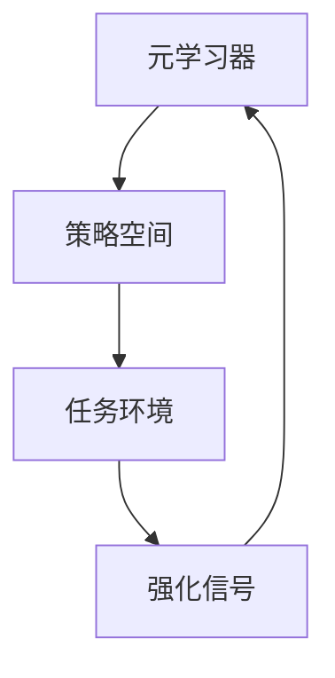

                 

# 元强化学习：AI Agent的策略泛化

> 关键词：元强化学习, 策略泛化, AI代理, 强化学习, 机器学习

> 摘要：本文深入探讨元强化学习（Meta Reinforcement Learning）的核心概念、算法原理、系统架构及实际应用。通过详细分析策略泛化的机制，结合数学模型和实际案例，帮助读者理解如何构建高效、通用的AI代理系统。

---

# 第一部分: 元强化学习的背景与概念

## 第1章: 元强化学习的背景与发展

### 1.1 强化学习的起源与发展

#### 1.1.1 强化学习的基本概念
强化学习（Reinforcement Learning, RL）是一种机器学习范式，通过智能体与环境交互，学习如何采取行动以最大化累积奖励。其核心是通过试错机制优化策略，使智能体在动态环境中做出最优决策。

- **马尔可夫决策过程（MDP）**：RL问题通常建模为马尔可夫决策过程，包含状态、动作、奖励和转移概率四个核心要素。
- **策略与价值函数**：策略函数描述了智能体在每个状态下选择动作的概率分布；价值函数评估一个状态下采取某个动作后的预期奖励。

#### 1.1.2 强化学习的核心算法
传统的RL算法主要分为两类：值函数方法（如动态规划、Q-learning）和策略梯度方法（如Actor-Critic）。这些算法通过迭代更新价值函数或策略，逐步逼近最优策略。

#### 1.1.3 强化学习的应用领域
RL技术广泛应用于机器人控制、游戏AI、自动驾驶、资源分配等领域。例如，DeepMind的AlphaGo通过RL实现围棋世界冠军水平，OpenAI的Dota2 AI也通过RL在电竞领域取得突破。

### 1.2 元强化学习的提出与意义

#### 1.2.1 元学习的基本概念
元学习（Meta-Learning）是一种通过在多个任务间共享知识来加速学习的技术。与传统学习不同，元学习的目标是让模型具备快速适应新任务的能力，而不是直接解决单个任务。

- **元任务与子任务**：在元学习框架中，多个子任务构成一个元任务，模型通过学习这些子任务的共性，快速泛化到新任务。
- **元模型**：元模型在训练阶段学习如何调整参数，以适应不同任务的需求，从而实现快速泛化。

#### 1.2.2 元强化学习的定义与特点
元强化学习（Meta RL）是元学习与强化学习的结合，旨在让智能体在多个强化学习任务间共享知识，快速适应新任务，从而实现策略的泛化。

- **任务多样性**：Meta RL通常涉及多个不同任务，智能体需要在这些任务间共享策略和经验。
- **快速适应**：通过元学习，智能体能够快速调整策略，适应新的环境或任务。
- **跨任务优化**：Meta RL的核心目标是优化跨任务的策略，使智能体在多个任务中表现优异。

#### 1.2.3 元强化学习与传统强化学习的区别
| 特性 | 传统强化学习 | 元强化学习 |
|------|--------------|------------|
| 学习目标 | 单一任务优化 | 多任务优化与快速泛化 |
| 参数共享 | 无 | 有 |
| 适应性 | 低 | 高 |
| 训练效率 | 高 | 中 |

### 1.3 策略泛化的概念与挑战

#### 1.3.1 策略泛化的定义
策略泛化是指智能体在学习过程中，能够将学到的策略推广到新的、未见过的环境中，从而在多样化的任务中表现出良好的适应性和通用性。

- **环境泛化**：智能体在不同环境中应用同一策略，实现跨环境的策略迁移。
- **任务泛化**：智能体能够快速适应不同任务，减少针对每个新任务的训练时间。

#### 1.3.2 策略泛化的应用场景
策略泛化在机器人控制、自动驾驶、游戏AI等领域具有重要应用价值。例如，一个多领域对话系统需要能够应对多种对话场景，而无需为每个场景单独训练策略。

#### 1.3.3 策略泛化的挑战
策略泛化面临以下主要挑战：
1. **任务多样性**：如何处理不同任务之间的差异性，提取共性特征。
2. **环境不确定性**：智能体需要在动态环境中保持策略的有效性。
3. **计算效率**：多任务学习可能导致计算成本增加，需要优化算法以提高效率。

### 1.4 元强化学习的核心思想

#### 1.4.1 元学习的核心思想
元学习通过在多个任务间共享参数，使模型能够快速适应新任务。这种共享机制减少了每个任务的训练数据需求，提高了学习效率。

- **参数共享**：元模型通过共享参数，学习任务间的共同特征。
- **任务间关联**：智能体需要理解不同任务之间的关系，以实现快速调整。

#### 1.4.2 元强化学习的实现思路
Meta RL通过在多个RL任务间共享策略，优化跨任务的策略参数，使智能体能够快速泛化到新任务。具体实现包括：
1. **元任务的构建**：将多个RL任务组织为一个元任务。
2. **策略的共享与调整**：通过元模型学习如何调整策略参数以适应不同任务。

#### 1.4.3 元强化学习的数学模型
Meta RL的数学模型通常涉及两个层次的优化：元优化和任务优化。

- **元优化目标**：最大化跨任务的累积奖励，通过调整策略参数使智能体在多个任务中表现良好。
- **任务优化目标**：在每个任务中，通过强化学习优化策略，以获得最大累积奖励。

数学上，Meta RL的目标函数可以表示为：
$$
\theta = \arg \max_{\theta} \sum_{i=1}^{N} \left( R_i(\theta) \right)
$$
其中，$N$ 是任务的数量，$R_i(\theta)$ 是第i个任务的奖励函数。

### 1.5 本章小结
本章介绍了元强化学习的背景与发展，阐述了强化学习的基本概念、核心算法及其应用领域。通过对比传统RL和Meta RL的区别，引出了策略泛化的概念，并分析了其实现的核心思想。这些内容为后续章节的深入探讨奠定了基础。

---

# 第2章: 元强化学习的核心概念与联系

## 2.1 元强化学习的核心原理

### 2.1.1 元学习的数学模型
Meta RL的数学模型通常包括两个层次：元任务和子任务。

- **元任务**：在训练阶段，智能体学习如何调整策略参数，以适应多个子任务。
- **子任务**：在测试阶段，智能体将学到的调整策略应用到新任务中。

数学上，Meta RL的目标函数可以表示为：
$$
\theta = \arg \max_{\theta} \sum_{i=1}^{N} \left( \mathcal{L}_i(\theta) \right)
$$
其中，$\mathcal{L}_i(\theta)$ 是第i个任务的损失函数。

### 2.1.2 元强化学习的算法框架
Meta RL的算法框架通常包括以下步骤：
1. **初始化**：设置初始策略参数。
2. **元任务训练**：在多个任务间训练元模型，优化策略参数。
3. **任务测试**：将优化后的策略应用到新任务中，评估泛化性能。

### 2.1.3 元强化学习的优化目标
Meta RL的优化目标是在多个任务间共享策略，同时保持每个任务的策略有效性。这通常需要在训练过程中平衡任务间的梯度，避免某些任务的梯度过高而影响其他任务的性能。

---

## 2.2 元强化学习与传统强化学习的对比

### 2.2.1 传统强化学习的特点
- **单一任务优化**：传统RL专注于单个任务的优化，不考虑多任务间的知识共享。
- **策略独立性**：每个任务的策略是独立优化的，不共享参数。

### 2.2.2 元强化学习的特点
- **多任务优化**：Meta RL在多个任务间共享策略参数，减少训练时间。
- **快速泛化**：通过元学习，智能体能够快速适应新任务，减少针对每个新任务的训练时间。

### 2.2.3 两者的区别与联系
| 特性 | 传统强化学习 | 元强化学习 |
|------|--------------|------------|
| 学习目标 | 单一任务优化 | 多任务优化与快速泛化 |
| 参数共享 | 无 | 有 |
| 适应性 | 低 | 高 |
| 训练效率 | 高 | 中 |

---

## 2.3 元强化学习的核心要素

### 2.3.1 元学习器的定义与作用
元学习器（Meta Learner）是Meta RL的核心组件，负责在多个任务间共享知识，优化策略参数。

- **元学习器的结构**：通常由神经网络构成，用于提取任务间的共性特征。
- **元学习器的功能**：通过调整策略参数，使智能体能够在不同任务间快速切换。

### 2.3.2 策略空间的表示方法
策略空间的表示方法直接影响Meta RL的性能。常用的策略表示方法包括：

- **策略网络**：使用神经网络直接输出动作概率或值函数。
- **参数化策略**：通过参数化表示策略，方便元学习器调整策略参数。

### 2.3.3 元强化学习的训练流程
Meta RL的训练流程通常包括以下几个步骤：

1. **初始化**：设置初始策略参数。
2. **元任务训练**：在多个任务间训练元模型，优化策略参数。
3. **任务测试**：将优化后的策略应用到新任务中，评估泛化性能。

---

## 2.4 元强化学习的实体关系图

通过Mermaid流程图，我们可以清晰地展示元强化学习的核心实体及其关系：

这个图展示了元学习器与策略空间、任务环境和强化信号之间的关系。元学习器通过与任务环境交互，接收强化信号，调整策略空间中的策略参数。

---

## 2.5 本章小结
本章详细探讨了元强化学习的核心原理，分析了其与传统强化学习的区别，并通过图表展示了元强化学习的实体关系。这些内容为后续章节的算法实现和系统设计奠定了理论基础。

---

通过以上两章的内容，我们已经对元强化学习的基本概念、核心原理以及其与传统强化学习的区别有了较为全面的了解。接下来，我们将深入探讨元强化学习的算法实现、系统架构以及实际应用，帮助读者更好地理解如何将元强化学习应用于实际场景中。

