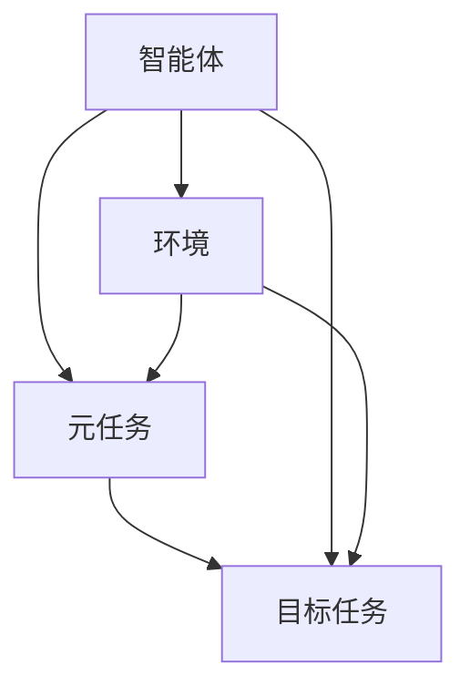
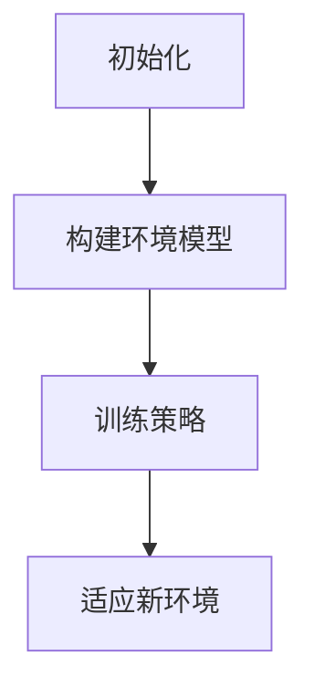
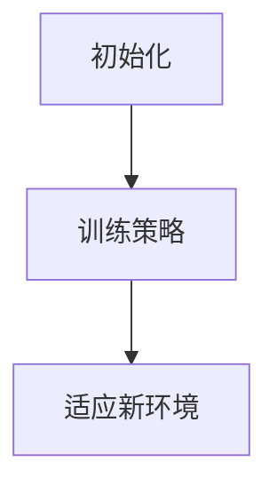
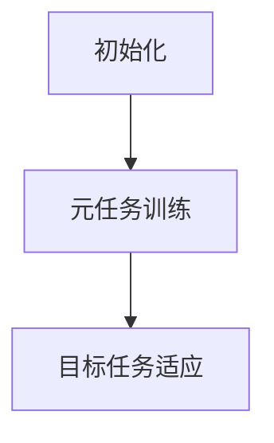
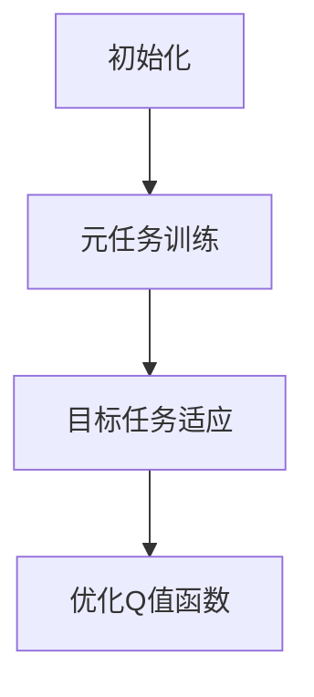
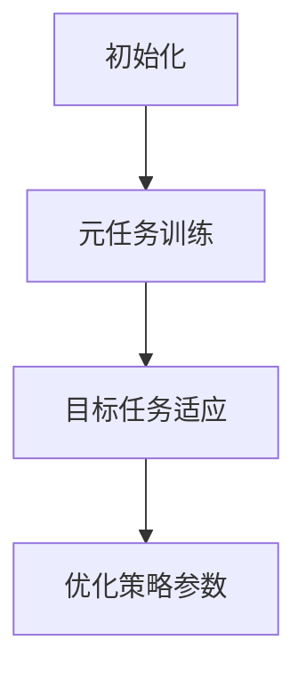
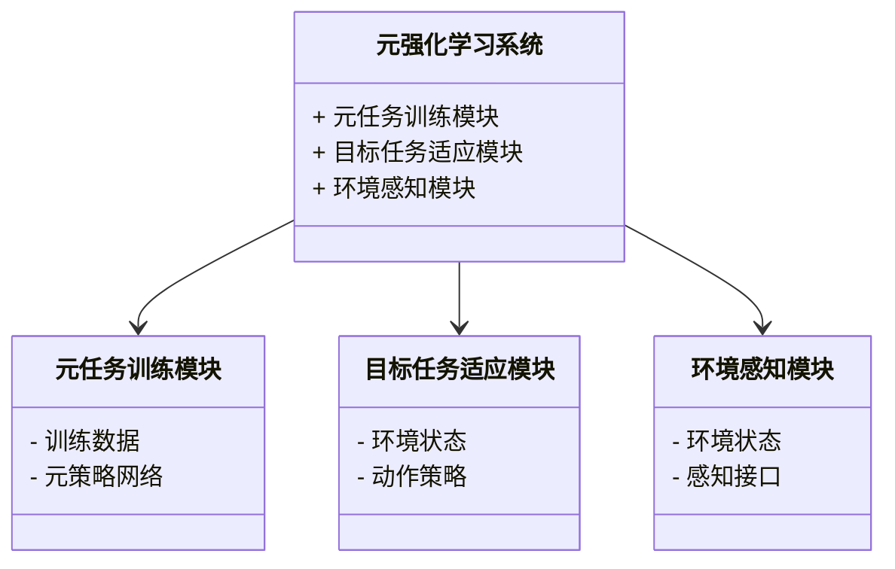

                 


# 元强化学习：快速适应新环境的AI Agent

> **关键词**: 元强化学习, AI Agent, 强化学习, 快速适应, 环境适应

> **摘要**: 元强化学习是一种结合了强化学习和元学习的新型AI技术，能够在快速变化的环境中快速适应并做出有效的决策。本文从背景、核心概念、算法原理、系统架构、项目实战到高级应用，全面剖析元强化学习的原理和应用，为读者提供一个完整的元强化学习知识体系。

---

## 第1章: 元强化学习概述

### 1.1 元强化学习的基本概念

元强化学习（Meta-Reinforcement Learning，MRL）是一种结合了元学习（Meta-Learning）和强化学习（Reinforcement Learning，RL）的新兴技术。其核心思想是通过学习如何学习，使AI代理（AI Agent）能够在快速变化的环境中快速适应新任务，而不需要从头开始训练。

#### 1.1.1 强化学习的基本原理

强化学习是一种通过试错机制来学习策略的方法，其中智能体通过与环境互动，逐步优化其行为以最大化累积奖励。其核心公式为：

$$
Q(s, a) = r + \gamma \max_{a'} Q(s', a')
$$

其中，\( Q(s, a) \) 表示在状态 \( s \) 下采取动作 \( a \) 的价值，\( r \) 是即时奖励，\( \gamma \) 是折扣因子。

#### 1.1.2 元强化学习的定义

元强化学习是在强化学习的基础上，引入了元学习的思想。元学习的目标是通过学习多个任务的共同特征，快速适应新任务。在元强化学习中，智能体不仅需要学习如何在特定环境中获得最大奖励，还需要学习如何快速调整策略以适应新环境。

#### 1.1.3 元强化学习的核心思想

元强化学习的核心思想是通过“元任务”（Meta-Tasks）的训练，使智能体具备快速适应新环境的能力。具体来说，智能体会在多个模拟环境中进行训练，学习如何调整其策略以适应不同的环境。这种能力使其在面对新任务时，能够快速找到最优策略，而无需重新训练。

### 1.2 元强化学习的背景与问题背景

传统强化学习在处理新任务时，通常需要从头开始训练，这在快速变化的环境中效率低下。元强化学习的出现，正是为了解决这一问题。

#### 1.2.1 传统强化学习的局限性

- **训练时间长**：传统强化学习需要在每个新环境中重新训练，耗时较长。
- **适应性差**：当环境发生较大变化时，智能体需要重新训练，增加了适应成本。
- **难以处理动态环境**：在动态环境中，传统强化学习可能无法快速调整策略。

#### 1.2.2 元强化学习的提出动机

为了克服传统强化学习的局限性，元强化学习应运而生。其核心动机是通过元学习，使智能体能够快速适应新环境，减少训练时间，提高适应性。

#### 1.2.3 元强化学习的应用场景

元强化学习在多个领域有广泛的应用，包括：

- **游戏AI**：快速适应游戏规则变化。
- **机器人控制**：在不同环境中快速调整动作策略。
- **自动驾驶**：快速适应交通规则变化。
- **智能家居**：快速适应家庭成员的习惯变化。

### 1.3 元强化学习的应用价值

元强化学习的应用价值主要体现在以下几个方面：

#### 1.3.1 快速适应新环境的重要性

在快速变化的环境中，智能体需要能够快速适应新任务，以保持其性能。元强化学习通过元学习，使智能体具备这一能力。

#### 1.3.2 元强化学习在AI Agent中的作用

AI Agent通过元强化学习，可以在不同环境中快速调整策略，提高其智能性和适应性。

#### 1.3.3 元强化学习的未来发展趋势

随着AI技术的不断发展，元强化学习将在更多领域得到应用，并逐渐成为AI Agent的核心技术之一。

### 1.4 本章小结

本章介绍了元强化学习的基本概念、背景和应用价值，为后续章节的学习奠定了基础。

---

## 第2章: 元强化学习的核心概念与联系

### 2.1 元强化学习的核心原理

元强化学习的核心原理是通过元任务的训练，使智能体具备快速适应新环境的能力。

#### 2.1.1 元强化学习的基本原理

元强化学习的训练过程分为两个阶段：

1. **元任务训练阶段**：智能体在多个模拟环境中进行训练，学习如何调整策略以适应不同环境。
2. **目标任务适应阶段**：在面对新任务时，智能体利用元任务训练中获得的知识，快速调整策略，适应新任务。

#### 2.1.2 元强化学习与传统强化学习的对比

以下是元强化学习与传统强化学习的对比：

| 对比维度         | 传统强化学习                  | 元强化学习                  |
|------------------|------------------------------|-----------------------------|
| 策略调整方式     | 需要从头开始训练              | 可以快速调整策略            |
| 训练时间         | 较长                         | 较短                        |
| 适应性           | 较差                         | 较强                        |

#### 2.1.3 元强化学习的关键特性

- **快速适应性**：智能体能够在短时间内适应新环境。
- **通用性**：适用于多种不同的任务和环境。
- **高效性**：相比传统强化学习，训练时间大幅减少。

### 2.2 元强化学习的核心概念对比

元强化学习与迁移学习、多任务学习等概念有相似之处，但也存在显著差异。

#### 2.2.1 元强化学习与迁移学习的对比

- **迁移学习**：将从一个任务中学到的知识应用到另一个相关任务中。
- **元强化学习**：通过元任务训练，使智能体能够快速适应新任务。

| 对比维度         | 迁移学习                     | 元强化学习                     |
|------------------|------------------------------|--------------------------------|
| 知识转移方式     | 直接应用已知知识             | 通过元任务学习如何调整策略     |
| 适应性           | 较强                        | 更强                          |

#### 2.2.2 元强化学习与多任务学习的对比

- **多任务学习**：同时学习多个任务，共享任务间的共同特征。
- **元强化学习**：通过元任务训练，使智能体能够快速适应新任务。

| 对比维度         | 多任务学习                   | 元强化学习                   |
|------------------|------------------------------|-------------------------------|
| 知识共享方式     | 任务间共享                   | 元任务训练                   |
| 适应性           | 中等                        | 较强                        |

#### 2.2.3 元强化学习与自适应学习的对比

- **自适应学习**：智能体能够根据反馈调整自身行为。
- **元强化学习**：通过元任务训练，使智能体具备快速调整策略的能力。

| 对比维度         | 自适应学习                   | 元强化学习                   |
|------------------|------------------------------|-------------------------------|
| 策略调整方式     | 单任务调整                   | 元任务训练                   |
| 适应性           | 较弱                        | 较强                        |

### 2.3 元强化学习的实体关系图

以下是一个元强化学习的实体关系图：



### 2.4 本章小结

本章详细讲解了元强化学习的核心概念及其与相关概念的对比，帮助读者更好地理解其原理和特点。

---

## 第3章: 元强化学习的算法原理

### 3.1 元强化学习的基本算法

元强化学习的基本算法包括基于模型和基于无模型的两种类型。

#### 3.1.1 基于模型的元强化学习算法

基于模型的元强化学习算法通过构建环境模型，帮助智能体快速适应新环境。以下是具体的算法步骤：



数学模型如下：

$$
\theta = \arg \max_{\theta} \sum_{t=1}^{T} r_t
$$

其中，\( \theta \) 是模型参数，\( r_t \) 是第 \( t \) 步的奖励。

#### 3.1.2 基于无模型的元强化学习算法

基于无模型的元强化学习算法不依赖于环境模型，直接通过策略优化来适应新环境。以下是具体的算法步骤：



数学模型如下：

$$
a_t = \arg \max_{a} Q(s_t, a; \theta)
$$

其中，\( Q(s_t, a; \theta) \) 是策略网络，\( a_t \) 是第 \( t \) 步的动作。

### 3.2 元强化学习的高级算法

高级的元强化学习算法包括元Q-learning和元策略梯度算法。

#### 3.2.1 元Q-learning算法

元Q-learning算法通过元任务训练，使智能体能够快速调整Q值函数。以下是具体的算法步骤：



数学模型如下：

$$
Q(s, a) = \sum_{i=1}^{N} \alpha_i Q_i(s, a)
$$

其中，\( Q_i(s, a) \) 是第 \( i \) 个元任务的Q值函数，\( \alpha_i \) 是权重系数。

#### 3.2.2 元策略梯度算法

元策略梯度算法通过元任务训练，优化策略参数，使智能体能够快速适应新环境。以下是具体的算法步骤：


数学模型如下：

$$
\theta = \arg \max_{\theta} \mathbb{E}_{s,a}[\sum_{t=1}^{T} r_t]
$$

其中，\( \theta \) 是策略参数，\( r_t \) 是第 \( t \) 步的奖励。

#### 3.2.3 元强化学习算法的优缺点对比

以下是几种元强化学习算法的优缺点对比：

| 对比维度         | 基于模型的算法             | 基于无模型的算法             |
|------------------|---------------------------|-----------------------------|
| 优点             | 能够快速适应新环境         | 不依赖于环境模型             |
| 缺点             | 对环境模型的依赖性较高     | 对环境模型的依赖性较低       |

### 3.3 元强化学习算法的数学模型

#### 3.3.1 基于模型的元强化学习数学模型

$$
\theta = \arg \max_{\theta} \sum_{t=1}^{T} r_t
$$

其中，\( \theta \) 是模型参数，\( r_t \) 是第 \( t \) 步的奖励。

#### 3.3.2 基于无模型的元强化学习数学模型

$$
a_t = \arg \max_{a} Q(s_t, a; \theta)
$$

其中，\( Q(s_t, a; \theta) \) 是策略网络，\( a_t \) 是第 \( t \) 步的动作。

### 3.4 算法的mermaid流程图

#### 3.4.1 元Q-learning算法的mermaid流程图



#### 3.4.2 元策略梯度算法的mermaid流程图



### 3.5 本章小结

本章详细讲解了元强化学习的算法原理，包括基本算法和高级算法，帮助读者理解其数学模型和工作流程。

---

## 第4章: 元强化学习的系统分析与架构设计方案

### 4.1 系统分析

#### 4.1.1 系统问题场景介绍

在快速变化的环境中，传统的强化学习系统需要频繁重新训练，导致适应时间长，效率低下。元强化学习系统的引入，能够有效解决这一问题。

#### 4.1.2 系统功能需求分析

元强化学习系统需要具备以下功能：

1. 元任务训练：通过多个模拟环境训练智能体的元策略。
2. 目标任务适应：在新环境中快速调整策略，适应新任务。
3. 环境感知：实时感知环境状态，做出相应决策。

#### 4.1.3 系统性能需求分析

- **训练时间**：较传统强化学习大幅减少。
- **适应时间**：能够在短时间内适应新环境。
- **处理能力**：需要较强的计算能力，支持元任务训练和目标任务适应。

### 4.2 系统架构设计

#### 4.2.1 系统架构设计原则

元强化学习系统的架构设计需要遵循以下原则：

1. **模块化设计**：各功能模块独立，便于维护和扩展。
2. **高效性**：确保系统在元任务训练和目标任务适应阶段的效率。
3. **可扩展性**：支持多种环境和任务的扩展。

#### 4.2.2 系统架构的mermaid类图

以下是一个元强化学习系统的类图：



#### 4.2.3 系统架构的mermaid序列图

以下是一个系统的交互序列图：

```mermaid
sequenceDiagram
参与者：用户
系统：元强化学习系统
用户 -> 系统：启动元任务训练
系统 -> 元任务训练模块：开始训练
元任务训练模块 -> 元策略网络：更新参数
系统 -> 目标任务适应模块：开始适应
目标任务适应模块 -> 环境感知模块：获取环境状态
环境感知模块 -> 目标任务适应模块：返回环境状态
目标任务适应模块 -> 动作策略：输出动作
```

### 4.3 系统接口设计

#### 4.3.1 系统内部接口设计

- **元任务训练接口**：负责元任务的训练和参数更新。
- **目标任务适应接口**：负责目标任务的适应和策略调整。
- **环境感知接口**：负责环境状态的感知和传递。

#### 4.3.2 系统外部接口设计

- **用户接口**：用户可以通过命令行或图形界面启动和控制系统。
- **环境接口**：系统通过环境接口与外部环境进行交互。

### 4.4 本章小结

本章详细分析了元强化学习系统的架构设计和接口设计，为后续的实现奠定了基础。

---

## 第5章: 元强化学习的项目实战

### 5.1 环境安装

要实现元强化学习系统，首先需要安装以下环境：

- **Python**：3.6+
- **深度学习框架**：TensorFlow或PyTorch
- **强化学习库**：如OpenAI Gym
- **Mermaid**：用于绘制图表

安装命令示例：

```bash
pip install tensorflow numpy gym
```

### 5.2 系统核心实现源代码

以下是元强化学习系统的核心代码实现：

#### 5.2.1 元任务训练模块

```python
import numpy as np
import gym

class MetaTaskTrainer:
    def __init__(self, env_name='CartPole-v0'):
        self.env = gym.make(env_name)
        self.env.seed(42)
        self.model = self._build_model()
    
    def _build_model(self):
        # 简单的神经网络模型，实际应用中可以使用更复杂的结构
        from tensorflow.keras import layers
        model = layers.Sequential([
            layers.Dense(64, activation='relu', input_dim=4),
            layers.Dense(16, activation='relu'),
            layers.Dense(2, activation='softmax')
        ])
        model.compile(optimizer='adam', loss='sparse_categorical_crossentropy')
        return model
    
    def train(self, epochs=10):
        for _ in range(epochs):
            state = self.env.reset()
            done = False
            while not done:
                action = self.model.predict([state])[0]
                action = np.random.choice(2, p=action)
                state, reward, done, _ = self.env.step(action)
                self.model.fit([state], [action], epochs=1, verbose=0)
```

#### 5.2.2 目标任务适应模块

```python
class TargetTaskAdapter:
    def __init__(self, meta_model, env_name='CartPole-v1'):
        self.meta_model = meta_model
        self.env = gym.make(env_name)
        self.env.seed(42)
    
    def adapt(self):
        state = self.env.reset()
        done = False
        while not done:
            action = self.meta_model.predict([state])[0]
            action = np.random.choice(2, p=action)
            state, reward, done, _ = self.env.step(action)
```

### 5.3 代码应用解读与分析

- **元任务训练模块**：负责在多个模拟环境中训练元策略网络。
- **目标任务适应模块**：利用元策略网络，快速调整策略以适应新环境。
- **环境感知模块**：实时感知环境状态，为决策提供依据。

### 5.4 实际案例分析

以经典控制问题CartPole为例，展示元强化学习系统在目标任务中的适应过程。

#### 5.4.1 训练阶段

```python
trainer = MetaTaskTrainer()
trainer.train()
```

#### 5.4.2 适应阶段

```python
adapter = TargetTaskAdapter(trainer.model)
adapter.adapt()
```

### 5.5 本章小结

本章通过实际案例，展示了元强化学习系统的实现过程，帮助读者理解其应用场景和实现细节。

---

## 第6章: 元强化学习的高级应用与未来发展

### 6.1 动态环境中的元强化学习

动态环境是指环境状态和奖励函数随时间变化的环境。元强化学习在动态环境中的应用尤为重要。

#### 6.1.1 动态环境的建模与适应

动态环境的建模可以通过强化学习和元强化学习的结合来实现。智能体需要不断更新其环境模型，以适应环境的变化。

#### 6.1.2 动态环境中的元强化学习算法

在动态环境中，元强化学习算法需要具备更强的适应能力。一种可能的算法改进方向是引入自适应元任务训练机制。

### 6.2 元强化学习的未来发展趋势

随着AI技术的不断进步，元强化学习将在更多领域得到应用，并逐步成为AI Agent的核心技术之一。

#### 6.2.1 更高效的元学习算法

未来的研究方向包括开发更高效的元学习算法，进一步提高元强化学习的效率和效果。

#### 6.2.2 多模态元强化学习

多模态元强化学习将结合视觉、听觉等多种感知方式，进一步提升智能体的适应能力。

#### 6.2.3 元强化学习与人机协作

元强化学习在人机协作中的应用将更加广泛，例如在机器人辅助、智能助手等领域。

### 6.3 本章小结

本章展望了元强化学习的未来发展方向，为读者提供了更广阔的研究视野。

---

## 第7章: 总结与展望

### 7.1 总结

元强化学习是一种结合了强化学习和元学习的新兴技术，能够在快速变化的环境中快速适应并做出有效的决策。本文从背景、核心概念、算法原理、系统架构、项目实战到高级应用，全面剖析了元强化学习的原理和应用。

### 7.2 展望

随着AI技术的不断进步，元强化学习将在更多领域得到应用，并逐步成为AI Agent的核心技术之一。未来的研究方向包括开发更高效的元学习算法，进一步提高元强化学习的效率和效果。

---

## 作者：AI天才研究院/AI Genius Institute & 禅与计算机程序设计艺术 /Zen And The Art of Computer Programming

---

感谢您的阅读！希望本文对您理解元强化学习有所帮助。如果需要进一步探讨或有疑问，请随时联系作者。

