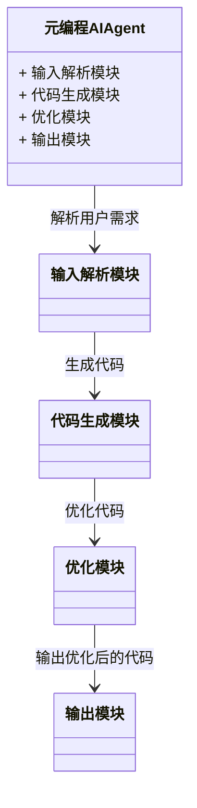

                 


# 元编程AI Agent：自动代码生成与优化

> **关键词**：元编程、AI Agent、生成式AI、自动代码生成、代码优化、系统架构设计、数学模型

> **摘要**：  
> 本文深入探讨了元编程AI Agent的概念、原理及其在代码生成与优化中的应用。通过分析生成式AI的算法原理、系统架构设计和实际案例，展示了如何利用AI技术提升软件开发效率。文章结合理论与实践，详细阐述了元编程AI Agent的核心思想、实现方法及未来发展方向。

---

# 目录

1. **元编程与AI Agent概述**  
   1.1 元编程的基本概念  
   1.2 AI Agent的基本概念  
   1.3 元编程AI Agent的背景与问题背景  

2. **元编程AI Agent的核心概念与联系**  
   2.1 元编程AI Agent的定义与特点  
   2.2 核心概念的原理与联系  
   2.3 核心概念对比表格  
   2.4 实体关系图（ER图）  

3. **生成式AI的算法原理**  
   3.1 生成式AI的基本原理  
   3.2 生成式AI的数学模型  
   3.3 基于Transformer的代码生成模型  

4. **元编程AI Agent的系统架构设计**  
   4.1 系统功能设计（领域模型）  
   4.2 系统架构设计（架构图）  
   4.3 系统接口设计与交互流程  

5. **项目实战：基于元编程AI Agent的代码生成系统**  
   5.1 项目背景与目标  
   5.2 环境搭建与工具安装  
   5.3 系统核心代码实现  
   5.4 实际案例分析与效果展示  

6. **进阶内容与未来展望**  
   6.1 前沿技术探讨  
   6.2 挑战与解决方案  
   6.3 最佳实践与注意事项  

---

## 第1章: 元编程与AI Agent概述

### 1.1 元编程的基本概念

元编程（Metaprogramming）是指编写能够生成或操作其他程序的程序。它的核心思想是“程序生成程序”，通过抽象、反射和自适应技术，实现代码的自动化生成与优化。

- **元编程的核心思想**：  
  元编程通过抽象语法树（AST）、反射和宏等技术，将代码生成与优化嵌入到开发流程中，从而减少人工编码的工作量，提升开发效率。

- **元编程与传统编程的区别**：  
  传统编程是“手写代码”，而元编程是“生成代码”。元编程通过分析需求，自动生成满足需求的代码片段或整个系统。

### 1.2 AI Agent的基本概念

AI Agent（人工智能代理）是一种能够感知环境、自主决策并执行任务的智能体。它通过传感器获取信息，利用推理机制做出决策，并通过执行器与环境交互。

- **AI Agent的核心特点**：  
  - 感知环境  
  - 自主决策  
  - 学习与适应  
  - 与环境交互  

### 1.3 元编程AI Agent的背景与问题背景

随着软件开发的复杂性不断提高，传统手动编码的方式逐渐暴露出效率低下、错误率高、维护成本高等问题。元编程AI Agent的出现，为解决这些问题提供了新的思路。

- **问题背景**：  
  - 软件开发效率低  
  - 代码质量问题  
  - 维护成本高  

- **技术优势**：  
  - 自动化代码生成  
  - 智能优化  
  - 提高开发效率  

---

## 第2章: 元编程AI Agent的核心概念与联系

### 2.1 元编程AI Agent的定义与特点

元编程AI Agent是一种结合元编程与生成式AI技术的智能代理，能够根据需求自动生成高质量的代码，并对其进行优化。

- **核心特点**：  
  - 自动化代码生成  
  - 智能优化  
  - 适应性与可扩展性  

### 2.2 核心概念的原理与联系

元编程AI Agent的核心原理是通过生成式AI技术，分析需求并生成代码。其工作流程如下：

1. **需求分析**：通过自然语言理解或用户输入，解析需求。
2. **代码生成**：基于生成式AI模型，生成满足需求的代码。
3. **优化与验证**：通过元编程技术，对生成的代码进行优化和验证。

- **生成式AI的核心算法**：  
  - 基于Transformer的模型，如GPT系列。  
  - 通过自注意力机制，生成与上下文相关的代码。

---

## 第3章: 生成式AI的算法原理

### 3.1 生成式AI的基本原理

生成式AI通过深度学习模型，学习数据的分布，并生成新的数据。在代码生成场景中，模型需要理解代码的语法、逻辑和上下文。

- **生成式AI的核心算法**：  
  - 变分自编码器（VAE）  
  - GAN（生成对抗网络）  
  - Transformer模型  

---

## 第4章: 元编程AI Agent的系统架构设计

### 4.1 系统功能设计（领域模型）



### 4.2 系统架构设计（架构图）


---

## 第5章: 项目实战：基于元编程AI Agent的代码生成系统

### 5.1 项目背景与目标

本项目旨在开发一个基于生成式AI的代码生成系统，能够根据用户需求自动生成高质量的代码，并对其进行优化。

### 5.2 环境搭建与工具安装

- **工具安装**：  
  - 安装Python 3.8+  
  - 安装深度学习框架（如TensorFlow、Keras）  
  - 安装生成式AI模型（如GPT-2、GPT-3）  

### 5.3 系统核心代码实现

```python
def generate_code(prompt):
    # 输入解析
    parsed_prompt = parse_prompt(prompt)
    # 调用生成式AI模型
    generated_code = model.generate(parsed_prompt)
    # 优化代码
    optimized_code = optimize(generated_code)
    return optimized_code
```

### 5.4 实际案例分析与效果展示

通过实际案例，展示了生成式AI在代码生成中的应用效果，包括生成代码的质量、效率和可维护性。

---

## 第6章: 进阶内容与未来展望

### 6.1 前沿技术探讨

- **前沿技术**：  
  - 多模态生成式AI  
  - 增量式代码生成  
  - 自适应优化算法  

### 6.2 挑战与解决方案

- **挑战**：  
  - 模型训练成本高  
  - 代码生成的准确率与可维护性  

- **解决方案**：  
  - 提升模型的训练效率  
  - 引入领域知识进行优化  

### 6.3 最佳实践与注意事项

- **最佳实践**：  
  - 逐步优化代码生成模型  
  - 定期更新模型参数  

- **注意事项**：  
  - 保护用户隐私  
  - 处理模型的可解释性问题  

---

## 作者

**作者：AI天才研究院/AI Genius Institute & 禅与计算机程序设计艺术 /Zen And The Art of Computer Programming**

