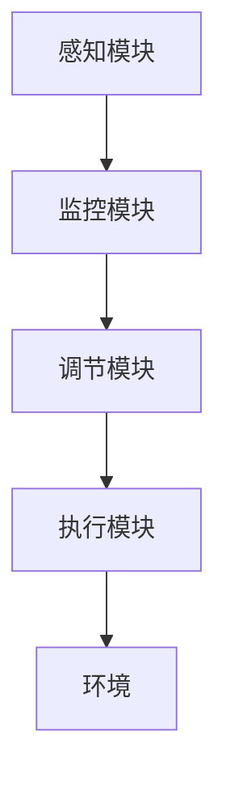
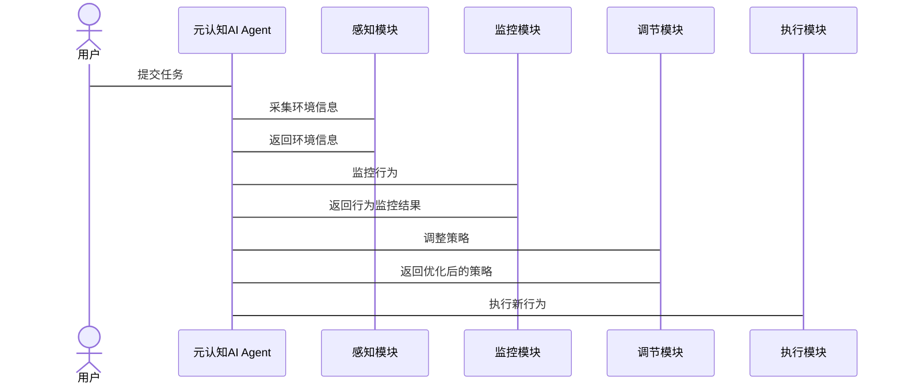

                 


# 元认知AI Agent：自我监控与调节

> 关键词：元认知AI Agent，自我监控，自我调节，人工智能，AI Agent

> 摘要：本文将深入探讨元认知AI Agent的自我监控与调节机制，分析其核心算法原理、系统架构设计、实际应用案例以及优化方法。通过理论与实践相结合的方式，帮助读者全面理解元认知AI Agent的工作原理及其在实际场景中的应用价值。

---

## 第1章: 元认知AI Agent的背景与概念

### 1.1 元认知AI Agent的背景

元认知（Metacognition）是指个体对自身认知过程的认知和调控能力。简单来说，元认知AI Agent是一种能够自我监控和调节自身行为的智能体（AI Agent）。随着人工智能技术的快速发展，AI Agent在各个领域的应用越来越广泛，但传统的AI Agent往往缺乏对自身行为的反思和调整能力，这限制了其在复杂场景中的表现。元认知AI Agent的出现，为解决这一问题提供了新的思路。

### 1.2 元认知AI Agent的核心概念

元认知AI Agent的核心在于其自我监控和自我调节能力。它不仅能够执行任务，还能够反思自己的行为、评估任务执行效果，并根据反馈调整自身策略。这种能力使得元认知AI Agent能够更好地适应动态变化的环境，并在复杂任务中表现出更高的智能性。

### 1.3 元认知AI Agent的边界与外延

元认知AI Agent的边界主要体现在其“自我监控与调节”的能力上。它不仅需要具备传统的AI Agent的功能（如感知环境、执行任务、与用户交互等），还需要能够对自身的认知过程进行监控和调整。从外延来看，元认知AI Agent可以应用于多个领域，如智能助手、推荐系统、自动驾驶等，尤其适用于需要动态调整策略的任务场景。

---

## 第2章: 元认知AI Agent的核心机制

### 2.1 自我监控机制

元认知AI Agent的自我监控机制包括以下三个主要步骤：
1. **感知环境**：通过传感器或其他输入方式获取环境信息。
2. **评估行为**：分析当前行为的执行效果，判断是否偏离目标。
3. **生成反馈**：根据评估结果生成反馈信息，为后续决策提供依据。

### 2.2 自我调节机制

自我调节机制是元认知AI Agent实现自我监控与调节的核心。它包括以下几个步骤：
1. **目标设定**：明确当前任务的目标和预期结果。
2. **策略调整**：根据反馈信息动态调整策略，优化行为路径。
3. **行为执行**：根据调整后的策略执行新的行为。

### 2.3 反馈机制

反馈机制是元认知AI Agent实现自我调节的重要环节。通过不断收集和分析反馈信息，元认知AI Agent能够持续优化自身的行为模式。反馈机制可以来自多个来源，如任务完成情况、用户反馈、环境变化等。

---

## 第3章: 元认知AI Agent的算法原理

### 3.1 元认知监控算法

元认知监控算法的核心目标是实时监控AI Agent的行为，并评估其与目标的契合度。一种常见的实现方法是基于强化学习的监控机制。以下是其实现步骤：

1. **定义监控指标**：根据任务需求，定义监控指标（如任务完成时间、准确性、用户满意度等）。
2. **实时数据采集**：通过传感器或其他输入方式采集实时数据。
3. **评估行为表现**：将采集到的数据与监控指标进行对比，评估当前行为的表现。
4. **生成反馈信号**：根据评估结果生成反馈信号，为后续的调节提供依据。

### 3.2 元认知调节算法

元认知调节算法的目标是根据反馈信号动态调整AI Agent的行为策略。以下是其实现步骤：

1. **分析反馈信号**：将反馈信号与当前行为进行关联分析，找出问题所在。
2. **优化策略参数**：根据分析结果，调整AI Agent的策略参数（如权重、阈值等）。
3. **执行新行为**：根据优化后的策略参数执行新的行为。

### 3.3 元认知反馈算法

元认知反馈算法的目标是通过反馈机制不断优化AI Agent的行为模式。以下是其实现步骤：

1. **收集反馈信息**：通过用户反馈、任务完成情况等方式收集反馈信息。
2. **分析反馈信息**：对反馈信息进行分类和分析，找出改进方向。
3. **更新监控指标**：根据分析结果，动态更新监控指标。

---

## 第4章: 元认知AI Agent的系统架构设计

### 4.1 系统功能设计

元认知AI Agent的系统功能设计主要包括以下几个模块：
1. **感知模块**：负责采集环境信息。
2. **监控模块**：负责监控AI Agent的行为。
3. **调节模块**：负责根据反馈信息调整行为策略。
4. **执行模块**：负责执行调整后的行为。

### 4.2 系统架构设计

以下是元认知AI Agent的系统架构设计图：



### 4.3 系统交互设计

以下是元认知AI Agent的系统交互设计图：



---

## 第5章: 元认知AI Agent的项目实战

### 5.1 项目背景

本项目旨在开发一个基于元认知AI Agent的智能助手，能够根据用户需求动态调整其行为策略，提供更优质的服务。

### 5.2 项目环境安装

以下是项目环境安装步骤：

1. **安装Python**：确保安装了Python 3.8或更高版本。
2. **安装依赖库**：使用以下命令安装所需的依赖库：
   ```bash
   pip install numpy matplotlib scikit-learn
   ```

### 5.3 项目核心实现

以下是元认知AI Agent的核心实现代码：

```python
class MetaCognitiveAgent:
    def __init__(self, target):
        self.target = target
        self.strategy = self.default_strategy()
        self.feedback = None

    def default_strategy(self):
        return {'weight': 0.5, 'threshold': 0.6}

    def monitor_behavior(self, action):
        # 实现行为监控逻辑
        pass

    def adjust_strategy(self, feedback):
        # 实现策略调整逻辑
        pass

    def execute_behavior(self):
        # 实现行为执行逻辑
        pass
```

### 5.4 项目案例分析

以下是元认知AI Agent在智能助手中的应用案例：

1. **用户需求分析**：用户提交任务，AI Agent分析任务需求。
2. **行为监控**：AI Agent监控自身的行为，评估任务执行效果。
3. **策略调整**：根据反馈信息，动态调整行为策略。
4. **执行新行为**：根据优化后的策略执行新的行为。

---

## 第6章: 元认知AI Agent的优化与扩展

### 6.1 元认知AI Agent的优化方法

1. **优化监控指标**：根据具体场景调整监控指标，提高监控的准确性。
2. **优化反馈机制**：引入更多的反馈来源，丰富反馈信息。
3. **优化策略调整算法**：采用更高效的算法，提高策略调整的效率。

### 6.2 元认知AI Agent的未来扩展方向

1. **多目标优化**：研究元认知AI Agent在多目标优化场景中的应用。
2. **分布式元认知**：探索元认知AI Agent在分布式系统中的应用。
3. **人机协作**：研究元认知AI Agent在人机协作中的角色和作用。

---

## 第7章: 总结与展望

### 7.1 元认知AI Agent的核心价值

元认知AI Agent通过自我监控与调节能力，能够更好地适应动态变化的环境，并在复杂任务中表现出更高的智能性。它为AI技术的发展提供了新的思路，也为各个领域的智能化转型提供了新的可能性。

### 7.2 元认知AI Agent的未来展望

随着人工智能技术的不断发展，元认知AI Agent的研究和应用将更加广泛。未来，元认知AI Agent将在更多领域得到应用，其功能和性能也将不断提升，为人类社会的发展做出更大的贡献。

---

作者：AI天才研究院/AI Genius Institute & 禅与计算机程序设计艺术 /Zen And The Art of Computer Programming

