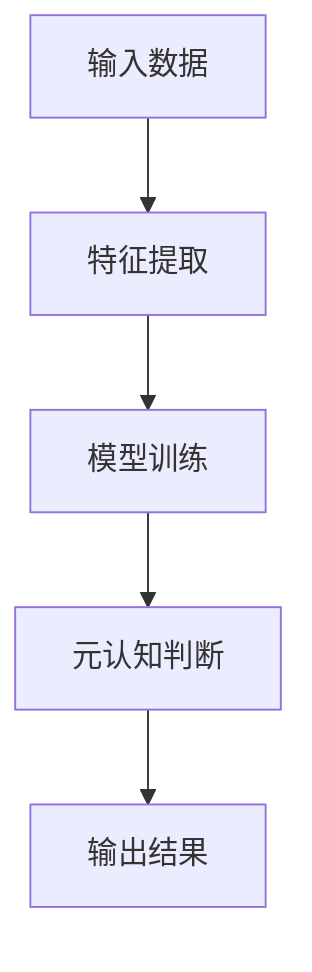
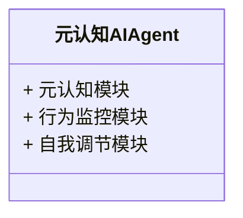
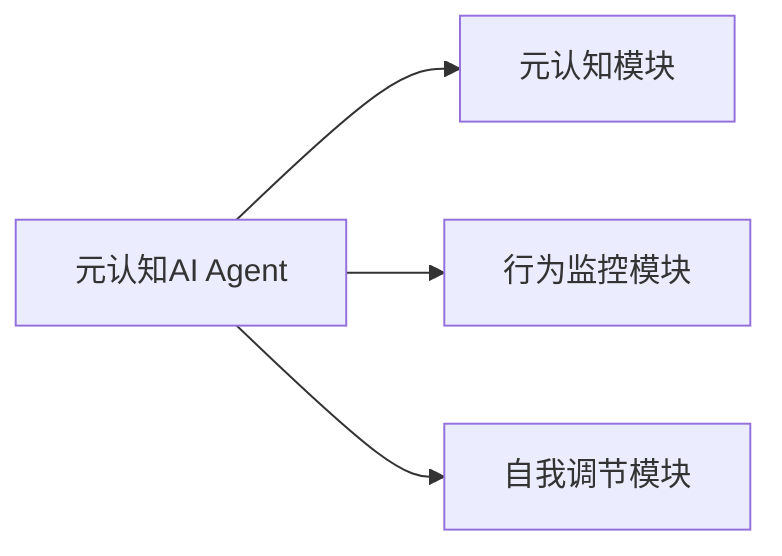
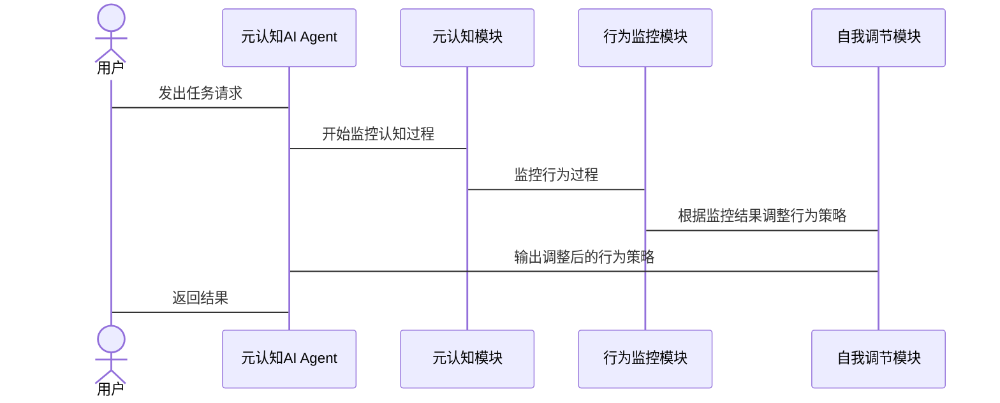

                 


# 元认知AI Agent：自我监控与调节

## 关键词：
元认知AI Agent, 自我监控, 自我调节, AI代理, 人工智能, 系统架构

## 摘要：
本文深入探讨了元认知AI Agent的核心概念、算法原理、系统架构及实际应用。通过详细分析元认知AI Agent的背景、核心概念与传统AI Agent的区别，以及其实现算法的数学模型和流程图，本文为读者提供了全面的理解。同时，通过项目实战案例，展示了元认知AI Agent在实际场景中的应用，并提供了系统的架构设计与接口设计。本文适合AI开发人员、研究人员及对元认知AI Agent感兴趣的读者阅读。

---

# 第一部分: 元认知AI Agent的背景与核心概念

## 第1章: 元认知AI Agent的背景与问题背景

### 1.1 元认知AI Agent的定义与核心概念

#### 1.1.1 元认知的定义与特征
元认知（Metacognition）是指对自身认知过程的认知，包括对思维过程的监控、评估和调节。元认知的核心特征包括：
- **自省性**：能够反思自身的认知过程。
- **调控性**：能够根据认知结果调整认知策略。
- **目标导向性**：以实现特定目标为导向。

#### 1.1.2 元认知AI Agent的定义
元认知AI Agent是一种具备元认知能力的智能代理，能够对自身的认知过程进行监控、评估和调节，以优化决策和行为。元认知AI Agent不仅能够执行任务，还能够反思自己的行为，并根据反思结果进行调整。

#### 1.1.3 元认知AI Agent的核心要素与组成
元认知AI Agent的核心要素包括：
- **元认知模块**：负责监控和评估AI Agent的认知过程。
- **行为监控模块**：对AI Agent的行为进行实时监控。
- **自我调节模块**：根据监控结果调整AI Agent的行为策略。

### 1.2 问题背景与问题描述

#### 1.2.1 当前AI Agent的局限性
传统AI Agent通常依赖预设的规则和数据，缺乏对自身认知过程的监控和调节能力。当遇到复杂或动态变化的环境时，传统AI Agent往往难以适应，导致性能下降。

#### 1.2.2 元认知能力在AI Agent中的必要性
元认知能力使AI Agent能够：
- 监控自身的认知过程。
- 评估认知结果的准确性。
- 根据评估结果调整认知策略。
这种能力能够显著提高AI Agent在复杂环境中的适应性和智能性。

#### 1.2.3 元认知AI Agent的目标与应用场景
元认知AI Agent的目标是通过自我监控和调节，优化AI Agent的行为，使其能够在动态变化的环境中实现更高效的任务执行。应用场景包括智能助手、智能客服、自动驾驶等。

### 1.3 元认知AI Agent的边界与外延

#### 1.3.1 元认知AI Agent的边界
元认知AI Agent的核心能力是元认知，但其边界不包括对物理环境的直接操作或对外部系统的控制，而是专注于认知过程的监控和调节。

#### 1.3.2 元认知AI Agent与相关概念的对比
以下是元认知AI Agent与相关概念的对比：

| 概念 | 定义 | 特点 |
|------|------|------|
| 传统AI Agent | 依据预设规则执行任务 | 无法监控和调节自身认知过程 |
| 元认知AI Agent | 具备元认知能力的智能代理 | 能够监控、评估和调节自身认知过程 |
| 自我修复系统 | 具备自我修复能力的系统 | 通常不涉及认知过程的监控 |

#### 1.3.3 元认知AI Agent的外延与扩展
元认知AI Agent的外延包括：
- **自适应学习**：根据监控结果动态调整学习策略。
- **动态决策**：在复杂环境中实时调整决策策略。
- **自我优化**：通过元认知能力实现性能的持续优化。

## 1.4 本章小结
本章介绍了元认知AI Agent的背景、核心概念和边界，重点分析了元认知AI Agent与传统AI Agent的区别，并总结了元认知AI Agent的目标与应用场景。

---

## 第2章: 元认知AI Agent的核心概念与联系

### 2.1 元认知模型的原理与实现

#### 2.1.1 元认知模型的原理
元认知模型通过监控和评估AI Agent的认知过程，实现对认知策略的调节。其原理包括：
1. **认知监控**：实时监控AI Agent的认知过程。
2. **认知评估**：评估认知过程的有效性和准确性。
3. **认知调节**：根据评估结果调整认知策略。

#### 2.1.2 元认知模型的实现机制
元认知模型的实现机制包括：
- **监控模块**：负责监控AI Agent的认知过程。
- **评估模块**：对监控结果进行评估。
- **调节模块**：根据评估结果调整认知策略。

#### 2.1.3 元认知模型与AI Agent的结合
元认知模型通过与AI Agent的结合，使其能够实现自我监控和调节。这种结合使得AI Agent能够在复杂环境中动态调整行为策略。

### 2.2 元认知与传统AI Agent的对比分析

#### 2.2.1 元认知AI Agent与传统AI Agent的对比
以下是元认知AI Agent与传统AI Agent的对比：

| 比较维度 | 传统AI Agent | 元认知AI Agent |
|----------|---------------|-----------------|
| 是否具备元认知能力 | 无 | 有 |
| 是否能够监控自身认知过程 | 无 | 有 |
| 是否能够调节自身认知策略 | 无 | 有 |

#### 2.2.2 元认知能力对AI Agent性能的提升
元认知能力能够显著提升AI Agent的性能，具体表现为：
- **适应性增强**：能够更好地适应复杂环境。
- **决策精度提高**：能够通过元认知能力提高决策的准确性。
- **自我修复能力增强**：能够通过元认知能力实现自我修复。

#### 2.2.3 元认知AI Agent的独特优势
元认知AI Agent的独特优势包括：
- **动态适应性**：能够动态调整行为策略。
- **自我优化能力**：能够通过元认知能力实现自我优化。
- **高效性**：通过元认知能力实现高效的任务执行。

### 2.3 元认知AI Agent的ER实体关系图

```mermaid
er
actor: 元认知AI Agent
role: 元认知模块
role: 行为监控模块
role: 自我调节模块
```

---

## 第3章: 元认知AI Agent的算法原理

### 3.1 元认知模型的数学模型与公式

#### 3.1.1 元认知模型的数学表达式
元认知模型的数学表达式如下：

$$ P(\text{元认知判断正确}) = f(\text{历史行为数据}) $$

其中，$f$ 是一个函数，表示根据历史行为数据计算元认知判断正确的概率。

### 3.2 元认知AI Agent的算法实现

#### 3.2.1 元认知模型的训练流程



---

## 第4章: 元认知AI Agent的系统分析与架构设计

### 4.1 系统分析与架构设计

#### 4.1.1 系统功能设计



#### 4.1.2 系统架构设计



#### 4.1.3 系统接口设计
- **输入接口**：接收外部环境的输入数据。
- **输出接口**：输出AI Agent的行为结果。
- **内部接口**：元认知模块、行为监控模块和自我调节模块之间的交互接口。

#### 4.1.4 系统交互流程



---

## 第5章: 元认知AI Agent的项目实战

### 5.1 项目介绍

#### 5.1.1 项目背景
本项目旨在开发一个具备元认知能力的智能写作助手，能够根据用户的写作过程进行监控和调节，优化写作效率。

### 5.2 系统核心实现

#### 5.2.1 环境安装
```bash
pip install -r requirements.txt
```

#### 5.2.2 核心代码实现

```python
class MetaCognitionAI:
    def __init__(self):
        self.meta_cognition_module = MetaCognitionModule()
        self.behavior_monitoring_module = BehaviorMonitoringModule()
        self.self_regulation_module = SelfRegulationModule()

    def process_request(self, request):
        self.meta_cognition_module.monitor(request)
        self.behavior_monitoring_module.monitor(request)
        adjustment = self.self_regulation_module.regulate(request)
        return adjustment

class MetaCognitionModule:
    def monitor(self, request):
        # 具体实现
        pass

    def regulate(self, request):
        # 具体实现
        pass

class BehaviorMonitoringModule:
    def monitor(self, request):
        # 具体实现
        pass
```

#### 5.2.3 代码解读与分析
- **MetaCognitionAI**：元认知AI Agent的主类，负责协调各个模块的工作。
- **MetaCognitionModule**：元认知模块，负责监控和调节认知过程。
- **BehaviorMonitoringModule**：行为监控模块，负责监控AI Agent的行为过程。

### 5.3 实际案例分析

#### 5.3.1 案例背景
用户向智能写作助手提出写作请求，AI Agent需要根据用户的写作过程进行监控和调节，优化写作效率。

#### 5.3.2 案例分析
1. 用户提出写作请求。
2. 元认知模块开始监控用户的写作过程。
3. 行为监控模块监控用户的写作行为。
4. 自我调节模块根据监控结果调整写作策略。
5. AI Agent输出调整后的写作策略。

### 5.4 项目小结
本项目通过实际案例展示了元认知AI Agent在智能写作助手中的应用，验证了其在实际场景中的有效性。

---

## 第6章: 元认知AI Agent的最佳实践与小结

### 6.1 最佳实践

#### 6.1.1 系统设计
- 确保元认知模块、行为监控模块和自我调节模块的协同工作。
- 定期评估和优化元认知模型的性能。

#### 6.1.2 实施建议
- 在实际应用中，建议结合具体场景优化元认知AI Agent的行为策略。
- 定期更新元认知模型的参数，以适应环境的变化。

### 6.2 小结
元认知AI Agent通过自我监控和调节，能够显著提高AI Agent的智能性和适应性。在实际应用中，元认知AI Agent能够在复杂环境中动态调整行为策略，实现更高效的任务执行。

---

## 第7章: 元认知AI Agent的注意事项与拓展阅读

### 7.1 注意事项

#### 7.1.1 系统稳定性
元认知AI Agent的自我监控和调节能力依赖于系统的稳定性，建议在实际应用中确保系统的稳定性。

#### 7.1.2 数据隐私
元认知AI Agent需要监控和调节认知过程，可能涉及用户数据的处理，需要注意数据隐私问题。

### 7.2 拓展阅读
- 《元认知与人工智能》
- 《自适应AI系统设计》
- 《智能系统中的自我调节机制》

---

## 作者：AI天才研究院/AI Genius Institute & 禅与计算机程序设计艺术 /Zen And The Art of Computer Programming

---

以上是关于“元认知AI Agent：自我监控与调节”的完整文章内容，涵盖了从背景到实现的各个方面，为读者提供了全面的理解和实践指导。

