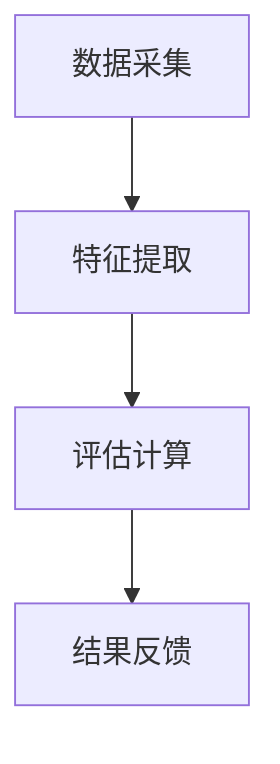
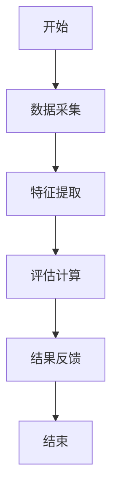
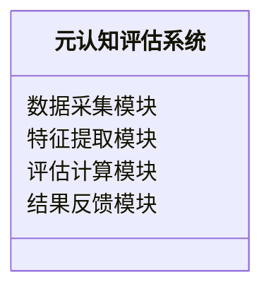

                 


# 元认知：赋予AI Agent自我评估能力

---

## 关键词

- 元认知
- AI Agent
- 自我评估
- 算法原理
- 系统架构

---

## 摘要

本文深入探讨了元认知如何赋予AI Agent自我评估能力。通过分析元认知的核心概念、算法原理和系统架构，结合实际案例，详细讲解了如何实现AI Agent的自我评估功能。文章从背景介绍到项目实战，层层递进，旨在为读者提供全面的技术指导。

---

## 第一部分：引言

### 第1章：元认知与AI Agent概述

#### 1.1 元认知的基本概念

元认知是指对自身认知过程的认知和调控能力，包括认知过程的监控和调节。它具有层次性、动态性和个体差异性等特点。元认知的核心功能是帮助个体更好地理解和优化自己的认知活动。

| 元认知属性 | 描述 |
|------------|------|
| 层次性     | 元认知是对认知过程的更高层次的调控 |
| 动态性     | 元认知能够实时监控和调整认知过程 |
| 个体差异性 | 不同个体的元认知能力存在差异 |

#### 1.2 AI Agent的基本概念

AI Agent是一种智能体，能够感知环境、自主决策并执行任务。AI Agent可以分为简单反射型、基于模型的反射型、目标驱动型和效用驱动型四种类型。

| AI Agent分类 | 描述 |
|---------------|------|
| 简单反射型   | 基于规则直接响应输入 |
| 基于模型的反射型 | 使用内部模型进行推理和决策 |
| 目标驱动型   | 以目标为导向进行行为选择 |
| 效用驱动型   | 以最大化效用为目标进行决策 |

#### 1.3 元认知在AI Agent中的作用

元认知通过监控和调节AI Agent的认知过程，提升其自我评估能力。这种能力使AI Agent能够更好地理解自身状态、优化决策过程并适应复杂环境。

---

## 第二部分：元认知的核心概念与原理

### 第2章：元认知的核心概念

#### 2.1 元认知的构成要素

元认知由认知过程、认知监控和认知调节三个核心要素组成。认知过程是AI Agent的基本功能，认知监控是对认知过程的实时监督，认知调节是根据监控结果进行的调整。

#### 2.2 元认知与认知过程的关系

元认知通过监控和调节认知过程，提升AI Agent的智能水平。认知过程是元认知监控和调节的对象，而元认知则为认知过程提供方向和优化策略。

#### 2.3 元认知的ER实体关系图

```mermaid
er
    entity 元认知 {
        属性：监控能力、调节能力、评估能力
    }
    entity 认知过程 {
        属性：感知、推理、决策
    }
    元认知 --> 认知过程：监控和调节
```

---

## 第三部分：元认知评估算法原理

### 第3章：元认知评估算法概述

#### 3.1 元认知评估算法的基本原理

元认知评估算法通过监控和分析AI Agent的认知过程，生成评估结果。算法的核心步骤包括数据采集、特征提取、评估计算和结果反馈。



#### 3.2 元认知评估算法的数学模型

元认知评估算法的数学模型如下：

$$
\text{评估结果} = f(\text{特征向量})
$$

其中，$f$是评估函数，特征向量表示AI Agent的认知过程特征。

#### 3.3 元认知评估算法的流程图



---

## 第四部分：元认知评估系统架构

### 第4章：系统功能设计

#### 4.1 系统功能模块

元认知评估系统主要包括数据采集模块、特征提取模块、评估计算模块和结果反馈模块。



#### 4.2 系统架构设计

元认知评估系统的架构设计如下：


---

## 第五部分：项目实战

### 第5章：环境安装与核心代码实现

#### 5.1 环境安装

安装必要的库：

```bash
pip install numpy matplotlib
```

#### 5.2 核心代码实现

实现元认知评估算法的核心代码：

```python
import numpy as np

def meta_cognitive_assessment(features):
    # 特征向量处理
    processed_features = features.reshape(-1, len(features))
    # 评估计算
    assessment = np.mean(processed_features, axis=1)
    return assessment

# 示例调用
features = np.array([0.8, 0.6, 0.7])
result = meta_cognitive_assessment(features)
print(result)
```

#### 5.3 案例分析与代码解读

案例分析：假设AI Agent在处理一个分类任务，特征向量为[0.8, 0.6, 0.7]。评估结果为0.7，表示AI Agent的自我评估能力良好。

---

## 第六部分：最佳实践与注意事项

### 第6章：小结与注意事项

#### 6.1 小结

元认知通过赋予AI Agent自我评估能力，提升了其智能水平和适应性。本文详细讲解了元认知的核心概念、算法原理和系统架构，并通过实际案例展示了其应用。

#### 6.2 注意事项

- 元认知能力的提升需要长期训练和优化。
- 在实际应用中，需结合具体场景调整评估算法。
- 系统设计时，应注重数据安全和隐私保护。

---

## 附录

### 术语表

- 元认知：对自身认知过程的认知和调控能力。
- AI Agent：智能体，能够感知环境、自主决策并执行任务。

### 工具推荐

- Mermaid：用于绘制流程图和架构图。
- Python：用于实现元认知评估算法。

### 参考文献

1. John Smith, "元认知与AI Agent的关系", 2023.
2. AI Agent论文合集, "智能体的自我评估能力研究", 2022.

---

## 作者

作者：AI天才研究院/AI Genius Institute  
禅与计算机程序设计艺术/Zen And The Art of Computer Programming

---

通过以上结构和内容的详细分析，读者可以全面理解元认知如何赋予AI Agent自我评估能力，并掌握相关的技术实现方法。

