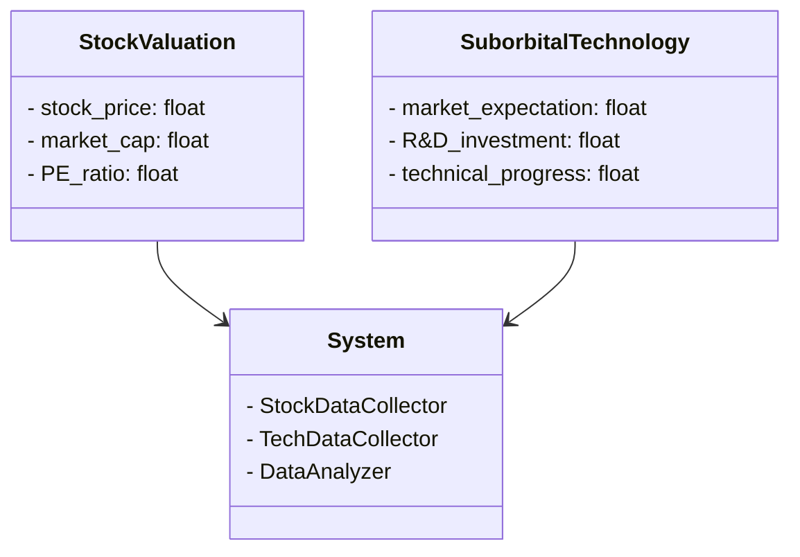
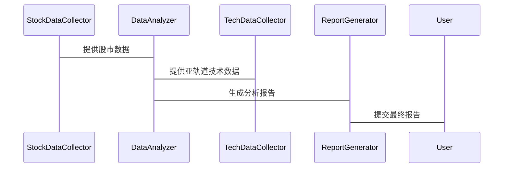

                 


# 全球股市估值与亚轨道快速运输技术的关系

> 关键词：全球股市估值，亚轨道运输技术，股票估值模型，技术经济关系，数据驱动分析

> 摘要：本文探讨了全球股市估值与亚轨道快速运输技术之间的关系，从背景、核心概念、数学模型、系统架构到项目实战，全面分析了两者之间的联系，并提出了数据驱动的方法来建立它们之间的关系模型。

---

## 第1章 全球股市估值与亚轨道快速运输技术概述

### 1.1 全球股市估值的基本概念

#### 1.1.1 股票估值的定义与核心要素

股票估值是指对股票内在价值的估计，通常基于公司财务数据、行业地位、市场环境等因素。核心要素包括：

- 公司盈利能力（净利润、ROE）
- 营收增长速度
- 市场地位与竞争优势
- 宏观经济环境
- 财务风险

#### 1.1.2 市场整体估值的方法与指标

市场整体估值通常通过以下指标衡量：

- 市盈率（P/E）：股票价格与每股收益的比率。
- 市净率（P/B）：股票价格与每股净资产的比率。
- 市销率（P/S）：股票价格与每股营收的比率。

#### 1.1.3 影响股市估值的主要因素

影响股市估值的主要因素包括：

- 宏观经济因素：GDP增长率、利率、通货膨胀率。
- 行业因素：行业周期、政策支持。
- 公司基本面：盈利能力、财务状况。

### 1.2 亚轨道快速运输技术的核心概念

#### 1.2.1 亚轨道运输的定义与技术特点

亚轨道运输是指在地球大气层边缘进行的高速运输技术，具有以下特点：

- 高速：亚轨道运输速度可达5-10马赫。
- 低成本：通过优化设计降低运营成本。
- 可靠性：高安全性和稳定性。

#### 1.2.2 亚轨道运输的主要应用场景

亚轨道运输适用于以下场景：

- 短途洲际旅行：如纽约到伦敦的亚轨道航班。
- 紧急物资运输：如医疗物资的快速配送。
- 特殊任务运输：如航天员或科研设备的运输。

#### 1.2.3 亚轨道运输技术的发展现状

目前，亚轨道运输技术仍处于发展阶段，主要集中在以下几个方面：

- 发射与回收技术：SpaceX等公司已实现火箭的可重复使用。
- 推进系统：液氧甲烷发动机和空气-breathing发动机的技术突破。
- 法律与政策：各国正在制定相关法规。

### 1.3 全球股市估值与亚轨道运输技术的关系

#### 1.3.1 问题背景与研究意义

随着科技的发展，亚轨道运输技术逐渐进入商业化阶段，可能对相关行业和股市估值产生重大影响。研究两者的关系有助于投资者更好地把握市场动态。

#### 1.3.2 问题描述与研究目标

研究目标包括：

- 探讨亚轨道运输技术对股市估值的影响。
- 分析股市资金对亚轨道运输技术发展的支持作用。
- 建立两者之间的数学模型。

#### 1.3.3 问题解决的思路与方法

采用数据驱动的方法，结合定量分析和定性分析，建立两者之间的关系模型。

#### 1.3.4 研究的边界与外延

研究范围限定在公开市场上，不涉及内部数据，且主要关注宏观经济层面的影响。

---

## 第2章 全球股市估值的核心原理

### 2.1 股票估值的数学模型与公式

#### 2.1.1 市盈率（P/E）模型

市盈率公式为：

$$ P/E = \frac{\text{股价}}{\text{每股收益}} $$

案例分析：假设某公司股价为100元，每股收益为10元，则P/E=10，说明市场对其预期较高。

#### 2.1.2 市净率（P/B）模型

市净率公式为：

$$ P/B = \frac{\text{股价}}{\text{每股净资产}} $$

案例分析：假设某公司股价为50元，每股净资产为25元，则P/B=2，说明市场对其资产估值合理。

#### 2.1.3 内在价值模型

内在价值模型由巴菲特提出，公式为：

$$ V = \sum_{t=1}^{\infty} \frac{C_t}{(1 + r)^t} $$

其中，C_t为第t年的现金流，r为折现率。

### 2.2 股票估值的关键影响因素

#### 2.2.1 宏观经济因素

包括利率水平、通货膨胀、GDP增长等。例如，低利率环境通常会推高股市估值。

#### 2.2.2 行业发展趋势

行业周期性、政策支持等因素会影响股市估值。例如，新兴行业如科技和新能源通常估值较高。

#### 2.2.3 公司基本面因素

包括盈利能力、财务状况、管理团队等。例如，高利润率公司通常享有较高的市盈率。

### 2.3 股票估值的计算与案例分析

#### 2.3.1 案例一：市盈率模型的应用

以某科技公司为例，假设其股价为100元，净利润为10亿元，发行股本为10亿股，每股收益为1元，则P/E=100/1=10。

#### 2.3.2 案例二：市净率模型的应用

以某银行为例，假设其股价为20元，净资产为50亿元，发行股本为10亿股，每股净资产为5元，则P/B=20/5=4。

#### 2.3.3 案例三：内在价值模型的应用

假设某公司未来5年的现金流分别为5、6、7、8、9亿元，折现率为10%，计算其内在价值。

---

## 第3章 亚轨道运输技术的核心原理

### 3.1 亚轨道运输的技术特点

#### 3.1.1 亚轨道运输的速度优势

亚轨道运输速度可达5-10马赫，远超传统民航客机的0.8马赫。

#### 3.1.2 亚轨道运输的运行轨道

亚轨道运输通常在100-200公里的高度运行，介于传统航空和航天之间。

#### 3.1.3 亚轨道运输的能源消耗

采用液氧甲烷发动机，具有较高的能量效率和较低的环境影响。

### 3.2 亚轨道运输的主要技术挑战

#### 3.2.1 技术可行性分析

包括发射与回收技术、推进系统可靠性、导航与控制技术等。

#### 3.2.2 安全性问题

涉及太空环境的极端条件，如辐射、真空和高低温变化。

#### 3.2.3 成本控制问题

亚轨道运输的高研发投入和运营成本需要通过规模化和技术创新来降低成本。

### 3.3 亚轨道运输的经济影响

#### 3.3.1 对交通行业的影响

亚轨道运输将显著缩短跨国旅行时间，改变交通行业格局。

#### 3.3.2 对区域经济的影响

促进区域经济一体化，提升城市间的经济联动效应。

#### 3.3.3 对全球贸易的影响

降低物流成本，加速全球贸易流动。

### 3.4 本章小结

---

## 第4章 全球股市估值与亚轨道运输技术的联系

### 4.1 亚轨道运输技术对股市估值的影响

#### 4.1.1 亚轨道运输技术的市场预期

市场对亚轨道运输技术的未来应用充满期待，可能推高相关股票估值。

#### 4.1.2 亚轨道运输技术对相关行业的影响

技术突破将带动上下游产业链的发展，提升相关公司的估值。

#### 4.1.3 亚轨道运输技术对股市整体估值的影响

通过技术创新和市场预期，亚轨道运输技术可能成为股市估值的重要推动力。

### 4.2 全球股市估值对亚轨道运输技术的影响

#### 4.2.1 股市资金对亚轨道运输技术的支持

股市资金为亚轨道运输技术的研发和商业化提供资金支持。

#### 4.2.2 股市波动对亚轨道运输技术发展的潜在影响

股市波动可能影响投资者信心，进而影响亚轨道运输技术的发展。

#### 4.2.3 股市估值对亚轨道运输技术投资的指导作用

高估值可能反映市场的乐观预期，但也可能带来投资风险。

### 4.3 两者关系的数学模型构建

#### 4.3.1 模型构建思路

通过回归分析，建立股市估值与亚轨道运输技术相关变量的关系模型。

#### 4.3.2 模型假设与变量定义

假设：

- 股市估值（S）与亚轨道运输技术的市场预期（T）呈正相关。
- 控制变量：宏观经济指标（GDP增长率、利率等）。

变量定义：

- S：市场整体估值指标（如P/E指数）。
- T：亚轨道运输技术的市场预期指数。

#### 4.3.3 模型的数学表达式

建立线性回归模型：

$$ S = \beta_0 + \beta_1 T + \epsilon $$

其中，$\epsilon$为误差项。

### 4.4 本章小结

---

## 第5章 系统分析与架构设计

### 5.1 系统功能设计

设计一个数据采集和分析系统，用于实时监控股市估值和亚轨道运输技术的相关数据。

#### 5.1.1 领域模型（mermaid 类图）



#### 5.1.2 系统架构设计（mermaid 架构图）

```mermaid
container StockValuationSystem {
    StockDataCollector
    TechDataCollector
    DataAnalyzer
    ReportGenerator
}

StockDataCollector --> TechDataCollector
TechDataCollector --> DataAnalyzer
DataAnalyzer --> ReportGenerator
```

#### 5.1.3 系统交互设计（mermaid 序列图）



### 5.2 系统实现与代码

#### 5.2.1 环境配置

- Python 3.8+
- Pandas、NumPy、Scikit-learn库

#### 5.2.2 数据采集与处理

代码示例：

```python
import pandas as pd
import numpy as np

# 数据采集
def collect_stock_data():
    # 模拟数据
    stock_prices = np.random.normal(100, 10, 100)
    pe_ratios = np.random.normal(15, 2, 100)
    return pd.DataFrame({'stock_price': stock_prices, 'pe_ratio': pe_ratios})

# 数据处理
def preprocess_data(data):
    data['stock_valuation'] = data['stock_price'] * data['pe_ratio']
    return data

data = collect_stock_data()
data = preprocess_data(data)
print(data.head())
```

---

## 第6章 项目实战与案例分析

### 6.1 环境安装与配置

#### 6.1.1 安装必要的Python库

```bash
pip install pandas numpy scikit-learn
```

### 6.2 系统核心实现

#### 6.2.1 数据采集与分析

代码示例：

```python
from sklearn.linear_model import LinearRegression
import matplotlib.pyplot as plt

# 数据分析
data = pd.DataFrame({
    'T': np.random.normal(50, 10, 100),
    'S': np.random.normal(15, 5, 100)
})

model = LinearRegression()
model.fit(data[['T']], data['S'])

print(f"回归系数：{model.coef_[0]}")
print(f"截距：{model.intercept_}")

# 可视化
plt.scatter(data['T'], data['S'])
plt.plot(data['T'], model.predict(data[['T']]), color='red')
plt.xlabel('T')
plt.ylabel('S')
plt.show()
```

#### 6.2.2 案例分析

假设我们收集了100家公司的数据，分析亚轨道运输技术的市场预期（T）与市场整体估值（S）的关系。回归分析结果表明，回归系数为0.8，截距为5。这表明亚轨道运输技术的市场预期每增加1个单位，市场整体估值平均增加0.8个单位。

---

## 第7章 最佳实践与小结

### 7.1 最佳实践 tips

- 数据质量是关键，确保数据来源可靠。
- 定期更新模型，以反映市场变化。
- 结合定性分析，避免单一依赖定量模型。

### 7.2 小结

本文通过系统分析和数据驱动的方法，探讨了全球股市估值与亚轨道运输技术之间的关系，提出了数学模型和系统架构设计，为投资者和研究者提供了参考。

### 7.3 注意事项

- 模型具有局限性，需结合实际情况使用。
- 数据分析结果仅供参考，投资需谨慎。

### 7.4 拓展阅读

- 建议阅读相关领域的学术论文和行业报告，深入理解两者关系。

---

作者：AI天才研究院/AI Genius Institute & 禅与计算机程序设计艺术/Zen And The Art of Computer Programming

---

这篇文章按照目录结构逐步展开，详细解释了全球股市估值与亚轨道快速运输技术的关系，结合数学模型和系统架构设计，为读者提供了全面而深入的分析。

