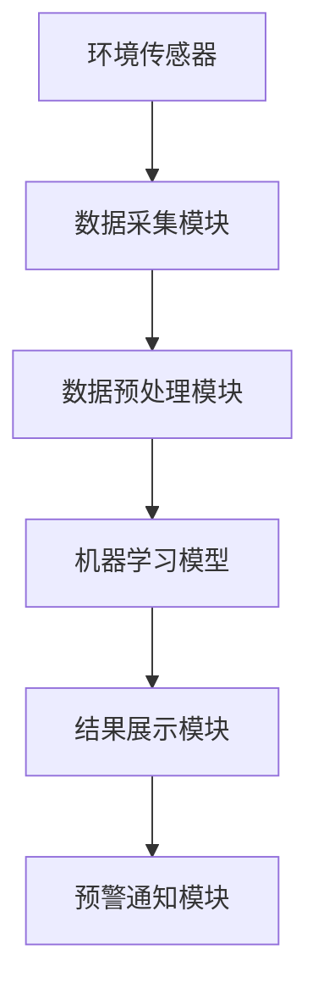

                 

# 全球股市估值与人工智能在环境监测中的应用

> 关键词：全球股市估值，人工智能，环境监测，股票估值模型，机器学习，深度学习

> 摘要：本文探讨了全球股市估值的核心概念与应用，以及人工智能在环境监测中的创新应用。通过分析股票估值的基本方法与挑战，结合机器学习和深度学习技术，展示了AI在环境监测中的数据处理、预测建模和实时监控的优势。最后，本文结合两者，分析了跨领域应用的潜力与投资机会。

---

# 第一部分: 全球股市估值基础

## 第1章: 全球股市估值概述

### 1.1 股市估值的基本概念

#### 1.1.1 股票估值的定义与意义

股票估值是指对单个股票或整个市场的价值进行评估的过程，旨在确定其内在价值。股票估值的意义在于帮助投资者做出明智的投资决策，识别被低估或高估的投资机会。

#### 1.1.2 股市估值的核心要素

股市估值的核心要素包括公司基本面、宏观经济环境、行业状况和市场情绪等。

#### 1.1.3 股市估值的分类与应用场景

股市估值可以分为相对估值和绝对估值。相对估值常用市盈率（PE）、市净率（PB）等指标；绝对估值则主要基于现金流折现模型（DCF）。

### 1.2 股市估值的主要影响因素

#### 1.2.1 宏观经济因素

宏观经济因素包括GDP增长率、利率水平、通货膨胀率和货币政策等，这些因素直接影响股市的整体估值。

#### 1.2.2 行业因素

行业因素包括行业生命周期、竞争格局和政策法规等，不同行业的估值标准和驱动因素有所不同。

#### 1.2.3 公司基本面因素

公司基本面因素包括盈利能力、财务状况、成长能力和分红政策等，是股票估值的核心依据。

### 1.4 股市估值的挑战与局限性

#### 1.4.1 数据的不完全性

市场数据可能存在缺失或滞后，影响估值的准确性。

#### 1.4.2 市场情绪的波动性

市场情绪的短期波动可能导致估值偏离实际价值。

#### 1.4.3 宏观经济的不确定性

宏观经济的不确定性使得长期估值预测更具挑战性。

---

## 第2章: 全球股市估值模型与应用

### 2.1 常用的股市估值模型

#### 2.1.1 市盈率（PE）模型

市盈率模型基于公司当前的股价与每股收益（EPS）的比率，适用于盈利稳定的公司。

$$ PE = \frac{Stock Price}{Earnings Per Share} $$

#### 2.1.2 市净率（PB）模型

市净率模型基于公司股价与每股净资产（BPS）的比率，适用于资产密集型行业。

$$ PB = \frac{Stock Price}{Book Value Per Share} $$

#### 2.1.3 现金流折现模型（DCF）

DCF模型通过折现未来现金流来评估公司价值，适用于高成长性公司。

$$ V = \sum_{t=1}^{n} \frac{CF_t}{(1+r)^t} $$

### 2.2 股市估值模型的优缺点对比

| 模型 | 优点 | 缺点 |
|------|------|------|
| PE | 简单易用，适用于盈利稳定公司 | 受周期性影响，不适合亏损公司 |
| PB | 考虑资产价值，适用于资产密集型行业 | 未能反映盈利情况 |
| DCF | 精确反映未来现金流，适用于高成长性公司 | 计算复杂，依赖未来现金流预测 |

### 2.3 股市估值模型的实际应用案例

#### 2.3.1 美国股市估值案例

以苹果公司为例，使用PE和DCF模型进行估值，比较市场价与内在价值，判断是否低估或高估。

#### 2.3.2 欧洲股市估值案例

以德国某制造业公司为例，使用PB模型结合行业数据进行估值。

#### 2.3.3 亚洲股市估值案例

以某中国科技公司为例，使用DCF模型评估其高成长性。

---

# 第二部分: 人工智能在环境监测中的应用

## 第3章: 人工智能与环境监测概述

### 3.1 环境监测的基本概念

环境监测是通过技术手段对环境质量进行检测和评估的过程，包括空气、水、土壤等介质的监测。

### 3.2 人工智能在环境监测中的作用

#### 3.2.1 数据处理与分析

AI能够处理海量环境数据，提取关键特征，提高分析效率。

#### 3.2.2 模型预测与预警

通过机器学习模型预测环境质量变化，提前发出预警。

#### 3.2.3 自动化监测与反馈

AI可以实现环境监测系统的自动化运行和实时反馈。

### 3.3 人工智能在环境监测中的优势

#### 3.3.1 高效性

AI能够快速处理大量数据，提高监测效率。

#### 3.3.2 准确性

AI模型通过学习历史数据，提高预测的准确性。

#### 3.3.3 实时性

AI系统能够实时分析数据，实现即时反馈。

---

## 第4章: 人工智能在环境监测中的关键技术

### 4.1 数据采集与预处理

#### 4.1.1 环境数据的采集

通过传感器网络实时采集环境数据，如温度、湿度、PM2.5等。

#### 4.1.2 数据预处理

数据清洗、特征提取和数据标准化，为后续分析提供高质量数据。

### 4.2 环境监测的机器学习模型

#### 4.2.1 回归模型

用于预测环境指标，如PM2.5浓度预测。

$$ y = \beta_0 + \beta_1x_1 + \beta_2x_2 + \dots + \beta_nx_n $$

#### 4.2.2 分类模型

用于环境状态分类，如空气质量指数（AQI）分类。

#### 4.2.3 深度学习模型

用于复杂环境数据的特征提取和预测。

### 4.3 环境监测系统的系统架构设计

#### 4.3.1 系统功能设计

数据采集、数据处理、模型预测、结果展示和预警通知。

#### 4.3.2 系统架构图

### 4.4 环境监测系统的实际应用案例

#### 4.4.1 空气质量监测

通过AI模型预测PM2.5浓度，提前发出预警。

#### 4.4.2 水质监测

通过AI模型分析水质数据，识别污染源。

---

## 第5章: 结合全球股市估值与人工智能的环境监测应用

### 5.1 跨领域应用的潜力

通过AI技术结合全球股市估值模型，优化环境监测系统的投资决策。

### 5.2 投资机会与风险管理

利用AI模型预测环境监测企业的股票估值，寻找投资机会，同时进行风险管理。

### 5.3 未来发展趋势

随着AI技术的进步，环境监测与股市估值的结合将更加紧密，推动绿色金融的发展。

---

## 附录

### 附录A: 相关工具与API

列出常用的环境监测数据源和股票估值工具。

### 附录B: 参考文献

引用本文中提到的相关文献和数据源。

---

作者：AI天才研究院 & 禅与计算机程序设计艺术

