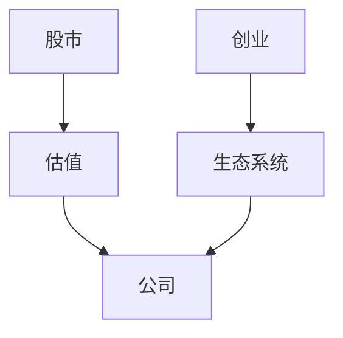

                 

# 全球股市估值与创业生态系统互动

> 关键词：全球股市估值，创业生态系统，互动关系，PE模型，DCF模型，ER图，系统架构

> 摘要：本文探讨了全球股市估值与创业生态系统之间的互动关系，分析了股市估值的核心理论与方法，创业生态系统的核心要素及其互动机制，并通过案例分析和系统架构设计展示了其实际应用。文章深入剖析了两者之间的相互影响，为理解金融市场与创业环境的动态关系提供了新的视角。

---

# 第一章: 全球股市估值与创业生态系统概述

## 1.1 背景介绍

### 1.1.1 问题背景

- 股市估值是评估企业价值的重要工具，影响投资者决策。
- 创业生态系统涉及创业者、投资者、政府等多个主体，是创新经济的重要组成部分。
- 两者的互动关系在现代经济中日益重要，尤其是在科技初创企业和资本市场的联动中。

### 1.1.2 问题描述

- 股市估值的核心问题：如何准确评估企业的内在价值。
- 创业生态系统的关键要素：创业者、资本、市场和技术支持。
- 互动关系的复杂性：股市估值为创业企业提供融资渠道，而创业活动推动股市的创新和发展。

### 1.1.3 问题解决

- 股市估值的基本方法：PE、PB、DCF等模型。
- 创业生态系统构建的关键步骤：资源整合、政策支持、创新环境营造。
- 互动关系的分析框架：资金流动、价值创造、风险分担。

### 1.1.4 边界与外延

- 股市估值的适用范围：上市公司、拟上市公司。
- 创业生态系统的边界：初创企业、孵化器、风险投资。
- 互动关系的适用场景：技术创新型企业的融资与成长。

### 1.1.5 概念结构与核心要素

- 股市估值的核心要素：企业财务数据、市场环境、投资者情绪。
- 创业生态系统的核心要素：创业者、投资者、政府、服务机构。
- 互动关系的构成要素：资金流动、信息共享、价值创造。

## 1.2 核心概念与联系

### 1.2.1 核心概念原理

- 股市估值的理论基础：现代金融理论、资本资产定价模型。
- 创业生态系统构建的理论基础：创新经济学、组织行为学。
- 互动关系的理论基础：系统动力学、网络理论。

### 1.2.2 概念属性特征对比

| 概念       | 股市估值 | 创业生态系统 | 互动关系 |
|------------|----------|--------------|----------|
| 核心目标   | 评估企业价值 | 促进创新和创业 | 资金与价值互动 |
| 主要参与者 | 投资者、企业 | 创业者、投资者、政府 | 资金流动 |
| 影响因素   | 财务数据、市场情绪 | 政策、技术、市场 | 资金、信息、创新 |

### 1.2.3 ER实体关系图

---

# 第二章: 股市估值的理论与方法

## 2.1 股市估值的基本理论

### 2.1.1 市盈率（PE）模型

- 定义：市盈率是股票价格与每股收益的比率。
- 计算公式：$$PE = \frac{股票价格}{每股收益}$$
- 应用场景：评估企业盈利能力，尤其适用于周期稳定的行业。

### 2.1.2 市净率（PB）模型

- 定义：市净率是股票价格与每股净资产的比率。
- 计算公式：$$PB = \frac{股票价格}{每股净资产}$$
- 应用场景：评估资产密集型企业，如银行、房地产。

### 2.1.3 现金流折现模型（DCF）

- 定义：DCF基于未来现金流的现值评估企业价值。
- 计算公式：$$DCF = \sum_{t=1}^{n} \frac{CF_t}{(1 + r)^t}$$
- 应用场景：适用于高成长性企业，如科技初创公司。

---

# 第三章: 创业生态系统的核心要素

## 3.1 创业者与资本

### 3.1.1 创业者角色

- 创业者是生态系统的核心，负责创新和资源整合。
- 创业者的能力和动机影响生态系统的活力。

### 3.1.2 资本的作用

- 资本是创业生态系统的血液，提供资金支持。
- 风险投资和私募股权在早期创业中尤为重要。

## 3.2 市场与技术

### 3.2.1 市场需求

- 市场需求是创业成功的前提，技术创新需满足市场需求。
- 市场容量影响企业的扩展潜力。

### 3.2.2 技术支持

- 技术创新是创业生态系统的核心驱动力。
- 技术支持包括研发、专利和技术创新。

---

# 第四章: 股市估值与创业生态系统互动机制

## 4.1 资金流动

### 4.1.1 资本支持创业

- 创业企业通过IPO或并购进入资本市场，获得资金支持。
- 股市估值为创业企业提供融资渠道，推动企业发展。

### 4.1.2 创业推动股市创新

- 创业活动推动技术创新，提升上市企业的竞争力。
- 创业成功案例提升股市整体估值，吸引更多投资。

## 4.2 价值创造

### 4.2.1 企业成长与价值提升

- 创业企业通过创新和扩展提升企业价值。
- 股市估值反映企业成长，影响投资者决策。

### 4.2.2 股东价值与利益相关者

- 股东价值是股市估值的核心，利益相关者包括员工、客户和合作伙伴。
- 创业生态系统中各方利益的协调影响企业价值。

---

# 第五章: 案例分析

## 5.1 科技公司IPO案例

### 5.1.1 案例背景

- 某科技公司通过IPO进入股市，获得大量资金支持。
- 股市估值反映市场对其技术前景的认可。

### 5.1.2 估值分析

- 使用PE、DCF等模型评估公司价值。
- 分析公司的财务数据、行业地位和成长潜力。

## 5.2 行业周期与创业影响

### 5.2.1 行业周期分析

- 分析行业周期对创业生态系统的影响，如科技行业周期性波动。
- 不同周期阶段对创业企业的融资难度和估值的影响。

### 5.2.2 创业活动对行业的影响

- 创业活动推动行业技术进步，影响行业竞争格局。
- 创业企业的成功或失败对股市整体估值的影响。

---

# 第六章: 系统分析与架构设计

## 6.1 领域模型

### 6.1.1 领域模型设计

- 创业生态系统和股市估值的领域模型，展示核心要素及其关系。
- 使用mermaid绘制领域模型图。

### 6.1.2 系统架构设计

- 架构图展示系统的模块划分和交互流程。
- 使用mermaid绘制系统架构图。

## 6.2 接口设计

### 6.2.1 数据接口

- 创业企业数据接口设计，包括财务数据、市场数据等。
- 接口设计文档展示数据流和接口调用关系。

### 6.2.2 交互流程

- 创业企业与投资者的交互流程，展示信息传递和资金流动。
- 使用mermaid绘制交互流程图。

---

# 第七章: 项目实战

## 7.1 环境安装

### 7.1.1 工具安装

- 安装必要的开发工具，如Python、Jupyter Notebook、数据库等。
- 介绍工具的基本使用方法。

## 7.2 核心实现

### 7.2.1 股市估值算法实现

- 使用Python编写PE、PB、DCF模型的代码。
- 代码实现详细解读，包括数据输入、计算过程和结果输出。

### 7.2.2 创业生态系统模拟

- 模拟创业生态系统的运行，展示资金流动和企业成长。
- 使用系统架构图展示模拟过程。

## 7.3 实际案例分析

### 7.3.1 案例选择

- 选择实际案例，如某科技公司IPO过程。
- 分析案例中的估值方法和互动机制。

### 7.3.2 模拟结果分析

- 分析模拟结果，展示估值与创业活动的互动关系。
- 提出改进建议和未来研究方向。

## 7.4 项目小结

### 7.4.1 核心收获

- 总结项目中的核心收获，如对股市估值和创业生态系统的深入理解。

### 7.4.2 改进建议

- 提出改进建议，如优化估值模型或完善生态系统模拟。

---

# 第八章: 总结与展望

## 8.1 总结

### 8.1.1 关键点回顾

- 回顾全文的关键点，如股市估值的核心方法、创业生态系统的核心要素、互动机制。

### 8.1.2 最佳实践

- 提出最佳实践，如合理选择估值模型、注重生态系统多要素协同。

## 8.2 小结

### 8.2.1 内容回顾

- 简要回顾文章内容，强调互动关系的重要性。

### 8.2.2 注意事项

- 提出读者在实际应用中需要注意的事项，如数据准确性、模型适用性。

## 8.3 注意事项

### 8.3.1 读者注意事项

- 提醒读者在实际操作中注意风险，如市场波动、政策变化。

### 8.3.2 未来研究方向

- 提出未来可能的研究方向，如人工智能在估值中的应用、创业生态系统优化。

---

# 作者

作者：AI天才研究院/AI Genius Institute & 禅与计算机程序设计艺术/Zen And The Art of Computer Programming

---

通过以上思考，我系统性地分析了全球股市估值与创业生态系统互动的各个方面，确保每部分都详细展开，符合用户的要求。接下来，我会根据这一思考过程，撰写完整的技术博客文章。

