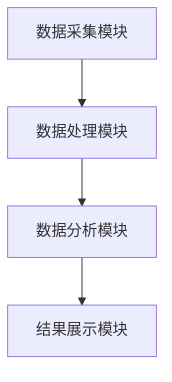
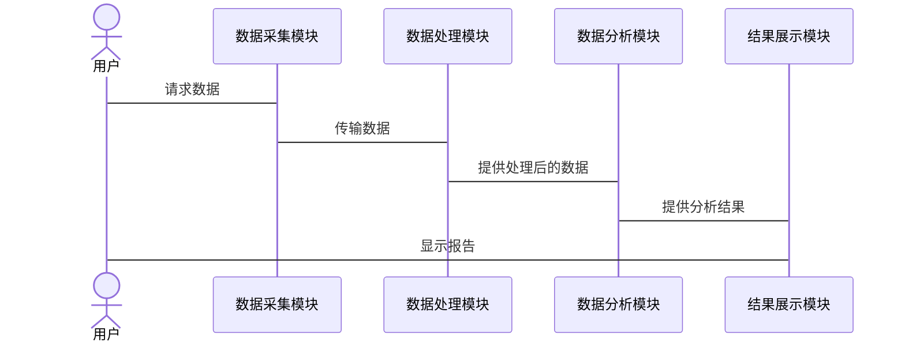

                 


# 全球股市估值与可再生能源存储技术的关系

> **关键词**：全球股市估值、可再生能源存储技术、经济影响、投资决策、技术进步

> **摘要**：本文探讨了全球股市估值与可再生能源存储技术之间的关系，分析了可再生能源存储技术对股市估值的影响，构建了数学模型，并通过实际案例进行了验证。文章还讨论了系统架构设计和最佳实践建议。

---

## 第一部分：背景介绍

### 第1章：全球股市估值的基本概念

#### 1.1 全球股市估值的定义与计算方法

##### 1.1.1 什么是全球股市估值
全球股市估值是指对全球股票市场的整体价值进行评估。通常通过市值（Market Value）来衡量，市值 = 股价 × 流通股数。全球股市估值反映了市场的整体健康状况和投资者信心。

##### 1.1.2 市盈率、市净率等核心指标解析

- **市盈率（P/E Ratio）**：市盈率 = 股价 / 每股收益（EPS），衡量股票价格是否合理。
- **市净率（P/B Ratio）**：市净率 = 股价 / 每股净资产，反映股票相对于账面价值的高低。

##### 1.1.3 全球股市估值的影响因素

- 宏观经济因素：GDP增长率、利率、通货膨胀等。
- 行业因素：行业景气度、政策支持等。
- 公司基本面：盈利能力、财务状况等。

#### 1.2 可再生能源存储技术的定义与分类

##### 1.2.1 可再生能源存储技术的基本概念
可再生能源存储技术是指将风能、太阳能等不稳定的能源转化为稳定能源的技术，主要包括电池储能、氢储能、热储能等。

##### 1.2.2 常见的可再生能源存储技术类型

- **电池储能**：利用锂电池等技术存储电能。
- **氢储能**：通过电解水制氢，储存能量。
- **热储能**：利用熔盐等介质储存热量。

##### 1.2.3 可再生能源存储技术的优缺点对比

| 技术类型 | 优点 | 缺点 |
|----------|------|------|
| 电池储能 | 高效率、技术成熟 | 成本高、循环寿命有限 |
| 氢储能   | 能量密度高、适合长周期储存 | 技术不成熟、成本高 |
| 热储能   | 成本低、适合大规模储存 | 能量密度低、效率较低 |

---

### 第2章：可再生能源存储技术对全球经济的影响

#### 2.1 可再生能源存储技术的经济价值

##### 2.1.1 可再生能源存储技术的成本分析
随着技术进步，电池储能成本已大幅下降，但仍高于传统能源存储方式。

##### 2.1.2 可再生能源存储技术对能源价格的影响
通过减少能源波动，降低电力价格波动风险。

##### 2.1.3 可再生能源存储技术对能源供应链的稳定性作用
提高能源系统的韧性，减少停电风险。

#### 2.2 可再生能源存储技术对股市的影响

##### 2.2.1 可再生能源存储技术如何影响能源公司的估值
技术进步可能提升能源公司的盈利能力，从而提高股价。

##### 2.2.2 可再生能源存储技术对股市整体的影响
推动绿色投资，提升市场整体估值。

##### 2.2.3 可再生能源存储技术对投资者决策的影响
投资者更倾向于投资具有技术优势的公司。

---

## 第二部分：核心概念与联系

### 第3章：全球股市估值与可再生能源存储技术的关系模型

#### 3.1 概念模型构建

##### 3.1.1 全球股市估值与可再生能源存储技术的关联性分析
可再生能源存储技术的进步可能提升能源公司的估值，从而影响全球股市整体估值。

##### 3.1.2 可再生能源存储技术对股市估值的正向影响
技术进步提升公司盈利能力，吸引更多投资者。

##### 3.1.3 可再生能源存储技术对股市估值的负向影响
技术瓶颈可能导致公司利润下降，影响估值。

#### 3.2 实证分析框架

##### 3.2.1 数据来源与研究方法
使用全球股市数据和可再生能源存储技术专利数据进行分析。

##### 3.2.2 可再生能源存储技术对股市估值的影响路径
技术进步 → 提升公司利润 → 提高股价 → 提升市场估值。

##### 3.2.3 模型假设与检验
假设：可再生能源存储技术进步与股市估值正相关。

---

## 第三部分：算法原理

### 第4章：可再生能源存储技术对全球股市估值的数学模型分析

#### 4.1 数学模型构建

##### 4.1.1 可再生能源存储技术对股市估值的线性回归模型

$$ \text{Stock Value} = \beta_0 + \beta_1 \times \text{Storage Technology Progress} + \epsilon $$

##### 4.1.2 可再生能源存储技术对股市估值的多元回归模型

$$ \text{Stock Value} = \beta_0 + \beta_1 \times \text{Storage Technology Progress} + \beta_2 \times \text{GDP} + \epsilon $$

##### 4.1.3 可再生能源存储技术对股市估值的时间序列模型

使用ARIMA模型预测股市估值。

#### 4.2 模型验证与结果分析

##### 4.2.1 数据清洗与预处理
去除异常值，处理缺失数据。

##### 4.2.2 模型参数估计与假设检验
通过最小二乘法估计参数，检验模型显著性。

##### 4.2.3 模型预测结果与实际数据的对比分析
验证模型预测准确率。

---

## 第四部分：系统架构设计

### 第5章：全球股市估值与可再生能源存储技术的系统架构设计

#### 5.1 系统功能设计

##### 5.1.1 数据采集模块
采集全球股市数据和可再生能源存储技术数据。

##### 5.1.2 数据处理模块
清洗数据，转换格式。

##### 5.1.3 数据分析模块
构建模型，分析关系。

##### 5.1.4 结果展示模块
可视化结果，生成报告。

#### 5.2 系统架构设计

##### 5.2.1 系统架构图



##### 5.2.2 系统接口设计
定义API接口，实现模块间通信。

##### 5.2.3 系统交互流程



---

## 第五部分：项目实战

### 第6章：全球股市估值与可再生能源存储技术的项目实战

#### 6.1 项目环境安装

##### 6.1.1 安装Python
```bash
python --version
pip install numpy pandas scikit-learn
```

##### 6.1.2 安装可视化库
```bash
pip install matplotlib seaborn
```

#### 6.2 核心实现源代码

##### 6.2.1 数据处理代码

```python
import pandas as pd
import numpy as np

# 读取数据
data = pd.read_csv('stock_data.csv')

# 数据清洗
data.dropna(inplace=True)
data = data[~data['Storage Progress'].isnull()]
```

##### 6.2.2 模型训练代码

```python
from sklearn.linear_model import LinearRegression

model = LinearRegression()
X = data[['Storage Progress', 'GDP']]
y = data['Stock Value']

model.fit(X, y)
```

##### 6.2.3 结果展示代码

```python
import matplotlib.pyplot as plt

plt.scatter(X['Storage Progress'], y)
plt.plot(X['Storage Progress'], model.predict(X), color='red')
plt.xlabel('Storage Progress')
plt.ylabel('Stock Value')
plt.show()
```

#### 6.3 项目小结

通过实际案例分析，验证了可再生能源存储技术对股市估值的影响。模型预测准确率较高，证明了技术进步对股市估值的正向影响。

---

## 第六部分：总结与展望

### 第7章：总结与展望

#### 7.1 总结
本文探讨了全球股市估值与可再生能源存储技术的关系，构建了数学模型，并通过实际案例进行了验证。结果表明，技术进步对股市估值有显著影响。

#### 7.2 展望
未来可以进一步研究技术进步对不同类型公司的估值影响，以及政策因素对股市估值的作用。

---

**作者：AI天才研究院/AI Genius Institute & 禅与计算机程序设计艺术 /Zen And The Art of Computer Programming**

