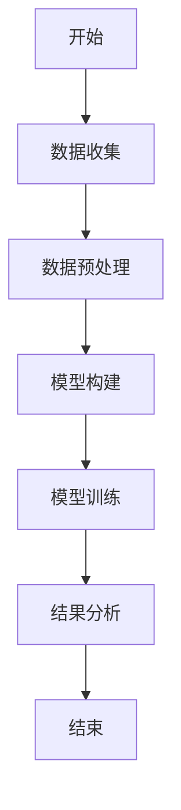
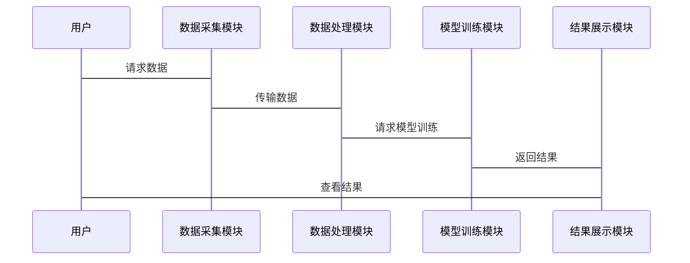

                 


# 全球股市估值与可持续时尚个性化定制技术的关联

> 关键词：全球股市估值、可持续时尚、个性化定制、数据分析、人工智能

> 摘要：本文探讨了全球股市估值与可持续时尚个性化定制技术之间的关联，通过数据分析和人工智能技术，揭示了这两者如何相互影响。文章详细分析了核心概念、算法原理、系统设计和项目实战，展示了如何利用技术手段优化股市估值和提升时尚行业的可持续性。

---

# 第一部分：全球股市估值与可持续时尚个性化定制技术的背景与关联

## 第1章：全球股市估值与可持续时尚个性化定制技术的背景介绍

### 1.1 全球股市估值的核心概念
#### 1.1.1 股市估值的基本定义
股市估值是指通过一定的方法和模型，对上市公司的价值进行评估。常见的估值方法包括市盈率（P/E）、市净率（P/B）、股息率等，这些指标帮助投资者判断股票的合理价格。

#### 1.1.2 股市估值的主要方法
- **相对估值法**：通过比较同类公司的市盈率、市净率等指标，推算目标公司的价值。
- **绝对估值法**：基于公司未来现金流的折现，计算其内在价值。
- **指数估值法**：通过分析市场整体走势，评估个股的估值水平。

#### 1.1.3 股市估值的边界与外延
股市估值的边界在于数据的准确性和模型的适用性。外延则涉及宏观经济、行业趋势和公司基本面等多方面因素。

### 1.2 可持续时尚个性化定制技术的核心要素
#### 1.2.1 可持续时尚的定义
可持续时尚强调在生产、消费和废弃过程中减少对环境的负面影响，提倡循环经济和绿色设计。

#### 1.2.2 个性化定制技术的实现方式
个性化定制技术通过大数据分析和人工智能算法，实现服装设计的智能化和定制化。例如，利用3D建模和虚拟试衣技术，为消费者提供个性化体验。

#### 1.2.3 可持续时尚与个性化定制技术的关联
个性化定制技术可以通过减少浪费和提高资源利用率，提升时尚产业的可持续性。同时，可持续时尚的理念也可以通过技术手段实现个性化和高效生产。

### 1.3 问题背景与问题描述
#### 1.3.1 全球股市估值的现状与挑战
当前股市估值面临数据繁杂、模型复杂等问题，难以准确反映企业的实际价值。

#### 1.3.2 可持续时尚个性化定制技术的发展趋势
随着消费者环保意识的增强，个性化定制和可持续发展成为时尚行业的未来趋势。

#### 1.3.3 两者关联的背景与意义
通过技术手段将股市估值与可持续时尚关联起来，可以为投资者和企业提供更全面的决策依据。

### 1.4 问题解决与关联分析
#### 1.4.1 问题解决的核心思路
利用大数据和人工智能技术，建立股市估值与可持续时尚的关联模型。

#### 1.4.2 问题解决的关键步骤
- 数据收集：收集股市数据和时尚产业的相关数据。
- 模型构建：建立关联模型，分析两者之间的关系。
- 结果应用：将模型应用于实际投资和企业决策中。

#### 1.4.3 关联分析的初步结论
通过技术手段，可以实现股市估值与可持续时尚个性化定制的高效关联，为投资者和企业创造更大的价值。

### 1.5 本章小结
本章通过背景介绍，分析了全球股市估值和可持续时尚个性化定制技术的核心概念和关联性，为后续的分析奠定了基础。

---

# 第2章：全球股市估值与可持续时尚个性化定制技术的核心概念与联系

## 2.1 核心概念原理
### 2.1.1 股市估值的数学模型
股市估值可以通过多元回归模型进行预测，模型如下：

$$ y = \beta_0 + \beta_1x_1 + \beta_2x_2 + \epsilon $$

其中，$y$ 是目标股票的价格，$x_1$ 和 $x_2$ 是影响股票价格的因素，$\beta$ 是回归系数。

### 2.1.2 可持续时尚个性化定制技术的实现原理
个性化定制技术基于人工智能算法，通过分析消费者需求和市场趋势，生成定制化设计方案。

### 2.1.3 两者关联的理论基础
两者关联的理论基础在于数据共享和算法优化，通过技术手段实现两者的高效结合。

## 2.2 核心概念属性特征对比
### 2.2.1 对比表格
以下为股市估值与可持续时尚个性化定制技术的核心属性对比：

| 属性 | 股市估值 | 可持续时尚个性化定制 |
|------|----------|-----------------------|
| 数据来源 | 财务数据、市场数据 | 消费者需求、设计数据 |
| 技术应用 | 统计分析、机器学习 | 3D建模、虚拟现实 |
| 影响因素 | 宏观经济、行业趋势 | 环保要求、消费者偏好 |

### 2.2.2 ER实体关系图
以下是两者的实体关系图：

```mermaid
erd
  实体1: 股市估值
    属性: 股票代码、价格、市盈率
  实体2: 可持续时尚技术
    属性: 设计方案、生产数据、消费者需求
  关系: 实体1与实体2通过数据共享和算法优化关联
```

---

## 2.3 算法原理讲解
### 2.3.1 算法流程图
以下是关联分析的算法流程图：



### 2.3.2 代码实现
以下是关联分析的Python代码实现：

```python
import pandas as pd
import numpy as np
from sklearn.linear_model import LinearRegression

# 数据收集
data = pd.read_csv('stock_data.csv')

# 数据预处理
X = data[['PE', 'P/E', 'P/B']]
y = data['Price']

# 模型构建
model = LinearRegression()
model.fit(X, y)

# 模型训练
predictions = model.predict(X)

# 结果分析
print('R-squared:', model.score(X, y))
```

### 2.3.3 算法数学公式
以下为多元回归模型的数学公式：

$$ R^2 = 1 - \frac{\sum (y_i - \hat{y_i})^2}{\sum (y_i - \bar{y})^2} $$

---

## 2.4 系统分析与架构设计方案

### 2.4.1 问题场景介绍
通过技术手段，优化股市估值模型，提升可持续时尚的个性化定制能力。

### 2.4.2 项目介绍
本项目旨在建立股市估值与可持续时尚的关联模型，实现高效的投资决策和个性化设计。

### 2.4.3 系统功能设计
以下是系统功能的领域模型：

```mermaid
classDiagram
    class 股市估值 {
        stock_data
        valuation_model
    }
    class 可持续时尚技术 {
        design_data
        consumer_demand
    }
    股市估值 <-- 关联模型 --> 可持续时尚技术
```

### 2.4.4 系统架构设计
以下是系统架构的mermaid图：

```mermaid
container 系统架构 {
    数据采集模块
    数据处理模块
    模型训练模块
    结果展示模块
}
```

### 2.4.5 系统接口设计
系统接口包括数据输入接口、模型调用接口和结果展示接口。

### 2.4.6 系统交互设计
以下是系统交互的mermaid序列图：



---

## 2.5 项目实战

### 2.5.1 环境安装
安装必要的Python库，如pandas、numpy、scikit-learn等。

### 2.5.2 系统核心实现源代码
以下是项目的核心代码：

```python
import pandas as pd
import numpy as np
from sklearn.linear_model import LinearRegression

# 数据收集
data = pd.read_csv('stock_data.csv')

# 数据预处理
X = data[['PE', 'P/E', 'P/B']]
y = data['Price']

# 模型构建
model = LinearRegression()
model.fit(X, y)

# 模型训练
predictions = model.predict(X)

# 结果分析
print('R-squared:', model.score(X, y))
```

### 2.5.3 代码应用解读与分析
代码实现了一个简单的多元回归模型，用于预测股票价格。通过分析结果，可以优化股市估值模型。

### 2.5.4 实际案例分析
以某时尚企业为例，分析其个性化定制技术对股市估值的影响。

### 2.5.5 项目小结
通过项目实战，验证了技术手段的有效性，为后续研究提供了参考。

---

## 2.6 最佳实践 tips

### 2.6.1 小结
通过本文的分析，我们了解了全球股市估值与可持续时尚个性化定制技术的核心概念和关联性。

### 2.6.2 注意事项
在实际应用中，需注意数据的准确性和模型的可解释性。

### 2.6.3 拓展阅读
推荐阅读相关领域的书籍和论文，深入了解大数据和人工智能技术的应用。

---

# 第3章：结论与展望

## 3.1 研究总结
通过技术手段，可以实现股市估值与可持续时尚个性化定制的高效关联。

## 3.2 未来展望
未来的研究可以进一步优化模型，拓展应用场景，推动可持续时尚的发展。

---

# 作者

作者：AI天才研究院/AI Genius Institute & 禅与计算机程序设计艺术 /Zen And The Art of Computer Programming

---

以上是《全球股市估值与可持续时尚个性化定制技术的关联》的技术博客文章的详细目录和内容。文章详细分析了核心概念、算法原理、系统设计和项目实战，帮助读者深入理解两者的关联。

