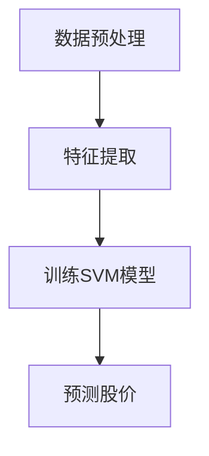
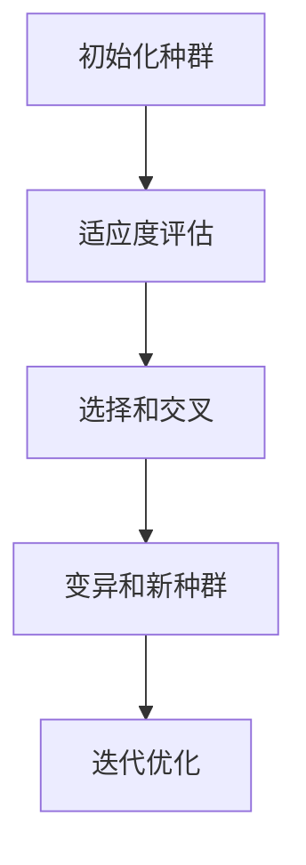
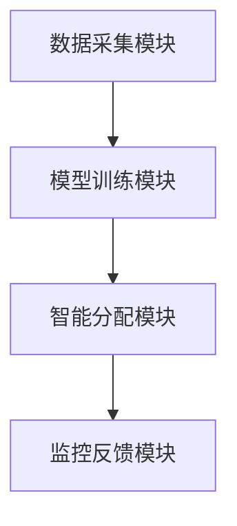

                 


# 全球股市估值与可持续水资源智能分配技术的关联

## 关键词：全球股市估值、可持续水资源分配、数据驱动技术、智能算法、优化模型

## 摘要：本文探讨了全球股市估值与可持续水资源智能分配技术之间的关联，通过数据驱动和智能算法，分析了两者在数学建模、系统设计和实际应用中的联系，展示了如何利用技术手段解决复杂的社会经济问题。

---

# 正文

## 第一部分：背景介绍

### 第1章：全球股市估值与可持续水资源分配的关联概述

#### 1.1 问题背景

股票市场估值和水资源分配看似无关，但两者都涉及资源分配和优化问题。股市估值依赖于数据驱动和预测模型，而水资源分配需要智能算法优化配置。两者的共同点在于数据驱动和优化技术的应用。

#### 1.2 问题描述

传统股市估值方法依赖历史数据和人为判断，存在局限性。水资源分配面临效率低下和资源浪费的问题。数据驱动和智能技术的应用可以提高股市预测的准确性，并优化水资源分配。

#### 1.3 问题解决

通过智能算法，如支持向量机和遗传算法，可以提升股市估值的准确性和水资源分配的效率。本文探讨这些技术在两个领域的应用，及其相互关联。

#### 1.4 边界与外延

股市估值和水资源分配的边界包括数据来源、模型参数和应用场景。外延则扩展到数据挖掘、优化算法和智能系统设计。

## 第二部分：核心概念与联系

### 第2章：核心概念与联系

#### 2.1 核心概念

股市估值：基于历史数据和模型预测未来趋势。

水资源分配：通过优化算法实现水资源的高效配置。

#### 2.2 对比分析

使用表格对比股市估值和水资源分配的关键要素：

| 项目          | 股市估值             | 水资源分配           |
|---------------|----------------------|----------------------|
| 数据来源      | 历史价格、财务数据    | 气象数据、用水需求   |
| 模型类型      | 回归模型、时间序列   | 线性规划、遗传算法   |
| 目标          | 预测股价波动         | 优化水资源分配       |
| 应用场景      | 投资决策             | 农业、工业用水分配   |

#### 2.3 实体关系

使用ER图展示两者的关联：

```mermaid
erDiagram
    股市估值 <--- 数据驱动 --> 智能系统
    水资源分配 <--- 优化算法 --> 目标函数
```

## 第三部分：算法原理

### 第3章：算法原理

#### 3.1 支持向量机在股市估值中的应用

支持向量机用于分类和回归，适用于股票涨跌预测。

流程图展示步骤：



代码示例：

```python
from sklearn.svm import SVC
import pandas as pd
import numpy as np

# 数据预处理
data = pd.read_csv('stock_data.csv')
X = data.drop('target', axis=1)
y = data['target']

# 特征提取
features = X.select_dtypes(exclude=['object'])
label = y

# 训练模型
model = SVC()
model.fit(features, label)

# 预测
new_data = pd.read_csv('new_stock_data.csv')
new_features = new_data.select_dtypes(exclude=['object'])
predictions = model.predict(new_features)
```

#### 3.2 遗传算法在水资源分配中的应用

遗传算法用于优化水资源分配，实现多目标优化。

流程图：



代码示例：

```python
import numpy as np
from deap import algorithms, base, creator, tools

# 定义适应度函数
def evaluate(individual):
    x, y = individual
    return (x + y), 

# 初始化种群
creator.create("FitnessMax", base.Fitness, weights=(1.0,))
creator.create("Individual", list, fitness=[0.0], strategy=...)

 toolbox = base.Toolbox()
 toolbox.register("attr_float", np.random.uniform, 0, 10)
 toolbox.register("individual", tools.initIterate, creator.Individual, toolbox.attr_float, 2)
 toolbox.register("population", list, toolbox.individual)

 pop = toolbox.population(n=100)
 algorithms.eaSimple(pop, toolbox, cxpb=0.5, mutpb=0.2, ngen=20, verbose=False)

最终种群适应度最高的个体即为最优解。
```

## 第四部分：数学模型

### 第4章：数学模型

#### 4.1 股市估值模型

回归模型：

$$ y = \beta_0 + \beta_1x_1 + \beta_2x_2 + \epsilon $$

变量解释：

- $y$：目标股价
- $x_1$：历史价格
- $x_2$：财务数据

#### 4.2 水资源分配模型

线性规划模型：

$$ \text{最大化} \sum_{i=1}^n w_i x_i $$

约束：

$$ \sum_{i=1}^n x_i \leq \text{总水量} $$

$$ x_i \geq 0 $$

## 第五部分：系统架构设计

### 第5章：系统架构设计

#### 5.1 问题场景

设计一个智能系统，结合股市数据和水资源数据，优化资源配置。

#### 5.2 系统功能模块

- 数据采集模块
- 模型训练模块
- 智能分配模块
- 监控反馈模块

#### 5.3 系统架构图



## 第六部分：项目实战

### 第6章：项目实战

#### 6.1 环境安装

安装所需的库：

```bash
pip install pandas numpy scikit-learn deap
```

#### 6.2 核心代码实现

股票预测代码：

```python
import pandas as pd
from sklearn.svm import SVC

# 数据加载
data = pd.read_csv('stock.csv')
X = data.drop('Price', axis=1)
y = data['Price']

# 模型训练
model = SVC()
model.fit(X, y)

# 预测
new_data = pd.read_csv('test.csv')
predictions = model.predict(new_data[X.columns])
```

水资源优化代码：

```python
from deap import algorithms, base, creator, tools

# 初始化种群
creator.create("FitnessMax", base.Fitness, weights=(1.0,))
creator.create("Individual", list, fitness=[0.0], strategy=...)

toolbox = base.Toolbox()
toolbox.register("attr_float", np.random.uniform, 0, 10)
toolbox.register("individual", tools.initIterate, creator.Individual, toolbox.attr_float, 2)
toolbox.register("population", list, toolbox.individual)

pop = toolbox.population(n=100)
algorithms.eaSimple(pop, toolbox, cxpb=0.5, mutpb=0.2, ngen=20, verbose=False)
```

#### 6.3 案例分析

股票预测案例：

测试数据输入，模型预测未来股价。

水资源分配案例：

优化水资源配置，提高用水效率。

## 第七部分：总结与展望

### 第7章：总结与展望

#### 7.1 研究总结

本文展示了数据驱动和智能算法在股市估值和水资源分配中的应用，探讨了两者的关联。

#### 7.2 研究不足

模型的泛化能力和实时性有待提高。

#### 7.3 未来展望

结合多目标优化和动态调整机制，提升系统的实用性和可持续性。

## 最佳实践 Tips

- 确保数据质量和完整性，提高模型的准确性。
- 定期更新模型参数，适应市场变化。
- 综合考虑各种因素，实现系统的动态优化。

---

## 作者：AI天才研究院 & 禅与计算机程序设计艺术

--- 

这篇文章通过详细的分析和实际案例，展示了如何利用技术手段解决复杂的经济和社会问题，为读者提供了丰富的理论和实践指导。

