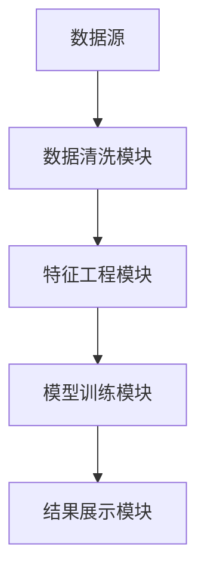
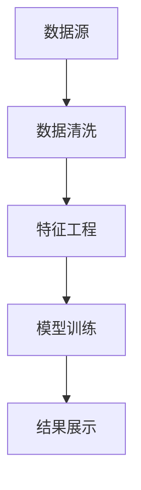

                 


# 全球股市估值与可持续水资源管理的关联

> 关键词：全球股市估值，可持续水资源管理，气候变化，投资决策，风险管理，ESG因素

> 摘要：本文探讨了全球股市估值与可持续水资源管理之间的关联，分析了气候变化对水资源的影响，以及水资源风险如何影响股市估值。通过介绍核心概念、算法原理和系统架构，结合实际案例，本文为投资者和企业提供了风险管理策略和政策建议。

---

## 第1章：全球股市估值的现状与挑战

### 1.1 全球股市估值的基本概念

股市估值是评估企业价值的重要工具，主要通过市盈率（P/E）、市净率（P/B）和现金流折现模型（DCF）等指标衡量。股市估值不仅反映企业的财务状况，还受宏观经济、行业趋势和政策环境的影响。

#### 1.1.1 股市估值的定义与意义
股市估值通过分析企业的盈利能力、成长性和资产质量，帮助投资者做出投资决策。股市估值的意义在于揭示企业的内在价值，指导投资策略。

#### 1.1.2 全球股市估值的主要指标
- **市盈率（P/E）**：股价与每股收益的比率，反映市场对公司的估值。
- **市净率（P/B）**：股价与每股净资产的比率，适用于评估资产密集型企业。
- **现金流折现模型（DCF）**：通过未来现金流的现值评估企业价值。

#### 1.1.3 股市估值的驱动因素
- 宏观经济环境：GDP增长、利率水平和通货膨胀。
- 行业趋势：技术创新、政策变化和市场需求。
- 企业基本面：盈利能力、成长性和财务状况。

### 1.2 可持续水资源管理的重要性

可持续水资源管理是确保水资源的合理利用和保护，防止枯竭和污染，促进生态平衡。

#### 1.2.1 水资源管理的基本概念
水资源管理涉及水的收集、分配、使用和保护，确保满足人类、农业和工业的需求。

#### 1.2.2 可持续水资源管理的核心原则
- 保护水资源：防止污染和过度开发。
- 高效利用：通过技术改进减少浪费。
- 公平分配：确保所有人都能获得基本用水。

#### 1.2.3 水资源管理的全球挑战
- 水资源短缺：干旱地区水资源不足。
- 水资源污染：工业排放和农业化肥导致水质下降。
- 气候变化：影响降水模式和水资源分布。

---

## 第2章：全球股市与水资源管理的关联性

### 2.1 气候变化对水资源的影响

气候变化导致极端天气事件增多，影响水资源的分布和可用性。

#### 2.1.1 气候变化对水资源分布的影响
气候变化改变了降水模式，导致某些地区干旱，而其他地区洪水频发。

#### 2.1.2 气候变化对农业和工业用水的影响
农业和工业用水需求增加，加剧水资源短缺，影响生产效率。

#### 2.1.3 气候变化对能源行业的影响
水资源短缺影响水电站和火电厂的运营，导致能源成本上升。

### 2.2 水资源风险对股市估值的影响

水资源风险影响企业的运营成本和市场声誉，进而影响股市估值。

#### 2.2.1 水资源短缺对企业的直接影响
- 生产成本上升：水资源短缺导致企业用水成本增加。
- 供应链中断：水资源不足影响原材料供应。
- 法律风险：违反水资源管理法规可能导致罚款和诉讼。

#### 2.2.2 水资源风险对投资者决策的影响
- 投资者越来越关注企业的水资源管理表现，ESG评分高的企业在股市中表现更好。
- 水资源风险可能引发投资组合的波动，投资者需评估企业的水资源风险敞口。

#### 2.2.3 可持续水资源管理在企业可持续发展中的作用
- 提高企业声誉：良好的水资源管理提升品牌形象。
- 降低运营风险：通过优化用水减少环境影响。
- 符合政策要求：满足政府的可持续发展目标。

### 2.3 全球水资源管理与股市估值的互动关系

水资源管理与股市估值存在复杂的互动关系，相互影响。

#### 2.3.1 水资源管理对股市估值的正向影响
- 提升企业形象：良好的水资源管理提升投资者信心。
- 降低风险：有效管理水资源减少企业面临的法律和环境风险。

#### 2.3.2 水资源管理对股市估值的负向影响
- 管理成本增加：投入更多资源进行水资源保护和优化可能影响短期利润。
- 供应链风险：水资源短缺可能导致供应链中断，影响企业生产。

#### 2.3.3 水资源管理对股市估值的长期影响
- 长期收益：可持续水资源管理提升企业的长期竞争力。
- 投资者偏好：随着ESG投资的兴起，水资源管理良好的企业吸引更多投资者。

---

## 第3章：全球股市估值的核心概念与模型

### 3.1 股市估值的主要模型

股市估值模型帮助企业评估企业的内在价值，指导投资决策。

#### 3.1.1 市盈率模型
市盈率（P/E）= 股价 / 每股收益（EPS）

#### 3.1.2 市净率模型
市净率（P/B）= 股价 / 每股净资产（BPS）

#### 3.1.3 现金流折现模型
DCF模型通过预测未来现金流的现值评估企业价值。

### 3.2 可持续发展在股市估值中的应用

可持续发展理念的兴起使ESG因素成为影响股市估值的重要因素。

#### 3.2.1 环境、社会和治理（ESG）因素
- 环境因素：企业的碳排放和水资源管理。
- 社会因素：劳工权益和社区关系。
- 治理因素：公司治理结构和透明度。

#### 3.2.2 可持续发展报告与股市估值
企业发布可持续发展报告，披露环境和社会表现，影响投资者决策。

#### 3.2.3 可持续发展评级与股市表现
第三方机构对企业进行ESG评级，评级高的企业在股市中表现优于评级低的企业。

---

## 第4章：可持续水资源管理的核心要素与挑战

### 4.1 可持续水资源管理的核心要素

可持续水资源管理涉及多个方面，确保水资源的合理利用。

#### 4.1.1 水资源的保护与修复
- 防治污染：减少工业排放和农业化肥使用。
- 水源保护：保护河流、湖泊和地下水。

#### 4.1.2 水资源的高效利用
- 技术创新：推广节水技术和设备。
- 循环利用：废水处理和再利用。

#### 4.1.3 水资源的公平分配
- 公平分配：确保所有人都能获得基本用水。
- 政策支持：政府制定政策保障水资源公平分配。

### 4.2 可持续水资源管理的主要挑战

实现可持续水资源管理面临诸多挑战。

#### 4.2.1 水资源污染问题
- 工业污染：化工企业排放废水导致水质下降。
- 农业污染：化肥和农药使用导致水体富营养化。

#### 4.2.2 水资源短缺问题
- 自然资源限制：某些地区水资源天然不足。
- 人口增长：人口增加导致用水需求上升。

#### 4.2.3 气候变化的影响
- 降水模式变化：影响水资源分布。
- 极端天气事件：洪水和干旱加剧水资源管理难度。

---

## 第5章：全球股市估值与可持续水资源管理的算法原理

### 5.1 数据收集与预处理

收集影响水资源的环境数据和企业的ESG评分，清洗数据。

#### 5.1.1 数据来源
- 气候数据：收集降水、温度和蒸发量等数据。
- 企业数据：获取企业的用水量、排放数据和ESG评分。

#### 5.1.2 数据清洗
- 处理缺失值：使用均值或中位数填充。
- 异常值处理：识别并处理异常值。

### 5.2 模型构建与训练

使用多元回归模型或机器学习模型，分析水资源因素对股市估值的影响。

#### 5.2.1 多元回归模型
建立回归模型，将水资源因素作为自变量，股市估值作为因变量。

#### 5.2.2 机器学习模型
使用随机森林或XGBoost模型，捕捉非线性关系和复杂特征。

### 5.3 模型验证与优化

通过交叉验证优化模型参数，确保模型的准确性和鲁棒性。

#### 5.3.1 交叉验证
使用k折交叉验证评估模型性能，防止过拟合。

#### 5.3.2 参数优化
调整模型参数，如学习率、树深度和正则化参数，优化模型表现。

### 5.4 结果分析与可视化

展示模型预测结果，分析水资源风险对股市的具体影响。

#### 5.4.1 模型解释
解释模型中各变量的系数或重要性，识别关键影响因素。

#### 5.4.2 结果可视化
使用图表展示模型预测结果，帮助理解水资源因素对股市估值的影响。

---

## 第6章：系统架构与设计

### 6.1 问题场景介绍

系统目标是将水资源因素纳入股市估值模型，帮助投资者做出更 informed 的决策。

### 6.2 系统功能设计

设计数据收集、模型构建和结果展示模块。

#### 6.2.1 数据收集模块
- 从公开数据源获取气候数据和企业ESG评分。
- 数据清洗和预处理。

#### 6.2.2 模型构建模块
- 使用机器学习模型分析水资源因素对股市估值的影响。
- 模型训练和优化。

#### 6.2.3 结果展示模块
- 可视化模型预测结果，提供交互式界面。

### 6.3 系统架构设计

使用Mermaid图展示系统的整体架构和数据流。

#### 6.3.1 系统架构图


#### 6.3.2 数据流图


---

## 第7章：项目实战

### 7.1 环境安装

安装必要的Python库，如pandas、scikit-learn和xgboost。

#### 7.1.1 安装Python库
```bash
pip install pandas scikit-learn xgboost
```

### 7.2 核心代码实现

实现数据处理、模型训练和预测的Python代码。

#### 7.2.1 数据处理代码
```python
import pandas as pd

# 读取数据
data = pd.read_csv('water_risk.csv')

# 数据清洗
data.dropna(inplace=True)
```

#### 7.2.2 模型训练代码
```python
from sklearn.ensemble import RandomForestRegressor
from sklearn.model_selection import train_test_split
from sklearn.metrics import mean_squared_error

# 划分训练集和测试集
X = data.drop('stock_price', axis=1)
y = data['stock_price']

X_train, X_test, y_train, y_test = train_test_split(X, y, test_size=0.2, random_state=42)

# 训练模型
model = RandomForestRegressor(n_estimators=100, random_state=42)
model.fit(X_train, y_train)

# 预测和评估
y_pred = model.predict(X_test)
print(mean_squared_error(y_test, y_pred))
```

### 7.3 案例分析

分析某个地区的水资源状况对当地股市的影响，展示模型的应用。

#### 7.3.1 数据来源
使用具体区域的气候数据和企业的ESG评分，分析水资源风险对当地股市的影响。

#### 7.3.2 模型应用
将模型应用于具体案例，展示如何利用模型预测水资源风险对股市估值的影响。

---

## 第8章：最佳实践与小结

### 8.1 风险管理策略

投资者应将水资源风险纳入投资决策，选择水资源管理良好的企业。

### 8.2 政策建议

政府应制定政策支持企业优化水资源管理，鼓励企业采用可持续的水资源管理实践。

### 8.3 未来研究方向

未来研究可以探索更复杂的模型，如深度学习，以更好地捕捉水资源因素对股市估值的影响。

---

## 第9章：注意事项与拓展阅读

- **注意事项**：在实际应用中，模型的表现可能受数据质量和特征选择的影响，需谨慎解读结果。
- **拓展阅读**：推荐阅读相关文献，深入理解气候变化对水资源的影响及股市估值的相关研究。

---

## 第10章：作者介绍

作者：AI天才研究院/AI Genius Institute & 禅与计算机程序设计艺术/Zen And The Art of Computer Programming

---

# 结语

全球股市估值与可持续水资源管理的关联是一个复杂的系统问题，需要跨学科的综合分析。通过本文的探讨，读者可以更好地理解如何将水资源因素纳入投资决策，降低风险，实现可持续发展。

--- 

如果需要进一步探讨或获取更多详细信息，请随时联系。

