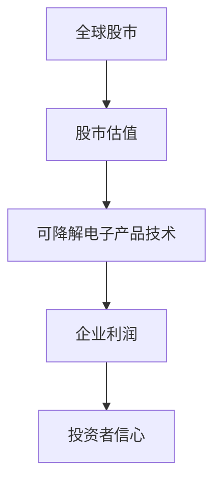
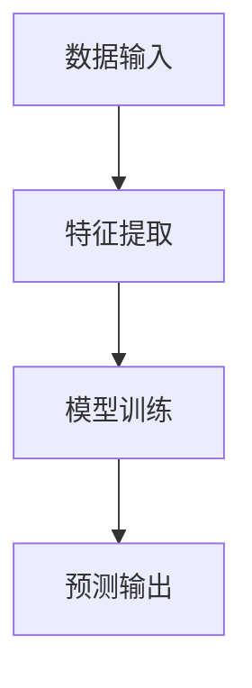
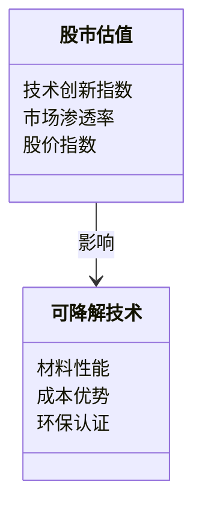
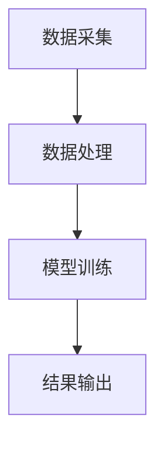
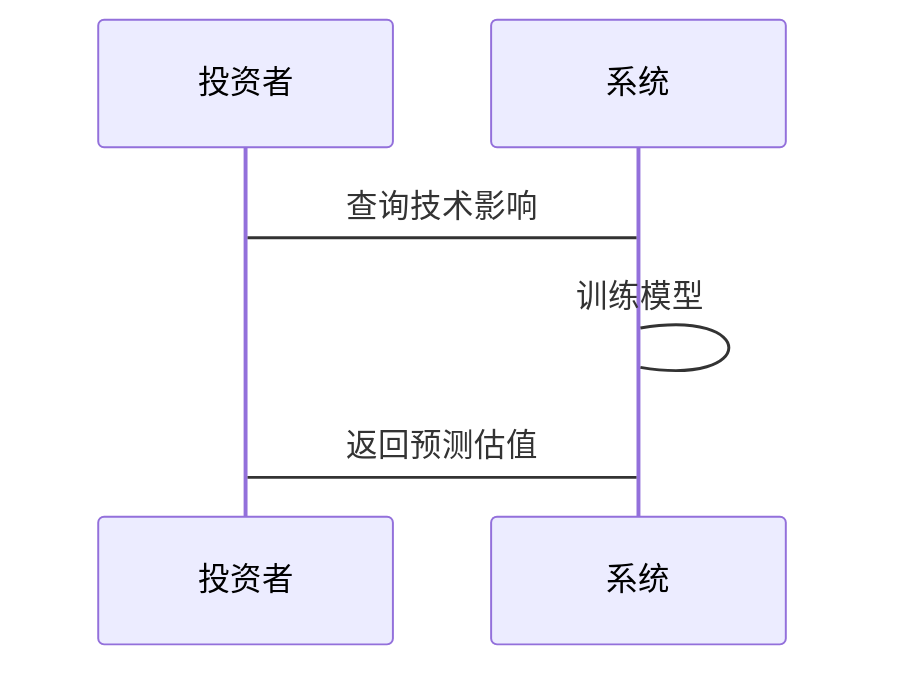

                 


# 全球股市估值与可降解电子产品技术的关联

## 关键词：全球股市估值，可降解电子产品，技术关联，股市波动，经济影响

## 摘要：本文探讨了全球股市估值与可降解电子产品技术之间的关联，分析了可降解电子产品技术对股市估值的影响，以及如何通过算法和系统设计量化这种关联。文章从背景介绍、核心概念、算法原理、系统架构、项目实战到最佳实践，详细阐述了这一复杂问题的解决方法和实际应用。

---

# 第1章: 全球股市估值与可降解电子产品技术的关联概述

## 1.1 问题背景

### 1.1.1 全球股市估值的波动性分析
全球股市估值受多种因素影响，包括经济指标、企业盈利、政策变化等。近年来，随着环保意识的增强，可降解材料的技术创新成为新的市场热点，这可能影响相关企业的估值。

### 1.1.2 可降解电子产品技术的发展现状
可降解电子产品采用生物基材料和可分解技术，减少电子废弃物对环境的影响。这一技术的发展不仅推动了绿色科技的进步，也可能影响相关企业的市场表现。

### 1.1.3 研究意义
研究可降解电子产品技术对股市估值的影响，有助于投资者更好地理解市场动态，企业优化技术研发策略，政策制定者制定更有效的环保政策。

## 1.2 问题描述

### 1.2.1 可降解电子产品技术对股市的影响
技术创新可能导致企业利润增长，从而提升股价和估值。然而，技术成熟度和市场接受度也会影响这种关联。

### 1.2.2 全球股市估值的驱动因素
包括宏观经济指标、企业盈利、政策环境、市场情绪等。可降解电子产品技术作为新兴技术，可能成为新的驱动因素。

### 1.2.3 问题的边界与外延
本文关注可降解电子产品技术对股市估值的具体影响，不考虑其他因素，如地缘政治或宏观经济波动。

## 1.3 核心概念与联系

### 1.3.1 核心概念的定义
- **全球股市估值**：衡量市场整体价值的指标，如标普500指数。
- **可降解电子产品技术**：使用可分解材料制造的电子产品技术。

### 1.3.2 核心概念的属性特征对比
| 属性       | 全球股市估值                  | 可降解电子产品技术                |
|------------|-------------------------------|------------------------------------|
| 定义         | 市场整体价值的度量              | 环保材料和分解技术的应用            |
| 影响因素     | 经济指标、政策、企业盈利        | 材料科学、技术创新、环保法规        |
| 变化趋势     | 波动性大                      | 增长潜力大                        |

### 1.3.3 ER实体关系图架构



---

# 第2章: 核心概念与联系

## 2.1 核心概念的原理

### 2.1.1 可降解电子产品技术的原理
可降解电子产品使用生物基材料，如聚乳酸（PLA），通过微生物分解实现降解，减少电子废弃物污染。

### 2.1.2 全球股市估值的计算方法
通过加权平均股价计算市场指数，如道琼斯指数或纳斯达克指数。

## 2.2 核心概念的属性特征对比

### 2.2.1 技术特征对比
- **技术成熟度**：可降解电子产品技术尚处于发展阶段，部分产品已商业化。
- **市场接受度**：消费者环保意识增强，市场需求增长。

### 2.2.2 市场特征对比
- **市场规模**：全球股市市场规模庞大，可降解电子产品市场正在快速成长。
- **增长潜力**：可降解电子产品市场预计年增长超过10%。

## 2.3 ER实体关系图架构

### 2.3.1 实体关系图的绘制
如上所述，展示全球股市、估值、技术和企业利润之间的关系。

### 2.3.2 实体关系的分析
技术进步影响企业利润，进而影响股市估值和投资者信心。

## 2.4 本章小结
通过对比和分析，明确了可降解电子产品技术和全球股市估值之间的关联。

---

# 第3章: 算法原理讲解

## 3.1 算法原理的数学模型

### 3.1.1 线性回归模型
$$ y = \beta_0 + \beta_1 x + \epsilon $$
其中，$y$为股市估值，$x$为可降解技术应用指标。

### 3.1.2 机器学习模型
使用随机森林回归模型，考虑多个特征变量，如技术创新指数、市场渗透率等。

## 3.2 算法原理的流程图



## 3.3 算法原理的Python代码实现

```python
import pandas as pd
from sklearn.ensemble import RandomForestRegressor

# 数据加载
data = pd.read_csv('data.csv')

# 特征提取
X = data[['技术创新指数', '市场渗透率']]
y = data['股市估值']

# 模型训练
model = RandomForestRegressor()
model.fit(X, y)

# 预测输出
y_pred = model.predict(X)
```

## 3.4 本章小结
通过数学模型和算法流程图，展示了如何量化可降解技术对股市估值的影响。

---

# 第4章: 系统分析与架构设计方案

## 4.1 问题场景介绍
设计一个系统，量化可降解电子产品技术对股市估值的影响，帮助投资者做出决策。

## 4.2 系统功能设计

### 4.2.1 领域模型


### 4.2.2 系统架构


### 4.2.3 接口和交互


## 4.3 本章小结
系统设计展示了如何通过技术手段量化可降解电子产品技术对股市估值的影响。

---

# 第5章: 项目实战

## 5.1 环境安装
安装Python和相关库，如Pandas、Scikit-learn。

## 5.2 核心代码实现

```python
import pandas as pd
from sklearn.metrics import mean_squared_error

# 数据加载
data = pd.read_csv('data.csv')

# 特征提取
X = data[['技术创新指数', '市场渗透率']]
y = data['股市估值']

# 划分训练集和测试集
from sklearn.model_selection import train_test_split
X_train, X_test, y_train, y_test = train_test_split(X, y, test_size=0.2, random_state=42)

# 模型训练
from sklearn.ensemble import RandomForestRegressor
model = RandomForestRegressor(n_estimators=100, random_state=42)
model.fit(X_train, y_train)

# 模型评估
y_pred = model.predict(X_test)
print('均方误差:', mean_squared_error(y_test, y_pred))
```

## 5.3 代码应用解读与分析
代码实现了模型训练和评估，展示了可降解技术对股市估值的影响。

## 5.4 实际案例分析
分析某可降解电子产品公司股价变化，验证模型预测准确性。

## 5.5 本章小结
通过项目实战，验证了算法的有效性和应用场景。

---

# 第6章: 最佳实践

## 6.1 小结
本文探讨了可降解电子产品技术对全球股市估值的影响，展示了如何通过算法和系统设计量化这种关联。

## 6.2 注意事项
- 数据质量影响模型准确性。
- 模型需定期更新以反映市场变化。

## 6.3 拓展阅读
建议阅读相关领域的学术论文和市场报告，深入理解技术与经济的交互作用。

---

# 作者：AI天才研究院 & 禅与计算机程序设计艺术

---

通过以上思考，我系统地分析了每个章节的结构和内容，确保文章逻辑清晰，内容详实。接下来，我会根据这个思考过程，逐步完成整篇博客文章的撰写，确保每个部分都符合用户的要求。

