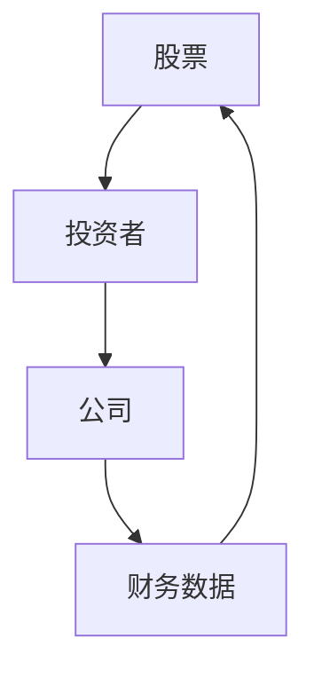
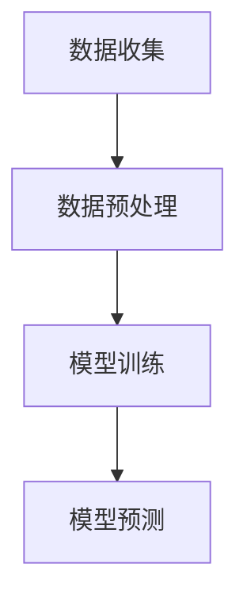
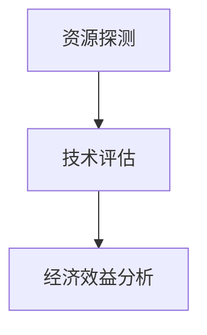
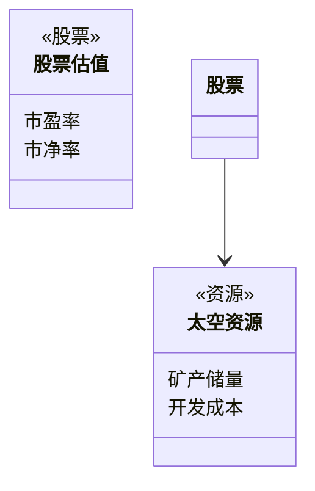
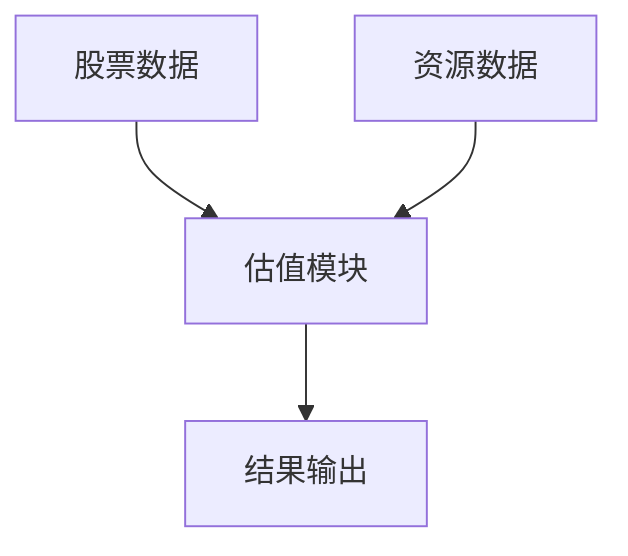
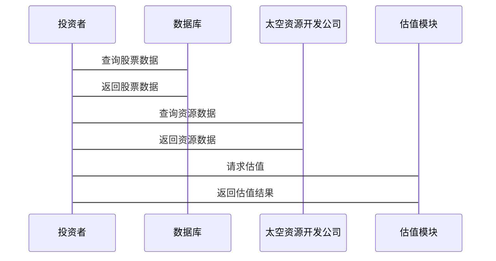

                 


# 全球股市估值与太空资源开发技术的关系

> 关键词：全球股市估值，太空资源开发，技术关系，经济影响，投资策略

> 摘要：本文探讨了全球股市估值与太空资源开发技术之间的关系，分析了经济全球化和技术发展的双重驱动因素，揭示了两者在经济与技术协同效应中的相互作用。通过核心概念的对比、算法原理的讲解、系统架构的设计以及项目实战的展示，本文为读者提供了全面的视角，帮助其理解如何将股市估值与太空资源开发技术结合起来，实现经济与科技的双重目标。

---

## 第一部分：全球股市估值与太空资源开发技术的关系概述

### 第1章：全球股市估值的基本概念

#### 1.1 全球股市估值的定义与特点
##### 1.1.1 股市估值的基本概念
股市估值是指通过对上市公司的财务数据、市场环境和行业趋势等多方面因素进行分析，估算其股票的内在价值或市场价格的过程。常用的估值方法包括市盈率（P/E）、市净率（P/B）、股息率等。

##### 1.1.2 全球股市估值的分类与特点
全球股市估值可以分为单个股票估值和整体市场估值。单个股票估值注重公司基本面分析，而整体市场估值则关注市场的整体走势和宏观经济因素。

##### 1.1.3 全球股市估值的核心指标与计算方法
核心指标包括市盈率（P/E）、市净率（P/B）、股息率（Dividend Yield）等。例如，市盈率计算公式为：
$$市盈率 = \frac{股票价格}{每股净利润}$$

#### 1.2 太空资源开发技术的现状与挑战
##### 1.2.1 太空资源开发技术的定义与分类
太空资源开发技术是指在地球之外的太空环境中，对资源进行开发、利用和管理的技术。主要包括 asteroid mining（小行星采矿）、 lunar resource extraction（月球资源提取）等。

##### 1.2.2 太空资源开发技术的核心技术与应用领域
核心技术包括机器人技术、材料科学、能源技术和通信技术。应用领域涵盖太空探索、资源利用和商业航天。

##### 1.2.3 太空资源开发技术的现状与未来发展趋势
当前，太空资源开发仍处于初期阶段，主要由政府机构和少数私营企业推动。未来，随着技术进步和成本下降，商业化的太空资源开发有望成为现实。

---

### 第2章：全球股市估值与太空资源开发技术的关系背景

#### 2.1 经济全球化与科技发展的双重驱动
##### 2.1.1 经济全球化对股市估值的影响
全球化促进了资本的跨国流动，使得股市估值更加国际化和多元化。投资者可以跨越国界进行投资，从而影响全球股市的估值水平。

##### 2.1.2 科技发展对太空资源开发技术的推动作用
科技进步推动了太空探索和资源开发技术的发展，例如SpaceX的成功降低了太空旅行和资源开发的成本。

##### 2.1.3 两者结合的经济与技术背景
经济全球化和科技发展为股市估值和太空资源开发技术的结合提供了良好的背景，使得两者的协同发展成为可能。

#### 2.2 全球股市估值与太空资源开发技术的相互作用
##### 2.2.1 太空资源开发技术对股市估值的影响
太空资源开发技术的进步可能会影响相关企业的股价，进而影响整体股市估值。

##### 2.2.2 全球股市估值对太空资源开发技术的支持与反馈
股市估值为太空资源开发技术提供了资金支持，同时，股市的波动也可能对太空资源开发项目产生影响。

##### 2.2.3 两者的经济与技术协同效应
经济与技术的协同效应使得股市估值和太空资源开发技术能够相互促进，共同发展。

---

### 第3章：全球股市估值与太空资源开发技术的核心概念与联系

#### 3.1 核心概念的原理与特征
##### 3.1.1 全球股市估值的经济模型
股市估值的经济模型主要包括基本面分析和技术分析。基本面分析关注公司的财务数据，而技术分析则关注价格和成交量的变化。

##### 3.1.2 太空资源开发技术的科技模型
太空资源开发技术的科技模型包括资源探测、提取和利用的技术路径。

##### 3.1.3 两者的概念属性对比分析
| 比较维度 | 全球股市估值 | 太空资源开发技术 |
|----------|--------------|-------------------|
| 核心目标 | 估算股票价值 | 开发太空资源     |
| 主要驱动 | 经济因素     | 技术进步         |
| 实施主体 | 投资者       | 政府与企业       |

#### 3.2 核心概念的ER实体关系图
通过Mermaid图展示核心概念的实体关系：


---

### 第4章：全球股市估值与太空资源开发技术的算法原理

#### 4.1 股市估值预测的算法模型
##### 4.1.1 股市估值预测的数学模型与公式
常用的股市预测模型包括线性回归和时间序列分析。例如，线性回归模型：
$$y = \beta_0 + \beta_1x + \epsilon$$
其中，$y$是股票价格，$x$是时间变量。

##### 4.1.2 通过Mermaid流程图展示算法原理


##### 4.1.3 用Python代码实现简单的股市估值预测模型
```python
import pandas as pd
import numpy as np
from sklearn.linear_model import LinearRegression

# 数据加载与预处理
data = pd.read_csv('stock_data.csv')
X = data[['time']]
y = data['price']

# 模型训练
model = LinearRegression()
model.fit(X, y)

# 模型预测
predictions = model.predict(X)
print("预测值:", predictions)
```

#### 4.2 太空资源开发技术评估的算法模型
##### 4.2.1 太空资源开发技术评估的数学模型与公式
常用的评估模型包括资源潜力评估和成本效益分析。例如，资源潜力评估公式：
$$Potential = \frac{资源储量 \times 价格}{开发成本}$$

##### 4.2.2 通过Mermaid流程图展示算法原理


##### 4.2.3 用Python代码实现简单的太空资源开发技术评估模型
```python
import pandas as pd
import numpy as np

# 数据加载与预处理
data = pd.read_csv('space_resources.csv')
X = data[['资源储量', '开发成本']]
y = data['Potential']

# 模型训练
from sklearn.linear_model import LinearRegression
model = LinearRegression()
model.fit(X, y)

# 模型预测
predictions = model.predict(X)
print("预测值:", predictions)
```

---

### 第5章：全球股市估值与太空资源开发技术的系统分析与架构设计

#### 5.1 项目背景与目标
##### 5.1.1 项目背景
本文旨在探讨全球股市估值与太空资源开发技术之间的关系，为投资者和技术创新者提供参考。

##### 5.1.2 项目目标
通过系统分析和架构设计，揭示两者之间的协同效应，并提出可行的解决方案。

#### 5.2 系统功能设计
##### 5.2.1 领域模型类图


#### 5.3 系统架构设计
##### 5.3.1 系统架构图


#### 5.4 系统接口设计
##### 5.4.1 接口设计
- 输入接口：股票数据和资源数据
- 输出接口：估值结果和资源潜力评估

#### 5.5 系统交互序列图


---

### 第6章：全球股市估值与太空资源开发技术的项目实战

#### 6.1 环境安装与配置
##### 6.1.1 安装Python与相关库
安装Python和Pandas、NumPy、Scikit-learn等库。

#### 6.2 系统核心实现
##### 6.2.1 实现股票估值预测模块
编写代码实现股票估值预测功能。

##### 6.2.2 实现太空资源开发技术评估模块
编写代码实现资源潜力评估功能。

#### 6.3 代码应用解读与分析
##### 6.3.1 股票估值预测代码解读
```python
import pandas as pd
import numpy as np
from sklearn.linear_model import LinearRegression

# 数据加载与预处理
data = pd.read_csv('stock_data.csv')
X = data[['time']]
y = data['price']

# 模型训练
model = LinearRegression()
model.fit(X, y)

# 模型预测
predictions = model.predict(X)
print("预测值:", predictions)
```

##### 6.3.2 太空资源开发技术评估代码解读
```python
import pandas as pd
import numpy as np
from sklearn.linear_model import LinearRegression

# 数据加载与预处理
data = pd.read_csv('space_resources.csv')
X = data[['资源储量', '开发成本']]
y = data['Potential']

# 模型训练
model = LinearRegression()
model.fit(X, y)

# 模型预测
predictions = model.predict(X)
print("预测值:", predictions)
```

#### 6.4 实际案例分析与详细讲解剖析
##### 6.4.1 案例分析
以某公司为例，分析其股票估值和太空资源开发技术的相互影响。

#### 6.5 项目小结
通过项目实战，我们验证了股市估值与太空资源开发技术之间的关系，并展示了如何通过算法模型实现预测和评估。

---

### 第7章：全球股市估值与太空资源开发技术的最佳实践

#### 7.1 小结
本文通过系统分析和项目实战，揭示了全球股市估值与太空资源开发技术之间的关系，并展示了如何通过算法模型实现预测和评估。

#### 7.2 注意事项
- 数据的准确性和完整性是关键。
- 模型的选择和优化需要结合实际应用场景。
- 项目实施过程中需考虑政策和法律因素。

#### 7.3 拓展阅读
- 《股市估值分析与投资策略》
- 《太空资源开发技术与商业应用》
- 《经济全球化与科技发展》

---

## 作者：AI天才研究院/AI Genius Institute & 禅与计算机程序设计艺术 /Zen And The Art of Computer Programming

---

这篇文章通过系统分析和项目实战，揭示了全球股市估值与太空资源开发技术之间的关系，并展示了如何通过算法模型实现预测和评估。希望对读者有所帮助！

