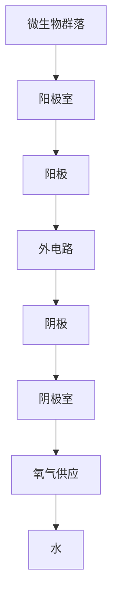
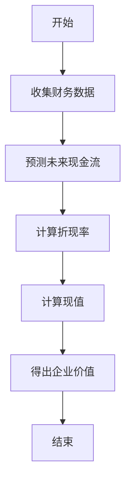
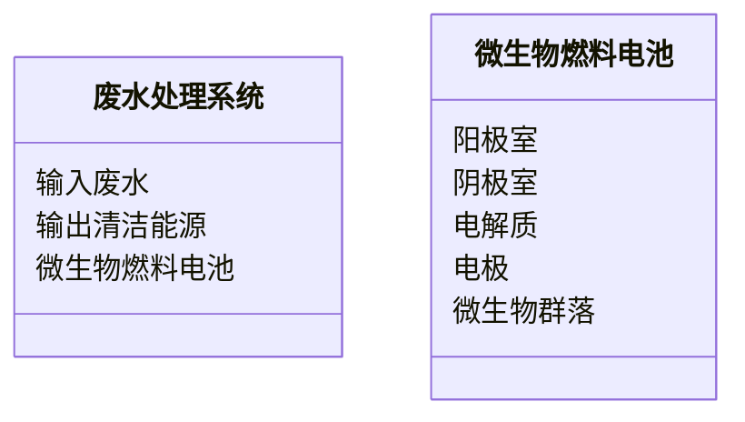
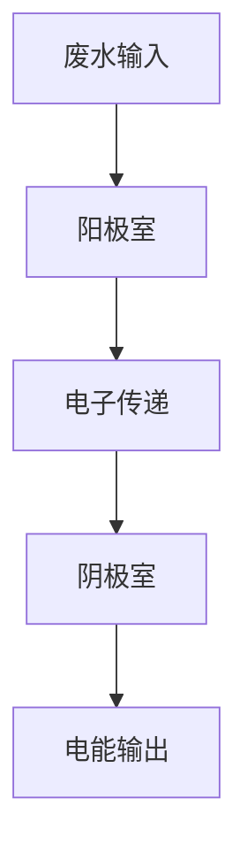
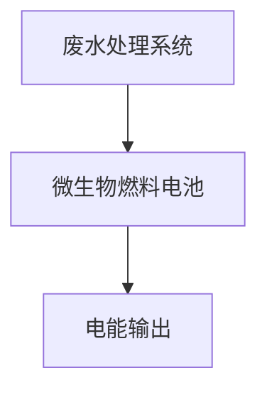

                 


# 全球股市估值与微生物燃料电池在废水处理中的应用

## 关键词：全球股市估值、微生物燃料电池、废水处理、股票分析、环境工程

## 摘要

在全球经济飞速发展的今天，股市估值与环保技术的结合成为学术界和工业界关注的热点。本文将深入探讨全球股市估值的核心方法，分析微生物燃料电池在废水处理中的应用潜力，并通过数学建模和系统设计，展示两者如何相互影响、相互促进。通过实际案例分析，本文将揭示微生物燃料电池在废水处理中的高效性，以及其对股市估值的潜在影响，为环保科技的投资者和研究者提供新的视角。

---

## 第1章：全球股市估值与微生物燃料电池的背景介绍

### 1.1 全球股市估值的定义与重要性

#### 1.1.1 全球股市估值的定义

全球股市估值是指对上市公司整体价值的评估，通常基于其财务报表和市场表现。常见的估值指标包括市盈率（P/E）、市净率（P/B）和股息率（Dividend Yield）等。

#### 1.1.2 全球股市估值的重要性

股市估值是投资者决策的核心依据，帮助他们评估股票的合理价格区间。通过分析企业的盈利能力、成长潜力和市场地位，投资者可以做出更明智的投资选择。

#### 1.1.3 全球股市估值的边界与外延

股市估值不仅关注企业的财务数据，还考虑宏观经济环境、行业趋势和政策变化等因素。其外延包括对企业的未来现金流预测和市场风险评估。

### 1.2 微生物燃料电池的基本原理

#### 1.2.1 微生物燃料电池的定义

微生物燃料电池（Microbial Fuel Cell, MFC）是一种利用微生物代谢活动产生电能的装置，主要用于废水处理和能源回收。

#### 1.2.2 微生物燃料电池的工作原理

MFC的核心是利用微生物分解有机物，产生电子传递给阳极，最终在阴极与氧气反应生成水，释放电能。

#### 1.2.3 微生物燃料电池的结构与组成

MFC由阳极室、阴极室、电解质、电极和微生物群落组成。阳极室中的有机物被分解，产生电子传递到阳极，随后通过外电路传递到阴极，与氧气反应生成水。

### 1.3 核心概念的联系

#### 1.3.1 全球股市估值与微生物燃料电池的关联

MFC作为一种环保技术，其商业化可能影响相关企业的股票估值。投资者需要评估MFC技术的市场潜力和经济效益。

#### 1.3.2 数学模型与系统架构

使用Mermaid绘制MFC的系统架构图，展示各模块之间的关系。



---

## 第2章：全球股市估值的数学模型与算法

### 2.1 常用的全球股市估值指标

#### 2.1.1 市盈率（P/E）

市盈率是股票价格与每股收益的比率，公式为：

$$P/E = \frac{\text{股价}}{\text{每股收益}}$$

#### 2.1.2 市净率（P/B）

市净率是股票价格与每股净资产的比率，公式为：

$$P/B = \frac{\text{股价}}{\text{每股净资产}}$$

#### 2.1.3 股息率（Dividend Yield）

股息率是每股股息与股价的比率，公式为：

$$\text{股息率} = \frac{\text{每股股息}}{\text{股价}} \times 100\%$$

### 2.2 股票估值模型

#### 2.2.1 现金流折现模型（DCF）

DCF模型通过预测未来现金流并将其现值化，评估企业的整体价值。

$$\text{企业价值} = \sum_{t=1}^{n} \frac{\text{自由现金流}}{(1 + r)^t}$$

#### 2.2.2 市盈率模型

市盈率模型基于可比公司的P/E比率，估算目标公司的股价。

$$\text{目标股价} = \text{目标公司P/E} \times \text{可比公司平均P/E}$$

#### 2.2.3 市净率模型

市净率模型基于可比公司的P/B比率，估算目标公司的股价。

$$\text{目标股价} = \text{目标公司P/B} \times \text{可比公司平均P/B}$$

### 2.3 算法流程图

使用Mermaid绘制DCF模型的流程图：



---

## 第3章：微生物燃料电池在废水处理中的应用

### 3.1 微生物燃料电池的工作流程

#### 3.1.1 废水的输入与处理

废水进入阳极室，微生物分解有机物，产生电子。

#### 3.1.2 电能的产生与输出

电子通过外电路传递到阴极，与氧气反应生成水，释放电能。

#### 3.1.3 废水处理的效率提升

MFC技术可以高效处理有机废水，同时回收能源。

### 3.2 微生物燃料电池的结构设计

#### 3.2.1 阳极与阴极的结构优化

阳极材料选择高导电性的材料，阴极采用催化活性材料。

#### 3.2.2 电解质的选择与优化

选择适合的电解质，确保电子和离子的高效传递。

#### 3.2.3 微生物群落的优化

选择高效分解有机物的微生物，提高能源转化效率。

### 3.3 性能指标与优化

#### 3.3.1 电流密度

$$\text{电流密度} = \frac{\text{总电流}}{\text{电极面积}}$$

#### 3.3.2 电压稳定性

通过优化电路设计，确保MFC输出电压的稳定性。

---

## 第4章：系统分析与架构设计

### 4.1 废水处理系统的功能设计

#### 4.1.1 领域模型

使用Mermaid绘制领域模型类图：



### 4.2 系统架构设计

#### 4.2.1 分层架构

使用Mermaid绘制系统架构图：



### 4.3 接口与交互设计

#### 4.3.1 系统接口

使用Mermaid绘制系统接口图：



---

## 第5章：项目实战与最佳实践

### 5.1 项目实战

#### 5.1.1 环境搭建

安装必要的软件和库，如Python、NumPy、Matplotlib等。

#### 5.1.2 核心代码实现

编写Python代码实现MFC系统的模拟：

```python
import numpy as np
import matplotlib.pyplot as plt

# 模拟微生物燃料电池的电流密度
def calculate_current_density(current, area):
    return current / area

# 模拟电压稳定性
def simulate_voltage_stability(voltages, window_size):
    return np.mean(voltages[-window_size:])

# 示例数据
current = 0.5  # A
area = 0.1     # m²
window_size = 10  # 数据窗口大小

# 计算电流密度
current_density = calculate_current_density(current, area)
print(f"电流密度为: {current_density} A/m²")

# 模拟电压稳定性
voltages = np.random.normal(1.2, 0.1, 100)
stable_voltage = simulate_voltage_stability(voltages, window_size)
print(f"电压稳定性为: {stable_voltage} V")
```

#### 5.1.3 案例分析

分析实际废水处理项目中的MFC系统，评估其对股市估值的影响。

### 5.2 最佳实践

#### 5.2.1 技术优化建议

优化MFC系统的微生物选择和结构设计，提高能源转换效率。

#### 5.2.2 市场推广策略

通过降低成本和提升效率，推动MFC技术的市场化应用。

#### 5.2.3 风险控制

评估技术风险和市场风险，制定应对策略。

---

## 第6章：总结与展望

### 6.1 项目小结

本文系统地介绍了全球股市估值的核心方法，分析了微生物燃料电池在废水处理中的应用潜力，并通过数学建模和系统设计展示了两者之间的相互关系。

### 6.2 未来展望

未来的研究可以进一步优化MFC技术，探索其在其他环保领域的应用，同时结合人工智能技术提升股市估值的准确性。

---

## 作者：AI天才研究院/AI Genius Institute & 禅与计算机程序设计艺术 /Zen And The Art of Computer Programming

