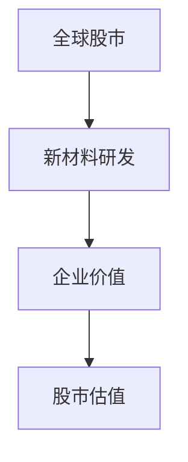
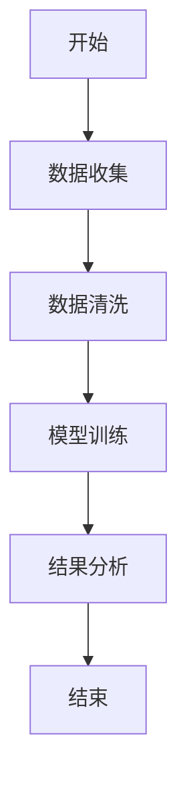
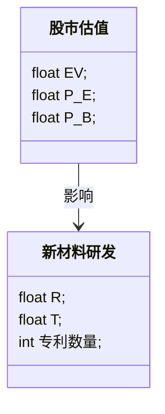
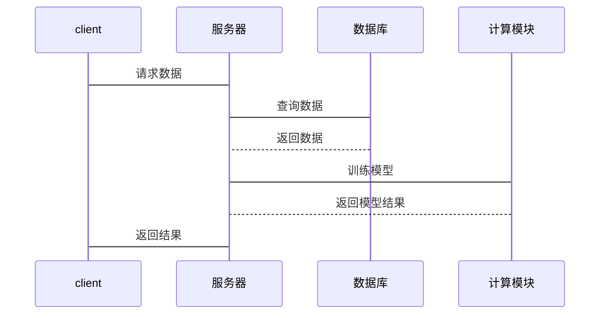

                 


# 全球股市估值与新材料研发的关系

## 关键词：全球股市估值, 新材料研发, 股市波动, 技术创新, 企业价值

## 摘要：  
本文探讨全球股市估值与新材料研发之间的关系，分析新材料研发对企业价值的影响，以及这些变化如何反映在全球股市估值中。通过构建理论模型和实证分析，本文揭示了新材料研发如何通过技术创新、成本降低和市场竞争力的提升，进而影响企业价值和股市估值的变化。文章还结合具体案例，展示了如何通过数据分析和算法模型量化这种关系，并提出了相应的投资策略和风险管理建议。

---

# 第一部分: 全球股市估值与新材料研发的背景与核心概念

## 第1章: 全球股市估值与新材料研发的背景介绍

### 1.1 问题背景
#### 1.1.1 全球股市估值的基本概念
- 股市估值的定义与计算方法  
- 影响股市估值的主要因素：宏观经济指标、企业盈利、市场情绪等  
- 新材料行业在股市中的地位与作用  

#### 1.1.2 新材料研发的重要性
- 新材料的定义与分类  
- 新材料研发对企业竞争力和经济增长的推动作用  
- 新材料行业的市场前景与投资价值  

#### 1.1.3 问题解决的必要性
- 新材料研发对企业价值的影响未被充分量化  
- 股市估值与新材料研发之间的动态关系需要深入研究  
- 通过量化分析，为投资者和企业提供科学决策依据  

### 1.2 问题描述
#### 1.2.1 全球股市估值的波动性
- 股市估值的周期性波动特点  
- 影响股市估值的短期与长期因素  

#### 1.2.2 新材料研发的周期性
- 新材料研发的周期特点  
- 研发成功对企业价值的提升作用  

#### 1.2.3 两者之间的潜在联系
- 新材料研发如何通过技术创新影响企业盈利和估值  
- 股市如何反映新材料研发的进展和成果  

### 1.3 问题解决
#### 1.3.1 理论框架的构建
- 建立股市估值与新材料研发之间的关系模型  
- 确定关键变量和因果关系  

#### 1.3.2 数据分析方法的选择
- 时间序列分析与回归分析的适用性  
- 数据来源与处理方法  

#### 1.3.3 实证研究的设计
- 研究目标与假设  
- 数据采集与处理流程  

### 1.4 边界与外延
#### 1.4.1 研究的边界条件
- 限定研究范围：仅考虑新材料行业对股市估值的影响  
- 忽略其他行业对股市的干扰  

#### 1.4.2 研究的外延范围
- 可扩展性：其他行业与股市估值的关系  
- 新材料研发的全球性与区域性差异  

#### 1.4.3 可能的限制因素
- 数据的可得性与质量  
- 模型的假设与简化  

### 1.5 概念结构与核心要素
#### 1.5.1 核心概念的组成
- 核心概念：股市估值、新材料研发、企业价值  
- 边缘概念：市场情绪、宏观经济指标  

#### 1.5.2 各要素之间的关系
- 新材料研发通过技术创新提升企业价值  
- 企业价值的提升反映在股市估值的上涨中  

#### 1.5.3 框架的逻辑性
- 从技术创新到企业价值的提升  
- 从企业价值到股市估值的变化  

### 1.6 本章小结
- 本章介绍了全球股市估值与新材料研发的背景，明确了问题的必要性与解决方向，为后续分析奠定了基础。

---

## 第2章: 核心概念与联系

### 2.1 核心概念的原理
#### 2.1.1 全球股市估值的计算方法
- 市盈率（P/E）：股价与每股收益的比率  
- 市净率（P/B）：股价与每股净资产的比率  
- 企业价值（EV）：企业整体价值的衡量指标  

#### 2.1.2 新材料研发的评价体系
- 技术创新指标：专利数量、研发投入占比  
- 经济效益指标：研发投入回收周期、投资回报率  

#### 2.1.3 两者之间的相互作用
- 新材料研发如何推动企业价值增长  
- 企业价值增长如何反映在股市估值中  

### 2.2 概念属性特征对比表
| 概念       | 定义                         | 影响因素                     | 计算方法       |
|------------|------------------------------|-------------------------------|----------------|
| 股市估值   | 反映企业市场价值的指标       | 企业盈利、市场情绪、宏观经济 | 市盈率、市净率 |
| 新材料研发 | 通过技术创新提升企业竞争力   | 技术难度、研发投入、政策支持 | 专利数量、研发投入占比 |

### 2.3 ER实体关系图架构


### 2.4 本章小结
- 本章详细分析了全球股市估值与新材料研发的核心概念，通过对比和图表展示了两者之间的关系，为后续分析提供了理论基础。

---

## 第3章: 算法原理讲解

### 3.1 算法原理的数学模型
#### 3.1.1 模型的建立
- 新材料研发对企业价值的影响模型  
$$ EV = \alpha \cdot R + \beta \cdot T $$
其中，$EV$ 表示企业价值，$R$ 表示新材料研发投入，$T$ 表示时间因素，$\alpha$ 和 $\beta$ 为系数。

#### 3.1.2 公式的推导
- 基于回归分析的模型构建  
- 确定变量之间的关系与权重  

### 3.2 算法流程的 Mermaid 流程图


### 3.3 算法实现的 Python 源代码
```python
import pandas as pd
import numpy as np
from sklearn.linear_model import LinearRegression

# 数据加载与预处理
data = pd.read_csv('新材料研发与股市估值.csv')
X = data[['R', 'T']]
y = data['EV']

# 模型训练
model = LinearRegression()
model.fit(X, y)

# 模型结果
coefficients = model.coef_
print(f"回归系数：{coefficients}")
```

### 3.4 本章小结
- 本章通过数学模型和算法流程，详细阐述了如何量化新材料研发对股市估值的影响，为后续实证分析提供了方法论支持。

---

## 第4章: 系统分析与架构设计方案

### 4.1 系统分析
#### 4.1.1 问题场景介绍
- 数据收集与处理的挑战  
- 模型构建与验证的复杂性  

#### 4.1.2 项目介绍
- 项目目标：构建全球股市估值与新材料研发的关系模型  
- 数据来源：公开市场数据、企业研发投入数据  

### 4.2 系统功能设计
#### 4.2.1 领域模型（Mermaid 类图）


#### 4.2.2 系统架构设计（Mermaid 架构图）
```mermaid
client --> 服务器 : 请求数据
服务器 --> 数据库 : 查询数据
服务器 --> 计算模块 : 计算模型
计算模块 --> 服务器 : 返回结果
服务器 --> 客户端 : 返回结果
```

#### 4.2.3 系统接口设计
- 数据接口：数据采集与存储接口  
- 模型接口：回归分析与预测接口  

#### 4.2.4 系统交互（Mermaid 序列图）


### 4.3 本章小结
- 本章通过系统分析与架构设计，展示了如何构建一个完整的分析系统来研究全球股市估值与新材料研发的关系。

---

## 第5章: 项目实战

### 5.1 环境安装
#### 5.1.1 环境要求
- Python 3.8 或以上版本  
- 数据分析库：pandas、numpy、scikit-learn  

#### 5.1.2 安装依赖
```bash
pip install pandas numpy scikit-learn
```

### 5.2 系统核心实现
#### 5.2.1 数据加载与预处理
```python
import pandas as pd
data = pd.read_csv('新材料研发与股市估值.csv')
data.head()
```

#### 5.2.2 模型训练与验证
```python
from sklearn.linear_model import LinearRegression
model = LinearRegression()
model.fit(X_train, y_train)
score = model.score(X_test, y_test)
print(f"模型得分：{score}")
```

#### 5.2.3 结果分析
```python
import matplotlib.pyplot as plt
plt.scatter(X_test, y_test, color='blue')
plt.scatter(X_test, model.predict(X_test), color='red')
plt.xlabel('研发投入')
plt.ylabel('企业价值')
plt.show()
```

### 5.3 案例分析
#### 5.3.1 案例背景
- 某新材料企业的研发投入与股市估值的变化  

#### 5.3.2 数据分析
```python
# 数据分析代码
import pandas as pd
data = pd.read_csv('案例数据.csv')
print(data.describe())
```

#### 5.3.3 结果解读
- 新材料研发投入对股市估值的显著影响  
- 模型预测的准确性与稳定性  

### 5.4 项目总结
- 项目实现的关键点  
- 可能的优化方向  

---

## 第6章: 最佳实践、小结、注意事项与拓展阅读

### 6.1 最佳实践 tips
- 数据质量的重要性：确保数据的准确性和完整性  
- 模型选择的合理性：根据实际情况选择合适的算法  
- 结果验证的必要性：通过交叉验证提高模型的可靠性  

### 6.2 小结
- 本文系统探讨了全球股市估值与新材料研发的关系，构建了理论模型并进行了实证分析，展示了如何通过数据分析量化这种关系。  

### 6.3 注意事项
- 数据的局限性：样本选择与数据偏差  
- 模型的局限性：假设的简化与实际的差异  

### 6.4 拓展阅读
- 更多关于股市估值的书籍：《投资学基础》  
- 更多关于新材料研发的技术文献：《新材料科学与技术》  

---

# 作者：AI天才研究院/AI Genius Institute & 禅与计算机程序设计艺术 /Zen And The Art of Computer Programming

---

本文通过系统的理论分析、算法实现和实证研究，揭示了全球股市估值与新材料研发之间的复杂关系，为投资者和研究人员提供了科学的分析工具和决策依据。

