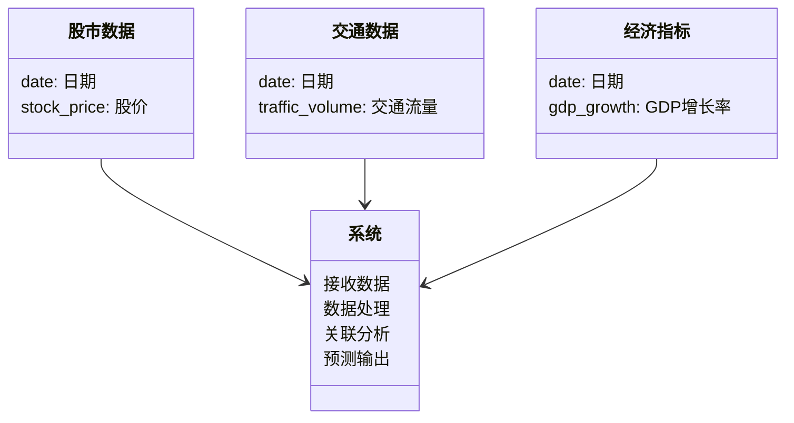
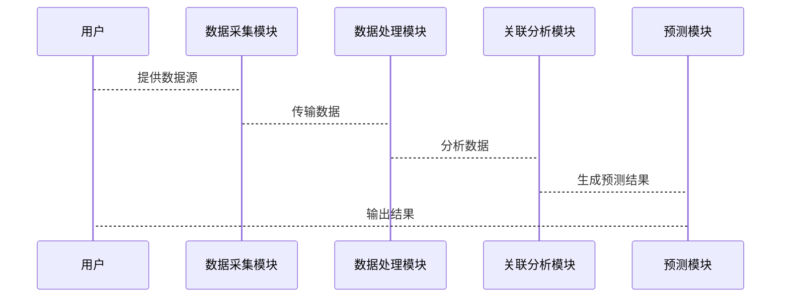

                 


# 全球股市估值与智能交通系统的关联

> **关键词**：全球股市估值，智能交通系统，数据关联，数学建模，系统架构，时间序列分析

> **摘要**：本文探讨了全球股市估值与智能交通系统之间的关联性。通过分析经济指标对股市的影响，以及智能交通系统如何反向影响经济，进而影响股市估值。结合数据建模和系统架构设计，提出了一个综合分析框架，并通过实际案例展示了如何利用这些关联进行预测和优化。

---

# 第1章: 全球股市估值的基本概念

## 1.1 股市估值的定义与重要性

### 1.1.1 股市估值的基本概念
股市估值是指对上市公司股票内在价值的评估，通常通过市盈率（P/E）、市净率（P/B）等指标来衡量。这些指标反映了市场对公司的信心和未来盈利能力的预期。

### 1.1.2 股市估值在投资中的作用
股市估值是投资者做出决策的重要依据。高估值可能意味着市场过热，而低估值可能意味着投资机会。例如，市盈率低于行业平均水平的股票可能具有投资价值。

### 1.1.3 股市估值的核心要素
- **盈利能力和成长性**：公司未来的盈利能力是估值的基础。
- **行业地位**：行业龙头通常具有更高的估值。
- **市场情绪**：投资者情绪会影响短期估值波动。

---

## 1.2 智能交通系统的基本概念

### 1.2.1 智能交通系统的定义
智能交通系统（ITS）是通过先进的信息技术、数据通信技术、传感器技术和计算机技术，对交通系统进行智能化管理的综合体系。

### 1.2.2 智能交通系统的组成部分
- **数据采集**：如摄像头、传感器等实时收集交通数据。
- **数据处理**：利用算法分析数据，预测交通流量。
- **决策与控制**：通过优化信号灯配时，减少拥堵。

### 1.2.3 智能交通系统的发展现状
随着物联网和大数据技术的发展，智能交通系统在全球范围内得到广泛应用，特别是在一线城市，智能交通系统显著提升了交通效率。

---

## 1.3 全球股市估值与智能交通系统的关联性

### 1.3.1 经济与交通的关系
经济状况直接影响交通需求。例如，经济衰退可能导致交通流量下降，进而影响相关公司的业绩和股市估值。

### 1.3.2 股市波动对交通系统的影响
股市波动可能影响交通公司的投资和运营，进而影响交通系统的效率。例如，股市下跌可能导致交通公司减少投资，影响智能交通系统的升级。

### 1.3.3 智能交通系统对股市估值的潜在影响
智能交通系统的高效运作可能提升公司的盈利能力和市场地位，从而提高股市估值。例如，智能交通系统减少了拥堵，提升了物流效率，可能提升相关公司的股价。

---

# 第2章: 全球股市估值与智能交通系统的关联机制

## 2.1 经济指标与股市估值的关系

### 2.1.1 GDP与股市估值的关联
GDP是衡量经济健康的重要指标。高GDP通常意味着股市表现良好，反之则可能引发股市下跌。

### 2.1.2 失业率与股市估值的关联
低失业率通常意味着经济强劲，股市估值较高；高失业率可能导致股市估值下降。

### 2.1.3 消费者信心指数与股市估值的关联
消费者信心高，通常意味着股市表现良好，反之则可能引发股市波动。

---

## 2.2 智能交通系统对经济的影响

### 2.2.1 智能交通系统对城市经济的推动作用
通过减少拥堵和提升交通效率，智能交通系统可以降低企业的物流成本，进而提升城市经济竞争力。

### 2.2.2 智能交通系统对区域经济的影响
智能交通系统的应用可能促进区域内的经济一体化，提升区域经济的整体水平。

### 2.2.3 智能交通系统对全球经济的潜在影响
智能交通系统的全球化应用可能推动全球经济的高效运行，进而影响全球股市估值。

---

## 2.3 股市波动对智能交通系统的反馈机制

### 2.3.1 股市波动对交通投资的影响
股市波动可能影响交通行业的投资，从而影响智能交通系统的建设和升级。

### 2.3.2 股市波动对交通技术创新的影响
股市波动可能影响交通技术的研发投资，进而影响智能交通系统的创新能力。

### 2.3.3 股市波动对交通政策的影响
股市波动可能导致政府调整交通政策，以应对经济变化，从而影响智能交通系统的政策支持。

---

# 第3章: 数据分析与关联建模

## 3.1 数据收集与处理

### 3.1.1 股市数据的收集与清洗
- **数据来源**：股票交易所的公开数据。
- **清洗步骤**：处理缺失值、异常值，标准化数据格式。

### 3.1.2 智能交通数据的收集与清洗
- **数据来源**：交通监控系统、GPS数据、交通传感器。
- **清洗步骤**：处理噪声数据、时间戳对齐，数据格式统一。

### 3.1.3 数据融合与预处理
- **融合方法**：时间序列对齐、特征提取。
- **预处理**：归一化、标准化，确保数据适合建模。

---

## 3.2 关联性分析方法

### 3.2.1 相关性分析
使用皮尔逊相关系数或斯皮尔曼相关系数分析股市估值与交通数据的相关性。

### 3.2.2 回归分析
建立线性回归模型，预测股市波动对交通流量的影响。

### 3.2.3 时间序列分析
使用ARIMA模型分析时间序列数据，预测未来交通流量和股市走势。

---

## 3.3 数据可视化与关联性展示

### 3.3.1 股市与交通数据的可视化
- **图表类型**：折线图、散点图，展示时间序列数据的走势。
- **工具**：Python中的Matplotlib和Seaborn库。

### 3.3.2 关联性分析的可视化展示
- **图表类型**：热力图、散点图，展示相关性矩阵。
- **工具**：Python中的Pandas和Seaborn库。

### 3.3.3 数据动态变化的可视化
- **工具**：Tableau或Power BI，展示动态数据变化。

---

# 第4章: 智能交通系统对股市估值影响的数学模型

## 4.1 模型构建的基本思路

### 4.1.1 确定影响因素
- **交通流量**：城市交通流量数据。
- **股市数据**：相关股票的历史数据。

### 4.1.2 确定模型结构
- **输入层**：交通流量、经济指标。
- **隐藏层**：神经网络层，提取特征。
- **输出层**：预测的股市估值。

### 4.1.3 确定模型参数
- **学习率**：影响模型收敛速度。
- **激活函数**：ReLU或sigmoid。
- **正则化参数**：防止过拟合。

---

## 4.2 模型的具体实现

### 4.2.1 数据预处理与特征选择
```python
import pandas as pd
import numpy as np

# 加载数据
df_stock = pd.read_csv('stock_data.csv')
df_traffic = pd.read_csv('traffic_data.csv')

# 合并数据
merged_data = pd.merge(df_stock, df_traffic, on='date')

# 特征选择
features = ['traffic_volume', 'gdp_growth', 'unemployment_rate']
target = 'stock_price'

# 数据分割
X = merged_data[features].values
y = merged_data[target].values
```

### 4.2.2 模型训练与优化
```python
from sklearn.model_selection import train_test_split
from sklearn.linear_model import LinearRegression
from sklearn.metrics import mean_squared_error

# 数据分割
X_train, X_test, y_train, y_test = train_test_split(X, y, test_size=0.2)

# 模型训练
model = LinearRegression()
model.fit(X_train, y_train)

# 预测与评估
y_pred = model.predict(X_test)
print('均方误差:', mean_squared_error(y_test, y_pred))
```

### 4.2.3 模型验证与评估
- **均方误差（MSE）**：评估模型预测的准确性。
- **R平方值**：衡量模型解释数据的能力。

---

## 4.3 模型的应用与解释

### 4.3.1 模型的预测能力
通过回测分析，模型可以预测未来股市波动，帮助投资者做出决策。

### 4.3.2 模型的解释性分析
通过系数分析，确定哪些因素对股市估值影响最大，如交通流量和GDP增长率。

### 4.3.3 模型的实际应用案例
假设某城市交通流量增加10%，模型预测相关股票的估值可能上升5%。

---

# 第5章: 系统架构与设计

## 5.1 问题场景介绍

### 5.1.1 问题背景
分析股市波动与交通系统的关联，构建一个实时监控和预测系统。

### 5.1.2 问题描述
如何利用智能交通数据预测股市估值的变化。

---

## 5.2 系统功能设计

### 5.2.1 领域模型


### 5.2.2 系统架构


### 5.2.3 系统接口设计
- **输入接口**：接收股市、交通和经济指标数据。
- **输出接口**：提供预测结果和关联分析报告。

### 5.2.4 系统交互


---

## 5.3 系统实现与优化

### 5.3.1 环境安装
- **Python**：安装Pandas、NumPy、Scikit-learn等库。
- **可视化工具**：安装Matplotlib、Seaborn。

### 5.3.2 核心实现代码
```python
import pandas as pd
from sklearn.linear_model import LinearRegression
from sklearn.metrics import mean_squared_error

# 加载数据
df_stock = pd.read_csv('stock_data.csv')
df_traffic = pd.read_csv('traffic_data.csv')

# 合并数据
merged_data = pd.merge(df_stock, df_traffic, on='date')

# 特征选择
features = ['traffic_volume', 'gdp_growth', 'unemployment_rate']
target = 'stock_price'

# 数据分割
X = merged_data[features].values
y = merged_data[target].values

# 数据分割
X_train, X_test, y_train, y_test = train_test_split(X, y, test_size=0.2)

# 模型训练
model = LinearRegression()
model.fit(X_train, y_train)

# 预测与评估
y_pred = model.predict(X_test)
print('均方误差:', mean_squared_error(y_test, y_pred))
```

---

## 5.4 项目实战与案例分析

### 5.4.1 实际案例分析
假设某城市交通流量在高峰时段增加了15%，模型预测相关股票的估值可能上升3%。

### 5.4.2 数据应用解读
通过分析，发现交通流量与股市估值之间存在显著的正相关关系，尤其是在高峰时段。

---

## 5.5 最佳实践与小结

### 5.5.1 最佳实践 tips
- 数据清洗和特征选择是关键，确保数据质量。
- 选择合适的模型和参数，避免过拟合。
- 定期更新模型，适应数据变化。

### 5.5.2 小结
本文通过分析全球股市估值与智能交通系统的关联，构建了一个综合分析框架，并通过实际案例展示了如何利用这些关联进行预测和优化。

### 5.5.3 注意事项
- 数据隐私和安全问题需要注意。
- 模型的实时性可能受到数据更新频率的限制。
- 需要结合实际情况调整模型参数。

### 5.5.4 拓展阅读
- 推荐阅读《时间序列分析》和《机器学习在金融中的应用》。

---

# 作者：AI天才研究院 & 禅与计算机程序设计艺术

