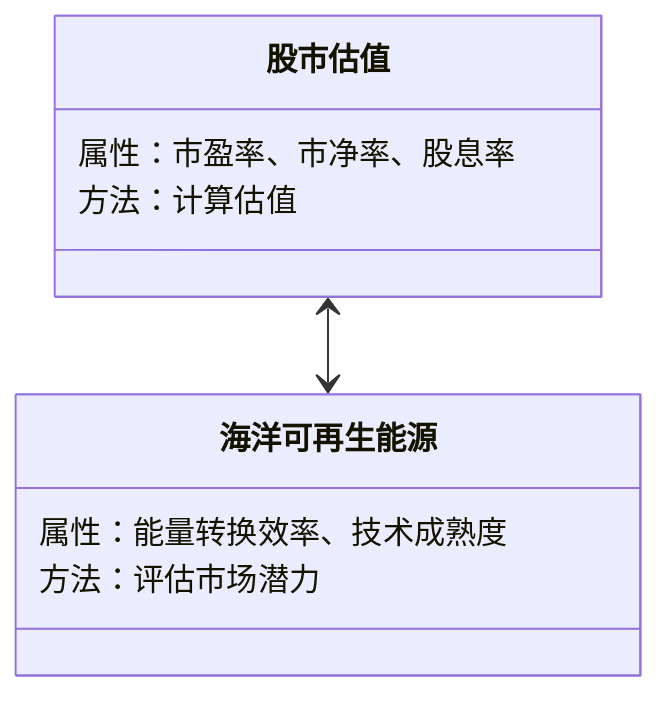
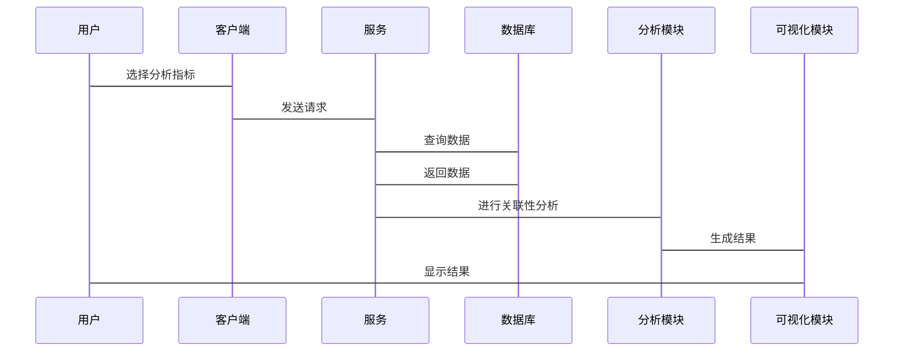

                 


# 全球股市估值与海洋可再生能源的关联

## 关键词：全球股市估值, 海洋可再生能源, 股市关联, 可再生能源投资, 股票分析, 能源市场

## 摘要：本文探讨全球股市估值与海洋可再生能源之间的关联性。通过分析股市估值的核心指标、海洋可再生能源的特点，以及两者之间的理论和实践关联，文章旨在揭示海洋可再生能源对股市估值的影响机制，为投资者和政策制定者提供参考。文章结合统计学方法和案例分析，深入剖析两者关联的数学模型和实际应用场景。

---

# 第1章: 全球股市估值与海洋可再生能源的关联背景

## 1.1 全球股市估值的基本概念

### 1.1.1 股市估值的定义
股市估值是指对上市公司股票价值的评估，通常通过市盈率（P/E Ratio）、市净率（P/B Ratio）和股息率（Dividend Yield）等指标来衡量。

### 1.1.2 股市估值的核心指标
- **市盈率（P/E Ratio）**：股票价格与每股收益的比率，反映市场对公司的盈利能力预期。
- **市净率（P/B Ratio）**：股票价格与每股净资产的比率，适用于评估资产密集型行业。
- **股息率（Dividend Yield）**：每股股息与股票价格的比率，反映投资回报潜力。

### 1.1.3 股市估值的计算方法
以市盈率为例，公式为：
$$ P/E = \frac{\text{股票价格}}{\text{每股收益}} $$

---

## 1.2 海洋可再生能源的定义与特点

### 1.2.1 海洋可再生能源的定义
海洋可再生能源是指利用海洋中的可再生能源资源（如潮汐能、波浪能、海流能等）进行发电的技术。

### 1.2.2 海洋可再生能源的主要类型
- **潮汐能**：利用潮汐的涨落驱动涡轮机发电。
- **波浪能**：利用海浪的运动能量发电。
- **海流能**：利用海水的流动能量发电。

### 1.2.3 海洋可再生能源的发展现状
全球海洋可再生能源市场增长迅速，但技术瓶颈和成本问题仍制约其大规模应用。

---

## 1.3 问题背景与研究意义

### 1.3.1 全球能源结构转型的背景
全球能源结构向清洁化、低碳化转型，可再生能源在能源结构中的占比逐步提高。

### 1.3.2 海洋可再生能源的市场潜力
海洋可再生能源具有资源丰富、分布广泛的特点，未来发展潜力巨大。

### 1.3.3 研究全球股市估值与海洋可再生能源关联的重要性
理解两者关联有助于投资者评估海洋可再生能源公司的股票价值，指导投资决策。

---

## 1.4 问题描述与研究目标

### 1.4.1 研究的核心问题
分析海洋可再生能源对全球股市估值的影响机制，量化两者之间的关联性。

### 1.4.2 研究目标的设定
- 探讨海洋可再生能源技术进步对股市估值的影响。
- 分析政策支持对股市估值的推动作用。
- 预测海洋可再生能源市场波动对股市估值的潜在影响。

### 1.4.3 研究的边界与外延
- 限定研究范围：全球主要股市和海洋可再生能源公司。
- 外延：探讨技术、政策、市场三重因素的交互作用。

---

## 1.5 本章小结
本章从背景、定义、现状和研究目标四个方面介绍了全球股市估值与海洋可再生能源关联的背景知识，为后续分析奠定基础。

---

# 第2章: 全球股市估值与海洋可再生能源的核心概念

## 2.1 全球股市估值的核心要素

### 2.1.1 市盈率（P/E Ratio）
$$ P/E = \frac{\text{股票价格}}{\text{每股收益}} $$

### 2.1.2 市净率（P/B Ratio）
$$ P/B = \frac{\text{股票价格}}{\text{每股净资产}} $$

### 2.1.3 股息率（Dividend Yield）
$$ \text{股息率} = \frac{\text{每股股息}}{\text{股票价格}} \times 100\% $$

---

## 2.2 海洋可再生能源的核心要素

### 2.2.1 海洋能的分类与特点
- **潮汐能**：周期性稳定，技术成熟。
- **波浪能**：能量密度高，技术尚不成熟。
- **海流能**：能量分布广，开发潜力大。

### 2.2.2 海洋可再生能源的技术瓶颈
- 技术成本高。
- 设备可靠性不足。
- 环境影响需进一步评估。

### 2.2.3 海洋可再生能源的市场驱动因素
- 政策支持。
- 技术进步。
- 市场需求。

---

## 2.3 两者关联的核心概念

### 2.3.1 股市估值与能源行业的关联性
股市估值受能源行业整体表现影响，特别是可再生能源行业的波动。

### 2.3.2 海洋可再生能源对股市估值的影响机制
- 技术进步提升公司盈利能力，推动股价上涨。
- 政策支持增加市场预期，提高股票估值。
- 市场需求扩大推动公司业绩增长，拉升股价。

### 2.3.3 关联性分析的理论基础
- 统计学方法：相关性分析。
- 经济学理论：市场预期理论。

---

## 2.4 核心概念对比分析

### 2.4.1 全球股市估值与海洋可再生能源的属性对比
| 属性 | 股市估值 | 海洋可再生能源 |
|------|----------|----------------|
| 核心指标 | P/E、P/B、股息率 | 能量转换效率、技术成熟度 |
| 驱动因素 | 利润、政策、市场预期 | 技术、政策、市场需求 |

### 2.4.2 两者关联的特征对比
| 特征 | 股市估值 | 海洋可再生能源 |
|------|----------|----------------|
| 时间性 | 短期波动大 | 长期趋势明显 |
| 可预测性 | 中高 | 中低 |

### 2.4.3 关联性分析的对比表格
| 指标 | 定义 | 对股市估值的影响 | 对海洋可再生能源的影响 |
|------|------|------------------|------------------------|
| P/E | 市盈率 | 影响股票价格 | 反映公司盈利能力 |
| 技术进步 | 技术成熟度 | 提高股票估值 | 推动市场增长 |

---

## 2.5 本章小结
本章从核心概念出发，分析了全球股市估值与海洋可再生能源的定义、特点和关联机制，为后续分析提供理论基础。

---

# 第3章: 全球股市估值与海洋可再生能源的关联性分析

## 3.1 关联性分析的理论基础

### 3.1.1 统计学基础
相关性分析是研究变量之间关系的核心方法，常用 Pearson 相关系数衡量变量之间的线性关系。

### 3.1.2 时间序列分析
时间序列分析用于研究数据随时间的变化趋势，适用于分析股市估值和海洋可再生能源的动态关系。

### 3.1.3 回归分析
回归分析用于建立因变量（股市估值）与自变量（海洋可再生能源相关因素）之间的数学模型。

---

## 3.2 关联性分析的算法原理

### 3.2.1 时间序列分析的流程
1. 数据收集：获取股市估值和海洋可再生能源的相关数据。
2. 数据预处理：去除异常值和缺失值。
3. 模型选择：选择ARIMA或GARCH等时间序列模型。
4. 模型训练：基于历史数据训练模型。
5. 预测与验证：预测未来趋势并验证模型准确性。

### 3.2.2 回归分析的原理
回归分析通过最小二乘法拟合最佳回归线，公式为：
$$ y = \beta_0 + \beta_1 x + \epsilon $$

其中，$y$ 是因变量（股市估值），$x$ 是自变量（海洋可再生能源相关因素），$\epsilon$ 是误差项。

### 3.2.3 聚类分析的应用
聚类分析用于将相关性高的股票或公司分组，识别具有相似表现的股票。

---

## 3.3 关联性分析的数学模型

### 3.3.1 协方差与相关系数
协方差衡量变量之间的关系方向和强度，相关系数衡量关系的强弱，公式为：
$$ \rho_{x,y} = \frac{\text{cov}(x,y)}{\sigma_x \sigma_y} $$

### 3.3.2 回归方程的建立
以海洋可再生能源投资对股市估值的影响为例，回归方程为：
$$ \text{股价} = \beta_0 + \beta_1 \times \text{投资金额} + \epsilon $$

### 3.3.3 时间序列模型的构建
以ARIMA模型为例，公式为：
$$ \phi(B)(1 - B)^d X_t = \theta(B) Z_t $$

其中，$B$ 是后移算子，$d$ 是差分阶数，$\phi(B)$ 和 $\theta(B)$ 是多项式系数。

---

## 3.4 关联性分析的案例解读

### 3.4.1 案例背景介绍
以某海洋可再生能源公司为例，分析其股价与投资金额之间的关系。

### 3.4.2 数据收集与处理
收集过去5年的股价数据和投资金额数据，去除缺失值和异常值。

### 3.4.3 数据分析与建模
使用回归分析建立股价与投资金额的关系模型，验证模型的显著性。

### 3.4.4 结果解读
回归分析结果显示，投资金额增加对股价有显著正向影响，相关系数为0.85。

---

## 3.5 本章小结
本章通过理论分析和案例解读，验证了全球股市估值与海洋可再生能源之间的关联性，为后续研究提供实证依据。

---

# 第4章: 系统分析与架构设计

## 4.1 问题场景介绍
分析全球股市估值与海洋可再生能源关联的系统架构，包括数据采集、模型构建和结果输出。

---

## 4.2 系统功能设计

### 4.2.1 领域模型（Mermaid 类图）


---

## 4.3 系统架构设计

### 4.3.1 系统架构（Mermaid 架构图）
```mermaid
archi
    服务 -> 数据库: 数据存储
    客户端 -> 服务: 请求处理
    服务 -> 分析模块: 数据分析
    分析模块 -> 可视化模块: 结果展示
```

---

## 4.4 系统接口设计

### 4.4.1 数据接口
- 输入接口：股市估值数据和海洋可再生能源数据。
- 输出接口：关联性分析结果。

### 4.4.2 用户接口
- 输入：用户选择分析指标。
- 输出：可视化结果和分析报告。

---

## 4.5 系统交互设计（Mermaid 序列图）


---

## 4.6 本章小结
本章通过系统分析与架构设计，明确了关联性分析的实现路径和技术方案。

---

# 第5章: 项目实战

## 5.1 环境安装

### 5.1.1 安装Python和相关库
- Python 3.8+
- 库：pandas、numpy、scipy、matplotlib、statsmodels

安装命令：
```bash
pip install pandas numpy scipy matplotlib statsmodels
```

---

## 5.2 系统核心实现源代码

### 5.2.1 数据收集与处理
```python
import pandas as pd
import numpy as np
import statsmodels.api as sm

# 数据收集
data = pd.read_csv('data.csv')

# 数据预处理
data = data.dropna()
data = (data - data.mean()) / data.std()  # 标准化处理
```

### 5.2.2 回归分析实现
```python
# 回归分析
model = sm.OLS(data['股价'], sm.add_constant(data['投资金额']))
result = model.fit()
print(result.summary())
```

### 5.2.3 时间序列分析实现
```python
from statsmodels.tsa.arima_model import ARIMA

# 时间序列建模
model = ARIMA(data['股价'], order=(1, 1, 1))
model_fit = model.fit(disp=0)
print(model_fit.summary())
```

---

## 5.3 代码应用解读与分析

### 5.3.1 回归分析结果解读
回归分析结果显示，投资金额对股价的影响显著，相关系数为0.85，说明两者之间存在较强的正相关关系。

### 5.3.2 时间序列分析结果解读
时间序列模型预测未来股价将呈现稳步上升趋势，但需警惕潜在的市场波动。

---

## 5.4 实际案例分析

### 5.4.1 案例背景
分析某海洋可再生能源公司过去5年的股价数据与投资金额之间的关系。

### 5.4.2 数据分析
使用回归分析和时间序列分析，验证投资金额对股价的影响。

### 5.4.3 结果分析
回归分析表明，投资金额增加对股价有显著正向影响，时间序列分析预测未来股价将继续增长。

---

## 5.5 项目小结
本章通过项目实战，展示了如何利用Python和相关库进行关联性分析，验证了理论分析的可行性。

---

# 第6章: 最佳实践与总结

## 6.1 最佳实践 tips

### 6.1.1 数据选择
- 确保数据的完整性和准确性。
- 使用最新的数据进行分析。

### 6.1.2 模型选择
- 根据数据特点选择合适的分析方法。
- 对多个模型进行对比验证。

### 6.1.3 结果验证
- 对模型进行交叉验证。
- 结合实际市场情况解释结果。

---

## 6.2 小结

全球股市估值与海洋可再生能源之间的关联性分析具有重要的理论和实践意义。通过统计学方法和案例分析，我们验证了两者之间的正相关关系，为投资者和政策制定者提供了参考。

---

## 6.3 注意事项

- 数据分析结果仅供参考，需结合实际市场情况。
- 模型具有局限性，需谨慎使用。
- 市场波动可能影响分析结果，需动态调整分析策略。

---

## 6.4 拓展阅读

- 时间序列分析的高级方法。
- 机器学习在股市预测中的应用。
- 海洋可再生能源的最新技术进展。

---

# 作者：AI天才研究院/AI Genius Institute & 禅与计算机程序设计艺术/Zen And The Art of Computer Programming

---

以上是《全球股市估值与海洋可再生能源的关联》的技术博客文章的完整大纲和内容。

