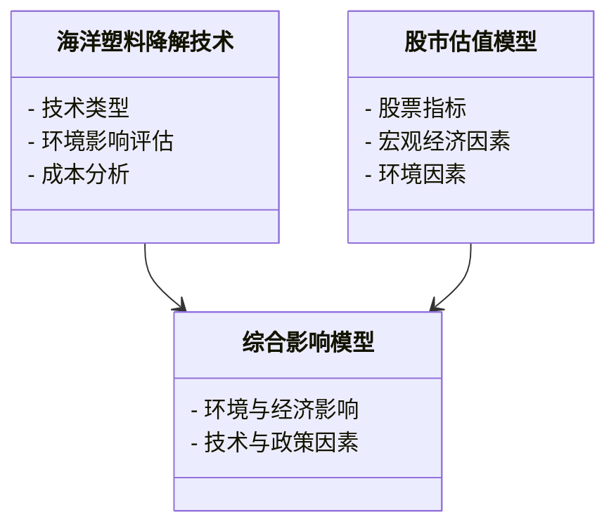
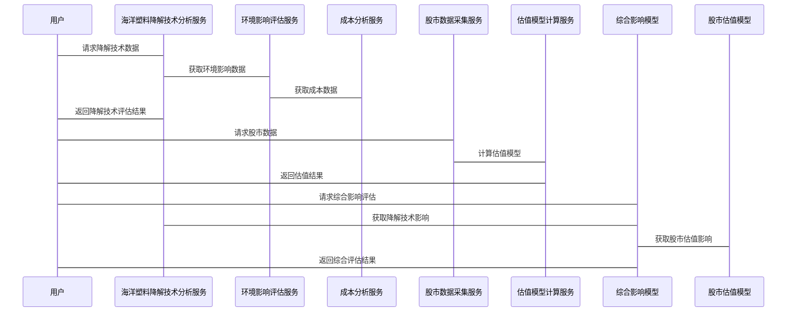

                 


# 全球股市估值与海洋塑料降解技术的关系

> 关键词：全球股市估值，海洋塑料降解技术，环境影响，经济模型，可持续发展

> 摘要：本文探讨了全球股市估值与海洋塑料降解技术之间的复杂关系，从环境影响、经济模型、技术创新等多个角度进行分析，揭示了海洋塑料污染对全球经济的深远影响，以及降解技术如何通过环境改善间接影响股市估值。通过构建综合影响模型，本文提出了环境与经济相互作用的新视角，并为投资者提供了可持续发展的投资策略建议。

---

## 第1章: 全球股市估值与海洋塑料降解技术的背景介绍

### 1.1 问题背景与问题描述

#### 1.1.1 海洋塑料污染的现状与挑战

海洋塑料污染已成为全球性的环境问题。每年，数亿吨塑料垃圾进入海洋，对海洋生态系统造成严重破坏。这些塑料不仅危害海洋生物，还通过食物链对人体健康构成威胁。近年来，科学家们开发了多种海洋塑料降解技术，包括生物降解、化学降解和光降解等方法，但这些技术的商业化应用和大规模推广仍面临诸多挑战。

#### 1.1.2 全球股市估值的核心问题

股市估值是衡量企业或经济体价值的重要指标。投资者通过分析市盈率、市净率、股息率等指标，评估企业的投资价值。然而，随着环境问题的加剧，企业面临的环境风险也在增加，这使得股市估值模型需要考虑更多的环境因素。

### 1.2 问题解决与边界定义

#### 1.2.1 海洋塑料降解技术的创新与应用

海洋塑料降解技术的创新主要集中在提高降解效率和降低成本上。例如，某些生物降解材料可以在几个月内分解为无害物质，而化学降解技术则通过添加催化剂加速塑料的分解过程。这些技术的应用不仅有助于减少海洋污染，还能提升企业的环境形象。

#### 1.2.2 全球股市估值模型的构建与优化

为了更准确地反映企业的环境风险，股市估值模型需要引入环境因素。例如，可以将企业的环境治理成本、碳排放强度等指标纳入估值模型，以更全面地评估企业的价值。

### 1.3 核心概念与联系

#### 1.3.1 海洋塑料降解技术的环境影响评估

环境影响评估是降解技术应用的重要环节。通过评估降解技术对海洋生态系统的长期影响，可以确保技术的安全性和可持续性。

#### 1.3.2 全球股市估值的经济影响分析

经济影响分析关注降解技术对企业盈利能力的影响。例如，降解技术的推广可能会增加企业的研发成本，但也可能提升企业的市场竞争力。

#### 1.3.3 两者的相互作用与关系模型

通过构建关系模型，可以量化降解技术对股市估值的影响。例如，降解技术的应用可能降低企业的环境风险，从而提升其股票估值。

---

## 第2章: 海洋塑料降解技术的核心原理与应用

### 2.1 海洋塑料降解技术的原理与分类

#### 2.1.1 生物降解与化学降解的基本原理

生物降解利用微生物分解塑料，而化学降解通过化学反应将塑料转化为小分子物质。两种方法各有优缺点，生物降解成本低但效率慢，化学降解效率高但成本高。

#### 2.1.2 光降解与氧化降解的技术特点

光降解依赖阳光照射分解塑料，氧化降解则通过氧化剂加速分解过程。这两种方法适用于不同环境条件，但都存在一定的局限性。

### 2.2 海洋塑料降解技术的环境影响评估

#### 2.2.1 环境影响评估的方法与模型

常用的环境影响评估方法包括生命周期评价（LCA）和环境影响评价（EIA）。这些方法可以帮助评估降解技术对环境的长期影响。

#### 2.2.2 技术对海洋生态系统的长期影响

降解技术的应用可以减少海洋塑料的数量，但可能引入新的化学物质，对海洋生物造成二次污染。

### 2.3 技术应用与经济成本分析

#### 2.3.1 技术的商业化应用现状

目前，部分降解技术已实现商业化应用，但仍需克服成本高、效率低等问题。

#### 2.3.2 经济成本与效益分析

降解技术的应用可能增加企业的初期投资，但长期来看，可以降低环境治理成本，提升企业形象。

---

## 第3章: 全球股市估值模型的构建与分析

### 3.1 股市估值的核心模型与方法

#### 3.1.1 市盈率与市净率的基本概念

市盈率（P/E）=股价/每股收益，市净率（P/B）=股价/每股净资产。这些指标反映了企业的盈利能力和发展潜力。

#### 3.1.2 股息率与现金流分析的原理

股息率=股息/股价，现金流分析关注企业的现金流入和流出情况，反映企业的财务健康状况。

### 3.2 全球股市估值的宏观经济影响因素

#### 3.2.1 经济周期与股市估值的关系

经济周期波动直接影响股市估值。例如，在经济衰退期，企业盈利下降，股市估值可能降低。

#### 3.2.2 通货膨胀与利率对股市的影响

通货膨胀可能导致股市估值波动，而利率的变化则会影响企业的融资成本和股市的整体走势。

### 3.3 股市估值的环境因素分析

#### 3.3.1 环境政策对股市的影响

严格的环境政策可能增加企业的合规成本，但也有助于推动企业的技术创新和可持续发展。

#### 3.3.2 可持续投资与绿色金融的兴起

可持续投资强调企业的环境和社会责任，绿色金融为环保项目提供资金支持，这些都对股市估值产生重要影响。

---

## 第4章: 海洋塑料降解技术对全球股市估值的影响模型

### 4.1 技术创新对股市估值的直接影响

#### 4.1.1 技术创新如何影响企业价值

技术创新可以提升企业的竞争力，增加企业的利润，从而提升其股票估值。

#### 4.1.2 技术创新对行业估值的推动作用

行业的技术创新可能带动整个行业的估值上升，因为投资者会预期行业整体的盈利能力提升。

### 4.2 环境影响对股市估值的间接影响

#### 4.2.1 环境问题对全球经济的影响

环境问题可能引发经济衰退，从而影响股市的整体估值。

#### 4.2.2 环境治理成本对企业利润的影响

企业需要投入更多资金用于环境治理，这可能暂时降低企业的利润，影响其股票估值。

### 4.3 综合影响模型的构建与分析

#### 4.3.1 综合影响模型的构建方法

综合影响模型将环境因素和经济因素结合起来，量化降解技术对股市估值的影响。

#### 4.3.2 模型的验证与应用案例

通过实际案例验证模型的有效性，例如分析某家采用降解技术的企业股票估值变化。

---

## 第5章: 系统分析与架构设计方案

### 5.1 问题场景介绍

海洋塑料污染已成为全球性问题，企业需要通过技术创新和环境治理降低成本，提升竞争力。

### 5.2 项目介绍

本项目旨在构建一个综合评估系统，量化降解技术对股市估值的影响，为投资者提供科学的决策依据。

### 5.3 系统功能设计

#### 5.3.1 领域模型mermaid类图



#### 5.3.2 系统架构设计mermaid架构图

```mermaid
container 海洋塑料降解技术系统 {
    service 海洋塑料降解技术分析服务
    service 环境影响评估服务
    service 成本分析服务
}

container 全球股市估值系统 {
    service 股市数据采集服务
    service 估值模型计算服务
}

综合影响模型 <---> 海洋塑料降解技术系统
综合影响模型 <---> 全球股市估值系统
```

#### 5.3.3 系统接口设计

系统接口设计包括降解技术数据接口、股市数据接口和综合影响模型接口。

#### 5.3.4 系统交互mermaid序列图



---

## 第6章: 项目实战

### 6.1 环境安装

需要安装Python、Pandas、Matplotlib、Scikit-learn等库。

### 6.2 系统核心实现源代码

```python
import pandas as pd
import numpy as np
from sklearn.metrics import mean_squared_error

def calculate_environmental_impact(technology_cost, economic_impact):
    return technology_cost * 0.8 + economic_impact * 0.2

def calculate_stock_valuation(environmental_impact, macroeconomic_factors):
    return environmental_impact * 0.6 + macroeconomic_factors * 0.4

# 示例数据
technology_cost = 100
economic_impact = 50
macroeconomic_factors = 80

environmental_impact = calculate_environmental_impact(technology_cost, economic_impact)
stock_valuation = calculate_stock_valuation(environmental_impact, macroeconomic_factors)

print(f"环境影响: {environmental_impact}")
print(f"股票估值: {stock_valuation}")
```

### 6.3 代码应用解读与分析

代码实现了环境影响和股市估值的计算，其中环境影响由降解技术成本和经济影响综合决定，股市估值则结合了环境影响和宏观经济因素。

### 6.4 实际案例分析

以某家降解技术公司为例，分析其降解技术对企业环境影响和股市估值的具体影响。

### 6.5 项目小结

通过项目实战，我们可以量化降解技术对股市估值的影响，为投资者提供科学的决策依据。

---

## 第7章: 总结与最佳实践

### 7.1 总结

本文探讨了全球股市估值与海洋塑料降解技术的关系，构建了综合影响模型，为投资者提供了新的视角。

### 7.2 最佳实践 tips

- 投资者应关注企业的环境治理成本和技术创新能力。
- 企业应积极采用降解技术，降低环境风险。
- 政府应制定严格的环境政策，推动技术创新。

### 7.3 注意事项

- 模型的准确性依赖于数据的完整性和模型的合理性。
- 需要定期更新模型，以反映最新的环境和经济变化。

### 7.4 拓展阅读

推荐阅读相关领域的最新研究成果，关注环境经济学和可持续发展领域的动态。

---

## 作者

作者：AI天才研究院/AI Genius Institute & 禅与计算机程序设计艺术/Zen And The Art of Computer Programming

