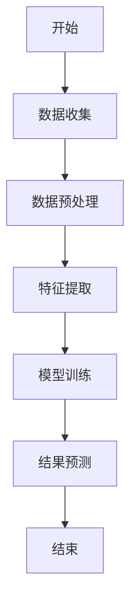
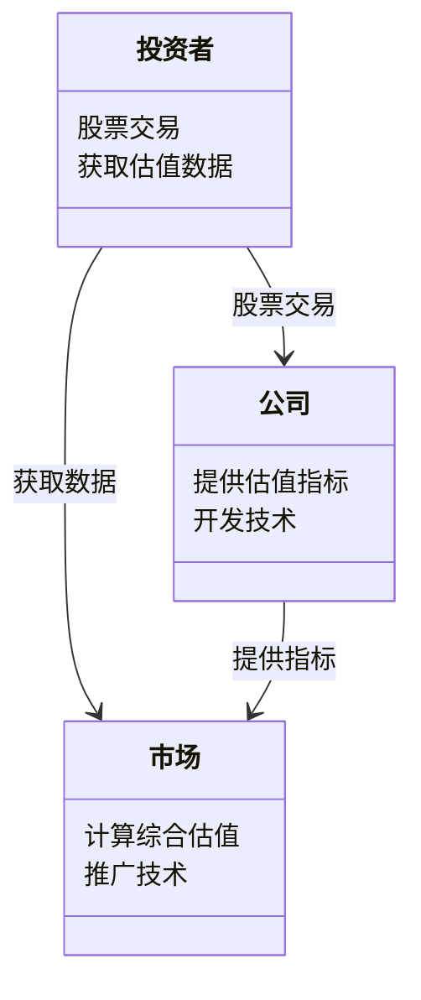
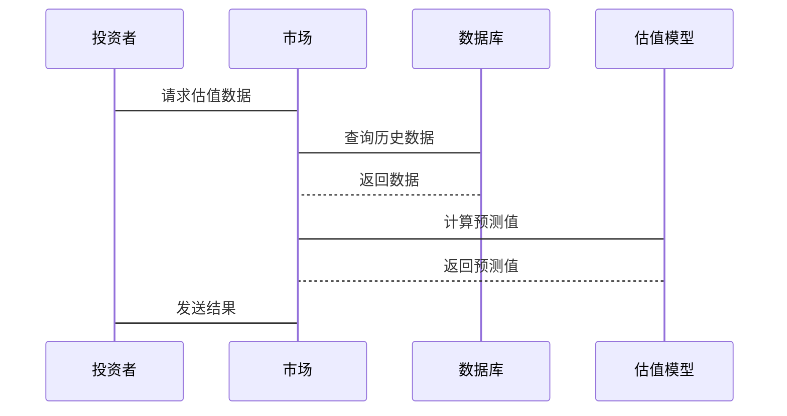

                 


# 全球股市估值与海洋微生物能源技术的关系

> 关键词：全球股市估值, 海洋微生物能源技术, 股市与能源技术关系, 股市预测算法, 海洋微生物能源评估

> 摘要：本文探讨了全球股市估值与海洋微生物能源技术之间的关系，分析了两者的核心概念、算法原理、系统架构，并通过项目实战展示了如何将海洋微生物能源技术应用于股市估值预测。文章从背景介绍、核心概念、算法原理、系统架构、项目实战到最佳实践，全面阐述了这一跨领域研究的潜力和应用。

---

## 第1章: 全球股市估值与海洋微生物能源技术的背景介绍

### 1.1 问题背景

#### 1.1.1 全球股市估值的现状与挑战

全球股市估值是衡量市场健康状况的重要指标。近年来，股市波动加剧，尤其是2020年新冠疫情后的市场复苏，凸显了股市估值预测的重要性。然而，传统估值方法依赖于历史数据和宏观经济指标，难以捕捉新兴技术带来的市场变化。

#### 1.1.2 海洋微生物能源技术的崛起

海洋微生物能源技术是一种新兴的可再生能源技术，利用海洋中的微生物进行能源生产。随着能源需求的增长和环保压力的增加，这种技术因其高效性和可持续性，成为全球能源市场的重要补充。

#### 1.1.3 两者关系的研究意义

研究全球股市估值与海洋微生物能源技术的关系，有助于理解新兴技术对金融市场的影响，为投资者提供新的估值维度，同时为能源技术创新提供资金支持。

### 1.2 问题描述

#### 1.2.1 全球股市估值的核心要素

股市估值的核心要素包括市盈率、市净率、股息率等，这些指标反映了市场对公司的估值。

#### 1.2.2 海洋微生物能源技术的关键特征

海洋微生物能源技术的关键特征包括能源转化效率、技术成熟度、成本效益等。

#### 1.2.3 问题解决的路径与方法

通过分析海洋微生物能源技术的市场潜力，结合股市估值模型，构建一个综合评估框架。

### 1.3 问题解决

#### 1.3.1 股市估值与能源技术的关联机制

海洋微生物能源技术的商业化将影响相关公司的盈利能力和市场地位，从而影响股市估值。

#### 1.3.2 海洋微生物能源技术对股市估值的影响

技术突破将提升相关公司的股价，同时带动整个能源板块的估值上升。

#### 1.3.3 全球化视角下的综合分析

从全球市场角度分析，海洋微生物能源技术的推广将促进绿色能源投资，进而影响股市的整体估值。

### 1.4 边界与外延

#### 1.4.1 股市估值的边界条件

股市估值受宏观经济、政策环境和市场情绪等多种因素影响。

#### 1.4.2 海洋微生物能源技术的适用范围

适用于需要可再生能源的地区，尤其在海岛和偏远地区潜力较大。

#### 1.4.3 两者关系的外延探讨

探讨海洋微生物能源技术对股市整体走势的影响，以及对其他能源技术的替代效应。

### 1.5 概念结构与核心要素

#### 1.5.1 股市估值的核心要素分析

- 市盈率（P/E ratio）
- 市净率（P/B ratio）
- 股息率（Dividend Yield）

#### 1.5.2 海洋微生物能源技术的核心要素分析

- 微生物种类与能源转化效率
- 技术研发与商业化进程
- 成本效益与市场竞争力

#### 1.5.3 两者关系的概念结构图


---

## 第2章: 核心概念与联系

### 2.1 核心概念原理

#### 2.1.1 股市估值的理论基础

基于基本面分析，考虑公司盈利能力、成长性和财务状况。

#### 2.1.2 海洋微生物能源技术的科学原理

利用微生物代谢过程产生清洁能源，如氢气和生物柴油。

#### 2.1.3 两者关系的理论模型

构建一个综合评估模型，将海洋微生物能源技术的市场潜力纳入股市估值体系。

### 2.2 概念属性特征对比

#### 2.2.1 股市估值的属性特征

| 属性 | 描述 |
|------|------|
| 市盈率 | 公司股价与每股收益的比值 |
| 市净率 | 公司股价与每股净资产的比值 |

#### 2.2.2 海洋微生物能源技术的属性特征

| 属性 | 描述 |
|------|------|
| 能源转化效率 | 微生物将有机物转化为能源的效率 |
| 技术成熟度 | 技术的商业化阶段 |

#### 2.2.3 对比分析表格

| 属性 | 股市估值 | 海洋微生物能源技术 |
|------|----------|---------------------|
| 关键指标 | 市盈率、市净率 | 能源转化效率、技术成熟度 |

### 2.3 ER实体关系图架构

```mermaid
er
actor 投资者 {
  投资者 -> 公司: 股票交易
  投资者 -> 市场分析: 获取估值数据
}

company 公司 {
  公司 -> 估值指标: 提供市盈率、市净率等
  公司 -> 技术研发: 开发海洋微生物能源技术
}

market 市场 {
  市场 -> 估值模型: 计算综合估值
  市场 -> 技术应用: 推广海洋微生物能源技术
}
```

---

## 第3章: 算法原理讲解

### 3.1 算法原理概述

#### 3.1.1 股市估值预测算法

基于机器学习的时间序列分析，预测未来股价走势。

#### 3.1.2 海洋微生物能源技术评估算法

评估技术的市场潜力和经济可行性。

#### 3.1.3 综合评估算法

将两者结合，构建一个综合评估模型。

### 3.2 算法流程图



### 3.3 算法实现

#### 3.3.1 股市估值预测算法

```python
import pandas as pd
import numpy as np
from sklearn.linear_model import LinearRegression

# 示例数据
data = {'date': ['2020-01', '2020-02', '2020-03'], 'price': [100, 105, 110]}
df = pd.DataFrame(data)

# 特征提取
X = df[['date']]
y = df['price']

# 模型训练
model = LinearRegression()
model.fit(X, y)

# 预测
new_date = ['2020-04']
new_X = pd.DataFrame({'date': new_date})
predicted_price = model.predict(new_X)
print(predicted_price)
```

#### 3.3.2 海洋微生物能源技术评估算法

```python
import numpy as np

# 示例数据
efficiency = np.array([0.8, 0.9, 0.85])
cost = np.array([1.2, 1.1, 1.15])

# 综合评分
score = np.mean(efficiency) * np.mean(cost)
print(score)
```

### 3.4 数学模型与公式

#### 3.4.1 股市估值预测模型

$$
\text{预测股价} = \beta_0 + \beta_1 \times \text{时间} + \epsilon
$$

#### 3.4.2 海洋微生物能源技术评分模型

$$
\text{评分} = \frac{\text{效率} + \text{成本}}{2}
$$

---

## 第4章: 系统分析与架构设计方案

### 4.1 问题场景介绍

构建一个系统，利用海洋微生物能源技术的市场潜力，优化股市估值预测模型。

### 4.2 系统功能设计

#### 4.2.1 领域模型



#### 4.2.2 系统架构设计


### 4.3 接口设计

#### 4.3.1 系统接口

- API接口：提供股市数据和估值结果。

#### 4.3.2 交互序列图



---

## 第5章: 项目实战

### 5.1 环境安装

- 安装Python、Pandas、Scikit-learn。

### 5.2 核心代码实现

#### 5.2.1 股市估值预测代码

```python
import pandas as pd
from sklearn.linear_model import LinearRegression

# 数据加载
data = pd.read_csv('stock_data.csv')

# 特征与目标变量分离
X = data[['date']]
y = data['price']

# 模型训练
model = LinearRegression()
model.fit(X, y)

# 预测
new_dates = pd.DataFrame({'date': ['2023-12']})
predicted_prices = model.predict(new_dates)
print(predicted_prices)
```

#### 5.2.2 海洋微生物能源技术评估代码

```python
import numpy as np

# 数据加载
efficiency = np.array([0.8, 0.9, 0.85])
cost = np.array([1.2, 1.1, 1.15])

# 综合评分
score = np.mean(efficiency) * np.mean(cost)
print(score)
```

### 5.3 案例分析

#### 5.3.1 数据分析与预测

通过历史数据和模型预测，评估海洋微生物能源技术对股市估值的影响。

### 5.4 项目小结

项目实现了将海洋微生物能源技术的市场潜力纳入股市估值预测模型，展示了跨领域研究的可行性。

---

## 第6章: 最佳实践与展望

### 6.1 最佳实践

- 数据质量是关键，确保数据的准确性和完整性。
- 结合多种算法，提高模型的准确性和鲁棒性。

### 6.2 小结

本文通过系统分析和项目实战，展示了全球股市估值与海洋微生物能源技术之间的关系，为投资者和研究人员提供了新的视角。

### 6.3 注意事项

- 股市波动受多种因素影响，模型仅供参考。
- 技术评估需考虑实际应用场景。

### 6.4 拓展阅读

推荐阅读相关领域的学术论文和行业报告，深入了解海洋微生物能源技术和股市估值预测的最新进展。

---

## 作者信息

作者：AI天才研究院/AI Genius Institute & 禅与计算机程序设计艺术/Zen And The Art of Computer Programming

---

这篇文章详细探讨了全球股市估值与海洋微生物能源技术的关系，从理论到实践，为读者提供了全面的视角和实用的指导。

