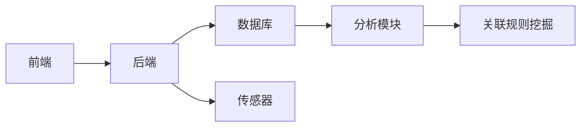

                 


# 全球股市估值与海洋生态修复纳米技术的关联

**关键词：** 全球股市估值，海洋生态修复，纳米技术，股市与环境关联，纳米材料应用

**摘要：** 本文探讨了全球股市估值与海洋生态修复之间的潜在关联，特别是通过纳米技术的应用。文章从背景、核心概念、算法原理、系统设计、项目实战和最佳实践等方面进行了详细分析，揭示了纳米技术在海洋生态修复中的作用及其对股市估值的影响。

---

## 第一部分：背景与概念

### 第1章：全球股市估值概述

#### 1.1 股市估值的基本概念

股市估值是指通过对上市公司的财务数据和市场因素进行分析，确定其股票的合理价值。常用指标包括市盈率（P/E）、市净率（P/B）和股息率等。

- **市盈率（P/E）**：股价与每股收益的比率，反映市场对公司的盈利预期。
- **市净率（P/B）**：股价与每股净资产的比率，适用于评估资产密集型行业。
- **股息率**：每股股息与股价的比率，反映投资回报能力。

股市估值不仅反映了企业的经营状况，还与宏观经济环境密切相关。经济波动、政策变化和全球事件都会影响股市估值。

#### 1.2 海洋生态修复的背景

海洋生态修复是通过技术手段恢复被破坏的海洋生态系统，包括水质改善、生物多样性保护和海岸线修复等方面。

- **水质改善**：去除海水中的污染物，如重金属和塑料。
- **生物多样性保护**：保护濒危物种及其栖息地。
- **海岸线修复**：防止侵蚀，恢复生态平衡。

海洋生态修复不仅关乎环境保护，还涉及经济利益。健康的海洋生态系统能支持渔业、旅游业和航运业，对全球经济有重要影响。

#### 1.3 纳米技术的基本概念

纳米技术是指在纳米尺度（1-100纳米） manipulate matter的科学技术，涉及材料科学、化学、物理和生物等多个领域。

- **纳米材料**：具有优异的物理、化学和生物性能，如高强度、高导电性和高催化活性。
- **纳米传感器**：用于检测环境中的微小变化，如温度、压力和化学物质。
- **纳米药物**：用于疾病诊断和治疗，具有高精度和低副作用。

纳米技术在海洋生态修复中的应用前景广阔，尤其是在水质监测和污染治理方面。

---

### 第2章：纳米技术在海洋生态修复中的应用

#### 2.1 纳米材料在海洋生态修复中的作用

纳米材料在海洋生态修复中具有独特的优势，如高比表面积和表面活性。

- **水质净化**：纳米材料可以吸附污染物，如重金属离子和有机污染物。
- **海洋生物修复**：纳米材料可以促进海洋生物的生长，如珊瑚和贝类。

#### 2.2 纳米技术在海洋监测中的应用

纳米传感器在海洋监测中具有高灵敏度和低成本的特点。

- **环境监测**：实时监测海水的pH值、温度和溶解氧。
- **污染检测**：快速检测水中的有害物质，如石油和塑料。

---

## 第二部分：核心概念与联系

### 第3章：全球股市估值与海洋生态修复的关联机制

#### 3.1 股市估值与经济活动的关系

股市估值受经济活动影响，而海洋生态修复可以促进经济可持续发展。

- **经济影响**：健康的海洋生态系统能支持渔业和旅游业，提升相关企业的业绩。
- **投资影响**：环保技术的投资回报可能影响企业的股价。

#### 3.2 纳米技术对海洋生态修复的推动作用

纳米技术的应用降低了修复成本，提高了修复效率，从而影响相关企业的市场表现。

- **技术创新**：纳米技术的应用可能提升企业的竞争力，推动股价上涨。
- **市场前景**：环保技术的市场需求增加，可能推动相关股票的估值上升。

### 第4章：核心概念的对比分析

#### 4.1 股市估值与海洋生态修复的对比

| 概念         | 股市估值                  | 海洋生态修复               |
|--------------|--------------------------|---------------------------|
| 定义         | 股票的合理价值估算        | 恢复被破坏的海洋生态系统    |
| 目标         | 确定投资价值              | 保护和恢复生态环境          |
| 方法         | 财务指标分析、市场分析    | 技术手段、环境监测          |

#### 4.2 纳米技术与海洋生态修复的对比

| 技术         | 纳米技术                  | 海洋生态修复               |
|--------------|--------------------------|---------------------------|
| 应用领域      | 纳米材料、传感器          | 水质净化、生物修复          |
| 优势         | 高灵敏度、低成本          | 高效、精准                 |

---

## 第三部分：算法原理与数学模型

### 第5章：股市估值与海洋生态修复的关联算法

#### 5.1 算法原理

- **数据收集**：收集股市数据和海洋环境数据。
- **关联规则挖掘**：使用关联规则挖掘算法（如Apriori）发现两者之间的关联。
- **算法实现步骤**：
  1. 数据预处理。
  2. 确定关联规则。
  3. 分析规则对股市估值的影响。

#### 5.2 算法实现

```python
import pandas as pd
from mlxtend.frequent_patterns import apriori

# 数据预处理
data = pd.read_csv('marine_stocks.csv')
data = data.dropna()

# 关联规则挖掘
frequent_itemsets = apriori(data, min_support=0.1, use_colnames=True)

print(frequent_itemsets)
```

#### 5.3 数学模型

股市估值与海洋生态修复的关联可以表示为：

$$ S = \beta_0 + \beta_1 X_{\text{nanotech}} + \beta_2 X_{\text{environment}} + \epsilon $$

其中，$S$ 是股市估值，$X_{\text{nanotech}}$ 是纳米技术应用的指标，$X_{\text{environment}}$ 是环境因素指标，$\epsilon$ 是误差项。

---

## 第四部分：系统分析与架构设计

### 第6章：系统设计

#### 6.1 项目介绍

开发一个基于纳米技术的海洋生态修复监测系统，实时监测海洋环境数据，并分析其对股市估值的影响。

#### 6.2 系统功能设计

- **数据采集**：传感器采集海洋环境数据。
- **数据处理**：清洗和分析数据。
- **关联分析**：挖掘数据中的关联规则。
- **结果展示**：可视化数据和分析结果。

#### 6.3 系统架构设计



---

## 第五部分：项目实战

### 第7章：环境安装与核心代码实现

#### 7.1 环境安装

- 安装Python和相关库（如pandas、mlxtend）。

#### 7.2 核心代码实现

```python
import pandas as pd
from mlxtend.frequent_patterns import apriori

# 读取数据
data = pd.read_csv('marine_stocks.csv')

# 删除缺失值
data = data.dropna()

# 执行关联规则挖掘
frequent_itemsets = apriori(data, min_support=0.1, use_colnames=True)

# 打印结果
print(frequent_itemsets)
```

#### 7.3 实际案例分析

分析某区域的海洋环境数据和相关企业的股市数据，挖掘两者之间的关联规则。

---

## 第六部分：最佳实践

### 第8章：总结与展望

#### 8.1 小结

本文探讨了全球股市估值与海洋生态修复纳米技术的关联，揭示了纳米技术在海洋生态修复中的重要作用及其对股市估值的潜在影响。

#### 8.2 注意事项

- 数据采集的准确性。
- 算法的适用性和可解释性。
- 环境保护与经济发展的平衡。

#### 8.3 未来展望

未来，随着纳米技术的不断发展，其在海洋生态修复中的应用将更加广泛，股市估值与环境技术的关联也将更加紧密。

#### 8.4 拓展阅读

建议阅读相关领域的学术论文和行业报告，深入了解纳米技术在环境保护中的最新进展。

---

**作者：AI天才研究院/AI Genius Institute & 禅与计算机程序设计艺术 /Zen And The Art of Computer Programming**

---

以上是文章的详细内容，涵盖了从背景到系统的各个方面，结合实际案例和代码实现，为读者提供了全面的视角。

