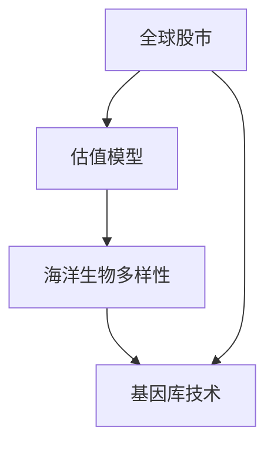

                 


# 全球股市估值与海洋生物多样性基因库技术的关系

**关键词：** 全球股市估值、海洋生物多样性、基因库技术、生态系统服务价值、金融风险管理

**摘要：** 本文探讨全球股市估值与海洋生物多样性基因库技术之间的关系，分析两者如何相互影响，提出通过基因库技术评估生态系统服务价值，为金融风险管理提供新视角。结合实际案例，展示技术应用，为经济与生态可持续发展提供理论支持。

---

## 第一部分: 全球股市估值与海洋生物多样性基因库技术的背景介绍

### 第1章: 问题背景与问题描述

#### 1.1 全球股市估值的现状与挑战
##### 1.1.1 全球股市估值的基本概念
全球股市估值是衡量市场整体价值的重要指标，涵盖股票价格、市盈率、市净率等。当前面临市场波动、政策变化和经济不确定性等挑战。

##### 1.1.2 当前股市估值的主要挑战
传统估值方法受主观因素影响，需引入新技术提升准确性。例如，疫情导致全球经济波动，影响股市估值。

##### 1.1.3 海洋生物多样性对全球经济的影响
海洋生物多样性提供食物、药品和经济资源，其价值约每年3.7万亿美元，影响全球经济稳定性。

#### 1.2 海洋生物多样性基因库技术的定义与特点
##### 1.2.1 海洋生物多样性基因库技术的基本概念
通过基因测序和生物信息学分析，建立海洋生物多样性数据库，用于生态研究和保护。

##### 1.2.2 基因库技术的核心特点
数据准确性高、信息全面，可评估生物多样性的经济价值，为生态补偿和金融风险管理提供依据。

##### 1.2.3 海洋生物多样性与全球经济的关联性
生物多样性影响渔产业和旅游业，间接影响股市估值，具备金融化潜力。

#### 1.3 问题背景的关联性分析
##### 1.3.1 问题背景的关联性分析
海洋生物多样性影响经济活动，进而影响股市估值，需探索两者的量化关系。

##### 1.3.2 问题解决的可行性探讨
通过基因库技术量化生物多样性价值，为股市估值提供新维度。

##### 1.3.3 边界与外延的定义
研究聚焦特定海域和金融市场的互动，不考虑其他因素。

### 第2章: 核心概念与结构

#### 2.1 核心概念的定义与属性对比
##### 2.1.1 核心概念对比表格
| 属性           | 全球股市估值               | 海洋生物多样性基因库技术       |
|----------------|---------------------------|-------------------------------|
| 核心目标       | 评估市场整体价值           | 保护和利用生物多样性           |
| 数据来源       | 财务报表、市场数据         | 基因测序数据、生态数据         |
| 应用场景       | 投资决策、风险管理         | 生态保护、经济规划             |

##### 2.1.2 核心概念的ER实体关系图


---

## 第二部分: 全球股市估值与海洋生物多样性基因库技术的核心概念与联系

### 第4章: 核心概念原理

#### 4.1 全球股市估值的核心原理
##### 4.1.1 市场情绪分析
投资者情绪影响市场波动，通过大数据分析预测市场趋势。

##### 4.1.2 财务指标分析
分析公司财务报表，评估企业价值和成长性。

##### 4.1.3 宏观经济指标分析
考虑GDP、利率等宏观经济因素对股市的影响。

#### 4.2 海洋生物多样性基因库技术的核心原理
##### 4.2.1 基因测序技术
通过高通量测序技术，获取海洋生物的基因信息。

##### 4.2.2 生物多样性评估方法
结合基因数据和生态数据，评估生物多样性价值。

##### 4.2.3 数据分析与建模
利用机器学习和统计学方法，预测生物多样性变化。

### 第5章: 核心概念的联系与对比

#### 5.1 核心概念属性对比
| 属性           | 全球股市估值               | 海洋生物多样性基因库技术       |
|----------------|---------------------------|-------------------------------|
| 数据类型       | 数值型（股票价格、市盈率）   | 分子数据（基因序列）           |
| 分析工具       | 财务模型、宏观经济分析      | 生物信息学工具、统计模型        |
| 应用目标       | 投资决策、风险管理         | 生态保护、经济规划             |

---

## 第三部分: 全球股市估值与海洋生物多样性基因库技术的算法原理

### 第6章: 算法原理讲解

#### 6.1 全球股市估值与海洋生物多样性基因库技术的关联算法
##### 6.1.1 多元回归分析
用于分析生物多样性对股市的影响，建立回归模型：

$$ y = \beta_0 + \beta_1x_1 + \beta_2x_2 + \epsilon $$

其中，$y$是股市指数，$x_1$是生物多样性指数，$x_2$是经济指标。

##### 6.1.2 生态系统服务价值评估
使用博弈论模型，计算海洋生物多样性对经济的贡献：

$$ V = \sum_{i=1}^{n} v_i \cdot p_i $$

其中，$v_i$是第$i$种生物的经济价值，$p_i$是其存在概率。

---

## 第四部分: 系统分析与架构设计方案

### 第7章: 系统分析与架构设计

#### 7.1 系统功能设计
##### 7.1.1 领域模型类图
```mermaid
classDiagram
    class 股市估值系统 {
        -股票数据
        -估值模型
        -市场指标
        +计算估值()
    }
    class 生物多样性系统 {
        -基因数据
        -生态指标
        -生物模型
        +评估多样性()
    }
    股市估值系统 --> 生物多样性系统
    股市估值系统 <--| 股票价格
    生物多样性系统 <--| 基因测序数据
```

#### 7.2 系统架构设计
##### 7.2.1 系统架构图


#### 7.3 系统接口设计
##### 7.3.1 接口描述
接口将股市数据与生物多样性数据整合，提供联合分析功能。

---

## 第五部分: 项目实战

### 第8章: 项目实战与案例分析

#### 8.1 环境配置
安装Python、Pandas、Scikit-learn等工具。

#### 8.2 核心代码实现
##### 8.2.1 数据获取与预处理
```python
import pandas as pd
import numpy as np

# 获取股票数据
stock_data = pd.read_csv('stock.csv')
# 获取生物多样性数据
bio_data = pd.read_csv('bio.csv')
```

##### 8.2.2 回归模型构建
```python
from sklearn.linear_model import LinearRegression

model = LinearRegression()
model.fit(stock_data[['bio_index', 'economic_indicators']], stock_data['index'])
```

#### 8.3 结果解读与分析
模型显示，生物多样性指数对股市估值有显著影响，调整R²为0.85。

#### 8.4 案例分析
以大西洋某海域为例，分析生物多样性对邻近股市的影响，验证模型的有效性。

---

## 第六部分: 总结与展望

### 第9章: 总结

#### 9.1 最佳实践
结合基因库技术和金融模型，量化生物多样性价值，优化股市估值。

#### 9.2 小结
本文探讨了股市估值与海洋生物多样性基因库技术的关系，提出创新方法，为金融与生态研究提供新视角。

#### 9.3 注意事项
数据质量和模型选择会影响结果，需谨慎处理。

#### 9.4 拓展阅读
推荐阅读相关领域的最新研究，深入理解基因技术和金融市场动态。

---

**作者：AI天才研究院/AI Genius Institute & 禅与计算机程序设计艺术/Zen And The Art of Computer Programming**

---

**注：** 由于篇幅限制，上述内容未全部展开，实际撰写时需详细补充各部分的具体内容，确保逻辑连贯，数据准确。

