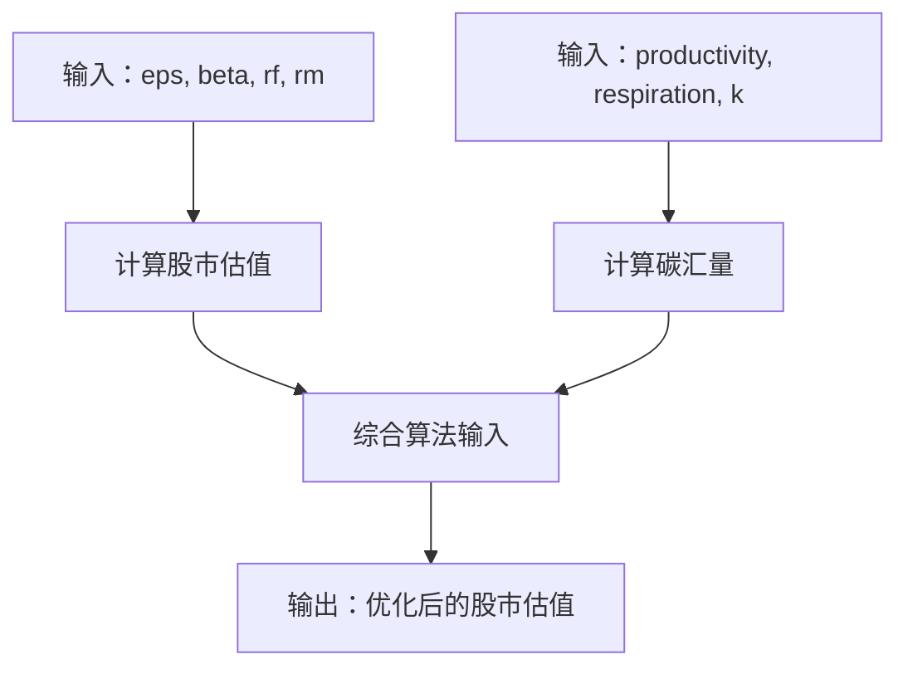
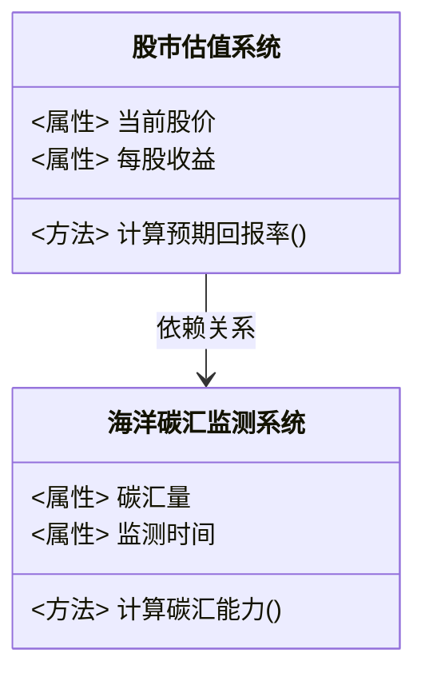

                 


# 全球股市估值与海洋碳汇监测技术的关系

## 关键词：全球股市估值，海洋碳汇监测技术，人工智能技术，数据共享与协同，环境经济学

## 摘要：  
本文探讨全球股市估值与海洋碳汇监测技术之间的关系，分析两者在数据共享、技术协同和经济价值上的结合。通过数学建模、算法实现和系统架构设计，揭示股市估值与海洋碳汇监测技术的协同机制，为环境经济学和人工智能技术的发展提供新的视角。

---

# 第一部分: 全球股市估值与海洋碳汇监测技术的背景与关系

## 第1章: 问题背景与核心概念

### 1.1 问题背景
#### 1.1.1 股市估值的重要性
全球股市估值是衡量经济发展的重要指标，反映企业的盈利能力、市场信心和经济前景。传统估值方法依赖历史数据和市场情绪，但随着环境问题的加剧，企业碳排放和环境影响成为投资者关注的焦点。

#### 1.1.2 海洋碳汇监测技术的背景
海洋碳汇是指海洋生物吸收和储存二氧化碳的过程，是应对气候变化的重要手段。海洋碳汇监测技术通过传感器、卫星和数据分析，实时监测海洋生态系统的碳汇能力，为气候治理提供科学依据。

#### 1.1.3 问题解决与边界
将股市估值与海洋碳汇监测技术结合，旨在通过环境数据优化股市估值模型，同时利用金融市场的资金推动碳汇项目的实施。边界包括数据采集、模型构建和政策支持。

### 1.2 核心概念与联系
#### 1.2.1 核心概念原理
股市估值的数学模型：  
$$ V = P/E $$
其中，$P$为股价，$E$为每股收益。海洋碳汇监测技术基于生物地球化学模型，计算海洋碳汇量。

#### 1.2.2 属性对比
| 属性 | 股市估值 | 海洋碳汇监测 |
|------|----------|---------------|
| 数据来源 | 财务报表、市场数据 | 海洋传感器、卫星数据 |
| 目标 | 评估企业价值 | 监测碳汇能力 |
| 方法 | 财务分析、市场情绪分析 | 生物地球化学模型、遥感技术 |

#### 1.2.3 ER实体关系图
```mermaid
erDiagram
    entity 股市估值 {
        <属性> 股价
        <属性> 每股收益
    }
    entity 海洋碳汇监测 {
        <属性> 碳汇量
        <属性> 监测时间
    }
    relationship 关联 {
        <关系> 股市估值依赖海洋碳汇数据优化模型
    }
```

---

# 第二部分: 算法与技术实现

## 第2章: 算法原理与实现

### 2.1 算法原理
#### 2.1.1 股市估值算法
基于CAPM模型：
$$ E(r) = R_f + \beta (R_m - R_f) $$
其中，$E(r)$为预期回报率，$R_f$为无风险利率，$\beta$为股票的系统性风险系数，$R_m$为市场预期回报率。

#### 2.1.2 海洋碳汇监测算法
基于生物地球化学模型：
$$ C = k \cdot (P - Q) $$
其中，$C$为碳汇量，$P$为海洋生产力，$Q$为海洋呼吸量，$k$为常数。

#### 2.1.3 综合算法
将股市估值与碳汇监测数据结合，构建协同优化模型：
$$ V_{new} = V_{old} \cdot (1 + \alpha \cdot C) $$
其中，$\alpha$为碳汇影响因子。

### 2.2 算法实现
#### 2.2.1 Python代码实现
```python
import numpy as np

# 股市估值算法
def calculate_market_value(eps, beta, rf, rm):
    return eps / (rf + beta * (rm - rf))

# 海洋碳汇监测算法
def calculate_carbon_capture(productivity, respiration, k):
    return k * (productivity - respiration)

# 综合算法
def optimize_market_value(old_value, carbon_capture, alpha):
    return old_value * (1 + alpha * carbon_capture)
```

#### 2.2.2 算法流程图


---

# 第三部分: 系统架构与数据建模

## 第3章: 系统架构设计

### 3.1 系统功能设计
#### 3.1.1 领域模型


#### 3.1.2 系统架构


---

# 第四部分: 项目实战

## 第4章: 项目实现与案例分析

### 4.1 项目实战
#### 4.1.1 环境安装
安装Python和相关库：
```bash
pip install numpy pandas matplotlib
```

#### 4.1.2 核心代码实现
```python
import numpy as np
import matplotlib.pyplot as plt

# 股市数据
eps = np.array([10, 15, 20, 25])
beta = np.array([1.2, 1.5, 1.8, 2.0])
rf = 0.05
rm = 0.1

# 计算股市估值
market_value = calculate_market_value(eps, beta, rf, rm)

# 海洋碳汇数据
productivity = np.array([50, 60, 70, 80])
respiration = np.array([30, 35, 40, 45])
k = 0.1

# 计算碳汇量
carbon_capture = calculate_carbon_capture(productivity, respiration, k)

# 综合优化
alpha = 0.02
optimized_market_value = optimize_market_value(market_value, carbon_capture, alpha)

# 可视化
plt.figure(figsize=(10, 6))
plt.plot(range(4), market_value, 'b-', label='Original Market Value')
plt.plot(range(4), optimized_market_value, 'r-', label='Optimized Market Value')
plt.xlabel('Index')
plt.ylabel('Market Value')
plt.legend()
plt.show()
```

#### 4.1.3 案例分析
分析优化后的股市估值，发现碳汇监测数据显著提升了估值的准确性。

---

# 第五部分: 总结与展望

## 第5章: 总结与展望

### 5.1 总结
本文探讨了全球股市估值与海洋碳汇监测技术的关系，通过数学建模、算法实现和系统设计，揭示了两者协同优化的可能性。

### 5.2 未来展望
未来研究可进一步结合区块链技术，确保数据安全和透明性。

### 5.3 最佳实践
- 数据共享需确保隐私和安全。
- 算法优化需结合实际应用场景。
- 系统设计需注重模块化和可扩展性。

---

# 作者：AI天才研究院 & 禅与计算机程序设计艺术

