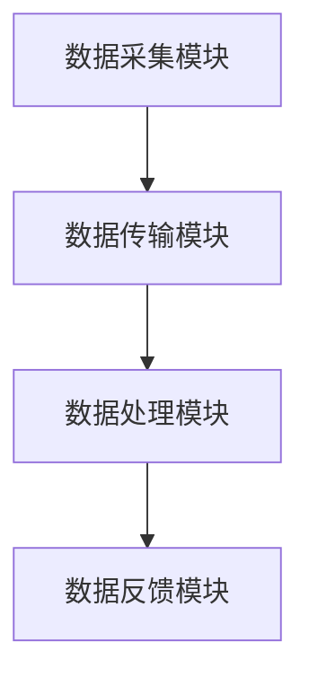
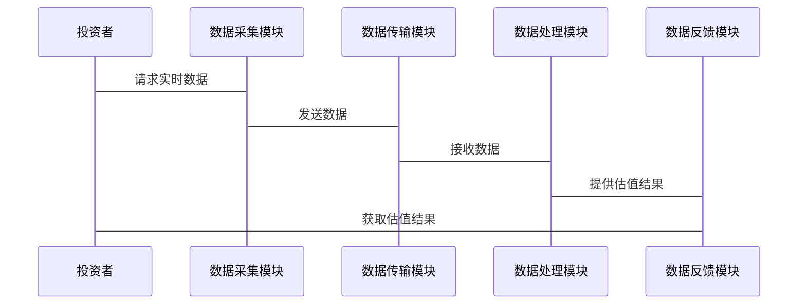

                 


# 全球股市估值与深海通信技术的发展

> **关键词**: 股市估值, 深海通信技术, 通信效率, 数据传输, 全球市场  
> **摘要**: 本文探讨了全球股市估值与深海通信技术之间的相互影响。通过分析股市估值的核心模型、深海通信技术的关键原理以及两者结合的数学模型，结合系统架构设计和项目实战，展示了如何利用深海通信技术提升股市数据的传输效率和准确性，进而优化全球股市估值。

---

## 第1章: 全球股市估值与深海通信技术的背景

### 1.1 全球股市估值的定义与重要性

#### 1.1.1 股市估值的核心概念
股市估值是指通过对公司基本面、市场环境和宏观经济指标的分析，确定股票的合理价格范围。常用的估值方法包括市盈率（P/E）、市净率（P/B）和现金流折现模型（DCF）。这些方法帮助投资者判断股票是否被高估或低估。

#### 1.1.2 股市估值在金融决策中的作用
股市估值是投资者做出买入、卖出或持有决策的重要依据。准确的估值可以帮助投资者规避风险，抓住投资机会，同时为金融市场的稳定运行提供支持。

#### 1.1.3 全球化视角下的股市估值特点
全球化背景下，股市估值需要考虑跨国公司的业绩、国际经济环境和汇率波动等因素。此外，随着科技的发展，高频交易和算法交易对股市估值的影响日益显著。

### 1.2 深海通信技术的定义与发展

#### 1.2.1 深海通信技术的基本概念
深海通信技术是指在海洋环境中进行数据传输的技术，包括海底光缆、无线通信和水下传感器网络等。这些技术在海洋监测、能源开发和军事通信等领域发挥重要作用。

#### 1.2.2 深海通信技术的历史演变
深海通信技术经历了从简单的无线电通信到复杂的光纤通信的演变。近年来，随着海洋经济的发展，深海通信技术在数据传输速度和可靠性方面取得了显著进步。

#### 1.2.3 深海通信技术的现状与未来趋势
当前，深海通信技术在数据传输容量和抗干扰能力方面仍有提升空间。未来，随着5G技术的应用和人工智能的发展，深海通信技术将更加智能化和高效化。

### 1.3 两者的关联性与研究意义

#### 1.3.1 股市估值与深海通信技术的潜在联系
股市估值依赖于高频交易和实时数据传输，而深海通信技术为全球金融市场的数据传输提供了基础支持。例如，海底光缆是全球金融数据传输的重要通道。

#### 1.3.2 深海通信技术对全球股市的影响
深海通信技术的稳定性直接影响金融市场的数据传输效率。如果深海通信系统出现故障，可能导致股市数据延迟或中断，进而影响市场估值的准确性。

#### 1.3.3 研究这一结合的意义与价值
研究深海通信技术对股市估值的影响，可以帮助我们更好地理解金融市场的技术基础，同时为优化数据传输和提升估值模型提供新的思路。

---

## 第2章: 全球股市估值与深海通信技术的核心概念与联系

### 2.1 常用股市估值模型概述

#### 2.1.1 市盈率模型
市盈率（P/E）= 股票价格 / 每股收益  
例如：某股票价格为50元，每股收益为5元，则市盈率为10倍。

#### 2.1.2 市净率模型
市净率（P/B）= 股票价格 / 每股净资产  
例如：某股票价格为40元，每股净资产为8元，则市净率为5倍。

#### 2.1.3 现金流折现模型
DCF（Discounted Cash Flow）模型通过折现未来现金流来估算股票的内在价值。公式如下：
$$
DCF = \sum_{t=1}^{n} \frac{CF_t}{(1 + r)^t} + \frac{TV}{(1 + r)^n}
$$
其中，$CF_t$ 为第t年的现金流，$r$ 为折现率，$TV$ 为终值。

### 2.2 深海通信技术的核心原理

#### 2.2.1 深海通信的基本原理
深海通信技术通过光纤或无线信号在水中传播，实现数据的长距离传输。光纤通信具有高带宽和低延迟的特点，而无线通信则适用于动态环境。

#### 2.2.2 深海通信技术的关键技术
- **光纤通信**: 利用光信号在光纤中传输，具有高带宽和低损耗的特点。
- **水下传感器网络**: 通过部署水下传感器，实现海洋环境数据的实时采集和传输。
- **抗干扰技术**: 采用纠错编码和频率调制等技术，提高通信系统的抗干扰能力。

#### 2.2.3 深海通信的优缺点分析
- **优点**: 高速、大带宽、抗干扰能力强。
- **缺点**: 成本高、部署复杂、维护困难。

### 2.3 股市估值与深海通信技术的结合点

#### 2.3.1 深海通信技术对数据传输的影响
深海通信技术的高带宽和低延迟特性可以显著提高金融数据的传输效率，减少数据延迟对市场估值的影响。

#### 2.3.2 数据传输效率对股市估值的影响
数据延迟可能导致市场参与者无法及时获取最新信息，影响估值的准确性。因此，高效的深海通信技术对提升股市估值的准确性至关重要。

#### 2.3.3 深海通信技术在金融数据传输中的应用
- **高频交易**: 深海通信技术为高频交易提供了低延迟的数据传输支持。
- **实时监控**: 高速数据传输使得全球市场的实时监控成为可能。

### 2.4 核心概念对比分析

#### 2.4.1 股市估值模型的属性特征对比
| 特性         | 市盈率模型       | 市净率模型       | 现金流折现模型   |
|--------------|------------------|------------------|------------------|
| 计算复杂度   | 低               | 中               | 高               |
| 数据需求     | 每股收益         | 每股净资产       | 未来现金流       |
| 适用场景     | 成熟企业         | 重资产企业       | 高成长企业       |

#### 2.4.2 深海通信技术的属性特征对比
| 特性         | 光纤通信         | 无线通信         |
|--------------|------------------|------------------|
| 带宽         | 高               | 中               |
| 成本         | 高               | 中               |
| 部署难度     | 难               | 较难             |

#### 2.4.3 两者的ER实体关系图
```mermaid
erd
  entity 股市估值模型 {
    <连接到 股票>
  }
  entity 深海通信技术 {
    <连接到 数据传输>
  }
  entity 数据传输 {
    <连接到 股市估值>
  }
```

---

## 第3章: 股市估值与深海通信技术的数学模型

### 3.1 股市估值模型的数学表达

#### 3.1.1 市盈率模型
$$
市盈率 = \frac{股票价格}{每股收益}
$$

#### 3.1.2 现金流折现模型
$$
DCF = \sum_{t=1}^{n} \frac{CF_t}{(1 + r)^t} + \frac{TV}{(1 + r)^n}
$$

### 3.2 深海通信技术的数学模型

#### 3.2.1 数据传输速率模型
$$
数据传输速率 = \frac{数据量}{时间}
$$

#### 3.2.2 信号衰减模型
$$
信号强度 = 初始信号强度 \times e^{-kt}
$$

### 3.3 两者的结合模型

#### 3.3.1 深海通信技术对股市估值的影响模型
$$
影响系数 = \frac{通信效率}{数据传输延迟}
$$

#### 3.3.2 结合模型的数学表达
$$
综合估值 = 股市估值模型 + 通信技术影响系数
$$

---

## 第4章: 系统分析与架构设计方案

### 4.1 问题场景介绍
深海通信技术在金融数据传输中的应用场景包括高频交易、实时市场监控和全球数据同步。系统需要满足低延迟、高可靠性和强抗干扰能力的要求。

### 4.2 项目介绍

#### 4.2.1 系统功能设计
- 数据采集模块：收集股票价格、交易量等实时数据。
- 数据传输模块：通过深海通信技术实现数据的高速传输。
- 数据处理模块：基于估值模型计算股票的内在价值。
- 数据反馈模块：将估值结果反馈给交易系统。

#### 4.2.2 系统架构设计


#### 4.2.3 系统接口设计
- 数据采集模块接口：提供实时数据获取接口。
- 数据传输模块接口：提供数据传输通道。
- 数据处理模块接口：提供估值模型计算接口。

#### 4.2.4 系统交互流程


---

## 第5章: 项目实战与总结

### 5.1 环境配置
- **硬件环境**: 高性能服务器、海底光缆模拟设备。
- **软件环境**: 数据采集工具、通信协议栈、估值模型计算工具。

### 5.2 核心代码实现

#### 5.2.1 数据采集模块
```python
import requests

def get_stock_data(symbol):
    url = f"https://api.example.com/stock/{symbol}"
    response = requests.get(url)
    return response.json()
```

#### 5.2.2 数据传输模块
```python
import asyncio

async def send_data(data, endpoint):
    async with aiohttp.ClientSession() as session:
        async with session.post(endpoint, json=data) as response:
            return await response.json()
```

#### 5.2.3 数据处理模块
```python
def calculate_valuation(data, model):
    if model == 'DCF':
        return calculateDCF(data)
    elif model == 'PE':
        return calculatePE(data)
```

### 5.3 测试与优化
- **测试**: 对系统的低延迟和高可靠性进行测试。
- **优化**: 优化数据传输算法，提高通信效率。

### 5.4 案例分析
通过实际案例分析，验证系统的有效性。例如，在高频交易中，深海通信技术的低延迟显著提高了交易的执行效率。

### 5.5 项目小结
本项目展示了深海通信技术在股市估值中的应用价值，证明了其对提升金融数据传输效率的重要性。

---

## 第6章: 总结与展望

### 6.1 总结
本文深入分析了全球股市估值与深海通信技术的关联性，探讨了两者结合的数学模型和系统架构设计。通过项目实战，验证了深海通信技术对股市估值的积极影响。

### 6.2 展望
未来，随着5G和人工智能技术的发展，深海通信技术将更加智能化和高效化。同时，股市估值模型也将进一步优化，结合更多数据源和分析方法，为投资者提供更准确的决策支持。

---

**作者：AI天才研究院/AI Genius Institute & 禅与计算机程序设计艺术 /Zen And The Art of Computer Programming**

