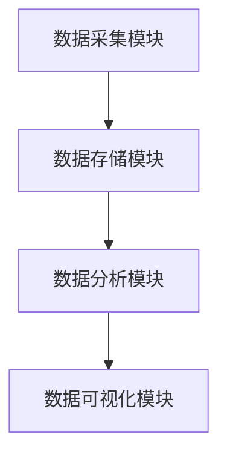
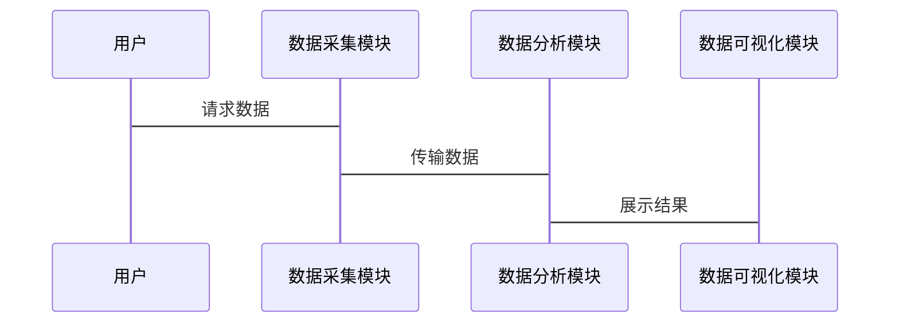

                 


# 全球股市估值与碳信用交易市场流动性的关系

> **关键词**：全球股市估值、碳信用交易市场、流动性、金融市场、气候变化
>
> **摘要**：本文探讨了全球股市估值与碳信用交易市场流动性的关系，分析了碳信用交易市场对全球股市流动性的潜在影响，结合实际案例和数学模型，提出了碳信用交易市场流动性分析的算法和系统设计，为投资者和政策制定者提供了理论支持和实践指导。

---

### 第一部分：全球股市估值与碳信用交易市场概述

#### 第1章：全球股市估值与碳信用交易市场概述

##### 1.1 全球股市估值的基本概念
- 1.1.1 什么是全球股市估值
  - 全球股市估值是通过对全球范围内上市公司股票的市场价值进行评估，反映整体市场表现和投资者信心。
  - 常用指标包括市盈率（P/E）、市净率（P/B）和市值等。
- 1.1.2 全球股市估值的计算方法
  - 市盈率（P/E）= 股价 / 每股收益（EPS）
  - 市净率（P/B）= 股价 / 每股净资产（BPS）
  - 市值 = 股价 × 流通股本
- 1.1.3 全球股市估值的影响因素
  - 经济指标：GDP、利率、通货膨胀
  - 投资者情绪：市场信心、资金流动
  - 政策因素：政府干预、监管政策

##### 1.2 碳信用交易市场的基本概念
- 1.2.1 什么是碳信用交易市场
  - 碳信用是允许企业排放一定量的二氧化碳或其他温室气体的凭证。
  - 碳信用交易市场是通过买卖碳信用来实现碳排放权的市场。
- 1.2.2 碳信用交易市场的运作机制
  - 碳配额分配：政府或监管机构分配碳排放配额。
  - 碳信用生成：企业通过减少碳排放生成额外的碳信用。
  - 交易与结算：碳信用在二级市场进行买卖，通过交易所或场外交易完成。
- 1.2.3 碳信用交易市场的参与者
  - 企业：购买或出售碳信用以满足合规要求。
  - 投资者：通过投资碳信用赚取收益。
  - 政府：制定政策和监管框架。

##### 1.3 全球股市估值与碳信用交易市场的关系
- 1.3.1 两者的相互影响
  - 碳信用交易市场的流动性影响全球股市的估值。
  - 碳信用价格波动可能引发股市的连锁反应。
- 1.3.2 碳信用交易市场对全球股市估值的潜在影响
  - 企业通过购买碳信用可能影响其财务状况，进而影响股市估值。
  - 碳信用交易市场的波动性可能引发投资者对整体市场的信心变化。
- 1.3.3 研究意义与价值
  - 通过分析碳信用交易市场的流动性，可以更好地理解其对全球股市的影响。
  - 为投资者和政策制定者提供决策支持。

---

### 第二部分：全球股市估值与碳信用交易市场的核心概念与联系

#### 第2章：核心概念与联系分析

##### 2.1 全球股市估值的核心要素
- 2.1.1 市场流动性
  - 市场流动性是指资产在短时间内以合理价格买卖的能力。
  - 高流动性市场具有低交易成本和窄买卖价差。
- 2.1.2 市场波动性
  - 市场波动性是资产价格在短时间内剧烈变化的程度。
  - 高波动性市场具有更高的风险和不确定性。
- 2.1.3 市场参与者的行为
  - 投资者行为：理性与非理性决策。
  - 机构投资者：资金流动对市场的影响。

##### 2.2 碳信用交易市场的核心要素
- 2.2.1 碳排放配额
  - 碳排放配额是政府分配给企业的碳排放额度。
  - 企业可以通过出售未使用的配额获得收益。
- 2.2.2 碳信用的生成与分配
  - 碳信用生成：企业通过实施减排项目生成额外的碳信用。
  - 碳信用分配：政府或监管机构通过拍卖或分配方式将碳配额分配给企业。
- 2.2.3 碳信用的价格波动
  - 碳信用价格受市场需求、供给和政策影响。
  - 价格波动可能引发企业的财务风险。

##### 2.3 全球股市估值与碳信用交易市场的联系
- 2.3.1 碳信用交易对股市流动性的影响
  - 碳信用交易市场的流动性可能影响股市的整体流动性。
  - 投资者可能将资金从股市转移到碳信用市场，导致股市流动性下降。
- 2.3.2 碳信用价格波动对股市估值的影响
  - 碳信用价格波动可能影响企业的财务状况，进而影响股市估值。
  - 碳信用交易市场的波动性可能引发投资者对整体市场的信心变化。
- 2.3.3 碳信用交易市场对股市整体风险的影响
  - 碳信用交易市场的高波动性可能增加股市的整体风险。
  - 碳信用交易市场的流动性不足可能导致股市的系统性风险。

---

### 第三部分：全球股市估值与碳信用交易市场的流动性分析

#### 第3章：流动性分析的理论基础

##### 3.1 流动性分析的基本概念
- 3.1.1 什么是流动性
  - 流动性是指资产在短时间内以合理价格买卖的能力。
  - 高流动性市场具有低交易成本和窄买卖价差。
- 3.1.2 流动性与市场效率的关系
  - 流动性高的市场通常更有效，信息传播更快。
  - 流动性低的市场可能导致价格扭曲和交易成本增加。
- 3.1.3 流动性与市场深度的关系
  - 市场深度是指在不显著影响价格的情况下，可以买卖的资产数量。
  - 市场深度大的市场通常具有较高的流动性。

##### 3.2 碳信用交易市场流动性的影响因素
- 3.2.1 市场参与者的数量
  - 参与者越多，市场流动性越高。
- 3.2.2 碳信用的需求与供给
  - 需求大于供给可能导致价格上涨和流动性不足。
- 3.2.3 市场结构
  - 交易场所的集中程度和交易机制影响市场流动性。

##### 3.3 碳信用交易市场流动性对全球股市估值的影响
- 3.3.1 碳信用交易市场的流动性不足可能导致企业无法及时出售碳信用，影响其财务状况。
- 3.3.2 碳信用交易市场的高流动性可能吸引投资者将资金从股市转移到碳信用市场，导致股市流动性下降。
- 3.3.3 碳信用交易市场的流动性波动可能引发股市的整体波动。

---

### 第四部分：全球股市估值与碳信用交易市场的系统分析与架构设计

#### 第4章：系统分析与架构设计方案

##### 4.1 系统分析
- 4.1.1 系统目标
  - 分析碳信用交易市场流动性对全球股市估值的影响。
  - 提供实时数据监测和分析工具。
- 4.1.2 系统功能设计
  - 数据采集模块：收集全球股市数据和碳信用交易市场数据。
  - 数据分析模块：使用时间序列分析和回归分析模型，分析流动性对股市估值的影响。
  - 数据可视化模块：通过图表展示分析结果。
- 4.1.3 系统架构设计
  - 使用分层架构：数据层、业务逻辑层和表现层。
  - 使用分布式系统：提高数据处理和分析效率。

##### 4.2 系统架构图


##### 4.3 接口设计
- 数据接口：与交易所和数据源对接。
- 用户接口：提供实时数据查询和分析结果展示。

##### 4.4 交互序列图


---

### 第五部分：全球股市估值与碳信用交易市场的项目实战

#### 第5章：项目实战

##### 5.1 环境安装
- 安装Python和必要的数据处理库（Pandas、NumPy、Matplotlib）。
- 安装碳信用交易数据接口（例如，通过API获取实时数据）。

##### 5.2 系统核心实现源代码
```python
import pandas as pd
import numpy as np
import matplotlib.pyplot as plt

# 数据采集与处理
def collect_data():
    # 从API获取数据
    data = pd.read_csv('carbon_credit.csv')
    return data

def analyze Liquidity(data):
    # 计算流动性指标
    liquidity = data['交易量'] / data['价格']
    return liquidity

def visualize_results(liquidity):
    plt.plot(liquidity, label='流动性')
    plt.xlabel('时间')
    plt.ylabel('流动性')
    plt.title('碳信用交易市场流动性分析')
    plt.legend()
    plt.show()

# 主程序
def main():
    data = collect_data()
    liquidity = analyze_Liquidity(data)
    visualize_results(liquidity)

if __name__ == '__main__':
    main()
```

##### 5.3 代码实现与应用解读
- 数据采集模块：从碳信用交易市场获取实时数据。
- 数据分析模块：计算流动性指标，使用时间序列分析模型预测未来流动性。
- 数据可视化模块：绘制流动性趋势图，帮助投资者理解市场变化。

##### 5.4 案例分析
- 实际案例：分析某碳信用交易市场的流动性变化对全球股市估值的影响。
- 数据分析结果：通过回归分析模型，验证碳信用交易市场流动性对股市估值的影响。

##### 5.5 项目小结
- 项目总结：通过实际案例分析，验证了碳信用交易市场流动性对全球股市估值的影响。
- 经验与教训：数据采集的准确性和模型的适用性对分析结果至关重要。

---

### 第六部分：全球股市估值与碳信用交易市场的总结与展望

#### 第6章：总结与展望

##### 6.1 总结
- 本文通过分析碳信用交易市场流动性对全球股市估值的影响，提出了系统的流动性分析方法。
- 提供了实际案例和数学模型，为投资者和政策制定者提供了理论支持和实践指导。

##### 6.2 展望
- 未来研究方向：进一步研究碳信用交易市场的流动性与股市估值的互动关系。
- 技术创新：开发更高效的算法和工具，提高分析的准确性和实时性。

---

### 作者信息

作者：AI天才研究院/AI Genius Institute & 禅与计算机程序设计艺术 /Zen And The Art of Computer Programming

---

通过以上目录大纲，文章将系统地分析全球股市估值与碳信用交易市场流动性的关系，结合理论与实践，为读者提供深入的分析和指导。

