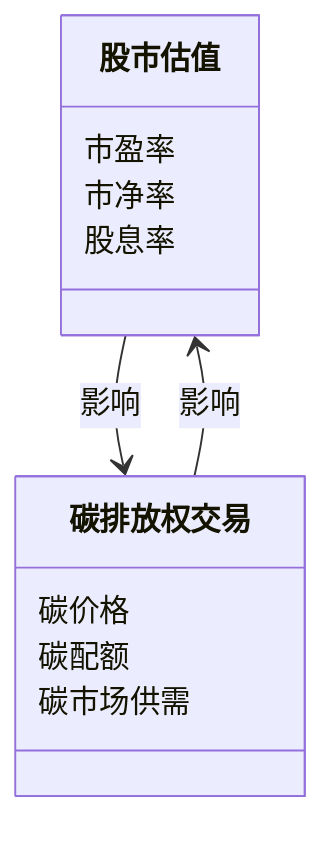
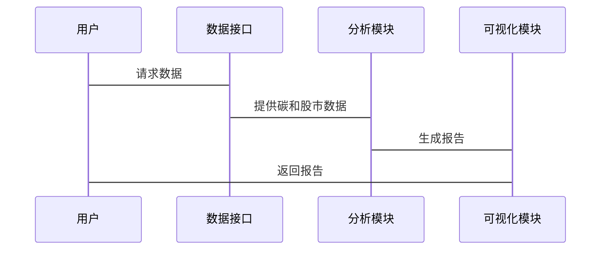

                 


# 全球股市估值与碳排放权交易市场的关系

> 关键词：全球股市估值、碳排放权交易、碳市场、股市影响、碳价格、投资分析

> 摘要：本文探讨全球股市估值与碳排放权交易市场的相互关系，分析碳排放权交易对股市估值的影响机制，构建数学模型，并通过实证分析验证其对投资决策的影响。

---

# 第一部分: 全球股市估值与碳排放权交易市场概述

## 第1章: 背景介绍

### 1.1 问题背景

#### 1.1.1 全球股市估值的重要性
- 股市估值是衡量企业价值的重要指标，影响投资者决策和市场稳定性。
- 全球股市总市值反映了经济健康状况，是全球经济的晴雨表。

#### 1.1.2 碳排放权交易市场的兴起
- 碳排放权交易是应对气候变化的关键工具，通过市场机制降低碳排放成本。
- 全球碳市场规模迅速增长，成为影响企业财务的重要因素。

#### 1.1.3 研究意义
- 分析碳排放权交易对股市的影响，有助于投资者优化决策。
- 为政策制定者提供参考，推动更有效的碳减排策略。

### 1.2 核心概念

#### 1.2.1 全球股市估值
- 定义：股市估值是基于企业财务状况和市场预期，评估其股票价值。
- 主要指标：市盈率（P/E）、市净率（P/B）、股息率（Dividend Yield）。
- 影响因素：宏观经济、企业盈利、市场情绪。

#### 1.2.2 碳排放权交易市场
- 定义：通过配额分配和交易，确定碳排放成本的市场机制。
- 核心机制：政府或机构分配碳配额，企业可买卖配额以满足减排目标。
- 监管框架：各国法规差异影响市场效率。

#### 1.2.3 两者关系
- 碳排放权交易影响企业成本，进而影响股市估值。
- 碳价格波动传导至股市，影响投资者行为。

---

## 第2章: 碳排放权交易市场的机制

### 2.1 碳排放权交易的基本原理

#### 2.1.1 碳配额的分配与管理
- 配额分配：基于企业历史排放或行业标准分配。
- 配额管理：企业需在规定时间内使用配额或通过交易满足需求。

#### 2.1.2 碳配额的交易方式
- 现货交易：即时买卖配额。
- 期货交易：基于未来价格的合约交易。
- 其他衍生品：期权、掉期等。

#### 2.1.3 碳市场的监管框架
- 监管机构：各国政府或国际组织。
- 监管措施：监测、报告、核查（MRV）机制，确保交易透明。

### 2.2 碳排放权交易的经济学分析

#### 2.2.1 碳价格的形成机制
- 供给与需求：市场供需决定碳价格。
- 政策影响：政府政策如配额分配影响价格波动。

#### 2.2.2 碳市场的供需关系
- 需求：企业为合规购买配额。
- 供给：政府分配或市场供给。

#### 2.2.3 碳市场的有效性与效率
- 市场效率：价格反映真实供需。
- 市场失灵：信息不对称、外部性问题。

---

## 第3章: 全球股市估值的影响因素

### 3.1 股市估值的主要指标

#### 3.1.1 市盈率（P/E）
- 定义：股价与每股收益的比率。
- 解释：低P/E可能代表低估，高P/E可能代表高增长预期。

#### 3.1.2 市净率（P/B）
- 定义：股价与每股净资产的比率。
- 解释：反映资产价值，低P/B可能代表低估。

#### 3.1.3 股息率
- 定义：股息与股价的比率。
- 解释：高股息率可能代表稳定的收益。

### 3.2 影响股市估值的主要因素

#### 3.2.1 宏观经济因素
- 利率：低利率环境通常推高股市估值。
- 经济增长：经济前景影响企业盈利和股价。

#### 3.2.2 企业盈利能力
- 净利润：直接影响市盈率和市净率。
- 未来增长潜力：影响股价预期。

#### 3.2.3 市场情绪与投资者行为
- 投资者情绪：影响短期股价波动。
- 市场流动性：影响股价和估值。

---

## 第4章: 碳排放权交易对股市的影响

### 4.1 碳排放权交易对企业的财务影响

#### 4.1.1 碳成本对企业利润的影响
- 碳配额成本增加企业支出，影响净利润。
- 高碳排放企业面临更大的成本压力。

#### 4.1.2 碳配额对企业价值的影响
- 配额的价值影响企业资产价值。
- 配额短缺可能导致罚款或市场损失。

#### 4.1.3 碳市场的不确定性对企业估值的影响
- 价格波动增加企业财务风险。
- 不确定性影响投资者对企业的估值预期。

### 4.2 碳排放权交易对股市整体的影响

#### 4.2.1 碳价格波动对股市的传导机制
- 碳价格上涨增加企业成本，可能拖累股价。
- 碳价格下跌可能降低企业成本，提升股价。

#### 4.2.2 碳市场的政策变化对股市的影响
- 政策收紧可能导致碳价格上涨，影响股市估值。
- 政策放松可能缓解企业压力，提升股价。

#### 4.2.3 碳市场对投资者行为的影响
- 投资者关注碳风险，可能调整投资组合。
- 碳信息透明度影响投资者决策。

---

## 第5章: 数学模型与实证分析

### 5.1 碳排放权交易与股市估值的关系模型

#### 5.1.1 碳价格与股市估值的关系模型
- 假设：碳价格与市盈率呈负相关。
- 模型：市盈率 = β₀ + β₁ * 碳价格 + ε

#### 5.1.2 碳配额对企业价值的影响模型
- 模型：企业价值 = α + γ * 碳配额 + ε

#### 5.1.3 碳市场对股市波动的影响模型
- 模型：股市波动率 = δ₀ + δ₁ * 碳价格波动 + ε

### 5.2 数据分析与案例

#### 5.2.1 数据收集
- 碳排放权交易数据：碳价格、交易量。
- 股市数据：股价、市盈率、市净率。

#### 5.2.2 实证分析
- 使用回归分析验证模型。
- 案例分析：特定行业的碳排放权交易对企业估值的影响。

---

## 第6章: 系统分析与架构设计

### 6.1 问题场景介绍

#### 6.1.1 项目介绍
- 目标：分析碳排放权交易对股市估值的影响。
- 范围：全球主要股市和碳市场数据。

### 6.2 系统功能设计

#### 6.2.1 领域模型


#### 6.2.2 系统架构设计


### 6.3 系统接口设计

#### 6.3.1 数据接口
- 输入：碳价格、股市数据。
- 输出：分析结果、可视化报告。

#### 6.3.2 用户接口
- 输入：用户查询。
- 输出：实时数据、分析报告。

### 6.4 系统交互设计



---

## 第7章: 项目实战

### 7.1 环境安装

#### 7.1.1 安装Python
- 使用Anaconda或virtualenv创建独立环境。
- 安装pandas、numpy、matplotlib、scikit-learn。

#### 7.1.2 数据获取
- 碳排放权交易数据：通过公开API或爬虫获取。
- 股市数据：从Yahoo Finance或其他来源获取。

### 7.2 核心实现

#### 7.2.1 数据清洗与预处理
```python
import pandas as pd
# 假设df为原始数据
df.dropna(inplace=True)
df['日期'] = pd.to_datetime(df['日期'])
```

#### 7.2.2 模型实现
```python
from sklearn.linear_model import LinearRegression
model = LinearRegression()
model.fit(X, y)
```

#### 7.2.3 可视化
```python
import matplotlib.pyplot as plt
plt.scatter(X, y)
plt.plot(X, model.predict(X), color='red')
plt.xlabel('碳价格')
plt.ylabel('市盈率')
plt.show()
```

### 7.3 实例分析

#### 7.3.1 数据分析
- 分析碳价格与市盈率的相关性。
- 检查模型的拟合优度和显著性。

#### 7.3.2 案例分析
- 分析某行业在碳价格波动下的股价变化。
- 讨论政策变化对估值的影响。

### 7.4 小结
- 碳排放权交易对股市估值有显著影响。
- 投资者需关注碳市场动态，优化投资组合。

---

## 第8章: 总结与展望

### 8.1 总结
- 本文分析了碳排放权交易对股市估值的影响。
- 构建了数学模型，并通过实证验证了其有效性。

### 8.2 未来展望
- 更多行业和地区的数据分析。
- 研究碳市场的不确定性对企业估值的影响。
- 探讨碳价格与其他金融市场的联动效应。

### 8.3 最佳实践 Tips
- 投资者应关注碳市场动态，评估其对投资组合的影响。
- 企业应积极参与碳市场，降低碳成本，提升估值。
- 政府应完善碳市场机制，促进有效减排。

---

# 作者：AI天才研究院 & 禅与计算机程序设计艺术

---

**注意：** 本文基于假设和简化模型进行分析，实际投资需谨慎，建议结合专业咨询。

