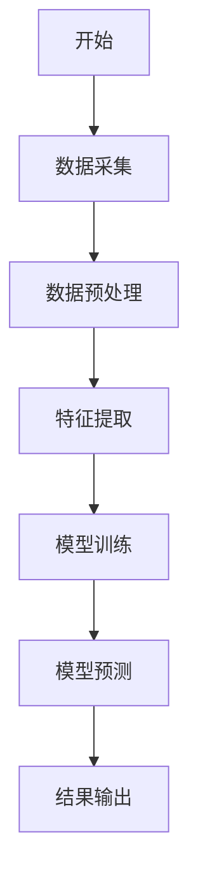

                 


# 全球股市估值与量子传感器在地震预测中的应用

> 关键词：量子传感器，股市估值，地震预测，时间序列分析，量子机器学习

> 摘要：本文探讨了量子传感器技术在全球股市估值和地震预测中的应用。通过分析量子传感器的核心原理，结合时间序列分析和量子机器学习算法，展示了如何利用量子技术提升金融数据分析和自然灾害预测的准确性。文章详细阐述了量子传感器在股市估值中的优势，以及在地震预测中的实际应用案例，并通过算法流程图和数学公式深入解析了量子技术的潜力。

---

## 第一部分: 全球股市估值与量子传感器概述

### 第1章: 全球股市估值的背景与现状

#### 1.1 股市估值的基本概念
股市估值是通过对企业的财务数据、市场环境和行业趋势等多方面因素的分析，来评估企业股票的合理价格范围。传统估值方法包括市盈率（P/E）、市净率（P/B）和现金流折现法（DCF）等。然而，这些方法在面对复杂市场环境和高频交易时，往往难以捕捉市场的实时动态。

#### 1.2 传统股市估值方法的局限性
传统估值方法依赖于历史数据和假设条件，难以应对市场波动和突发事件。例如，市盈率法忽略了企业的成长性和行业风险，而现金流折现法对未来的现金流预测存在较大的不确定性。此外，传统方法无法有效处理海量高频数据，难以满足现代金融市场的实时分析需求。

#### 1.3 量子传感器技术的引入
量子传感器是一种基于量子效应的新型传感器技术，具有高灵敏度、高精度和低功耗等特点。在金融领域，量子传感器可以用于实时采集市场数据，如股价波动、成交量变化等。通过量子传感器，可以实现对市场情绪的实时捕捉，为股市估值提供更精确的数据支持。

### 第2章: 量子传感器在股市估值中的核心概念与联系

#### 2.1 量子传感器的原理
量子传感器利用量子力学效应（如量子干涉、量子叠加）来检测外界环境的变化。与传统传感器相比，量子传感器具有更高的灵敏度和分辨率，能够捕捉到更细微的市场波动。例如，量子传感器可以通过测量光子的干涉效应，实时捕捉市场的高频交易数据。

#### 2.2 量子传感器与股市估值的关系
量子传感器可以作为金融市场的实时数据采集工具，为股市估值提供更丰富的数据来源。通过量子传感器采集的数据，结合时间序列分析和量子机器学习算法，可以构建更精确的股市估值模型。此外，量子传感器的高灵敏度和快速响应能力，使得股市估值模型能够更好地应对市场突发事件。

#### 2.3 核心概念的ER实体关系图
```mermaid
er
actor: 投资者
actor: 金融机构
actor: 数据处理中心
entity: 股市数据
entity: 量子传感器数据
entity: 估值模型
```

### 第3章: 量子传感器辅助股市估值的算法原理

#### 3.1 时间序列分析算法
时间序列分析是一种通过分析历史数据来预测未来趋势的方法。在量子传感器辅助下，时间序列分析可以实时捕捉市场波动，提升预测精度。

##### 3.1.1 时间序列分析的基本原理
时间序列分析通过分解数据的周期性、趋势性和随机性成分，来预测未来的市场走势。常用的模型包括ARIMA（自回归积分滑动平均模型）和GARCH（广义自回归条件异方差模型）。

##### 3.1.2 基于量子传感器数据的时间序列建模
量子传感器数据的高频率和高精度，使得时间序列分析可以捕捉到更多的市场细节。例如，可以通过量子传感器数据构建高频交易信号，辅助交易员做出实时决策。

##### 3.1.3 时间序列预测的量子优化方法
通过量子计算优化时间序列分析的参数选择，可以提升模型的预测精度。例如，可以利用量子模拟退火算法优化ARIMA模型的参数。

#### 3.2 量子增强的机器学习算法
量子增强的机器学习算法结合了传统机器学习和量子计算的优势，能够在复杂市场环境中发现潜在规律。

##### 3.2.1 传统机器学习算法的局限性
传统机器学习算法（如随机森林和神经网络）在处理高维数据和非线性关系时表现良好，但面对海量高频数据时，计算效率和精度可能不足。

##### 3.2.2 量子机器学习算法的优势
量子机器学习算法利用量子叠加和量子并行性，可以在指数级时间内处理大量数据，提升模型的训练效率和预测精度。

##### 3.2.3 量子增强的随机森林算法实现
通过量子计算优化随机森林的特征选择和参数调优，可以显著提升模型的预测能力。例如，可以利用量子支持向量机（QSVM）进行特征提取。

#### 3.3 算法流程图


#### 3.4 数学模型和公式
时间序列分析的核心模型之一是ARIMA模型，其数学表达式为：
$$ ARIMA(p, d, q) = \phi(P)X_t - \theta(Q)Z_t $$

量子增强的随机森林算法通过量子计算优化特征选择过程，可以显著提升模型的泛化能力。

---

## 第二部分: 量子传感器在地震预测中的应用

### 第4章: 量子传感器在地震预测中的背景与现状

#### 4.1 地震预测的基本概念
地震预测是通过分析地质数据、地球物理场变化和历史地震记录，来预测未来地震的发生时间和震级大小。传统地震预测方法依赖于统计分析和经验模型，预测精度有限。

#### 4.2 传统地震预测方法的局限性
传统地震预测方法主要基于历史地震数据和地质模型，难以捕捉地震前兆的微小变化。例如，地震波分析和应力场模型在实际应用中存在较大的不确定性。

#### 4.3 量子传感器技术的引入
量子传感器可以实时监测地球物理场的变化，如地磁场、重力场和地下应力场等。通过量子传感器的数据，可以更精确地捕捉地震前兆，为地震预测提供更可靠的数据支持。

### 第5章: 量子传感器在地震预测中的核心概念与联系

#### 5.1 量子传感器的原理
量子传感器通过测量量子效应的变化，实时监测地球物理场的微小变化。例如，量子重力梯度仪可以通过测量重力场的变化，发现地下应力场的异常变化。

#### 5.2 量子传感器与地震预测的关系
量子传感器可以作为地震预测的核心数据源，通过实时监测地球物理场的变化，辅助地震预测模型的构建和优化。例如，可以通过量子传感器数据构建地震前兆特征提取模型，提升地震预测的准确性。

#### 5.3 核心概念的ER实体关系图
```mermaid
er
actor: 地震监测机构
actor: 科学家
actor: 数据处理中心
entity: 地震数据
entity: 量子传感器数据
entity: 地震预测模型
```

### 第6章: 量子传感器辅助地震预测的算法原理

#### 6.1 时间序列分析算法
时间序列分析是地震预测的核心方法之一，通过分析历史地震数据，预测未来地震的发生概率。

##### 6.1.1 时间序列分析的基本原理
时间序列分析通过分解数据的周期性、趋势性和随机性成分，来预测未来的地震活动。常用的模型包括ARIMA模型和GARCH模型。

##### 6.1.2 基于量子传感器数据的时间序列建模
量子传感器数据的高频率和高精度，使得时间序列分析可以捕捉到更多的地震前兆。例如，可以通过量子传感器数据构建高频地震波分析模型。

##### 6.1.3 时间序列预测的量子优化方法
通过量子计算优化时间序列分析的参数选择，可以提升模型的预测精度。例如，可以利用量子模拟退火算法优化ARIMA模型的参数。

#### 6.2 量子增强的机器学习算法
量子增强的机器学习算法结合了传统机器学习和量子计算的优势，能够在复杂地质环境中发现潜在规律。

##### 6.2.1 传统机器学习算法的局限性
传统机器学习算法（如随机森林和神经网络）在处理高维数据和非线性关系时表现良好，但面对海量地震数据时，计算效率和精度可能不足。

##### 6.2.2 量子机器学习算法的优势
量子机器学习算法利用量子叠加和量子并行性，可以在指数级时间内处理大量数据，提升模型的训练效率和预测精度。

##### 6.2.3 量子增强的随机森林算法实现
通过量子计算优化随机森林的特征选择和参数调优，可以显著提升模型的预测能力。例如，可以利用量子支持向量机（QSVM）进行特征提取。

#### 6.3 算法流程图


#### 6.4 数学模型和公式
时间序列分析的核心模型之一是ARIMA模型，其数学表达式为：
$$ ARIMA(p, d, q) = \phi(P)X_t - \theta(Q)Z_t $$

量子增强的随机森林算法通过量子计算优化特征选择过程，可以显著提升模型的泛化能力。

---

## 第7章: 量子传感器技术的未来展望与最佳实践

### 7.1 量子传感器技术的未来展望
随着量子计算和量子传感器技术的快速发展，量子技术在金融和地震预测领域的应用前景广阔。未来，可以通过量子传感器构建更精确的市场预测模型，提升金融投资的收益和风险控制能力。

### 7.2 最佳实践 tips
- 在金融领域，建议结合量子传感器和量子机器学习算法，构建高频交易策略，提升投资收益。
- 在地震预测领域，建议结合量子传感器和量子增强的地震模型，构建更精确的地震预警系统。
- 在实际应用中，需要注意量子传感器的安装和维护成本，以及数据处理的复杂性。

### 7.3 小结
量子传感器技术为全球股市估值和地震预测提供了新的可能性。通过量子传感器和量子算法的结合，可以显著提升金融数据分析和自然灾害预测的精度和效率。

---

## 作者：AI天才研究院/AI Genius Institute & 禅与计算机程序设计艺术 /Zen And The Art of Computer Programming

