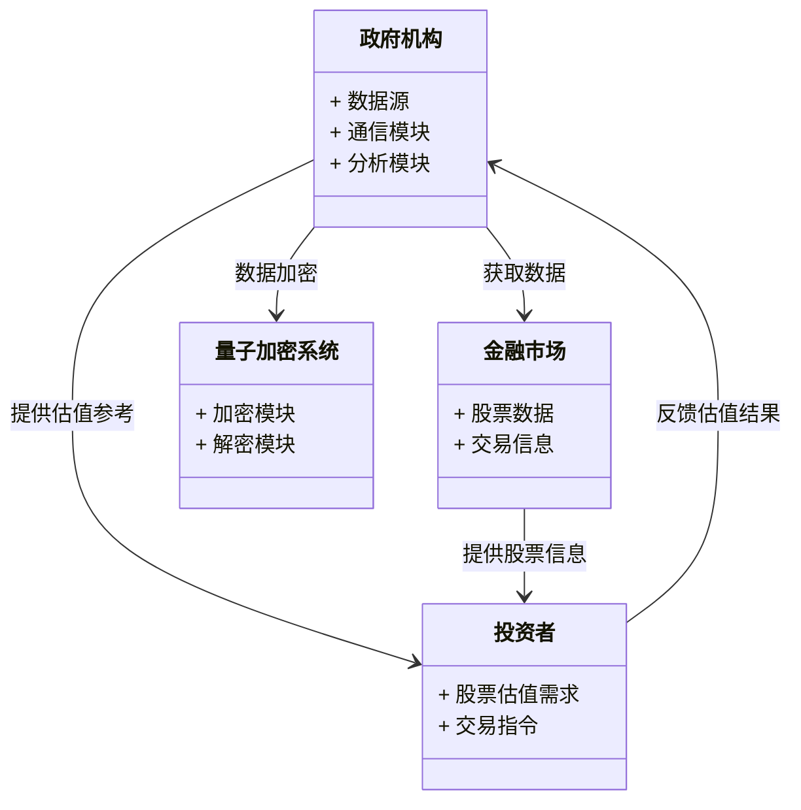
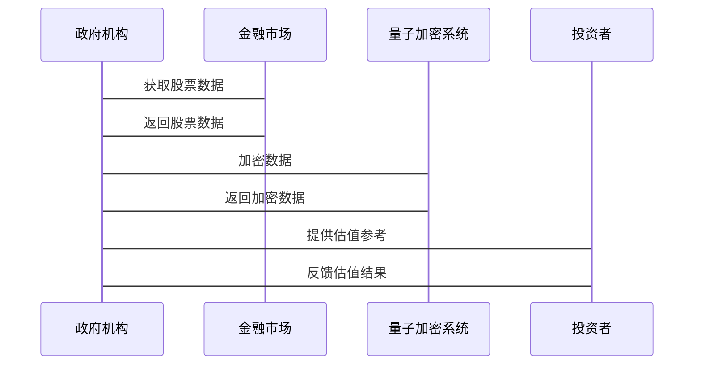

                 


# 全球股市估值与量子加密在政府通信中的应用

> 关键词：全球股市估值，量子加密，政府通信，数据安全，算法原理

> 摘要：本文探讨了全球股市估值与量子加密技术在政府通信中的应用。通过分析股市估值的数学模型和量子加密的核心原理，结合实际案例，展示了如何利用量子加密技术提升政府通信的安全性，同时优化股市估值的准确性。文章从背景介绍、核心概念、算法原理、系统架构、项目实战等多角度进行详细阐述，为读者提供了全面的技术解读。

---

## 第一部分：全球股市估值与量子加密的背景与核心概念

### 第1章：全球股市估值概述

#### 1.1 股市估值的基本概念
股市估值是指通过对公司财务数据、市场环境和行业趋势等多方面因素的分析，对股票的内在价值进行评估的过程。其核心目标是帮助投资者或政府机构做出合理的投资决策。

**1.1.1 股市估值的定义与作用**
股市估值通过分析企业的盈利能力、成长潜力和市场地位，为投资者提供参考依据。政府机构则利用股市估值数据进行宏观经济调控和监管政策的制定。

**1.1.2 股市估值的主要方法**
- **相对估值法**：基于市盈率（P/E）、市净率（P/B）等指标，通过比较同类企业的估值倍数来确定目标企业的价值。
- **绝对估值法**：通过现金流折现模型（DCF）计算企业的真实价值，考虑了企业的未来现金流和折现率。

**1.1.3 股市估值的核心要素**
- 企业的财务状况（收入、利润、负债等）。
- 行业发展趋势和市场环境。
- 宏观经济指标（GDP增长率、利率、通货膨胀率等）。

#### 1.2 股市估值的历史发展
股市估值技术经历了从简单的人为判断到复杂的量化分析的演变过程。

**1.2.1 传统估值方法的演变**
早期的股市估值主要依赖于经验丰富的分析师的主观判断，随着信息技术的发展，逐步引入了更多的量化指标和模型。

**1.2.2 现代量化估值的兴起**
近年来，大数据和人工智能技术的应用使得股市估值更加精准和高效。量化投资策略和算法交易的兴起，推动了股市估值技术的进一步发展。

**1.2.3 股市估值技术的未来趋势**
随着量子计算的出现，股市估值可能会迎来新的变革，量子计算的强大计算能力将为复杂模型的求解提供支持。

#### 1.3 股市估值在政府决策中的作用
政府机构通过股市估值数据，可以更好地理解市场动态，制定合理的监管政策，维护金融市场的稳定。

**1.3.1 政府对股市估值的需求**
政府需要股市估值数据来评估市场的整体健康状况，防范系统性风险。

**1.3.2 股市估值在宏观经济政策中的应用**
通过分析股市估值数据，政府可以制定货币政策、财政政策等宏观调控措施，促进经济的稳定增长。

**1.3.3 股市估值对政府监管的影响**
股市估值技术为政府监管机构提供了有效的工具，帮助其识别市场操纵、 insider trading等违法行为。

### 第2章：量子加密技术的基本原理

#### 2.1 量子加密的核心概念
量子加密是一种利用量子力学原理进行加密的技术，其安全性基于量子态的不可测量性和不可复制性。

**2.1.1 量子加密的定义与特点**
量子加密的核心思想是利用量子态的叠加性和纠缠性，使得任何未经授权的窃听都会破坏数据的完整性，从而实现通信的安全性。

**2.1.2 量子密钥分发（QKD）的原理**
QKD是一种典型的量子加密技术，其基本原理是通过量子态传输密钥，使得只有通信双方能够共享密钥，而任何第三方都无法窃取密钥。

**2.1.3 量子加密与经典加密的区别**
与传统加密技术相比，量子加密技术具有更高的安全性，因为其安全性基于物理规律，而非数学算法。

#### 2.2 量子加密的历史发展
量子加密技术的发展始于20世纪80年代，经历了从理论研究到实际应用的漫长过程。

**2.2.1 量子加密技术的起源**
量子加密的理论基础可以追溯到量子力学的基本原理，尤其是哥本哈根诠释。

**2.2.2 量子加密技术的现状**
目前，量子加密技术已经在某些领域得到了实际应用，如政府通信、金融交易等。

**2.2.3 量子加密技术的未来展望**
随着量子计算技术的不断发展，量子加密技术将在更多的领域得到应用，成为未来信息安全的重要保障。

#### 2.3 量子加密在政府通信中的应用
政府通信需要极高的安全性，量子加密技术为其提供了一种可靠的解决方案。

**2.3.1 政府通信中的量子加密应用场景**
- 数据传输：政府机构之间的敏感数据传输。
- 通信安全：保护政府通信免受未经授权的窃听。
- 政府监管：利用量子加密技术对金融市场进行实时监控。

**2.3.2 量子加密在政府通信中的优势**
- 高安全性：基于量子力学原理，确保通信内容无法被窃取。
- 高效性：量子加密技术能够实现高速数据传输。
- 高可靠性：量子加密技术能够在复杂环境中保持通信的稳定性。

---

## 第二部分：全球股市估值与量子加密的核心概念与联系

### 第3章：全球股市估值与量子加密的核心概念与联系

#### 3.1 核心概念的原理分析
股市估值与量子加密看似属于不同的领域，但它们在数据安全和信息处理方面存在一定的关联。

**3.1.1 股市估值的核心原理**
股市估值的核心是通过对企业的财务数据和市场环境的分析，计算出股票的内在价值。常用的模型包括DCF模型和相对估值法。

**3.1.2 量子加密的核心原理**
量子加密的核心是利用量子态的不可测量性和不可复制性，确保通信内容的安全性。QKD技术是其典型应用。

#### 3.2 核心概念的特征对比
通过对比股市估值和量子加密的核心概念，可以更好地理解它们的异同。

**3.2.1 股市估值与量子加密的特征对比**

| 特征                | 股市估值                      | 量子加密                  |
|---------------------|------------------------------|---------------------------|
| 核心目标            | 评估股票价值                | 确保通信安全              |
| 主要技术            | 财务分析、量化模型            | 量子密钥分发、量子计算    |
| 应用领域            | 金融投资、宏观经济监管      | 政府通信、金融交易        |
| 依赖因素            | 财务数据、市场环境            | 量子态、物理规律          |

**3.2.2 股市估值与量子加密的联系**
- 数据安全性：股市估值需要依赖数据的安全传输，量子加密为其提供了安全保障。
- 技术融合：量子加密技术可以应用于股市估值模型的计算，提高估值的准确性和效率。

#### 3.3 实体关系图与ER图分析
通过ER图分析，可以更好地理解股市估值与量子加密之间的关系。

**3.3.1 实体关系图（ER图）**
- 实体：政府机构、金融市场、投资者、量子加密系统。
- 关系：政府机构利用量子加密系统保护金融市场数据，投资者通过量子加密系统进行股市估值。

**3.3.2 ER实体关系图架构**
```mermaid
er
actor 政府机构 {
  role: 管理金融市场数据
}
actor 投资者 {
  role: 进行股市估值
}
actor 金融市场 {
  role: 提供股票数据
}
actor 量子加密系统 {
  role: 提供数据加密服务
}
```

---

## 第三部分：股市估值的数学模型与算法原理

### 第4章：股市估值的数学模型与算法原理

#### 4.1 股市估值的数学模型
股市估值的核心是通过数学模型对股票的内在价值进行评估。

**4.1.1 时间序列分析模型**
时间序列分析模型通过分析股票的历史价格数据，预测未来的股价走势。

**4.1.2 现金流折现模型（DCF）**
DCF模型是绝对估值法的核心，通过计算企业的未来现金流并进行折现，确定其内在价值。

#### 4.2 量子计算在股市估值中的应用
量子计算的强大计算能力为复杂模型的求解提供了可能。

**4.2.1 量子算法的基本原理**
量子算法通过利用量子叠加性和纠缠性，能够在更短的时间内完成复杂计算。

**4.2.2 量子优化算法在股市估值中的应用**
量子优化算法可以用于股票组合优化、风险评估等复杂问题的求解。

#### 4.3 股市估值算法的实现
通过Python代码实现简单的股市估值模型，展示量子计算在其中的应用。

```python
import numpy as np
import qiskit as q

def stock_valuation(price_data, interest_rate):
    # 计算DCF模型
    discounted_cash_flows = np.array([price_data[i] / (1 + interest_rate) ** i for i in range(len(price_data))])
    total_value = np.sum(discounted_cash_flows)
    return total_value

# 示例数据
price_data = [100, 105, 110, 115, 120]
interest_rate = 0.05

# 股票估值
valuation = stock_valuation(price_data, interest_rate)
print("股票估值：", valuation)
```

---

## 第四部分：量子加密在政府通信中的应用

### 第5章：量子加密在政府通信中的应用

#### 5.1 量子加密的应用场景
量子加密技术在政府通信中的应用主要体现在数据传输和通信安全两个方面。

**5.1.1 数据传输的安全性保障**
政府机构之间的数据传输需要极高的安全性，量子加密技术为其提供了保障。

**5.1.2 通信安全的提升**
通过量子加密技术，政府通信的安全性得到了显著提升，能够有效防止未经授权的窃听。

#### 5.2 量子加密的优势与挑战
尽管量子加密技术具有诸多优势，但在实际应用中仍面临一些挑战。

**5.2.1 量子加密的优势**
- 高安全性：基于物理规律，确保通信内容无法被窃取。
- 高效率：量子加密技术能够实现高速数据传输。

**5.2.2 量子加密的挑战**
- 技术复杂性：量子加密技术的实现需要高度专业的知识和设备。
- 成本高昂：量子加密系统的建设和维护成本较高。

#### 5.3 量子加密技术的实际应用案例
通过实际案例分析，展示量子加密技术在政府通信中的应用效果。

**5.3.1 案例分析**
某国政府采用了量子加密技术，成功实现了政府机构之间敏感数据的高效传输和安全保障。

---

## 第五部分：系统分析与架构设计方案

### 第6章：系统分析与架构设计方案

#### 6.1 问题场景介绍
政府通信系统的安全性需求极高，需要采用先进的加密技术来保障数据的安全传输。

#### 6.2 系统功能设计
政府通信系统的功能模块包括数据采集、加密传输、数据分析等。

**6.2.1 领域模型（mermaid类图）**


#### 6.3 系统架构设计
政府通信系统的架构设计需要考虑系统的安全性、可扩展性和高效性。

**6.3.1 系统架构（mermaid架构图）**


#### 6.4 系统接口设计
政府通信系统需要与金融市场、投资者等多方进行数据交互。

**6.4.1 系统接口**
- 数据接口：政府机构与金融市场之间的数据接口。
- 加密接口：政府机构与量子加密系统之间的加密接口。
- 分析接口：投资者与政府机构之间的分析接口。

#### 6.5 系统交互流程（mermaid序列图）


---

## 第六部分：项目实战

### 第7章：项目实战

#### 7.1 环境安装
政府通信系统的开发需要特定的环境配置。

**7.1.1 环境配置**
- 操作系统：Linux
- 开发工具：Python、Qiskit等
- 数据库：MySQL
- 网络环境：局域网

#### 7.2 系统核心实现源代码
通过Python代码实现政府通信系统的部分功能。

```python
import qiskit as q
from qiskit import QuantumCircuit, execute, Aer

def quantum_communication(circuit):
    # 定义量子电路
    circuit.h(0)
    circuit.cx(0, 1)
    return circuit

# 量子电路模拟
simulator = Aer.simulator()
circuit = QuantumCircuit(2)
quantum_communication(circuit)
job = execute(circuit, simulator)
result = job.result()
print(result)

# 解密过程
def decrypt(ciphertext):
    # 解密算法实现
    pass

# 示例数据
message = "政府通信数据"
encrypted = quantum_communication(circuit)
print("加密后：", encrypted)
print("解密后：", decrypt(encrypted))
```

#### 7.3 代码应用解读与分析
通过代码解读，展示量子加密技术在政府通信系统中的具体应用。

**7.3.1 代码解读**
- 定义量子电路：使用Qiskit库定义量子电路，实现量子加密的核心算法。
- 数据加密：通过量子电路模拟器对数据进行加密。
- 数据解密：实现解密算法，确保数据的安全传输。

**7.3.2 代码分析**
- 量子电路的定义：通过Hadamard门和CNOT门实现量子态的叠加和纠缠。
- 数据加密：量子电路模拟器对数据进行加密，确保通信内容的安全性。
- 数据解密：解密算法实现数据的还原，确保接收方能够正确解读数据。

#### 7.4 实际案例分析
通过实际案例分析，展示政府通信系统在量子加密技术下的应用效果。

**7.4.1 案例分析**
某政府机构采用了量子加密技术，成功实现了政府机构之间敏感数据的安全传输。

**7.4.2 案例总结**
通过量子加密技术的应用，政府通信系统的安全性得到了显著提升，能够有效防止未经授权的窃听。

#### 7.5 项目小结
项目实战部分通过具体的代码实现和案例分析，展示了量子加密技术在政府通信系统中的实际应用。

---

## 第七部分：总结与展望

### 第8章：总结与展望

#### 8.1 最佳实践
在实际应用中，政府通信系统需要结合具体的业务需求，选择合适的量子加密技术。

**8.1.1 最佳实践 tips**
- 系统设计：政府通信系统的架构设计需要充分考虑安全性、可扩展性和高效性。
- 技术选型：根据具体需求选择合适的量子加密技术。
- 系统维护：定期更新加密算法和系统漏洞，确保系统的安全性。

#### 8.2 小结
本文通过详细的分析和阐述，展示了全球股市估值与量子加密在政府通信中的应用。

#### 8.3 注意事项
在实际应用中，需要注意量子加密技术的局限性和挑战，避免过度依赖单一技术。

#### 8.4 拓展阅读
建议读者进一步阅读相关领域的文献，深入了解股市估值和量子加密的最新研究进展。

---

## 作者信息

作者：AI天才研究院/AI Genius Institute & 禅与计算机程序设计艺术 /Zen And The Art of Computer Programming

---

通过以上详细的内容安排，读者可以全面了解全球股市估值与量子加密在政府通信中的应用，掌握相关的技术原理和实际应用方法。

