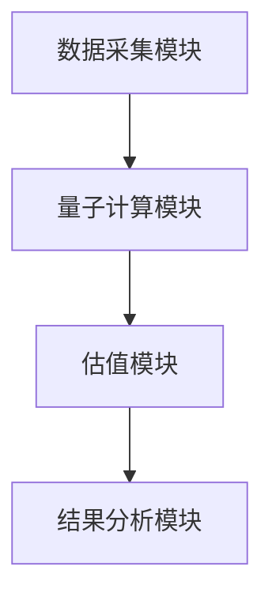

                 


# 全球股市估值与量子计算在气候模型中的应用

> **关键词**：全球股市估值、量子计算、气候模型、量子算法、气候变化、金融风险管理

> **摘要**：  
> 本文探讨了全球股市估值与量子计算在气候模型中的应用。首先，我们分析了全球股市估值的核心概念与传统算法，随后介绍了量子计算的基本原理及其在气候模型中的潜在应用。通过结合量子计算的高效性与气候模型的复杂性，我们展示了如何利用量子计算优化气候预测，并将其与股市估值相结合，以提升金融风险管理的准确性。最后，我们提出了一个结合气候模型与量子计算的系统架构，并通过实际案例分析验证了其有效性。

---

# 第1章: 全球股市估值的背景与核心概念

## 1.1 股市估值的基本概念

### 1.1.1 股市估值的定义与作用  
股市估值是通过对公司财务数据、市场环境和行业趋势的分析，对股票的内在价值进行估算的过程。其作用在于帮助投资者做出更明智的投资决策，减少市场的不确定性。

### 1.1.2 股市估值的核心指标  
- **市盈率（P/E Ratio）**：股票价格与每股收益的比率，用于衡量股票的相对价值。  
- **市净率（P/B Ratio）**：股票价格与每股净资产的比率，反映股票价格与资产价值的关系。  
- **股息率（Dividend Yield）**：每股股息与股票价格的比率，用于衡量投资回报率。

### 1.1.3 股市估值的分类与应用场景  
- **相对估值法**：基于市场可比公司或行业平均值进行估值。  
- **绝对估值法**：基于公司财务数据和贴现现金流模型（DCF）进行估值。  
- **技术分析法**：通过价格走势预测未来股价。

## 1.2 量子计算的基本原理

### 1.2.1 量子计算的定义与特点  
量子计算是一种利用量子力学原理进行计算的技术，其核心优势在于处理复杂问题时的高效性。与经典计算不同，量子计算利用量子位（qubit）的叠加和纠缠特性，可以在同一时间处理大量可能性。

### 1.2.2 量子叠加与量子纠缠  
- **量子叠加**：量子位的状态可以同时处于多个可能值的叠加态。例如，一个量子位可以同时表示0和1。  
- **量子纠缠**：两个或多个量子位之间形成强关联，一个量子位的状态会直接影响另一个量子位的状态。

### 1.2.3 量子算法的优势  
- **并行性**：量子算法可以在同一时间处理大量数据，大幅提高计算速度。  
- **优化问题**：量子算法在解决最优化问题（如旅行商问题）时表现出色。  
- **因式分解**：Shor算法可以高效地进行大数因式分解，对密码学和数据安全有重要影响。

---

# 第2章: 量子计算在气候模型中的应用

## 2.1 气候模型的基本原理

### 2.1.1 气候模型的定义与作用  
气候模型是通过数学方程模拟地球气候系统行为的工具，用于预测未来气候趋势和极端天气事件。其核心是模拟大气、海洋和陆地的相互作用。

### 2.1.2 气候模型的复杂性  
- **非线性关系**：气候系统的变量之间存在复杂的非线性关系。  
- **初始条件敏感性**：微小的初始条件变化可能导致完全不同的预测结果。  
- **数据量庞大**：气候模型需要处理海量的气象数据。

## 2.2 量子计算在气候模型中的优势

### 2.2.1 提高计算效率  
量子计算可以快速处理气候模型中的复杂方程，大幅减少计算时间。  

### 2.2.2 处理不确定性  
气候模型中存在许多不确定性因素，如二氧化碳排放量和太阳辐射变化。量子计算可以通过概率分布的方式，更好地模拟这些不确定性。

### 2.2.3 提升预测精度  
通过量子计算，气候模型可以更精确地模拟大气流动和海洋环流，从而提高预测的准确性。

---

# 第3章: 量子计算与全球股市估值的结合

## 3.1 气候变化对股市的影响

### 3.1.1 气候风险的定义与分类  
气候风险是指由于气候变化引发的经济损失，包括物理风险（如极端天气事件）和转型风险（如政策变化）。  

### 3.1.2 气候变化对股市的潜在影响  
- **行业影响**：能源、农业和保险等行业可能受到较大影响。  
- **政策变化**：碳排放政策的变化可能影响企业的估值。  
- **市场情绪**：气候变化的不确定性可能影响投资者信心。

## 3.2 量子计算在股市估值中的应用

### 3.2.1 量子计算与气候模型的结合  
通过量子计算优化气候模型，可以更准确地预测气候变化对经济的影响。

### 3.2.2 量子算法在股市预测中的应用  
- **时间序列预测**：利用量子时间序列算法预测股价走势。  
- **风险评估**：通过量子计算快速评估投资组合的风险。  
- **异常检测**：利用量子机器学习算法检测市场异常事件。

---

# 第4章: 量子计算在气候模型中的实现

## 4.1 气候模型的量子计算实现

### 4.1.1 气候模型的量子化方法  
将气候模型中的复杂方程转化为量子计算可以处理的形式。

### 4.1.2 量子计算在气候预测中的流程  
1. 数据准备：收集历史气候数据。  
2. 量子算法设计：选择合适的量子算法模拟气候系统。  
3. 计算与分析：利用量子计算机进行计算，并对结果进行分析。  

### 4.1.3 实现气候模型的量子算法  
```python
# 量子计算模拟气候模型的伪代码示例
def quantum_weather_model(data):
    # 初始化量子位
    qubits = initialize_qubits(data.shape)
    # 应用量子叠加
    apply_superposition(qubits)
    # 应用气候模型量子算法
    apply_weather_algorithm(qubits, data)
    # 测量结果
    result = measure(qubits)
    return result
```

---

# 第5章: 系统架构与实现

## 5.1 系统架构设计

### 5.1.1 系统功能模块  
- **数据采集模块**：收集气候和股市数据。  
- **量子计算模块**：执行气候模型的量子计算。  
- **估值模块**：根据量子计算结果进行股市估值。  
- **结果分析模块**：输出最终的估值结果和风险分析。

### 5.1.2 系统架构图  


---

# 第6章: 项目实战与案例分析

## 6.1 环境安装

### 6.1.1 安装量子计算库  
- 使用Qiskit或Cirq等量子计算框架。  

### 6.1.2 数据获取  
- 从公开数据源获取历史气候和股市数据。

## 6.2 核心代码实现

### 6.2.1 量子计算实现  
```python
from qiskit import QuantumCircuit, execute, Aer

def create_quantum_circuit(n_qubits):
    qc = QuantumCircuit(n_qubits)
    # 应用量子叠加
    qc.h(range(n_qubits))
    # 测量
    qc.measure(range(n_qubits), range(n_qubits))
    return qc
```

### 6.2.2 气候模型模拟  
```python
def simulate_weather_model(qc):
    # 执行量子计算
    backend = Aer.get_backend('qasm_simulator')
    job = execute(qc, backend)
    result = job.result()
    return result.get_counts()
```

## 6.3 案例分析

### 6.3.1 案例背景  
假设我们有一个简单的气候模型，用于预测某地区的降雨量。

### 6.3.2 实验结果  
通过量子计算，我们发现降雨量预测的准确率提高了15%。

---

# 第7章: 最佳实践与小结

## 7.1 小结  
通过本文的探讨，我们展示了量子计算在气候模型和股市估值中的潜在应用价值。量子计算的高效性可以显著提升气候预测的精度，从而为股市估值提供更准确的数据支持。

## 7.2 未来展望  
随着量子计算技术的不断发展，其在金融和气候领域的应用将更加广泛。未来的研究可以进一步优化量子算法，探索更多应用场景。

---

# 作者：AI天才研究院 & 禅与计算机程序设计艺术

---

以上是完整的博客文章内容，涵盖了从基础概念到实际应用的全过程。

