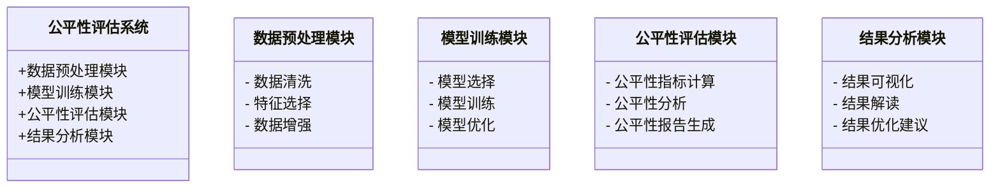

                 


```markdown
# 公平性评估：确保AI Agent无歧视偏见

> 关键词：公平性评估、AI Agent、算法公平性、数据偏见、对抗训练、损失函数、伦理AI

> 摘要：本文系统性地探讨了AI Agent公平性评估的核心概念、算法原理、系统设计与实现，结合实际案例，深入分析了如何通过技术手段消除AI系统中的歧视与偏见。文章从理论到实践，全面阐述了确保AI Agent公平性的方法与策略，为开发者和研究者提供了有价值的参考。

---

## 第一部分: 公平性评估背景与核心概念

### 第1章: 公平性评估的背景与问题描述

#### 1.1 人工智能的快速发展与挑战
人工智能技术近年来取得了突飞猛进的发展，AI Agent（智能体）广泛应用于各个领域，如推荐系统、自然语言处理、自动驾驶等。然而，随着AI系统的普及，公平性问题逐渐浮现。AI系统可能因为训练数据中的偏见、算法设计的缺陷或模型的局限性，导致不公平的结果，例如招聘系统中对某些群体的歧视，推荐系统中对某些群体的偏好。

#### 1.2 公平性评估的核心问题
- **什么是AI Agent的公平性？**  
  公平性是指AI系统在决策过程中对所有群体一视同仁，不因性别、种族、年龄等特征而产生歧视。  
- **公平性问题的多维度分析**  
  公平性问题涉及多个维度，包括结果公平性（Outcome Fairness）、机会公平性（Opportunity Fairness）和过程公平性（Process Fairness）。  
- **公平性评估的边界与外延**  
  公平性评估不仅关注最终结果，还关注决策过程中的每一步是否可能引入偏见。

#### 1.3 公平性评估的必要性与意义
- **社会价值**  
  公平性评估是确保AI系统符合社会道德和法律规范的重要手段。  
- **企业应用**  
  在企业中，公平性评估可以避免招聘、晋升等决策中的偏见，提升企业的公平性和声誉。  
- **技术挑战**  
  公平性评估需要结合统计学、机器学习和伦理学等多学科知识，技术实现难度较高。

---

### 第2章: 公平性评估的核心概念与联系

#### 2.1 公平性评估的原理
- **数据、模型与公平性**  
  数据是公平性评估的基础，模型是公平性实现的关键，公平性指标是评估的依据。  
- **公平性评估的关键因素**  
  包括数据的代表性、模型的可解释性、公平性指标的科学性等。  
- **公平性评估的数学基础**  
  公平性评估涉及概率论、统计学和优化理论，例如条件概率、均值差、损失函数等。

#### 2.2 公平性评估的核心概念对比
| 方法类型       | 统计学方法             | 对抗训练方法           | 基于公平性的损失函数 |
|----------------|----------------------|-----------------------|----------------------|
| 实现原理       | 基于统计检验           | 基于对抗网络           | 基于损失函数优化     |
| 优点           | 易于理解，计算效率高     | 能够发现隐含偏见         | 可控性强，可解释性好   |
| 缺点           | 对复杂场景的处理能力有限 | 实现复杂，收敛困难       | 需要手动设计损失函数   |

#### 2.3 公平性评估的ER实体关系图
```mermaid
er
    actor: 用户
    agent: AI Agent
    data: 数据集
    metric: 公平性指标
    fairness_assessment: 公平性评估系统
    actor --> data
    data --> agent
    agent --> metric
    metric --> fairness_assessment
```

---

## 第二部分: 公平性评估的算法原理

### 第3章: 公平性评估的数学模型与算法

#### 3.1 统计学方法
- **基于条件概率的公平性度量**  
  公平性指标：$P(Y=1|A=a)$，其中$Y$为结果，$A$为敏感属性。  
- **基于均值差的统计检验**  
  公平性指标：$|E[Y|A=1] - E[Y|A=0]|$。  
- **统计学方法的优缺点**  
  优点：简单易懂，计算效率高；缺点：难以处理高维数据和复杂场景。

#### 3.2 对抗训练方法
- **对抗网络的构建**  
  对抗网络由判别器$D$和生成器$G$组成，判别器用于区分真实数据和生成数据，生成器用于生成公平的数据。  
- **对抗训练的损失函数**  
  $$\mathcal{L} = \log(D(x)) + \log(1 - D(G(x)))$$  
- **对抗训练的收敛性分析**  
  对抗训练可能陷入局部最优，需要合理设计学习率和权重。

#### 3.3 基于公平性的损失函数
- **损失函数的定义**  
  $$\mathcal{L}_{fair} = \lambda \cdot \mathcal{L}_{task} + (1 - \lambda) \cdot \mathcal{L}_{fair}$$  
  其中$\mathcal{L}_{task}$是任务损失，$\mathcal{L}_{fair}$是公平性损失，$\lambda$是平衡系数。  
- **损失函数的优化**  
  使用梯度下降等优化方法，同时考虑任务目标和公平性目标。

### 第4章: 公平性评估算法的实现

#### 4.1 统计学方法的实现
- **数据预处理**  
  确保数据集的代表性，去除敏感属性或平衡不同群体的数据分布。  
- **统计检验**  
  使用卡方检验或t检验，计算不同群体的结果差异是否显著。

#### 4.2 对抗训练的实现
```python
import torch
import torch.nn as nn

class Discriminator(nn.Module):
    def __init__(self):
        super(Discriminator, self).__init__()
        self.fc = nn.Linear(10, 1)
    
    def forward(self, x):
        return torch.sigmoid(self.fc(x))

class Generator(nn.Module):
    def __init__(self):
        super(Generator, self).__init__()
        self.fc = nn.Linear(10, 10)
    
    def forward(self, x):
        return torch.tanh(self.fc(x))

# 初始化网络
disc = Discriminator()
gen = Generator()
criterion = nn.BCELoss()
optimizer_d = torch.optim.Adam(disc.parameters(), lr=0.001)
optimizer_g = torch.optim.Adam(gen.parameters(), lr=0.001)

# 训练过程
for epoch in range(100):
    # 更新判别器
    disc.zero_grad()
    outputs = disc(real_data)
    d_loss_real = criterion(outputs, torch.ones_like(outputs))
    gen_outputs = gen(real_data)
    d_loss_fake = criterion(outputs, torch.zeros_like(outputs))
    d_loss = d_loss_real + d_loss_fake
    d_loss.backward()
    optimizer_d.step()

    # 更新生成器
    gen.zero_grad()
    g_outputs = gen(real_data)
    g_loss = criterion(g_outputs, torch.ones_like(g_outputs))
    g_loss.backward()
    optimizer_g.step()
```

---

## 第三部分: 公平性评估的系统设计与实现

### 第5章: 公平性评估的系统架构设计

#### 5.1 问题场景介绍
- **招聘系统中的公平性问题**  
  防止招聘系统因性别、种族等因素对候选人进行不公平筛选。  
- **推荐系统中的公平性问题**  
  确保推荐结果不因用户特征而产生偏见。

#### 5.2 系统功能设计


#### 5.3 系统架构设计


---

## 第四部分: 公平性评估的项目实战

### 第6章: 公平性评估的项目实现

#### 6.1 环境安装
```bash
pip install numpy pandas scikit-learn torch
```

#### 6.2 核心代码实现
```python
import numpy as np
from sklearn.metrics import accuracy_score

def compute_accuracy(y_true, y_pred):
    return accuracy_score(y_true, y_pred)

def compute_fairness(y_true, y_pred, sensitive_features):
    # 计算公平性指标，例如均值差
    group1 = y_true[sensitive_features == 0]
    group2 = y_true[sensitive_features == 1]
    return abs(np.mean(group1) - np.mean(group2))

# 示例数据
X = np.random.randn(100, 10)
y = np.random.randint(2, size=100)
sensitive_features = np.random.randint(2, size=100)

# 训练模型
from sklearn.linear_model import LogisticRegression
model = LogisticRegression()
model.fit(X, y)

# 预测结果
y_pred = model.predict(X)

# 计算公平性指标
fairness = compute_fairness(y, y_pred, sensitive_features)
print(f"公平性指标：{fairness}")
```

#### 6.3 实际案例分析
- **案例一：招聘系统中的公平性评估**  
  对招聘系统的预测结果进行分析，确保不同性别、种族等群体的通过率无显著差异。  
- **案例二：推荐系统中的公平性评估**  
  确保推荐结果中不同群体的用户得到公平的推荐机会。

---

## 第五部分: 最佳实践与总结

### 第7章: 公平性评估的最佳实践

#### 7.1 小结
- 公平性评估是确保AI系统公平性的重要手段。  
- 统计学方法简单易懂，对抗训练方法能够发现隐含偏见，基于公平性的损失函数具有可控性和可解释性。  

#### 7.2 注意事项
- 数据预处理时要确保数据的代表性，避免引入新的偏见。  
- 公平性评估需要结合业务场景，选择合适的评估指标。  
- 对抗训练可能收敛困难，需要合理设计网络结构和超参数。

#### 7.3 拓展阅读
- "Fairness in Machine Learning" by Moritz Hardt  
- "Mitigating Bias in Machine Learning" by Google AI

---

## 作者信息

作者：AI天才研究院/AI Genius Institute & 禅与计算机程序设计艺术 /Zen And The Art of Computer Programming
```

