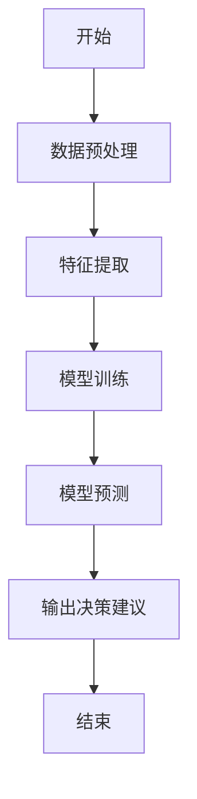
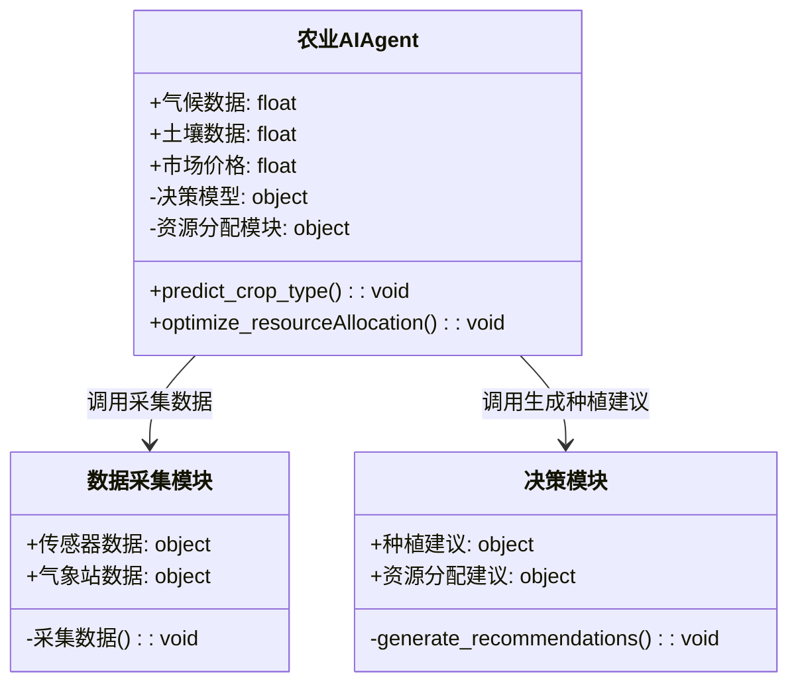
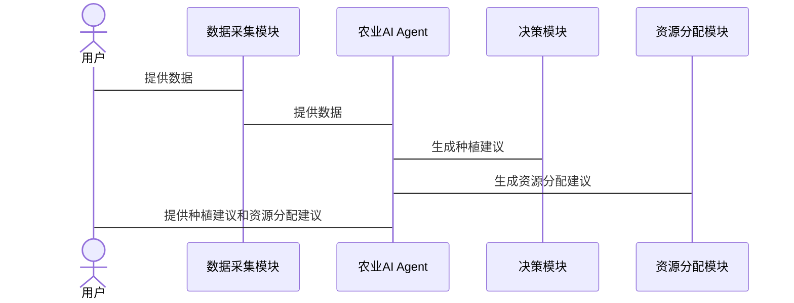

                 


# 农业AI Agent：优化种植决策与资源分配

> 关键词：农业AI Agent，种植决策优化，资源分配，机器学习，AI算法，农业现代化

> 摘要：本文详细探讨了农业AI Agent的概念、算法原理、系统架构及其在农业种植中的实际应用。通过分析农业AI Agent的核心要素与工作原理，结合具体的算法模型和系统设计，本文展示了如何利用AI技术优化种植决策和资源分配，从而提高农业生产效率和可持续性。文章还通过实际案例和项目实战，深入分析了农业AI Agent的优势与挑战，并提出了相应的解决方案和未来研究方向。

---

# 第一部分: 农业AI Agent的背景与概念

## 第1章: 农业面临的挑战与AI Agent的引入

### 1.1 农业生产中的关键问题

1.1.1 农业资源利用效率低下  
农业生产的资源利用效率一直是全球关注的焦点。传统农业模式中，水资源、化肥、农药等资源的使用往往存在浪费现象，导致成本增加，同时对环境造成负面影响。例如，过量使用化肥不仅增加了生产成本，还可能导致土地板结、水体富营养化等问题。

1.1.2 气候变化对农业的影响  
气候变化对农业生产的稳定性构成了巨大挑战。极端天气事件（如干旱、洪涝、高温等）频发，导致农作物减产甚至绝收。农民需要实时了解天气变化，调整种植计划，但由于信息不对称和决策滞后，往往难以做出最优选择。

1.1.3 农业生产决策的复杂性  
农业生产决策涉及多个变量，如土壤条件、气候数据、市场价格、病虫害风险等。传统决策方式依赖经验，但难以应对复杂的动态变化。例如，在选择作物种植类型时，农民需要综合考虑市场行情、气候条件、土壤特性等多种因素，这对个体决策者来说是一项复杂的任务。

### 1.2 AI Agent的基本概念

1.2.1 什么是AI Agent  
AI Agent（人工智能代理）是指能够感知环境、自主决策并采取行动的智能体。它通过传感器获取信息，利用算法进行分析和推理，最终做出最优决策。AI Agent的核心目标是帮助人类完成复杂任务或优化现有流程。

1.2.2 AI Agent的核心特征  
- **自主性**：AI Agent能够在没有外部干预的情况下独立运行。  
- **反应性**：能够实时感知环境变化并做出相应调整。  
- **目标导向**：具有明确的目标，并始终致力于实现目标。  
- **学习能力**：能够通过经验不断优化自身的决策能力。

1.2.3 AI Agent与传统决策工具的区别  
AI Agent与传统决策工具（如Excel表格、手动计算等）的最大区别在于其自主性和学习能力。传统工具需要人工输入数据并进行计算，而AI Agent能够主动获取数据、分析数据，并提出优化建议。

### 1.3 农业AI Agent的应用场景

1.3.1 种植决策优化  
农业AI Agent可以通过分析气候数据、土壤条件、市场价格等因素，为农民提供最优的作物种植建议。例如，在选择种植何种作物时，AI Agent可以综合考虑市场需求、气候风险和土地条件，帮助农民做出科学决策。

1.3.2 资源分配与管理  
AI Agent可以优化农业资源的分配，例如合理分配水资源、化肥和农药。通过实时监测土壤湿度和作物生长状况，AI Agent可以制定精准的灌溉计划，减少水资源浪费。

1.3.3 病虫害预测与防控  
AI Agent可以通过分析历史病虫害数据和当前气候条件，预测病虫害的发生概率，并提出相应的防控措施。例如，AI Agent可以根据气象数据预测水稻稻飞虱的发生概率，并建议农民提前采取防治措施。

---

## 第2章: 农业AI Agent的核心概念与联系

### 2.1 核心概念原理

2.1.1 农业AI Agent的定义  
农业AI Agent是一种基于人工智能技术的智能体，旨在通过数据感知、分析和决策，优化农业生产过程中的种植决策和资源分配。

2.1.2 农业AI Agent的核心要素  
- **数据源**：包括气候数据、土壤数据、市场价格、病虫害数据等。  
- **决策模型**：基于机器学习算法构建的数学模型，用于分析数据并生成决策建议。  
- **资源分配模块**：根据决策模型的输出，制定资源分配计划。

2.1.3 农业AI Agent的工作原理  
1. **数据采集**：通过传感器、气象站等设备获取农业生产相关的数据。  
2. **数据处理**：对采集到的数据进行清洗、特征提取和预处理。  
3. **模型训练**：利用机器学习算法训练决策模型，生成种植建议或资源分配方案。  
4. **决策优化**：根据模型输出，优化种植计划和资源分配策略。  
5. **反馈与迭代**：根据实际效果反馈，不断优化模型和决策策略。

### 2.2 核心概念属性特征对比

以下表格展示了农业AI Agent与其他农业决策工具的核心属性对比：

| 属性                | AI Agent                  | 传统决策工具              |
|---------------------|---------------------------|---------------------------|
| 自主性              | 高                        | 低                        |
| 学习能力            | 强                        | 无                        |
| 决策效率            | 高                        | 低                        |
| 适应性              | 强                        | 一般                      |
| 数据处理能力        | 复杂                     | 简单                      |

### 2.3 ER实体关系图

以下是一个简单的农业AI Agent ER图：

```mermaid
erd
  title 农业AI Agent ER图
  actor 用户
  actor 农业专家
  actor 数据源
  class 农业AI Agent
  class 种植数据
  class 决策模型
  class 资源分配方案
  用户 --> 农业AI Agent: 提交请求
  农业专家 --> 农业AI Agent: 提供知识
  数据源 --> 农业AI Agent: 提供数据
  农业AI Agent --> 决策模型: 运行模型
  农业AI Agent --> 种植数据: 分析数据
  农业AI Agent --> 资源分配方案: 输出方案
```

---

## 第3章: 农业AI Agent的算法原理

### 3.1 基于规则的推理算法

3.1.1 基于规则的推理原理  
基于规则的推理是一种简单的AI算法，通过预定义的规则对数据进行分析和推理。例如，如果土壤湿度低于某个阈值，则建议增加灌溉量。

3.1.2 农业知识库的构建  
基于规则的推理需要一个包含农业知识的知识库。例如，可以包含以下规则：  
- 如果气温高于30°C且土壤湿度低于30%，则建议增加灌溉量。  
- 如果病虫害指数超过50%，则建议喷洒农药。

3.1.3 规则的匹配与推理  
基于规则的推理通过匹配数据中的特征与预定义的规则，生成相应的决策建议。例如，当检测到土壤湿度低于30%时，AI Agent会触发“增加灌溉量”的规则，并向用户发出灌溉建议。

### 3.2 基于机器学习的决策模型

3.2.1 机器学习在农业AI Agent中的应用  
机器学习算法（如随机森林、支持向量机等）可以用于构建种植决策模型。例如，可以通过训练模型预测不同作物的产量，从而为农民提供种植建议。

3.2.2 农业数据的特征提取与处理  
在机器学习中，特征提取是关键步骤。例如，可以将土壤湿度、气温、降水等数据作为特征，用于训练模型。

3.2.3 算法流程图  
以下是一个基于随机森林算法的种植决策流程图：



3.2.4 代码实现  
以下是一个简单的基于随机森林算法的种植决策模型代码示例：

```python
import pandas as pd
from sklearn.ensemble import RandomForestClassifier
from sklearn.model_selection import train_test_split

# 加载数据
data = pd.read_csv('agriculture_data.csv')

# 特征选择
features = ['温度', '湿度', '降水']
target = '产量'

# 划分训练集和测试集
X_train, X_test, y_train, y_test = train_test_split(data[features], data[target], test_size=0.2)

# 训练模型
model = RandomForestClassifier()
model.fit(X_train, y_train)

# 预测
y_pred = model.predict(X_test)

# 输出结果
print('预测产量:', y_pred)
print('真实产量:', y_test.values)
```

---

## 第4章: 农业AI Agent的系统分析与架构设计

### 4.1 系统功能设计

4.1.1 领域模型  
以下是一个农业AI Agent的领域模型：



### 4.2 系统架构设计

4.2.1 系统架构图  
以下是一个农业AI Agent的系统架构图：

```mermaid
graph TD
    A[农业AI Agent] --> B[数据采集模块]
    A --> C[决策模块]
    A --> D[资源分配模块]
    B --> A: 提供数据
    C --> A: 提供种植建议
    D --> A: 提供资源分配建议
```

### 4.3 系统交互设计

4.3.1 交互流程图  
以下是一个农业AI Agent的交互流程图：



---

## 第5章: 农业AI Agent的项目实战

### 5.1 环境安装

5.1.1 安装Python  
```bash
python --version
```

5.1.2 安装必要的库  
```bash
pip install numpy pandas scikit-learn
```

### 5.2 系统核心实现源代码

以下是一个简单的农业AI Agent实现代码示例：

```python
import pandas as pd
from sklearn.ensemble import RandomForestClassifier
from sklearn.model_selection import train_test_split

# 加载数据
data = pd.read_csv('agriculture_data.csv')

# 特征选择
features = ['温度', '湿度', '降水']
target = '产量'

# 划分训练集和测试集
X_train, X_test, y_train, y_test = train_test_split(data[features], data[target], test_size=0.2)

# 训练模型
model = RandomForestClassifier()
model.fit(X_train, y_train)

# 预测
y_pred = model.predict(X_test)

# 输出结果
print('预测产量:', y_pred)
print('真实产量:', y_test.values)
```

### 5.3 代码应用解读与分析

1. **数据加载与预处理**  
   使用`pandas`库加载农业数据，并进行特征选择和数据清洗。

2. **模型训练与预测**  
   使用随机森林算法训练种植决策模型，并对测试数据进行预测。

3. **结果分析**  
   对比预测结果与真实结果，评估模型的准确性。

### 5.4 实际案例分析

以下是一个实际案例的分析：

假设我们有一个包含以下特征的数据集：  
- 温度  
- 湿度  
- 降水  
- 土壤类型  

目标是预测不同作物的最优种植区域。

通过训练随机森林模型，我们可以得出不同作物的种植区域建议。例如，模型可能建议在高温高湿的地区种植水稻，而在干旱地区种植耐旱作物。

### 5.5 项目小结

通过本项目，我们展示了如何利用AI技术优化种植决策。通过机器学习算法，我们可以帮助农民做出科学的种植计划，从而提高农业生产效率和资源利用效率。

---

## 第6章: 农业AI Agent的最佳实践

### 6.1 小结

农业AI Agent是一种能够显著提高农业生产效率和资源利用效率的智能工具。通过基于规则的推理和机器学习算法，农业AI Agent可以帮助农民做出科学的种植决策和资源分配计划。

### 6.2 注意事项

在实际应用中，需要注意以下几点：  
- 数据质量：确保数据的准确性和完整性。  
- 模型泛化能力：避免过拟合，确保模型在不同环境下的适用性。  
- 用户教育：帮助农民理解AI Agent的工作原理和使用方法。

### 6.3 拓展阅读

- 《机器学习实战》  
- 《人工智能导论》  
- 《农业物联网技术》  

---

# 结语

农业AI Agent作为一项前沿技术，正在逐步改变传统的农业生产方式。通过本文的详细讲解，我们希望读者能够理解农业AI Agent的核心概念、算法原理和实际应用，并能够将其应用于实际的农业生产中。未来，随着人工智能技术的不断发展，农业AI Agent将发挥更大的作用，为农业现代化和可持续发展贡献力量。

---

**作者：AI天才研究院/AI Genius Institute & 禅与计算机程序设计艺术 /Zen And The Art of Computer Programming**

