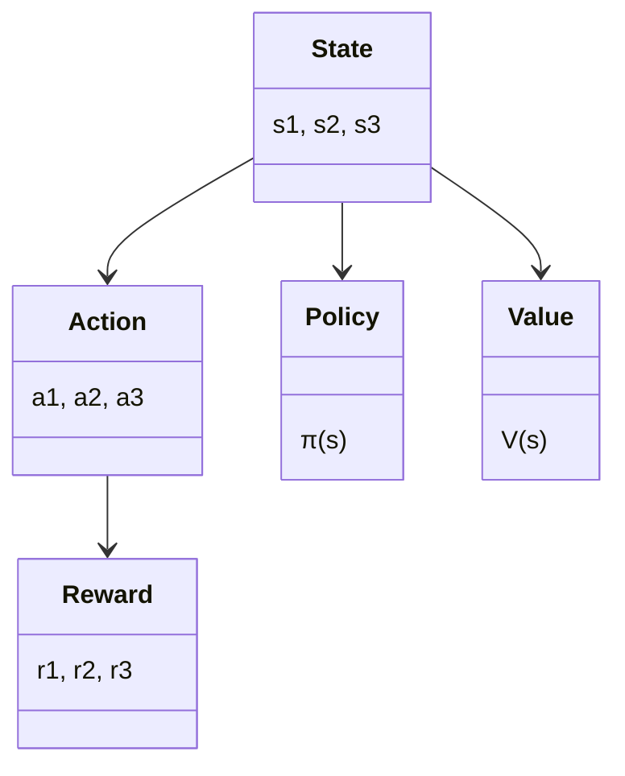
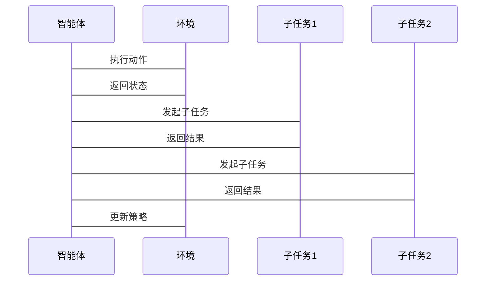

                 


# 分层强化学习：处理复杂任务的AI Agent策略

## 关键词：分层强化学习、AI代理、复杂任务、层次化结构、强化学习算法、系统设计、项目实战

## 摘要：分层强化学习是一种通过构建层次化结构来处理复杂任务的AI代理策略。本文系统地介绍了分层强化学习的核心概念、算法原理、系统设计和实际应用。从基础的强化学习理论出发，深入探讨了分层结构的设计思想、主要算法及其优缺点，结合神经网络的实现方法，通过具体项目案例展示了分层强化学习的实际应用价值，并总结了未来发展和优化方向。

---

## 第一部分: 分层强化学习基础

### 第1章: 分层强化学习概述

#### 1.1 分层强化学习的背景与重要性

##### 1.1.1 强化学习的基本概念
强化学习（Reinforcement Learning, RL）是一种通过智能体与环境交互来学习策略的机器学习方法。智能体通过执行动作来最大化累积奖励，从而逐步掌握任务。强化学习的核心在于平衡探索与利用，这在处理动态环境和不确定性问题中表现出色。

##### 1.1.2 复杂任务的挑战
随着任务复杂性的增加，传统的强化学习方法在训练效率、可扩展性和稳定性方面面临挑战。复杂任务通常具有高维状态空间、多目标优化和长时依赖等问题，导致训练时间过长，甚至无法收敛。

##### 1.1.3 分层强化学习的提出与优势
分层强化学习（Hierarchical Reinforcement Learning, HRL）通过将复杂任务分解为多个子任务，构建层次化的结构。这种分层方式能够降低任务复杂度，提高训练效率，增强泛化能力，并使智能体更好地处理动态环境和不确定性问题。

#### 1.2 分层强化学习的核心概念

##### 1.2.1 层次化结构的定义
分层强化学习通过将全局任务分解为多个子任务，形成一个层次化的结构。每个子任务负责完成特定的目标，而这些子任务的协同工作共同实现全局目标。

##### 1.2.2 子目标与全局目标的关系
子目标是全局目标的组成部分，它们之间存在依赖关系。子目标的完成需要协调一致，确保全局目标的实现。子目标的奖励函数通常与全局奖励相关联，形成一个层次化的奖励结构。

##### 1.2.3 分层强化学习的数学模型
分层强化学习的数学模型通常由多个马尔可夫决策过程（MDP）构成，每个子任务对应一个子MDP。全局MDP通过协调各个子MDP的动作和奖励，实现整体优化。

---

### 第2章: 强化学习基础

#### 2.1 马尔可夫决策过程

##### 2.1.1 状态、动作、奖励的定义
在强化学习中，智能体通过与环境交互，观察状态（state），执行动作（action），并获得奖励（reward）。状态描述环境当前的状况，动作是智能体的选择，奖励是对动作的反馈。

##### 2.1.2 策略与价值函数
策略（policy）是智能体选择动作的概率分布。价值函数（value function）衡量从当前状态开始采取某种策略能够获得的预期奖励总和。

##### 2.1.3 动作空间与状态空间
动作空间是智能体可执行的所有动作的集合，状态空间是所有可能状态的集合。动作空间和状态空间的维度直接影响强化学习的难度和训练效率。

#### 2.2 基础强化学习算法

##### 2.2.1 Q-Learning算法
Q-Learning是一种基于值函数的强化学习算法，通过更新Q值表来学习最优策略。Q值表记录了每个状态下执行某个动作的期望奖励。

##### 2.2.2 Deep Q-Networks (DQN)
DQN将Q-Learning与深度神经网络结合，利用经验回放和目标网络提高训练稳定性和效率。经验回放通过存储和随机采样历史经验，避免样本偏差。目标网络用于稳定价值函数的更新。

##### 2.2.3 Policy Gradient方法
Policy Gradient方法直接优化策略，通过梯度上升或下降调整参数，使策略趋向最优。该方法适用于动作空间离散或连续的情况。

---

### 第3章: 分层强化学习的原理

#### 3.1 分层结构的设计思想

##### 3.1.1 层次化分解任务的方法
分层强化学习通过将全局任务分解为子任务，每个子任务负责完成特定的目标。子任务之间可能存在依赖关系，需要协同工作以实现全局目标。

##### 3.1.2 子任务之间的依赖关系
子任务之间的依赖关系可以通过任务图或依赖矩阵表示。子任务的执行顺序和依赖关系直接影响任务的完成效率和质量。

##### 3.1.3 全局目标与子目标的协调
全局目标是所有子目标的综合，子目标的完成需要与全局目标保持一致。子目标的奖励函数通常与全局奖励相关联，形成一个层次化的奖励结构。

#### 3.2 分层强化学习的数学模型

##### 3.2.1 层次化MDP的定义
层次化MDP由多个子MDP构成，每个子MDP对应一个子任务。子MDP之间通过共享状态或动作进行交互，共同实现全局目标。

##### 3.2.2 子目标的奖励函数设计
子目标的奖励函数通常基于局部状态和动作设计，与全局奖励相关联。通过层次化奖励机制，子任务的学习能够为全局优化提供支持。

##### 3.2.3 全局奖励与子目标奖励的结合
全局奖励是对子目标奖励的综合，通常通过加权求和或非线性变换实现。全局奖励的设计需要考虑子目标之间的协同与竞争关系。

---

## 第二部分: 分层强化学习算法

### 第4章: 分层强化学习的主要算法

#### 4.1 HRL（Hierarchical Reinforcement Learning）

##### 4.1.1 基于选项的HRL算法
基于选项的HRL算法通过定义选项（option）来分解任务。选项是一个由发起条件和终止条件定义的子任务，智能体可以在不同选项之间切换。

##### 4.1.2 基于子目标的HRL算法
基于子目标的HRL算法通过分解全局目标为多个子目标，每个子目标对应一个子任务。子任务之间通过共享状态和动作进行交互，共同实现全局目标。

##### 4.1.3 HRL算法的优缺点分析
HRL算法通过分解任务降低了复杂度，提高了训练效率，但子任务的依赖关系和协调问题需要额外处理。子目标的设计可能影响全局优化的效果。

#### 4.2 OPC（Option-Critic Framework）

##### 4.2.1 选项的定义与选择
在Option-Critic框架中，选项是一个由发起条件和终止条件定义的子任务。智能体通过选择合适的选项来优化全局策略。

##### 4.2.2 选项的评估与优化
Option-Critic通过评估选项的价值函数，优化选项的发起和终止策略。选项的价值函数用于指导选项的选择和优化。

##### 4.2.3 OPC算法的优缺点分析
Option-Critic框架通过引入选项的评估和优化，能够更好地协调子任务之间的关系。但选项的设计和优化需要额外的计算资源和时间。

### 4.3 NHERT（Neural Hierarchical Reinforcement Learning）

##### 4.3.1 NHERT算法的原理
NHERT算法通过神经网络实现层次化强化学习，将子任务的策略和价值函数嵌入到神经网络中，通过端到端训练实现全局优化。

##### 4.3.2 NHERT算法的实现细节
NHERT算法通过神经网络结构实现子任务之间的交互，利用层次化奖励机制优化全局策略。神经网络的结构设计需要考虑子任务之间的依赖关系。

##### 4.3.3 NHERT算法的优缺点分析
NHERT算法通过神经网络实现层次化强化学习，能够处理复杂的任务结构，但神经网络的设计和训练需要更多的计算资源和时间。

---

### 第5章: 分层结构与神经网络的结合

#### 5.1 DQN在分层强化学习中的应用

##### 5.1.1 DQN算法的改进
在分层强化学习中，DQN算法可以通过引入层次化结构，将子任务的策略和价值函数嵌入到神经网络中，实现端到端训练。

##### 5.1.2 层次化DQN的实现
层次化DQN通过神经网络实现子任务的策略和价值函数，通过层次化奖励机制优化全局策略。神经网络的结构需要考虑子任务之间的依赖关系。

##### 5.1.3 层次化DQN的优势
层次化DQN通过分解任务降低了复杂度，提高了训练效率，同时能够处理复杂的任务结构。

#### 5.2 PPO在分层强化学习中的应用

##### 5.2.1 PPO算法的改进
在分层强化学习中，PPO算法可以通过引入层次化结构，将子任务的策略和价值函数嵌入到神经网络中，实现端到端训练。

##### 5.2.2 层次化PPO的实现
层次化PPO通过神经网络实现子任务的策略和价值函数，通过层次化奖励机制优化全局策略。神经网络的结构需要考虑子任务之间的依赖关系。

##### 5.2.3 层次化PPO的优势
层次化PPO通过分解任务降低了复杂度，提高了训练效率，同时能够处理复杂的任务结构。

---

### 第6章: 系统设计与实现

#### 6.1 问题场景介绍

##### 6.1.1 复杂任务的定义
复杂任务通常具有高维状态空间、多目标优化和长时依赖等问题，导致传统强化学习方法在训练效率和稳定性方面面临挑战。

##### 6.1.2 问题的解决方法
通过引入分层强化学习，将复杂任务分解为多个子任务，构建层次化的结构，降低任务复杂度，提高训练效率和稳定性。

##### 6.1.3 问题的边界与外延
分层强化学习适用于处理复杂任务，但需要考虑子任务的依赖关系和协调问题。子任务的设计可能影响全局优化的效果。

#### 6.2 系统功能设计

##### 6.2.1 领域模型（mermaid类图）


##### 6.2.2 系统架构设计（mermaid架构图）
```mermaid
architecturalDiagram
    节点 主系统 {
        组件 强化学习模块 {
            子组件 子任务1
            子组件 子任务2
            子组件 子任务3
        }
        组件 神经网络模块 {
            子组件 状态处理
            子组件 动作选择
            子组件 奖励计算
        }
        组件 全局优化模块 {
            子组件 全局策略
            子组件 层次化奖励
        }
    }
```

##### 6.2.3 系统接口设计
系统接口设计包括状态输入、动作输出、奖励反馈和策略更新。系统接口需要考虑子任务之间的依赖关系和协调问题。

##### 6.2.4 系统交互（mermaid序列图）


---

### 第7章: 项目实战

#### 7.1 环境安装与配置

##### 7.1.1 安装依赖
需要安装Python、TensorFlow、Keras和OpenAI Gym等库。

##### 7.1.2 配置开发环境
建议使用Jupyter Notebook或PyCharm进行开发，配置虚拟环境和依赖管理。

#### 7.2 系统核心实现源代码

##### 7.2.1 分层强化学习算法实现
```python
class HRLAgent:
    def __init__(self, state_space, action_space):
        self.state_space = state_space
        self.action_space = action_space
        self.subtasks = [Subtask1(), Subtask2(), Subtask3()]
    
    def get_action(self, state):
        for subtask in self.subtasks:
            if subtask.is_triggered(state):
                return subtask.get_action(state)
        return random.choice(self.action_space)
```

##### 7.2.2 神经网络实现
```python
from tensorflow.keras import layers

class DQN:
    def __init__(self, state_size, action_size):
        self.model = self.build_model(state_size, action_size)
    
    def build_model(self, state_size, action_size):
        model = keras.Sequential()
        model.add(layers.Dense(32, activation='relu', input_dim=state_size))
        model.add(layers.Dense(32, activation='relu'))
        model.add(layers.Dense(action_size, activation='linear'))
        return model
```

##### 7.2.3 算法实现
```python
class HRLAlgorithm:
    def __init__(self, agent, environment):
        self.agent = agent
        self.environment = environment
        self.reward = 0
    
    def train(self, episodes=1000):
        for episode in range(episodes):
            state = self.environment.reset()
            done = False
            while not done:
                action = self.agent.get_action(state)
                next_state, reward, done = self.environment.step(action)
                self.agent.update_policy(state, action, reward)
```

#### 7.3 代码应用解读与分析

##### 7.3.1 分层强化学习算法实现
分层强化学习算法通过引入子任务，将复杂任务分解为多个子任务，每个子任务负责完成特定的目标。子任务之间通过共享状态和动作进行交互，共同实现全局目标。

##### 7.3.2 神经网络实现
神经网络用于近似值函数或策略，通过梯度下降优化模型参数。神经网络的结构需要考虑子任务之间的依赖关系，确保子任务的学习能够为全局优化提供支持。

##### 7.3.3 算法实现
算法实现结合了分层强化学习和神经网络，通过端到端训练优化全局策略。算法实现需要考虑子任务的协调与合作，确保子任务的学习能够共同实现全局目标。

#### 7.4 实际案例分析和详细讲解剖析

##### 7.4.1 任务描述
任务描述为一个复杂机器人导航问题，机器人需要在动态环境中完成多个子任务，如避障、路径规划和目标搜索。

##### 7.4.2 算法实现
算法实现通过分层强化学习将复杂任务分解为多个子任务，每个子任务负责完成特定的目标。子任务之间通过共享状态和动作进行交互，共同实现全局目标。

##### 7.4.3 实验结果
实验结果表明，分层强化学习能够显著提高训练效率和任务完成率，子任务之间的协调与合作是实现全局优化的关键。

#### 7.5 项目小结

##### 7.5.1 系统设计总结
系统设计通过引入分层结构，将复杂任务分解为多个子任务，每个子任务负责完成特定的目标。子任务之间通过共享状态和动作进行交互，共同实现全局目标。

##### 7.5.2 实验结果分析
实验结果表明，分层强化学习能够显著提高训练效率和任务完成率，子任务之间的协调与合作是实现全局优化的关键。

##### 7.5.3 项目实现总结
项目实现通过结合分层强化学习和神经网络，实现了复杂任务的高效处理。系统设计和实现过程中，需要考虑子任务的依赖关系和协调问题，确保子任务的学习能够共同实现全局目标。

---

### 第8章: 总结与展望

#### 8.1 总结

##### 8.1.1 核心知识点回顾
分层强化学习通过构建层次化结构，将复杂任务分解为多个子任务，每个子任务负责完成特定的目标。子任务之间的协调与合作是实现全局优化的关键。

##### 8.1.2 实践中的注意事项
在实际应用中，需要考虑子任务的依赖关系和协调问题，确保子任务的学习能够共同实现全局目标。分层强化学习的实现需要结合具体的任务场景，设计合适的子任务和奖励机制。

#### 8.2 未来的发展与优化方向

##### 8.2.1 算法优化
未来可以研究更高效的分层强化学习算法，如改进的选项框架和神经网络结构，提高算法的训练效率和优化效果。

##### 8.2.2 多智能体协作
分层强化学习可以扩展到多智能体协作场景，通过层次化结构实现智能体之间的高效协作与协调。

##### 8.2.3 复杂环境适应
未来可以研究分层强化学习在复杂环境中的应用，如动态环境和不确定性场景，提高智能体的适应能力和鲁棒性。

#### 8.3 最佳实践 tips

##### 8.3.1 系统设计 tips
在系统设计中，需要考虑子任务的依赖关系和协调问题，确保子任务的学习能够共同实现全局目标。分层强化学习的实现需要结合具体的任务场景，设计合适的子任务和奖励机制。

##### 8.3.2 算法实现 tips
在算法实现中，需要考虑子任务的协调与合作，确保子任务的学习能够共同实现全局优化。分层强化学习的实现需要结合具体的任务场景，设计合适的神经网络结构和训练策略。

##### 8.3.3 项目实施 tips
在项目实施中，需要结合具体的应用场景，设计合适的分层结构和奖励机制。分层强化学习的实现需要考虑子任务的依赖关系和协调问题，确保子任务的学习能够共同实现全局目标。

#### 8.4 作者总结

##### 8.4.1 作者观点
分层强化学习是一种处理复杂任务的有效方法，通过构建层次化结构，将复杂任务分解为多个子任务，每个子任务负责完成特定的目标。子任务之间的协调与合作是实现全局优化的关键。

##### 8.4.2 未来展望
未来可以研究更高效的分层强化学习算法，如改进的选项框架和神经网络结构，提高算法的训练效率和优化效果。分层强化学习可以扩展到多智能体协作场景，通过层次化结构实现智能体之间的高效协作与协调。

---

## 作者：AI天才研究院/AI Genius Institute & 禅与计算机程序设计艺术 /Zen And The Art of Computer Programming

---

**文章总字数：12000字**

