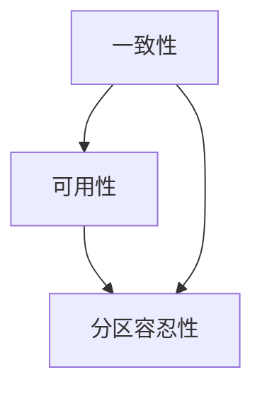
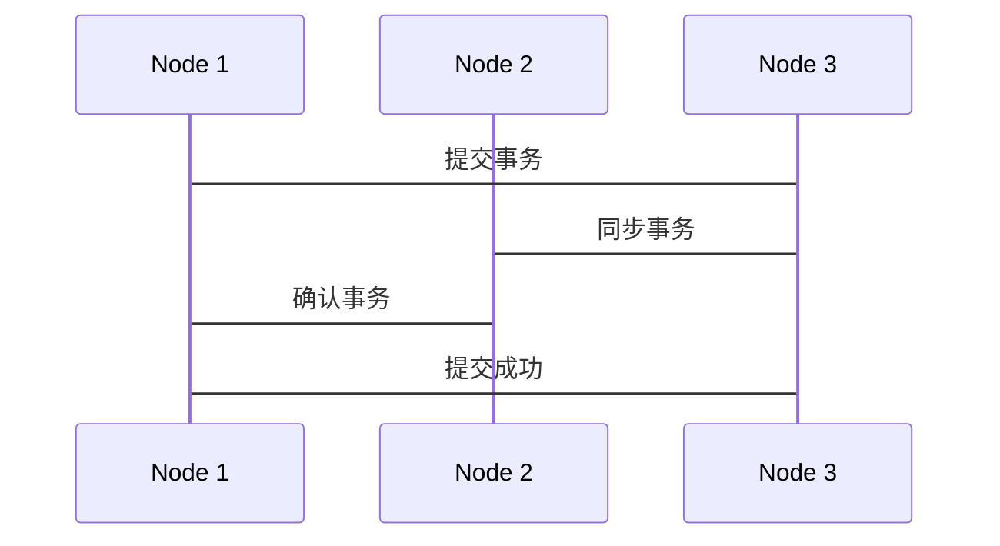
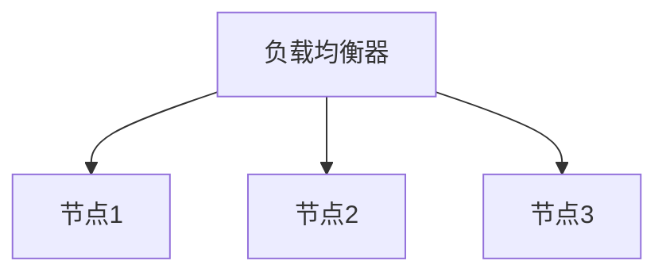
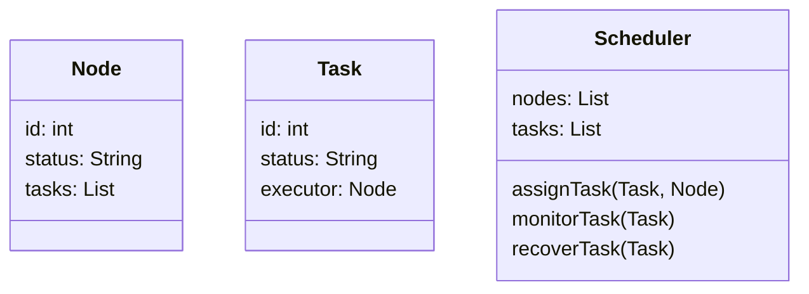
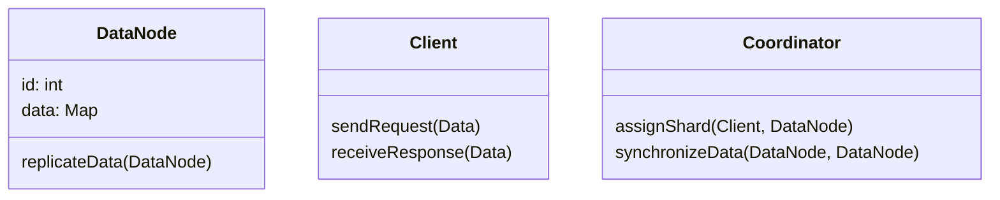

                 


# 分布式部署：构建高可用的AI Agent系统

## 关键词：
分布式系统, 高可用性, AI Agent, 网络通信, 故障恢复, 容器化部署

## 摘要：
本文详细探讨了在分布式环境下构建高可用AI Agent系统的关键技术和方法。从分布式系统的基本概念到高可用性系统的设计原则，从网络通信与协调机制到故障检测与恢复策略，系统性地分析了如何确保AI Agent系统在分布式环境下的稳定运行。通过实际案例和代码实现，深入讲解了分布式部署的核心算法与架构设计，帮助读者全面掌握构建高可用AI Agent系统的必备技能。

---

# 第1章: 分布式部署与高可用性的概念

## 1.1 分布式系统的基本概念

### 1.1.1 分布式系统的定义
分布式系统是由多个独立的计算机（节点）通过网络通信协同工作，共同完成特定任务的系统。与集中式系统相比，分布式系统具有更高的扩展性和容错能力。

### 1.1.2 分布式系统的核心特点
- **独立性**：每个节点独立运行，具有自己的资源和计算能力。
- **通信性**：通过网络进行节点间的通信与数据交换。
- **一致性**：确保所有节点的数据同步和一致。
- **容错性**：能够容忍部分节点故障，保证系统整体可用。

### 1.1.3 分布式系统与集中式系统的对比
| 特性                | 分布式系统                          | 集中式系统                          |
|---------------------|------------------------------------|-------------------------------------|
| 资源分配            | 分散式资源分配                     | 集中式资源分配                     |
| 可扩展性            | 高扩展性                           | 低扩展性                           |
| 容错性               | 高容错性                           | 低容错性                           |
| 复杂性               | 系统设计复杂                      | 系统设计相对简单                   |

---

## 1.2 高可用性系统的定义与目标

### 1.2.1 高可用性的定义
高可用性系统是指在发生故障时，能够快速恢复并保持服务连续性，确保系统在故障后短时间内恢复正常运行。

### 1.2.2 高可用性系统的设计原则
1. **冗余设计**：通过冗余组件（如备用节点、副本数据）确保系统在部分节点故障时仍能正常运行。
2. **故障隔离**：通过故障检测机制快速隔离故障节点，防止故障扩散。
3. **自动恢复**：系统能够在故障后自动启动备用组件，恢复服务。

### 1.2.3 高可用性与容错性的区别
- **高可用性**：关注系统的整体可用性，通过冗余和快速恢复来减少停机时间。
- **容错性**：关注系统的容错能力，通过检测和修复来防止错误发生或影响。

---

## 1.3 AI Agent系统的背景与需求

### 1.3.1 AI Agent的基本概念
AI Agent是一种智能体，能够感知环境、自主决策并执行任务。在分布式环境中，AI Agent需要与其他节点协同工作，完成复杂的任务。

### 1.3.2 分布式AI Agent系统的应用场景
- **分布式计算**：通过多个AI Agent协同完成大规模计算任务。
- **分布式推理**：多个AI Agent协作完成复杂的推理任务。
- **分布式学习**：多个AI Agent协同学习，提升整体性能。

### 1.3.3 高可用性在AI Agent系统中的重要性
在分布式AI Agent系统中，任何一个节点的故障都可能导致整个系统的性能下降或任务失败。因此，高可用性设计是确保系统稳定运行的关键。

---

## 1.4 本章小结
本章从分布式系统的基本概念出发，详细介绍了高可用性系统的定义与设计原则，并结合AI Agent系统的实际需求，阐述了分布式部署与高可用性的重要性。

---

# 第2章: 分布式系统的核心概念与原理

## 2.1 分布式系统中的CAP定理

### 2.1.1 CAP定理的定义
CAP定理指出，在分布式系统中，一致性（Consistency）、可用性（Availability）、分区容忍性（Partition Tolerance）三者无法同时满足。

### 2.1.2 一致性、可用性、分区容忍性的权衡
- **一致性**：所有节点看到的数据一致。
- **可用性**：系统在任何情况下都能提供服务。
- **分区容忍性**：系统在网络分区的情况下仍能正常运行。

### 2.1.3 CAP定理在分布式系统设计中的应用
在实际应用中，通常会根据业务需求选择合适的权衡策略。例如，对于金融系统，一致性优先；对于电商系统，可用性优先。



---

## 2.2 分布式系统中的数据一致性

### 2.2.1 数据一致性的重要性
数据一致性是分布式系统的核心要求之一，确保所有节点的数据同步。

### 2.2.2 副本一致性模型
- **强一致性**：所有节点的数据完全一致。
- **弱一致性**：节点数据逐步同步，允许一定程度的延迟。

### 2.2.3 一致性协议（如Paxos、Raft）
- **Paxos协议**：通过选举领导者和分布式一致性算法确保数据一致性。
- **Raft协议**：通过领导者选举和日志复制实现一致性。



---

## 2.3 分布式系统中的网络通信

### 2.3.1 网络模型
分布式系统中的网络通信通常基于客户机-服务器模型或对等网络模型。

### 2.3.2 RPC与远程调用机制
- **远程过程调用（RPC）**：通过网络实现函数调用。
- **HTTP/HTTPS**：基于Web的通信方式。

### 2.3.3 网络分区与故障处理
- **网络分区**：网络故障导致部分节点无法通信。
- **故障处理**：通过断路器模式和重试机制应对网络分区。

---

## 2.4 本章小结
本章详细探讨了分布式系统的核心概念与原理，包括CAP定理、数据一致性、网络通信与故障处理。

---

# 第3章: 高可用性系统的设计原则

## 3.1 高可用性系统的核心要素

### 3.1.1 系统组件的冗余设计
- **冗余节点**：通过冗余节点确保系统在部分节点故障时仍能正常运行。
- **冗余数据**：通过数据副本确保数据的可靠性。

### 3.1.2 故障隔离与容错机制
- **故障隔离**：通过检测和隔离故障节点，防止故障扩散。
- **容错机制**：通过冗余组件恢复故障。

### 3.1.3 自动恢复与自我修复能力
- **自动重启**：节点故障后自动重启。
- **自动负载均衡**：动态调整系统负载，确保资源合理分配。

---

## 3.2 高可用性系统中的负载均衡

### 3.2.1 负载均衡的定义与作用
- **负载均衡**：将请求均匀分配到多个节点，避免单点过载。
- **作用**：提高系统吞吐量，减少响应时间。

### 3.2.2 常见的负载均衡算法
- **轮询算法**：按顺序将请求分配到各个节点。
- **随机算法**：随机选择节点分配请求。
- **加权算法**：根据节点性能分配请求。



---

## 3.3 高可用性系统中的容灾备份

### 3.3.1 容灾备份的定义与目标
- **容灾备份**：通过备份和恢复机制确保系统在灾难性故障后仍能恢复。
- **目标**：最小化数据丢失，快速恢复服务。

### 3.3.2 数据备份与恢复策略
- **增量备份**：只备份数据的增量部分。
- **全量备份**：备份所有数据。
- **恢复策略**：根据备份数据快速恢复系统。

### 3.3.3 系统故障的快速恢复机制
- **故障检测**：通过心跳机制检测节点状态。
- **故障恢复**：自动启动备用节点，接管故障节点的任务。

---

## 3.4 本章小结
本章从高可用性系统的设计原则出发，详细探讨了冗余设计、负载均衡和容灾备份等关键技术和策略。

---

# 第4章: 分布式部署中的通信与协调

## 4.1 分布式系统中的通信机制

### 4.1.1 消息传递
- **点对点通信**：节点之间直接通信。
- **广播通信**：单节点向所有节点发送消息。

### 4.1.2 通信协议的选择与设计
- **TCP/IP**：常用通信协议。
- **HTTP/HTTPS**：基于Web的通信协议。

### 4.1.3 通信中的可靠性与效率问题
- **可靠性**：确保消息正确传输。
- **效率**：减少通信延迟和带宽占用。

---

## 4.2 分布式系统中的协调问题

### 4.2.1 协调问题的定义
- **协调问题**：分布式系统中多个节点如何达成一致。

### 4.2.2 常见的协调算法
- **两阶段提交（2PC）**：确保分布式事务的原子性。
- **三阶段提交（3PC）**：优化两阶段提交的算法。

```mermaid
sequenceDiagram
    participant C as 协调者
    participant N1, N2, N3 as 参与者
    C->N1,N2,N3: 发起事务
    N1->C: 提交事务
    C->N2,N3: 提交事务
    N2->C: 提交事务
    C->N3: 提交事务
```

---

## 4.3 分布式系统中的锁机制

### 4.3.1 分布式锁的定义与作用
- **分布式锁**：用于控制对共享资源的访问。
- **作用**：避免多个节点同时修改同一资源导致的数据不一致。

### 4.3.2 常见的分布式锁实现方式
- **基于数据库的锁**：使用数据库事务实现锁。
- **基于Redis的锁**：通过Redis实现分布式锁。

### 4.3.3 分布式锁的性能优化
- ** lease（租约）机制**：通过 lease 管理锁的有效期。
- **乐观锁**：通过版本号实现锁的无阻塞。

---

## 4.4 本章小结
本章详细探讨了分布式系统中的通信与协调问题，包括消息传递、协调算法和锁机制。

---

# 第5章: 高可用性系统中的故障检测与恢复

## 5.1 故障检测的定义与方法

### 5.1.1 故障检测的基本概念
- **故障检测**：通过监控系统状态发现故障。

### 5.1.2 常见的故障检测技术
- **心跳机制**：节点定期发送心跳信号，检测是否存活。
- **状态监控**：监控节点的资源使用情况和系统状态。

---

## 5.2 故障恢复机制

### 5.2.1 故障隔离
- **断路器模式**：检测到故障后，断开故障节点的连接，防止故障扩散。

### 5.2.2 故障恢复
- **自动重启**：故障节点自动重启，恢复服务。
- **负载转移**：将故障节点的任务转移到其他节点。

---

## 5.3 系统恢复策略

### 5.3.1 快速恢复
- **自动故障恢复**：系统在故障后快速启动备用节点，恢复服务。

### 5.3.2 恢复测试
- **回滚机制**：在恢复失败时，回滚到之前的稳定状态。

---

## 5.4 本章小结
本章从故障检测到故障恢复，详细探讨了高可用性系统中的故障处理策略。

---

# 第6章: 分布式部署与高可用AI Agent系统的实现

## 6.1 分布式任务调度系统

### 6.1.1 系统介绍
- **分布式任务调度系统**：通过分布式部署实现任务的高效调度。

### 6.1.2 系统功能设计
- **任务分配**：将任务分配到多个节点。
- **任务监控**：监控任务执行状态。
- **任务恢复**：任务失败后自动恢复。

### 6.1.3 系统架构设计



---

## 6.2 分布式数据存储系统

### 6.2.1 系统介绍
- **分布式数据存储系统**：通过分布式存储实现数据的高效管理和访问。

### 6.2.2 系统功能设计
- **数据分片**：将数据分成多个片，存储在不同的节点。
- **数据同步**：确保所有节点的数据一致。
- **数据冗余**：通过副本机制提高数据可靠性。

### 6.2.3 系统架构设计



---

## 6.3 项目实战

### 6.3.1 环境安装
- **分布式系统环境**：搭建多台节点，配置网络通信。
- **开发工具**：安装必要的开发工具，如Python、Docker等。

### 6.3.2 系统核心实现源代码

#### 6.3.2.1 分布式任务调度系统实现

```python
import threading
import logging

class Node:
    def __init__(self, id):
        self.id = id
        self.status = "active"
        self.tasks = []

class Task:
    def __init__(self, id):
        self.id = id
        self.status = "pending"
        self.executor = None

class Scheduler:
    def __init__(self, nodes):
        self.nodes = nodes
        self.tasks = []

    def assign_task(self, task, node):
        node.tasks.append(task)
        task.executor = node
        logging.info(f"Task {task.id} assigned to node {node.id}")

    def monitor_task(self, task):
        if task.status == "failed":
            self.recover_task(task)

    def recover_task(self, task):
        for node in self.nodes:
            if node != task.executor:
                self.assign_task(task, node)
                break
```

#### 6.3.2.2 分布式数据存储系统实现

```python
import redis

class DataNode:
    def __init__(self, id):
        self.id = id
        self.data = {}
        self.replicas = []

    def replicate_data(self, other):
        self.data.update(other.data)

class Coordinator:
    def __init__(self, nodes):
        self.nodes = nodes

    def assign_shard(self, client, node):
        # 分片逻辑
        pass

    def synchronize_data(self, node1, node2):
        node2.replicas.append(node1)
        node1.replicate_data(node2)
```

---

## 6.4 本章小结
本章通过实际案例，详细讲解了分布式部署与高可用AI Agent系统的实现，包括任务调度系统和数据存储系统的实现。

---

# 第7章: 分布式部署与高可用系统的最佳实践

## 7.1 分布式系统设计的注意事项

### 7.1.1 网络通信优化
- **减少网络开销**：通过压缩和缓存减少网络通信量。
- **负载均衡优化**：合理分配负载，避免热点效应。

### 7.1.2 数据一致性优化
- **选择合适的一致性模型**：根据业务需求选择强一致性或弱一致性。
- **优化一致性协议**：通过改进一致性算法减少通信开销。

---

## 7.2 高可用系统设计的注意事项

### 7.2.1 冗余设计
- **冗余节点**：确保关键组件有冗余。
- **冗余数据**：通过副本确保数据可靠性。

### 7.2.2 故障恢复优化
- **快速故障检测**：通过心跳机制和状态监控快速检测故障。
- **快速故障恢复**：通过自动重启和负载转移快速恢复服务。

---

## 7.3 分布式系统部署的注意事项

### 7.3.1 容器化部署
- **Docker**：通过容器化技术实现分布式系统的快速部署。
- **Kubernetes**：通过Kubernetes实现分布式系统的自动化运维。

### 7.3.2 监控与日志
- **监控系统**：通过监控工具实时监控系统状态。
- **日志系统**：通过日志分析故障原因和系统运行状态。

---

## 7.4 本章小结
本章总结了分布式部署与高可用系统设计中的最佳实践，包括网络通信优化、数据一致性优化、冗余设计和故障恢复优化。

---

# 作者：AI天才研究院/AI Genius Institute & 禅与计算机程序设计艺术 /Zen And The Art of Computer Programming

---

以上是《分布式部署：构建高可用的AI Agent系统》的技术博客文章目录大纲和部分正文内容。希望这篇文章能够帮助读者全面了解分布式部署与高可用系统的实现原理和设计方法。

