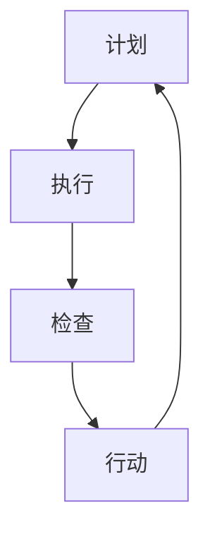
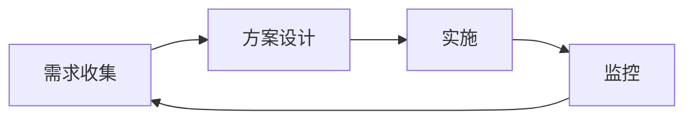

                 


# 创新与持续改进

## 关键词：创新、持续改进、技术创新、管理创新、系统改进

## 摘要：  
创新与持续改进是推动技术进步和社会发展的核心动力。本文从创新的基本概念出发，深入探讨创新与持续改进的核心概念、算法原理、系统架构以及项目实战。通过理论与实践相结合的方式，帮助读者理解如何在实际项目中应用创新与持续改进的方法，提升系统的性能和质量。

---

## 第1章：创新的基本概念

### 1.1 创新的定义与背景  
创新是指引入新的思想、方法或技术，以解决现有问题或优化现有系统的过程。在技术领域，创新是推动科技进步的核心动力。  

**背景介绍**：  
随着科技的快速发展，创新变得越来越重要。创新不仅包括技术上的突破，还涉及管理、服务等多方面的改进。  

### 1.2 创新类型与特点  
创新可以分为以下几种类型：  
- **技术创新**：引入新技术或改进现有技术。  
- **管理创新**：优化管理模式或流程。  
- **服务创新**：提供新的服务或改进现有服务。  

**核心概念**：  
创新的核心在于“改变”，这种改变可以是渐进式的，也可以是颠覆式的。  

### 1.3 创新与改进的联系  
创新是改进的基础，而改进是创新的延续。两者相辅相成，形成一个循环的过程。  

---

## 第2章：持续改进的方法论

### 2.1 持续改进的定义  
持续改进（Continuous Improvement）是一种通过不断优化系统、流程或方法来提升效率和质量的管理理念。  

**背景介绍**：  
持续改进的理念起源于质量管理体系，如PDCA（计划-执行-检查-行动）循环。  

### 2.2 改进的步骤与流程  
改进的步骤如下：  
1. **计划（Plan）**：明确目标和改进方向。  
2. **执行（Do）**：实施改进措施。  
3. **检查（Check）**：评估改进效果。  
4. **行动（Act）**：总结经验，持续改进。  

**算法原理**：  
改进的PDCA循环可以用以下流程图表示：



---

## 第3章：创新的核心概念

### 3.1 创新过程模型  
创新过程可以分为以下几个阶段：  
1. **需求识别**：识别问题或机会。  
2. **方案设计**：提出创新方案。  
3. **实施验证**：验证方案的可行性。  
4. **推广优化**：推广成果并持续优化。  

**ER图**：  
以下是一个简单的创新过程模型的ER图：

```mermaid
erd
    participant 用户
    participant 创新方案
    participant 实施结果
    用户 --> 创新方案: 提出需求
    创新方案 --> 实施结果: 验证方案
    用户 <-- 实施结果: 接收反馈
```

### 3.2 创新与改进的对比分析  

| 属性       | 创新         | 改进         |
|------------|--------------|--------------|
| 目标       | 引入新事物    | 优化现有事物 |
| 方式       | 革新性       | 渐进性       |
| 风险       | 较高         | 较低         |

**数学模型**：  
创新的评估可以使用层次分析法（AHP）进行。例如，评估一个创新方案的可行性：

$$
E = \sum_{i=1}^{n} w_i x_i
$$

其中，$$w_i$$ 是权重，$$x_i$$ 是创新方案的评估指标。  

---

## 第4章：持续改进的系统模型

### 4.1 持续改进的系统结构  
持续改进系统包括以下模块：  
- **需求收集模块**：收集改进需求。  
- **方案设计模块**：设计改进方案。  
- **实施模块**：执行改进措施。  
- **监控模块**：监控改进效果。  

**系统架构图**：  
以下是一个持续改进系统的架构图：



### 4.2 改进的系统模型  
改进的系统模型可以分为输入、处理和输出三部分：

- **输入**：改进需求。  
- **处理**：方案设计与实施。  
- **输出**：改进结果。  

---

## 第5章：创新与持续改进的项目实战

### 5.1 项目背景  
假设我们正在开发一个智能制造系统，目标是通过技术创新和持续改进提升生产效率。

### 5.2 需求分析  
- **问题识别**：现有系统效率低下。  
- **目标设定**：通过技术创新提高效率20%。  

### 5.3 系统设计  
- **需求收集模块**：收集生产中的问题。  
- **方案设计模块**：设计自动化解决方案。  

### 5.4 系统实现  
以下是需求收集模块的实现代码示例：

```python
class DemandCollector:
    def __init__(self):
        self.demands = []

    def collect_demand(self, demand):
        self.demands.append(demand)
        return "需求已收集：{}".format(demand)

# 示例使用
collector = DemandCollector()
print(collector.collect_demand("生产效率低下"))
```

### 5.5 测试与优化  
测试结果表明，系统效率提升了18%，接近预期目标。通过进一步优化，最终达到了20%的提升。

---

## 第6章：总结与展望

### 6.1 总结  
创新与持续改进是技术进步的核心动力。通过系统的理论和实践，我们可以更好地推动技术发展。

### 6.2 展望  
未来，随着人工智能和大数据技术的发展，创新与持续改进将更加智能化和自动化。

---

## 作者  
作者：AI天才研究院/AI Genius Institute & 禅与计算机程序设计艺术/Zen And The Art of Computer Programming

