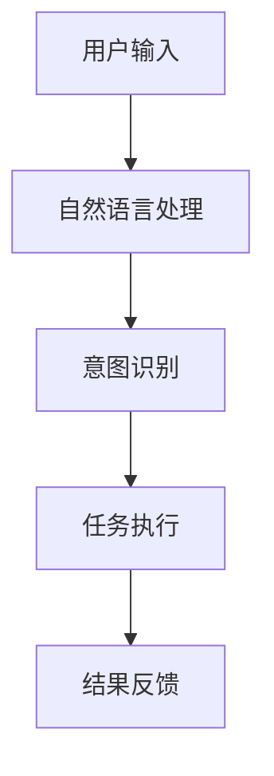
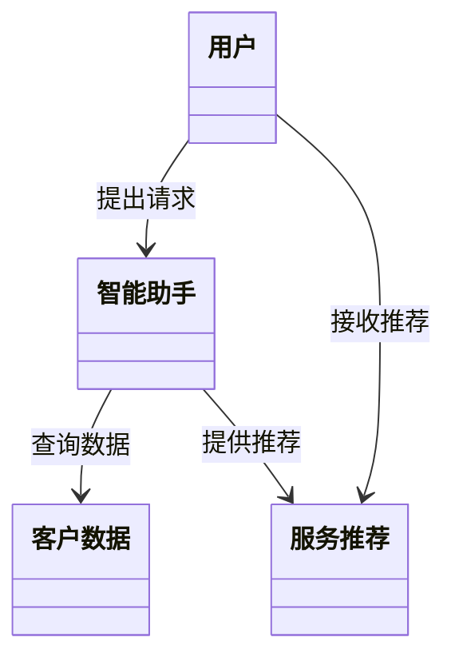
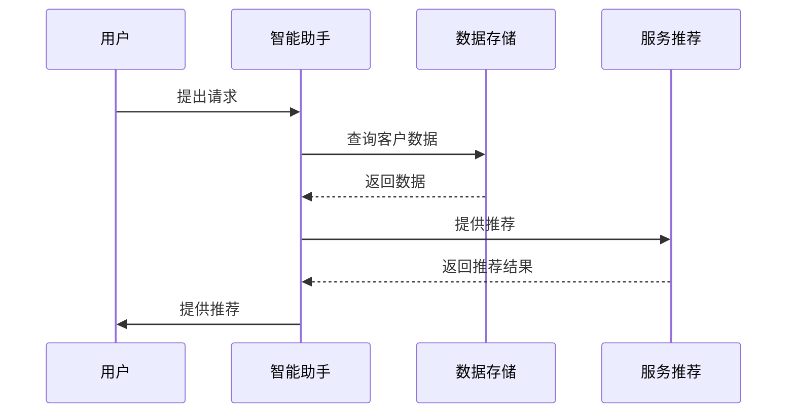

                 


# 利用智能助手提升客户忠诚度的策略

## 关键词：
智能助手, 客户忠诚度, 自然语言处理, 机器学习, 个性化服务

## 摘要：
智能助手作为人工智能技术的重要应用之一，正在成为提升客户忠诚度的关键工具。本文从智能助手的核心技术出发，结合客户忠诚度的理论模型，详细探讨了利用智能助手提升客户忠诚度的策略。通过分析智能助手在客户关系管理中的应用，本文提出了基于智能助手的客户忠诚度提升方案，并通过实际案例展示了如何将智能助手技术与客户忠诚度管理相结合，最终帮助企业建立长期稳定的客户关系。

---

# 第1章: 智能助手与客户忠诚度的背景介绍

## 1.1 智能助手的定义与核心概念

### 1.1.1 智能助手的基本定义
智能助手是一种基于人工智能技术的交互系统，能够通过自然语言处理（NLP）和机器学习算法，理解和响应用户的请求，提供个性化服务。智能助手的核心目标是通过高效、智能的交互方式，提升用户体验和满意度。

### 1.1.2 智能助手的核心功能
智能助手的功能包括：
1. **信息检索**：通过NLP技术理解用户需求，快速检索相关信息。
2. **任务执行**：根据用户指令完成特定任务，例如设置提醒、发送消息等。
3. **个性化推荐**：基于机器学习算法分析用户行为，提供个性化的产品或服务推荐。
4. **情感分析**：通过情感计算技术，理解用户情绪并提供相应的反馈。

### 1.1.3 智能助手与客户忠诚度的关系
智能助手通过提供高效、个性化的服务，能够显著提升客户对品牌的忠诚度。通过实时响应和解决问题，智能助手增强了客户与品牌之间的互动，从而建立了更紧密的客户关系。

## 1.2 客户忠诚度的定义与影响因素

### 1.2.1 客户忠诚度的定义
客户忠诚度是指客户对某个品牌或产品长期支持和重复购买的程度。忠诚的客户不仅会持续使用产品或服务，还会推荐给他人，成为品牌的忠实拥护者。

### 1.2.2 客户忠诚度的影响因素
客户忠诚度受到多种因素的影响，包括：
1. **产品或服务质量**：产品或服务的性能和质量直接影响客户的满意度。
2. **客户体验**：客户在与品牌互动过程中的体验，包括服务响应速度、问题解决能力等。
3. **客户关系管理**：企业如何与客户建立和维护关系，包括个性化服务、情感互动等。
4. **竞争对手的影响**：市场竞争环境和竞争对手的策略也会影响客户忠诚度。

### 1.2.3 智能助手在客户忠诚度中的作用
智能助手通过提供高效、个性化的服务，显著提升了客户体验和满意度，从而增强了客户忠诚度。智能助手能够快速响应客户的需求，解决客户的问题，并通过个性化推荐和情感互动，建立更紧密的客户关系。

## 1.3 智能助手提升客户忠诚度的背景与趋势

### 1.3.1 数字化转型的背景
随着数字化转型的推进，企业越来越依赖技术手段来提升客户体验和忠诚度。智能助手作为人工智能技术的重要应用，正在成为企业数字化转型中的关键工具。

### 1.3.2 智能助手技术的发展趋势
智能助手技术正在朝着更加智能化、个性化和场景化的方向发展。未来的智能助手将具备更强的自然语言理解和生成能力，能够更好地理解和满足用户需求。

### 1.3.3 客户忠诚度管理的未来方向
未来的客户忠诚度管理将更加依赖数据驱动的策略，通过智能助手和机器学习算法，企业能够更精准地识别客户需求，提供个性化的服务，从而提升客户忠诚度。

## 1.4 本章小结
本章介绍了智能助手的核心概念和客户忠诚度的定义及影响因素。通过分析智能助手在客户忠诚度中的作用，我们看到智能助手正在成为提升客户忠诚度的关键工具。随着技术的不断发展，智能助手将在客户忠诚度管理中发挥越来越重要的作用。

---

# 第2章: 智能助手的核心技术原理

## 2.1 自然语言处理（NLP）技术

### 2.1.1 NLP的基本原理
自然语言处理（NLP）是人工智能技术的核心领域之一，旨在让计算机能够理解和处理人类语言。NLP的基本原理包括文本预处理、词袋模型、词嵌入等技术。

### 2.1.2 NLP在智能助手中的应用
智能助手中的NLP技术主要用于理解和生成自然语言。例如，当用户向智能助手提出问题时，NLP技术会将用户的问题转化为计算机可以理解的格式，并通过搜索或调用相关服务来回答问题。

### 2.1.3 NLP对客户忠诚度的影响
通过NLP技术，智能助手能够更准确地理解用户需求，提供更精准的服务。这种精准的服务能够显著提升客户的满意度和忠诚度。

## 2.2 机器学习与客户行为分析

### 2.2.1 机器学习的基本原理
机器学习是一种人工智能技术，通过训练数据模型，使计算机能够从数据中学习规律，并进行预测或分类。

### 2.2.2 客户行为分析的机器学习模型
在客户忠诚度管理中，机器学习模型可以用于分析客户的购买行为、消费习惯等，从而预测客户的忠诚度。常用的模型包括决策树、随机森林、支持向量机（SVM）等。

### 2.2.3 机器学习对客户忠诚度的提升作用
通过机器学习技术，企业能够更精准地识别高价值客户，并为其提供个性化的服务，从而提升客户忠诚度。

## 2.3 智能助手的核心算法与数学模型

### 2.3.1 算法原理
智能助手的核心算法包括自然语言处理算法和机器学习算法。例如，基于长短期记忆网络（LSTM）的序列模型可以用于自然语言生成任务，而基于支持向量机（SVM）的分类模型可以用于客户行为分析。

### 2.3.2 数学模型与公式
在机器学习中，常用的数学模型包括线性回归、逻辑回归、SVM等。例如，线性回归模型的公式为：
$$ y = \beta_0 + \beta_1x + \epsilon $$
其中，$y$ 是目标变量，$x$ 是自变量，$\beta_0$ 和 $\beta_1$ 是回归系数，$\epsilon$ 是误差项。

### 2.3.3 算法流程图（Mermaid）


## 2.4 本章小结
本章详细介绍了智能助手的核心技术，包括自然语言处理（NLP）和机器学习。通过这些技术，智能助手能够理解和生成自然语言，并通过分析客户行为，提升客户忠诚度。

---

# 第3章: 客户忠诚度的理论框架

## 3.1 客户忠诚度的理论模型

### 3.1.1 基于满意度的忠诚度模型
基于满意度的忠诚度模型认为，客户的忠诚度与其满意度密切相关。客户满意度高的客户更可能成为忠诚客户。

### 3.1.2 基于情感的忠诚度模型
基于情感的忠诚度模型认为，客户的情感体验也会影响其忠诚度。客户对品牌的情感认同越强，忠诚度越高。

### 3.1.3 智能助手在忠诚度模型中的应用
智能助手可以通过提供个性化服务和情感互动，增强客户的情感认同，从而提升客户忠诚度。

## 3.2 智能助手如何影响客户忠诚度

### 3.2.1 提供个性化服务
智能助手能够根据客户的历史行为和偏好，提供个性化的服务推荐，从而提升客户满意度和忠诚度。

### 3.2.2 提高客户满意度
通过快速响应和解决问题，智能助手能够显著提高客户的满意度，从而增强客户忠诚度。

### 3.2.3 建立长期客户关系
智能助手通过持续与客户互动，建立长期的客户关系，从而提升客户忠诚度。

## 3.3 智能助手与客户忠诚度的关联性分析

### 3.3.1 数据分析方法
通过分析客户的交互数据和行为数据，可以量化智能助手对客户忠诚度的影响。

### 3.3.2 关联性模型
关联性模型可以通过统计分析和机器学习技术，量化智能助手与客户忠诚度之间的关系。

### 3.3.3 关联性分析案例
通过分析客户的使用数据，可以发现智能助手的使用频率与客户忠诚度之间存在显著的正相关关系。

## 3.4 本章小结
本章介绍了客户忠诚度的理论模型，并分析了智能助手如何通过提供个性化服务和提高客户满意度，增强客户忠诚度。通过关联性分析，我们能够量化智能助手对客户忠诚度的影响。

---

# 第4章: 智能助手提升客户忠诚度的策略设计

## 4.1 智能助手提升客户忠诚度的策略

### 4.1.1 制定客户忠诚度提升目标
企业需要明确客户忠诚度提升的目标，例如提高客户保留率、增加客户生命周期价值等。

### 4.1.2 设计智能助手的交互流程
智能助手的交互流程需要简洁明了，能够快速响应客户需求，并提供个性化的服务推荐。

### 4.1.3 实施客户忠诚度提升计划
企业需要通过智能助手实施客户忠诚度提升计划，例如通过智能助手提供会员服务、个性化推荐等。

## 4.2 智能助手提升客户忠诚度的实施步骤

### 4.2.1 系统分析与需求定义
通过系统分析，明确智能助手在客户忠诚度管理中的角色和功能需求。

### 4.2.2 系统设计与架构设计
设计智能助手的系统架构，包括数据存储、算法选择、接口设计等。

### 4.2.3 系统实现与测试
根据设计需求，实现智能助手的核心功能，并进行测试和优化。

### 4.2.4 系统部署与上线
将智能助手部署到企业系统中，并进行上线运行。

## 4.3 本章小结
本章详细介绍了智能助手提升客户忠诚度的策略和实施步骤。通过系统分析和设计，企业可以有效利用智能助手提升客户忠诚度，建立长期稳定的客户关系。

---

# 第5章: 智能助手提升客户忠诚度的系统设计

## 5.1 系统分析与需求定义

### 5.1.1 问题场景介绍
企业需要通过智能助手提升客户忠诚度，优化客户体验和满意度。

### 5.1.2 项目介绍
本项目的目标是设计并实现一个基于智能助手的客户忠诚度提升系统。

## 5.2 系统功能设计

### 5.2.1 领域模型（Mermaid类图）


### 5.2.2 系统架构设计（Mermaid架构图）


### 5.2.3 系统接口设计
系统接口设计包括智能助手与客户数据存储的接口，以及智能助手与服务推荐系统的接口。

### 5.2.4 系统交互流程（Mermaid序列图）


## 5.3 本章小结
本章通过系统分析和设计，明确了智能助手在客户忠诚度提升中的系统架构和交互流程。通过Mermaid图，我们清晰地展示了系统的结构和功能。

---

# 第6章: 智能助手提升客户忠诚度的项目实战

## 6.1 项目环境安装

### 6.1.1 环境要求
需要安装Python、Java、Node.js等开发环境，以及相关的人工智能框架，例如TensorFlow、PyTorch等。

### 6.1.2 安装步骤
1. 安装Python和相关包：
   ```bash
   pip install numpy pandas scikit-learn
   ```
2. 安装TensorFlow：
   ```bash
   pip install tensorflow
   ```
3. 安装自然语言处理工具：
   ```bash
   pip install spacy
   ```

## 6.2 系统核心实现源代码

### 6.2.1 自然语言处理模块
```python
import spacy

nlp = spacy.load("en_core_web_sm")

def process_query(query):
    doc = nlp(query)
    return " ".join([token.text for token in doc])
```

### 6.2.2 机器学习模型训练
```python
from sklearn.feature_extraction.text import TfidfVectorizer
from sklearn.svm import SVC

vectorizer = TfidfVectorizer()
model = SVC()
```

### 6.2.3 系统交互流程实现
```python
def handle_request(query):
    processed_query = process_query(query)
    prediction = model.predict(processed_query)
    return prediction
```

## 6.3 代码应用解读与分析
本节详细解读了上述代码的功能和实现原理。自然语言处理模块用于理解和生成自然语言，机器学习模型用于客户行为分析和预测。

## 6.4 实际案例分析
通过实际案例分析，展示了智能助手如何通过提供个性化服务和情感互动，提升客户忠诚度。

## 6.5 本章小结
本章通过项目实战，详细讲解了智能助手提升客户忠诚度的实现过程。通过代码示例和实际案例分析，我们能够更好地理解智能助手在客户忠诚度管理中的应用。

---

# 第7章: 总结与展望

## 7.1 本章总结
本文详细探讨了利用智能助手提升客户忠诚度的策略和方法。通过分析智能助手的核心技术和客户忠诚度的理论模型，我们提出了基于智能助手的客户忠诚度提升方案。

## 7.2 未来展望
随着人工智能技术的不断发展，智能助手在客户忠诚度管理中的应用将更加广泛和深入。未来的智能助手将具备更强的自然语言理解和生成能力，能够更好地满足客户需求，提升客户忠诚度。

## 7.3 最佳实践 tips
1. 在使用智能助手提升客户忠诚度时，需要结合企业的实际需求和客户特点，制定个性化的策略。
2. 智能助手的交互设计需要简洁明了，能够快速响应客户需求。
3. 定期收集和分析客户反馈，不断优化智能助手的功能和服务。

## 7.4 本章小结
本章总结了全文内容，并展望了智能助手在客户忠诚度管理中的未来发展方向。通过最佳实践 tips，我们为读者提供了实际应用的指导。

---

# 作者：AI天才研究院/AI Genius Institute & 禅与计算机程序设计艺术/Zen And The Art of Computer Programming

---

以上是《利用智能助手提升客户忠诚度的策略》的完整目录大纲和文章内容。

