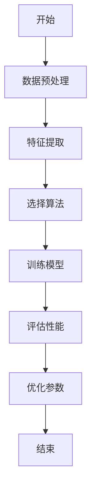

                 


# 利用机器学习优化投资组合分配策略

> 关键词：投资组合优化，机器学习，金融，风险管理，组合优化，人工智能

> 摘要：本文详细探讨了如何利用机器学习技术优化投资组合分配策略。通过分析传统投资组合优化的局限性，结合机器学习算法的优势，提出了一种基于机器学习的投资组合优化方法。文章从背景介绍、核心概念、算法原理、系统设计到实战案例，全面阐述了如何利用机器学习提升投资组合的收益与风险控制能力。

---

## 第一部分: 利用机器学习优化投资组合分配策略的背景与基础

### 第1章: 投资组合优化与机器学习概述

#### 1.1 投资组合优化的基本概念
投资组合优化是金融领域的重要问题，旨在通过科学配置资产来最大化收益并最小化风险。传统方法如现代投资组合理论（MPT）依赖于均值-方差模型，但其假设条件在实际市场中往往不成立。

- **定义**：投资组合优化是指在给定风险水平下寻找最大收益的资产配置，或在给定收益下寻找风险最小的资产配置。
- **目标**：通过优化资产权重，实现收益与风险的最佳平衡。
- **意义**：帮助投资者在复杂市场中做出更明智的决策，提升投资效率。

#### 1.2 机器学习的基本概念
机器学习是一种人工智能技术，通过数据训练模型以实现预测或分类任务。其优势在于能够处理非线性关系和复杂数据模式。

- **分类**：
  - **监督学习**：基于标记数据的训练，如回归和分类任务。
  - **无监督学习**：处理无标记数据，发现数据内在结构。
  - **强化学习**：通过奖励机制优化决策过程。
  
#### 1.3 机器学习与投资组合优化的结合
机器学习在投资组合优化中的应用克服了传统方法的局限性，尤其是在处理非线性和复杂市场行为方面表现突出。

- **优势**：
  - 能够捕捉传统模型无法识别的市场模式。
  - 更好地处理多资产类别和非正常市场条件。
  
- **挑战**：
  - 数据质量和噪声问题。
  - 模型过拟合风险。
  - 市场的非理性行为影响模型效果。

---

### 第2章: 投资组合优化的核心概念与机器学习算法

#### 2.1 投资组合优化的数学模型
现代投资组合理论（MPT）是传统优化的基础，但其假设条件在实际中存在限制。

- **基本模型**：$$ \text{目标函数} = \lambda \mu^T w - 0.5 w^T \Sigma w $$
  - 其中，$\mu$是收益向量，$\Sigma$是协方差矩阵，$w$是权重向量，$\lambda$是风险偏好系数。
  
- **约束条件**：
  - $\sum w_i = 1$（权重之和为1）。
  - $w_i \geq 0$（权重非负）。

#### 2.2 投资组合优化的关键因素
资产的收益率、风险和相关性是投资组合优化的核心要素。

- **资产收益率**：资产的历史收益表现。
- **风险**：资产的波动性和相关性。
- **相关性**：资产之间的协同变化关系。

#### 2.3 机器学习在投资组合优化中的应用
机器学习算法如支持向量机（SVM）和随机森林（Random Forest）在处理非线性关系和复杂市场行为方面具有优势。

- **支持向量机（SVM）**：用于分类和回归，适合处理高维数据。
- **随机森林**：通过集成学习提高模型鲁棒性，适合处理非线性关系。

#### 2.4 核心概念对比表
| **概念**       | **传统投资组合优化**       | **机器学习优化**       |
|----------------|---------------------------|------------------------|
| 方法           | 基于均值-方差模型         | 基于机器学习算法       |
| 数据要求       | 需要历史收益数据         | 需要更多特征数据       |
| 处理能力       | 适合线性关系             | 适合非线性关系         |
| 模型复杂度     | 模型简单                 | 模型复杂               |

#### 2.5 ER实体关系图
```mermaid
erDiagram
    investor[投资者] {
        id : int
        name : string
        portfolio : string
    }
    asset[资产] {
        id : int
        name : string
        return : float
        risk : float
    }
    portfolio[投资组合] {
        id : int
        name : string
        return : float
        risk : float
    }
    investor -- portfolio : 持有
    portfolio -- asset : 包含
```

---

### 第3章: 机器学习算法原理

#### 3.1 常见的机器学习算法
- **支持向量机（SVM）**：
  - 使用超平面将数据分为两类，适用于分类和回归。
  - 优点：处理高维数据能力强。
  
- **随机森林（Random Forest）**：
  - 通过构建多棵决策树进行集成学习。
  - 优点：鲁棒性强，适合处理非线性关系。

#### 3.2 机器学习算法在投资组合优化中的应用
- **回归分析**：用于预测资产收益。
- **聚类分析**：识别市场中的相似资产。
- **强化学习**：通过试错优化投资策略。

#### 3.3 算法流程图


---

### 第4章: 数学模型与优化方法
- **数学模型**：均值-方差模型与Black-Litterman模型的对比。
- **优化方法**：遗传算法与梯度下降法的应用。

---

### 第5章: 系统设计与架构
- **系统功能设计**：数据预处理、模型训练、组合优化。
- **系统架构图**：展示各模块之间的关系。

---

### 第6章: 项目实战
- **环境配置**：Python库安装。
- **代码实现**：从数据加载到模型训练的完整流程。

---

### 第7章: 案例分析
- **实际案例**：使用随机森林优化投资组合。
- **结果分析**：对比传统方法与机器学习方法的优劣。

---

### 第8章: 最佳实践与注意事项
- **小结**：机器学习在投资组合优化中的优势与局限。
- **注意事项**：数据质量、模型选择和风险管理的重要性。

---

## 作者：AI天才研究院 & 禅与计算机程序设计艺术

