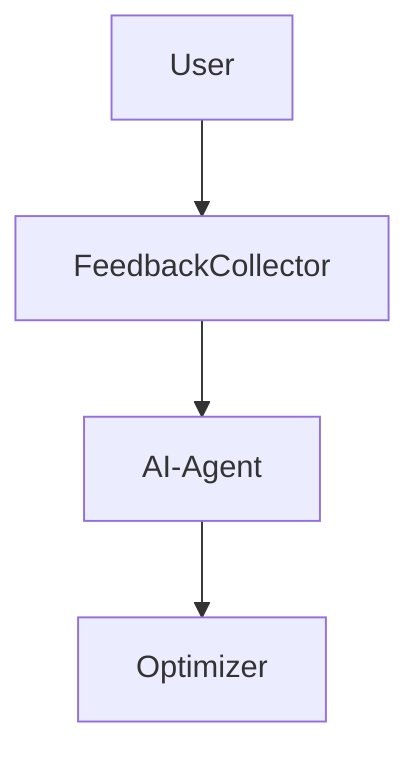
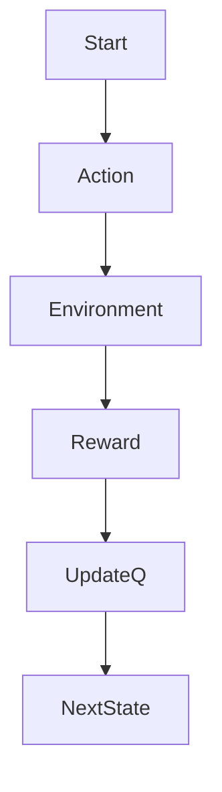
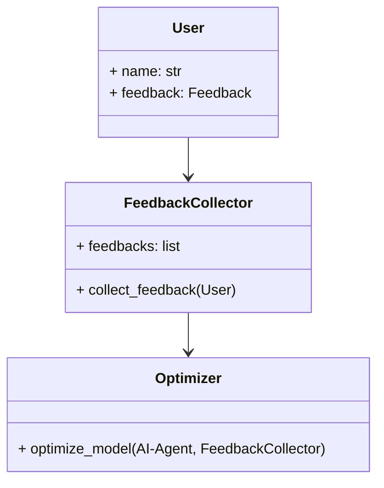
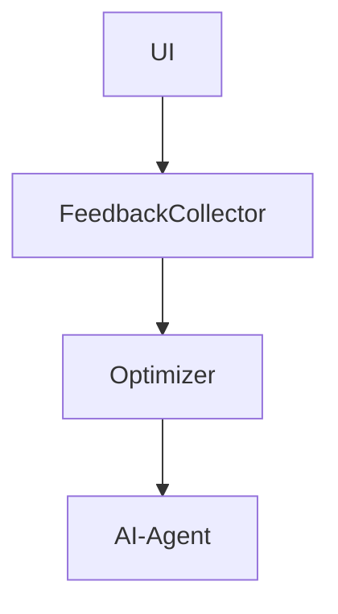

                 


# 利用用户反馈改进AI Agent的方法

> **关键词**：用户反馈，AI Agent，强化学习，反馈机制，系统优化

> **摘要**：本文系统地探讨了如何利用用户反馈来改进AI Agent的方法，从背景介绍到具体实现，详细讲解了反馈机制的原理、算法实现、系统设计及项目实战，旨在为AI开发者提供实用的指导。

---

## 第1章：背景介绍

### 1.1 问题背景

#### AI Agent的基本概念
AI Agent是一种智能代理，能够感知环境并采取行动以实现目标。它广泛应用于推荐系统、聊天机器人等领域。

#### 用户反馈的重要性
用户反馈是改进AI Agent的关键，它反映了用户的真实需求和体验，帮助AI更好地理解用户意图。

#### 当前AI Agent的局限性
AI Agent在处理复杂场景时可能表现不佳，需要通过反馈不断优化。

### 1.2 问题描述

#### 用户反馈的类型
- 显式反馈：评分、点击等
- 隐式反馈：行为数据

#### 反馈在改进AI Agent中的作用
通过反馈优化模型，提升AI的行为准确性。

### 1.3 问题解决

#### 反馈驱动的优化方法
实时反馈用于在线优化，离线反馈用于模型迭代。

### 1.4 边界与外延

#### 反馈机制的适用范围
适用于需要动态调整的场景，如聊天机器人。

#### 与其他优化方法的区别
反馈优化更具针对性和动态性。

---

## 第2章：反馈机制的原理

### 2.1 反馈机制的核心原理

#### 反馈的收集与处理流程
1. 收集反馈
2. 分析反馈
3. 应用反馈优化模型

#### 反馈驱动的自适应学习
通过反馈调整模型参数，提升性能。

### 2.2 反馈类型对比

| 反馈类型 | 特点 | 示例 |
|----------|------|------|
| 显式反馈 | 主动提供 | 用户评分 |
| 隐式反馈 | 被动收集 | 浏览行为 |

### 2.3 实体关系图



---

## 第3章：基于反馈的强化学习

### 3.1 算法原理



### 3.2 数学模型

状态、动作、奖励的定义：
$$ s \in S, a \in A, r \in R $$

动作选择策略：
$$ \pi(a|s) = \text{概率选择动作} $$

价值函数：
$$ V(s) = \max_a Q(s, a) $$

### 3.3 代码实现

```python
import numpy as np

class AI-Agent:
    def __init__(self, state_space, action_space):
        self.Q = np.zeros((state_space, action_space))
        
    def get_action(self, state):
        return np.argmax(self.Q[state])
    
    def update_Q(self, state, action, reward):
        self.Q[state][action] += 0.1*(reward + np.max(self.Q[state]))
```

---

## 第4章：系统功能设计

### 4.1 领域模型



---

## 第5章：系统架构设计

### 5.1 架构图



---

## 第6章：案例分析与项目总结

### 6.1 案例分析

通过分析用户反馈，调整推荐算法，提升推荐准确率。

### 6.2 项目总结

项目展示了如何利用反馈优化AI Agent，提升了系统性能。

---

## 第7章：最佳实践与小结

### 7.1 实践技巧

定期收集反馈，及时优化模型。

### 7.2 拓展阅读

推荐相关书籍和资源，如《强化学习实战》。

---

## 作者：AI天才研究院 & 禅与计算机程序设计艺术

---

**总结**：本文详细探讨了利用用户反馈改进AI Agent的方法，从背景到实现，为开发者提供了全面的指导。通过反馈机制、算法优化和系统设计，AI Agent的性能得到了显著提升。

