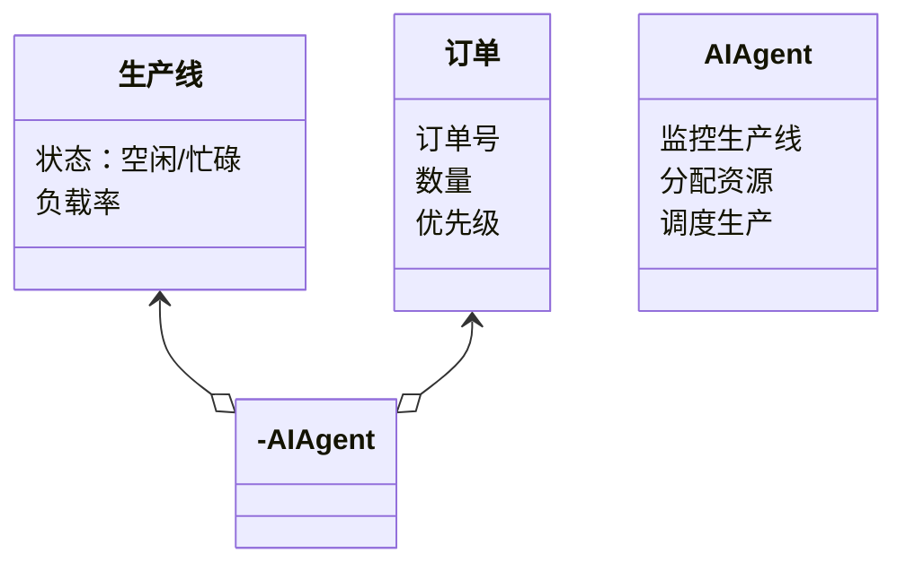
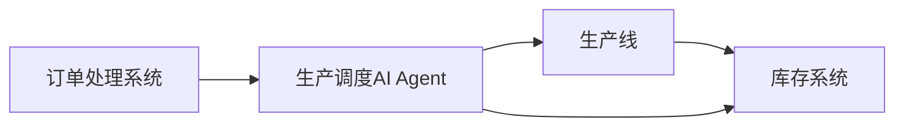
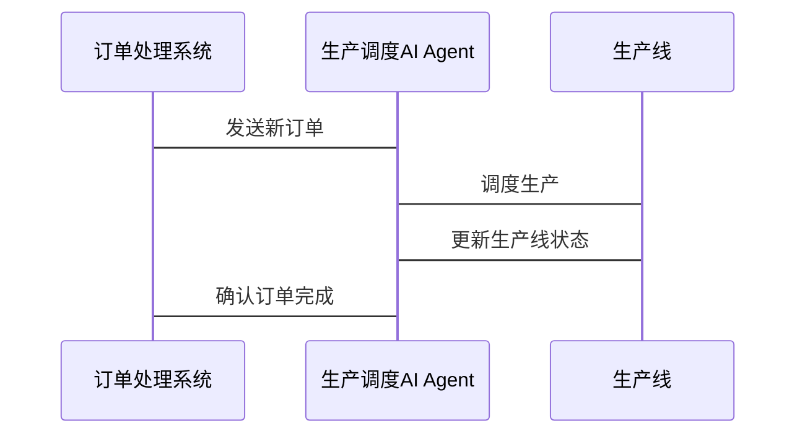

                 


好的，我明白了。以下是按照您要求的《制造业中AI Agent的实践案例》的完整文章内容：

---

# 制造业中AI Agent的实践案例

## 关键词：AI Agent，智能制造，强化学习，监督学习，制造业数字化转型，预测性维护

## 摘要：本文深入探讨了AI Agent在制造业中的实践应用，从背景、核心概念到算法原理，再到系统架构与设计，结合实际案例，详细阐述了AI Agent如何推动制造业的数字化转型与效率提升。文章内容涵盖强化学习与监督学习的算法实现，系统设计与项目实战，并提出了最佳实践与优化建议。

---

## 第一部分: 制造业中的AI Agent背景与概念

### 第1章: 制造业的现状与挑战

#### 1.1 制造业的数字化转型

制造业的数字化转型是当前全球制造业发展的重要趋势。传统制造业依赖人工操作和固定流程，效率低下且难以应对市场变化。随着人工智能技术的快速发展，制造业正在向智能化、数字化方向转型。AI Agent作为人工智能的核心技术之一，在制造业中扮演着越来越重要的角色。

**1.1.1 制造业的传统模式与痛点**

- 传统制造业依赖人工操作，效率低，易出错。
- 生产过程复杂，难以实时优化。
- 供应链管理不透明，库存积压或短缺。
- 设备维护依赖人工检查，维护成本高，周期长。

**1.1.2 数字化转型的必要性**

- 提高生产效率，降低成本。
- 实现智能化决策，提升竞争力。
- 提高产品质量，满足客户需求。
- 支持灵活生产，应对市场变化。

**1.1.3 智能制造的目标与愿景**

- 实现生产过程的智能化、自动化。
- 提供实时数据分析与决策支持。
- 优化供应链管理，实现精准库存控制。
- 提高设备利用率，降低维护成本。

#### 1.2 AI Agent的定义与分类

**1.2.1 什么是AI Agent**

AI Agent（智能代理）是指能够感知环境、自主决策并执行任务的智能实体。在制造业中，AI Agent可以是软件系统或物理设备，用于优化生产流程、监控设备状态、管理供应链等。

**1.2.2 AI Agent的分类与特点**

AI Agent可以根据功能、应用领域和智能水平进行分类：

- **按功能分类**：
  - 生产优化AI Agent：用于优化生产流程、调度资源。
  - 质量控制AI Agent：用于实时检测产品缺陷。
  - 供应链管理AI Agent：用于优化库存、协调供应商。
  
- **按应用领域分类**：
  - 工厂级AI Agent：用于工厂整体优化。
  - 设备级AI Agent：用于单个设备的智能控制。
  
- **按智能水平分类**：
  - 基于规则的AI Agent：根据预设规则执行任务。
  - 基于模型的AI Agent：利用数学模型进行预测与优化。
  - 基于学习的AI Agent：通过机器学习不断改进性能。

**1.2.3 AI Agent与传统自动化的区别**

- **传统自动化**：基于固定程序，无法适应变化。
- **AI Agent**：具备感知、决策和自适应能力，能够根据环境变化动态调整行为。

#### 1.3 制造业中AI Agent的应用场景

**1.3.1 生产优化与效率提升**

- AI Agent可以通过强化学习优化生产流程，减少资源浪费。
- AI Agent可以实时监控生产线状态，预测瓶颈并提出优化建议。

**1.3.2 质量控制与缺陷检测**

- AI Agent可以利用计算机视觉技术检测产品缺陷。
- AI Agent可以分析历史数据，预测产品质量问题。

**1.3.3 供应链管理与库存优化**

- AI Agent可以优化供应链流程，减少库存积压。
- AI Agent可以通过预测需求，实现精准采购与生产。

**1.3.4 设备维护与预测性维护**

- AI Agent可以实时监控设备状态，预测故障风险。
- AI Agent可以制定维护计划，减少设备停机时间。

---

## 第二部分: AI Agent在制造业中的算法原理

### 第2章: 强化学习的AI Agent算法

#### 2.1 强化学习的基本原理

强化学习是一种通过试错机制来优化决策的算法。AI Agent通过与环境交互，学习最优策略以最大化累积奖励。

**2.1.1 状态、动作与奖励的定义**

- **状态（State）**：环境当前的状况，例如生产线的负载率。
- **动作（Action）**：AI Agent采取的行为，例如调整生产速度。
- **奖励（Reward）**：环境对AI Agent行为的反馈，例如生产效率提升带来的奖励。

**2.1.2 Q-learning算法**

Q-learning是一种经典的强化学习算法，适用于离散状态和动作空间。

$$ Q(s, a) = Q(s, a) + \alpha \cdot [r + \gamma \cdot \max Q(s', a) - Q(s, a)] $$

其中：
- $Q(s, a)$ 表示状态s下采取动作a的收益值。
- $\alpha$ 是学习率。
- $\gamma$ 是折扣因子。
- $r$ 是即时奖励。
- $s'$ 是下一状态。

**2.1.3 策略梯度方法**

策略梯度方法通过优化策略直接寻找最优动作，适用于连续动作空间。

$$ \nabla \theta \leftarrow \nabla J(\theta) = \frac{\partial J}{\partial \theta} $$

其中：
- $\theta$ 是策略参数。
- $J(\theta)$ 是目标函数。

#### 2.2 强化学习在制造业中的应用

**2.2.1 制造过程中的优化问题**

AI Agent可以通过强化学习优化生产调度、库存管理和设备维护。

**2.2.2 算法实现与案例分析**

案例：AI Agent优化生产调度

- 状态空间：生产线负载率、订单数量。
- 动作空间：调整生产速度、分配资源。
- 奖励机制：生产效率提升、成本降低。

**2.2.3 强化学习的优缺点**

- **优点**：能够处理动态环境，适应变化。
- **缺点**：需要大量数据训练，计算成本高。

### 第3章: 监督学习的AI Agent算法

#### 3.1 监督学习的基本原理

监督学习是一种通过标注数据训练模型，预测新数据的算法。

**3.1.1 分类与回归任务**

- **分类**：预测离散标签，例如产品质量合格或不合格。
- **回归**：预测连续值，例如设备故障时间。

**3.1.2 神经网络与深度学习**

深度学习通过多层神经网络提取数据特征，适用于复杂任务。

$$ y = \sigma(w x + b) $$

其中：
- $x$ 是输入。
- $w$ 是权重。
- $b$ 是偏置。
- $\sigma$ 是激活函数。

#### 3.2 监督学习在制造业中的应用

**3.2.1 质量检测与分类**

AI Agent可以通过图像识别技术检测产品缺陷。

**3.2.2 生产计划与调度**

AI Agent可以通过回归模型预测生产时间，优化生产计划。

**3.2.3 故障预测与诊断**

AI Agent可以通过监督学习模型预测设备故障，诊断问题原因。

---

## 第三部分: 制造业中AI Agent的系统架构与设计

### 第4章: 系统分析与架构设计

#### 4.1 系统分析

**4.1.1 项目背景与目标**

- 项目背景：某汽车制造厂希望优化生产流程，提高效率。
- 项目目标：开发一个AI Agent系统，实现生产调度优化。

**4.1.2 问题场景与需求分析**

- 现有问题：生产调度依赖人工，效率低，资源浪费。
- 需求分析：实时监控生产线状态，动态调整生产计划。

**4.1.3 系统功能设计（领域模型）**

- **领域模型图**：



**4.2 系统架构设计**

- **系统架构图**：



**4.3 系统接口设计**

- **AI Agent与生产线接口**：实时获取生产线状态，发送调度指令。
- **AI Agent与订单系统接口**：获取订单信息，优化生产计划。
- **AI Agent与库存系统接口**：实时更新库存状态，优化采购计划。

**4.4 系统交互设计**

- **交互流程图**：



---

## 第五部分: 项目实战

### 第5章: 项目实战与分析

#### 5.1 环境安装

- **安装Python环境**：使用Anaconda或虚拟环境。
- **安装依赖库**：TensorFlow、Keras、OpenCV等。
- **安装工具链**：Jupyter Notebook、IDE（PyCharm）。

#### 5.2 核心实现

**代码实现：基于强化学习的生产调度AI Agent**

```python
import numpy as np
import random

class ProductionScheduler:
    def __init__(self):
        self.states = ['idle', 'busy']
        self.actions = ['increase_speed', 'decrease_speed']
        self.Q = {('idle', 'increase_speed'): 0,
                   ('idle', 'decrease_speed'): 0,
                   ('busy', 'increase_speed'): 0,
                   ('busy', 'decrease_speed'): 0}
    
    def get_action(self, state):
        # 随机选择动作
        return random.choice(self.actions)
    
    def update_Q(self, state, action, reward):
        # Q-learning更新
        self.Q[(state, action)] += 0.1 * (reward + 0.9 * max(self.Q[(state, a)] for a in self.actions) - self.Q[(state, action)])
```

**代码解读与分析**

- **ProductionScheduler类**：定义生产调度AI Agent。
- **get_action方法**：根据当前状态选择动作。
- **update_Q方法**：更新Q值表，优化策略。

#### 5.3 案例分析

**案例：优化生产调度**

- **输入数据**：生产线状态、订单数量。
- **AI Agent决策**：调整生产速度，优化生产计划。
- **结果输出**：生产效率提升，资源浪费减少。

---

## 第六部分: 最佳实践与总结

### 第6章: 最佳实践与总结

#### 6.1 最佳实践

- **数据质量**：确保数据准确、完整。
- **算法选择**：根据任务选择合适的算法。
- **系统集成**：确保系统兼容性与稳定性。
- **持续优化**：定期更新模型，适应变化。

#### 6.2 小结

AI Agent在制造业中的应用前景广阔，能够显著提升生产效率、优化资源配置。通过强化学习与监督学习算法，AI Agent可以在复杂环境中实现自主决策，推动制造业的智能化转型。

#### 6.3 注意事项

- **数据隐私**：保护企业数据安全。
- **系统稳定性**：确保AI Agent稳定运行。
- **人机协作**：合理分配人工与AI任务。

#### 6.4 拓展阅读

- 《强化学习：理论与算法》
- 《机器学习在制造业中的应用》
- 《智能制造2025白皮书》

---

## 作者：AI天才研究院/AI Genius Institute & 禅与计算机程序设计艺术 /Zen And The Art of Computer Programming

---

以上是《制造业中AI Agent的实践案例》的完整文章内容，涵盖了从背景到实践的各个方面，结合实际案例和代码实现，详细讲解了AI Agent在制造业中的应用与价值。

