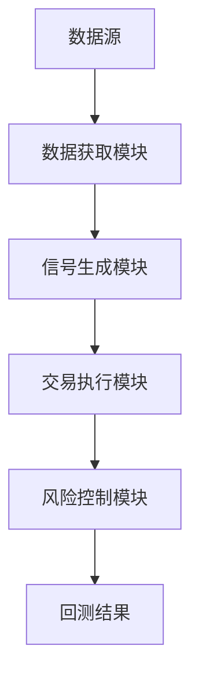
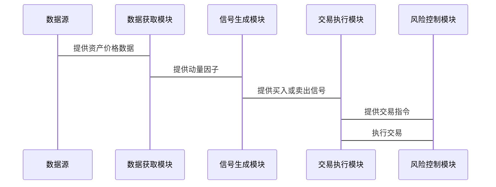

                 


# 动量投资策略：利用价格趋势获取收益

## 关键词

动量投资策略, 动量效应, 动量因子, 价格趋势, 投资收益, 金融策略

## 摘要

动量投资策略是一种基于价格趋势的投资方法，通过利用资产价格的惯性特征来获取超额收益。本文将深入探讨动量策略的核心原理、数学模型、系统架构及实际应用，从理论到实践全面解析动量投资策略。文章首先介绍动量效应的背景与概念，然后详细分析动量策略的数学模型与算法实现，接着通过系统架构设计和项目实战展示动量策略的应用过程，最后讨论动量策略的优化与扩展、风险管理和回测分析，为读者提供全面的动量投资策略指南。

---

## 第1章：动量投资策略的背景与概念

### 1.1 动量投资策略的定义

动量投资策略是一种基于资产价格趋势的投资方法，其核心思想是“趋势会延续”。动量策略的核心在于利用资产价格的惯性特征，即价格在短时间内会延续其趋势。动量策略与价值投资策略不同，后者基于资产的内在价值进行投资，而动量策略则关注价格的短期趋势。

#### 1.1.1 动量效应的定义

动量效应是指资产价格在短时间内表现出持续性特征的现象。具体来说，如果一只股票在过去一段时间内表现优异，其价格趋势可能会延续一段时间。动量效应的持续时间通常是短期的，通常为几周到几个月。

#### 1.1.2 动量策略的核心思想

动量策略的核心思想是“价格会延续其趋势”。动量策略通过识别价格趋势，利用动量效应来实现超额收益。动量策略的核心在于捕捉价格的短期趋势，通过持有趋势向上的资产来获得收益。

#### 1.1.3 动量策略与其他投资策略的对比

与价值投资策略不同，动量策略不关注资产的内在价值，而是关注价格的短期趋势。与趋势跟踪策略相比，动量策略更注重短期趋势的持续性，而趋势跟踪策略通常关注长期趋势的延续。

### 1.2 动量效应的理论基础

#### 1.2.1 动量效应的来源

动量效应的来源可以归因于以下几个方面：

1. **投资者情绪**：投资者的情绪通常会在短期内保持一致性，导致价格的延续性。
2. **市场摩擦**：市场摩擦可能导致价格的延续性，例如交易成本和信息不对称等因素。
3. **市场参与者的惯性**：市场参与者通常会在短期内保持其行为模式，导致价格的延续性。

#### 1.2.2 动量效应的数学模型

动量效应可以用以下数学模型来描述：

$$
p_t = \alpha + \beta \cdot p_{t-1} + \epsilon
$$

其中，$p_t$ 是当前的价格，$\alpha$ 是截距项，$\beta$ 是动量因子，$\epsilon$ 是误差项。如果 $\beta > 1$，则表明价格存在动量效应。

#### 1.2.3 动量效应的实证研究

实证研究表明，动量效应在股票市场中普遍存在。许多研究发现，动量策略在股票市场上能够获得超额收益。

### 1.3 动量策略的应用场景

#### 1.3.1 股票市场中的动量策略

在股票市场中，动量策略通常用于捕捉短期价格趋势。动量策略可以通过动量因子来选择表现优异的股票，并持有这些股票以获得超额收益。

#### 1.3.2 其他金融市场的动量策略

动量策略不仅适用于股票市场，还可以应用于其他金融市场，例如外汇市场和商品市场。在外汇市场中，动量策略可以通过捕捉汇率的短期趋势来实现收益。

#### 1.3.3 动量策略的适用性分析

动量策略的适用性取决于市场的流动性和交易成本。在流动性较高的市场中，动量效应通常较为显著。同时，交易成本较低的市场更适合动量策略的应用。

---

## 第2章：动量策略的核心原理

### 2.1 动量策略的核心原理

动量策略的核心原理是基于动量效应，通过识别价格趋势来实现超额收益。动量策略的关键在于选择那些价格趋势向上的资产，并持有这些资产以获得收益。

#### 2.1.1 动量因子的定义

动量因子是动量策略的核心组成部分。动量因子通常定义为资产价格的过去表现，例如过去一段时间内的收益。动量因子越大，资产的价格趋势越强。

#### 2.1.2 动量因子的计算方法

动量因子可以通过以下公式计算：

$$
MOM_t = \frac{p_t - p_{t-n}}{p_{t-n}}
$$

其中，$MOM_t$ 是动量因子，$p_t$ 是当前的价格，$p_{t-n}$ 是 $n$ 个交易日之前的收盘价。

#### 2.1.3 动量因子的特征

动量因子具有以下特征：

1. **短期性**：动量因子通常反映的是短期价格趋势。
2. **可预测性**：动量因子可以通过统计方法进行预测。
3. **可操作性**：动量因子可以通过简单的计算方法进行操作。

### 2.2 动量策略的信号生成

#### 2.2.1 动量信号的生成方法

动量信号的生成方法通常包括以下步骤：

1. 计算动量因子：计算资产价格的过去表现。
2. 确定动量信号：根据动量因子的大小确定是否生成买入或卖出信号。

#### 2.2.2 动量信号的优化策略

动量信号的优化策略包括以下内容：

1. **动量因子的优化**：选择最优的动量因子计算方法。
2. **信号生成的优化**：优化信号生成的逻辑，例如通过引入过滤器来减少虚假信号。

#### 2.2.3 动量信号的稳定性分析

动量信号的稳定性分析包括以下内容：

1. **信号的持续性**：分析动量信号的持续性，例如信号的有效时间。
2. **信号的波动性**：分析信号的波动性，例如信号的频繁程度。

### 2.3 动量策略的收益模型

#### 2.3.1 动量策略的收益来源

动量策略的收益来源包括以下方面：

1. **趋势的延续**：动量策略通过捕捉趋势的延续来实现收益。
2. **动量效应的持续性**：动量效应的持续性为动量策略提供了收益来源。

#### 2.3.2 动量策略的风险来源

动量策略的风险来源包括以下方面：

1. **动量因子的不稳定性**：动量因子的不稳定性可能导致动量策略的收益不稳定。
2. **市场波动性**：市场波动性可能影响动量策略的收益。

#### 2.3.3 动量策略的收益与风险的平衡

动量策略的收益与风险可以通过以下方式实现平衡：

1. **动量因子的优化**：通过优化动量因子来平衡收益与风险。
2. **风险控制**：通过风险控制措施来平衡动量策略的收益与风险。

---

## 第3章：动量策略的数学模型与算法实现

### 3.1 动量策略的数学模型

#### 3.1.1 动量因子的计算公式

动量因子的计算公式可以表示为：

$$
MOM_t = \frac{p_t - p_{t-n}}{p_{t-n}}
$$

其中，$MOM_t$ 是动量因子，$p_t$ 是当前的价格，$p_{t-n}$ 是 $n$ 个交易日之前的收盘价。

#### 3.1.2 动量策略的收益模型

动量策略的收益模型可以表示为：

$$
R_t = \beta \cdot MOM_t + \epsilon
$$

其中，$R_t$ 是动量策略的收益，$\beta$ 是回归系数，$\epsilon$ 是误差项。

#### 3.1.3 动量策略的优化模型

动量策略的优化模型可以表示为：

$$
\max \beta \cdot MOM_t - \lambda \cdot Var(R_t)
$$

其中，$\lambda$ 是风险调整因子，$Var(R_t)$ 是动量策略收益的方差。

### 3.2 动量策略的算法实现

#### 3.2.1 动量因子的计算

以下是动量因子的计算代码示例：

```python
import pandas as pd

# 计算动量因子
def calculate_momentum(close_prices, n):
    momentum = close_prices / close_prices.shift(n)
    return momentum

# 示例数据
close_prices = pd.Series([100, 102, 105, 108, 110, 112])
n = 3

# 计算动量因子
momentum = calculate_momentum(close_prices, n)
print(momentum)
```

#### 3.2.2 动量策略的信号生成

以下是动量策略的信号生成代码示例：

```python
import pandas as pd

# 生成动量信号
def generate_momentum_signal(momentum, threshold):
    signal = pd.Series([1 if m > threshold else 0 for m in momentum])
    return signal

# 示例数据
close_prices = pd.Series([100, 102, 105, 108, 110, 112])
n = 3
threshold = 1.02

# 计算动量因子
momentum = calculate_momentum(close_prices, n)
# 生成动量信号
signal = generate_momentum_signal(momentum, threshold)
print(signal)
```

#### 3.2.3 动量策略的回测分析

以下是动量策略的回测分析代码示例：

```python
import backtrader as bt

# 定义动量策略
class MomentumStrategy(bt.Strategy):
    def __init__(self, momentum_window):
        self.momentum_window = momentum_window
        self.add_indicator(bt.indicators.Momentum(self.datas[0], period=momentum_window))

    def next(self):
        # 简单的动量策略：如果动量指标大于0，则买入
        if self.datas[0].indicators.Momentum[-1] > 0:
            self.buy()
        else:
            self.sell()

# 初始化回测环境
cerebro = bt.Cerebro()
cerebro.addstrategy(MomentumStrategy, momentum_window=10)
cerebro.broker.setcash(10000.0)
data = bt.feeds.YahooFinanceData(
    dataname='AAPL',
    fromdate=bt.utils.date.num2date(20230101),
    todate=bt.utils.date.num2date(20231231)
)
cerebro.adddata(data)

# 运行回测
cerebro.run()
```

---

## 第4章：动量策略的系统分析与架构设计

### 4.1 动量策略的系统架构设计

#### 4.1.1 系统功能设计

动量策略的系统架构设计包括以下几个模块：

1. **数据获取模块**：从数据源获取资产价格数据。
2. **信号生成模块**：根据动量因子生成买入或卖出信号。
3. **交易执行模块**：根据信号执行交易。
4. **风险控制模块**：对交易风险进行控制。

#### 4.1.2 系统架构图

以下是动量策略的系统架构图：



#### 4.1.3 系统接口设计

动量策略的系统接口设计包括以下几个接口：

1. **数据接口**：从数据源获取资产价格数据。
2. **信号接口**：生成买入或卖出信号。
3. **交易接口**：执行交易操作。
4. **风险接口**：进行风险控制。

#### 4.1.4 系统交互流程图

以下是动量策略的系统交互流程图：



---

## 第5章：动量策略的项目实战

### 5.1 环境安装与数据获取

#### 5.1.1 环境安装

动量策略的实现需要安装以下环境：

1. **Python**：安装 Python 3.8 或更高版本。
2. **Pandas**：安装 Pandas 库用于数据处理。
3. **Backtrader**：安装 Backtrader 库用于回测。

安装命令如下：

```bash
pip install pandas backtrader
```

#### 5.1.2 数据获取

以下是动量策略的数据获取代码示例：

```python
import pandas as pd
import requests

# 下载数据
url = 'https://example.com/data/stock.csv'
data = requests.get(url).content
df = pd.read_csv(url)
print(df.head())
```

### 5.2 信号生成与交易执行

#### 5.2.1 信号生成

以下是动量策略的信号生成代码示例：

```python
import pandas as pd

# 计算动量因子
def calculate_momentum(close_prices, n):
    momentum = close_prices / close_prices.shift(n)
    return momentum

# 示例数据
close_prices = pd.Series([100, 102, 105, 108, 110, 112])
n = 3

# 计算动量因子
momentum = calculate_momentum(close_prices, n)
print(momentum)
```

#### 5.2.2 交易执行

以下是动量策略的交易执行代码示例：

```python
import backtrader as bt

# 定义动量策略
class MomentumStrategy(bt.Strategy):
    def __init__(self, momentum_window):
        self.momentum_window = momentum_window
        self.add_indicator(bt.indicators.Momentum(self.datas[0], period=momentum_window))

    def next(self):
        # 简单的动量策略：如果动量指标大于0，则买入
        if self.datas[0].indicators.Momentum[-1] > 0:
            self.buy()
        else:
            self.sell()

# 初始化回测环境
cerebro = bt.Cerebro()
cerebro.addstrategy(MomentumStrategy, momentum_window=10)
cerebro.broker.setcash(10000.0)
data = bt.feeds.YahooFinanceData(
    dataname='AAPL',
    fromdate=bt.utils.date.num2date(20230101),
    todate=bt.utils.date.num2date(20231231)
)
cerebro.adddata(data)

# 运行回测
cerebro.run()
```

### 5.3 回测分析与结果解读

#### 5.3.1 回测结果解读

动量策略的回测结果可以通过以下指标进行评估：

1. **收益率**：动量策略的平均收益率。
2. **最大回撤**：动量策略的最大回撤。
3. **夏普比率**：动量策略的风险调整后收益。

#### 5.3.2 结果分析

通过回测结果，可以分析动量策略的收益与风险，从而优化动量策略的参数设置。

---

## 第6章：动量策略的优化与扩展

### 6.1 动量策略的优化

#### 6.1.1 动量因子的优化

动量因子的优化可以通过以下方法实现：

1. **选择最优的动量窗口**：选择最优的动量窗口长度。
2. **优化动量因子的计算方法**：通过引入其他因素来优化动量因子的计算。

#### 6.1.2 动量策略的扩展

动量策略的扩展可以通过以下方法实现：

1. **多因子动量策略**：结合多个动量因子进行投资决策。
2. **动量衰减策略**：引入动量衰减因子，减少动量因子的衰减速度。

### 6.2 动量策略的局限性与结合其他策略

#### 6.2.1 动量策略的局限性

动量策略的局限性包括以下方面：

1. **动量因子的不稳定性**：动量因子的不稳定性可能导致动量策略的收益不稳定。
2. **市场波动性**：市场波动性可能影响动量策略的收益。

#### 6.2.2 动量策略的结合

动量策略可以通过与其他策略相结合来优化收益，例如结合趋势策略和市场微观结构特征。

---

## 第7章：动量策略的风险管理与回测分析

### 7.1 动量策略的风险管理

#### 7.1.1 动量策略的风险来源

动量策略的风险来源包括以下方面：

1. **动量因子的不稳定性**：动量因子的不稳定性可能导致动量策略的收益不稳定。
2. **市场波动性**：市场波动性可能影响动量策略的收益。

#### 7.1.2 风险管理策略

动量策略的风险管理策略包括以下内容：

1. **动量因子的优化**：通过优化动量因子来减少风险。
2. **风险控制**：通过风险控制措施来降低风险。

### 7.2 动量策略的回测分析

#### 7.2.1 回测报告解读

动量策略的回测报告可以通过以下指标进行评估：

1. **收益率**：动量策略的平均收益率。
2. **最大回撤**：动量策略的最大回撤。
3. **夏普比率**：动量策略的风险调整后收益。

#### 7.2.2 结果分析

通过回测报告，可以分析动量策略的收益与风险，从而优化动量策略的参数设置。

---

## 第8章：动量策略的最佳实践与注意事项

### 8.1 动量策略的最佳实践

#### 8.1.1 动量策略的实证研究

动量策略的实证研究表明，动量策略在股票市场中能够获得超额收益。

#### 8.1.2 动量策略的交易成本

动量策略的交易成本需要考虑，因为频繁的交易可能导致较高的交易成本。

### 8.2 动量策略的注意事项

#### 8.2.1 动量策略的市场适应性

动量策略的市场适应性需要考虑，不同市场的动量效应可能不同。

#### 8.2.2 动量策略的组合管理

动量策略可以通过组合管理来优化收益与风险。

---

## 第9章：总结与展望

### 9.1 总结

动量投资策略是一种基于价格趋势的投资方法，通过利用资产价格的惯性特征来获取超额收益。本文从动量策略的背景与概念、核心原理、数学模型、系统架构到实际应用进行了全面分析，为读者提供了动量投资策略的完整指南。

### 9.2 展望

未来的研究可以在以下几个方面进行：

1. **动量因子的优化**：进一步优化动量因子的计算方法。
2. **动量策略的扩展**：结合其他策略进行动量策略的优化。
3. **动量策略的实证研究**：进一步验证动量策略的有效性。

---

## 作者

作者：AI天才研究院/AI Genius Institute & 禅与计算机程序设计艺术 /Zen And The Art of Computer Programming

