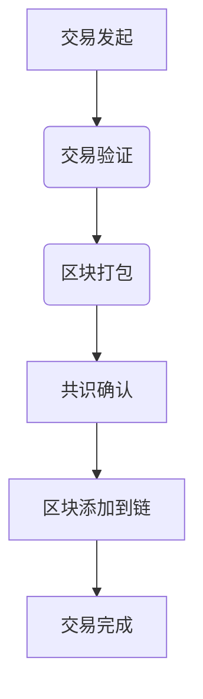
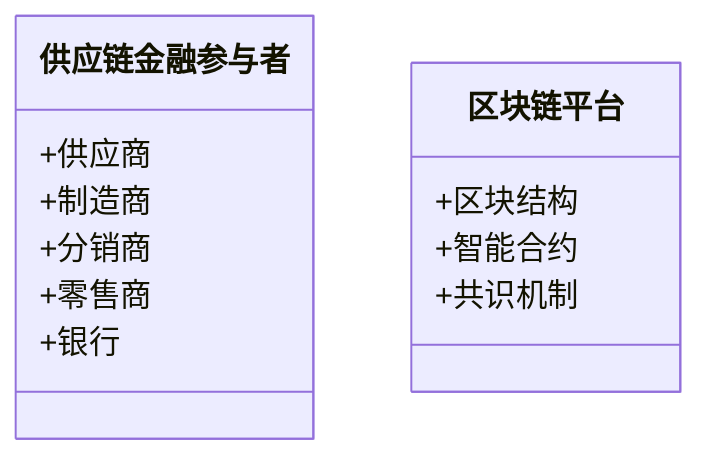

                 


# 区块链在供应链金融中的应用与挑战

## 关键词
区块链，供应链金融，去中心化，智能合约，共识机制，供应链管理

## 摘要
区块链技术在供应链金融中的应用正逐渐改变传统的金融模式，通过提供透明、安全和高效的解决方案，解决供应链金融中的痛点。本文详细分析了区块链在供应链金融中的核心概念、算法原理、系统架构设计、项目实战及最佳实践，探讨其在实际应用中的挑战和解决方案。

## 正文

---

## 第一部分：背景介绍

### 第1章：区块链与供应链金融概述

#### 1.1 区块链的基本概念
区块链是一种分布式账本技术，通过去中心化的网络实现数据的安全存储和传输。其核心要素包括：
- **去中心化**：数据存储在多个节点，无单点故障。
- **共识机制**：节点通过算法达成一致，如工作量证明（PoW）和权益证明（PoS）。
- **智能合约**：自动执行的代码，用于自动化业务流程。

#### 1.2 供应链金融的现状与问题
供应链金融涉及多个参与方，包括供应商、制造商、分销商、零售商和银行。传统模式存在以下问题：
- **信息不对称**：各参与方数据分散，难以共享。
- **效率低**：流程复杂，审核时间长。
- **成本高**：中间环节多，增加了交易成本。

#### 1.3 区块链如何解决供应链金融问题
区块链通过以下方式优化供应链金融：
- **提高透明度**：所有交易记录在区块链上，实时可查。
- **优化效率**：自动化流程减少人工干预。
- **降低成本**：减少中间环节，降低交易费用。

---

## 第二部分：核心概念与联系

### 第2章：区块链的核心原理

#### 2.1 区块链的基本原理
- **区块结构**：每个区块包含交易数据和哈希指针。
- **共识机制**：确保所有节点达成一致的算法。
- **智能合约**：自动执行的代码，用于触发支付等操作。

#### 2.2 区块链的分类与特点对比
| 类型       | 特点                           | 适用场景                     |
|------------|--------------------------------|------------------------------|
| 公有链     | 开放、匿名                     | 去中心化金融（DeFi）         |
| 联盟链     | 受限、成员授权                 | 企业间协作                   |
| 私有链     | 内部使用、高隐私               | 企业内部应用                 |

### 第3章：供应链金融中的实体关系

#### 3.1 实体关系分析
供应链金融中的主要参与者包括供应商、制造商、分销商、零售商和银行。各方通过区块链平台共享数据，确保透明性和信任。

#### 3.2 ER实体关系图
```mermaid
er
actor 供应链金融参与者 {
  供应商
  制造商
  分销商
  零售商
  银行
}
```

---

## 第三部分：算法原理讲解

### 第4章：区块链的工作流程

#### 4.1 区块链的交易流程


#### 4.2 共识机制的实现
使用Python实现工作量证明机制：
```python
def proof_of_work(last_hash):
    # 简单的哈希计算
    import hashlib
    while True:
        new_hash = hashlib.sha256(str(last_hash) + str(random.getrandbits(64))).hexdigest()
        if new_hash.startswith('0000'):
            return new_hash
```

---

## 第四部分：系统分析与架构设计方案

### 第5章：问题场景介绍
供应链金融中的多方协作问题，如应收账款融资、订单融资等，可通过区块链实现透明管理。

### 第6章：项目介绍与系统功能设计

#### 6.1 系统功能设计
- **订单融资**：基于订单生成贷款。
- **应收账款融资**：基于未来应收账款融资。

#### 6.2 领域模型类图


### 第7章：系统架构设计

#### 7.1 微服务架构
使用Spring Cloud构建微服务，提供API接口。

#### 7.2 数据库设计
采用分布式数据库存储交易数据，确保高可用性。

#### 7.3 接口设计
提供RESTful API，供各参与方调用。

---

## 第五部分：项目实战

### 第8章：环境安装与核心代码实现

#### 8.1 环境安装
- 安装Python和区块链框架（如Hyperledger Fabric）。
- 安装Mermaid和相关工具。

#### 8.2 核心代码实现
- 智能合约实现：
```solidity
contract SupplyChain {
    function transfer(bytes32 _id) {
        // 转账逻辑
    }
}
```
- 区块链网络部署：
```bash
docker run -it --name peer1 hyperledger/fabric:latest
```

#### 8.3 案例分析
分析一个具体项目，详细步骤包括需求分析、设计、实现和测试。

---

## 第六部分：总结与展望

### 第9章：最佳实践
- 数据隐私保护：采用隐私保护技术。
- 性能优化：优化共识机制和网络性能。
- 安全性：定期进行安全审计和漏洞修复。

### 第10章：小结
区块链在供应链金融中的应用潜力巨大，但需解决技术、法律和监管等挑战。

### 第11章：注意事项
- 数据隐私：确保数据加密和隐私保护。
- 成本控制：优化资源使用，降低成本。
- 监管合规：遵守相关法律法规。

### 第12章：拓展阅读
推荐相关书籍和论文，供深入学习。

---

## 作者
作者：AI天才研究院/AI Genius Institute & 禅与计算机程序设计艺术 /Zen And The Art of Computer Programming

---

以上为《区块链在供应链金融中的应用与挑战》的完整目录和文章内容，详细分析了区块链在供应链金融中的各个方面，从理论到实践，为读者提供了全面的视角。

