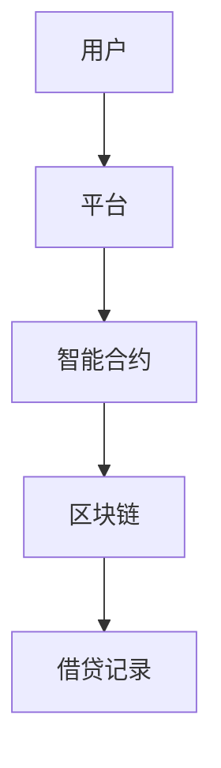

                 


# 区块链驱动的P2P借贷平台设计

> 关键词：区块链、P2P借贷、智能合约、分布式系统、金融科技、风险管理

> 摘要：本文将深入探讨区块链技术在P2P借贷平台中的应用，从背景、核心概念到系统架构设计，再到项目实战和安全与合规，全面解析区块链驱动的P2P借贷平台的实现原理和实际应用。通过本文，读者将掌握区块链技术在金融领域的创新应用，了解如何利用区块链技术构建高效、安全、透明的P2P借贷平台。

---

## 第一部分: 区块链驱动的P2P借贷平台背景与核心概念

### 第1章: 区块链与P2P借贷平台概述

#### 1.1 区块链技术的基本概念

##### 1.1.1 区块链的定义与特点
区块链是一种去中心化的分布式账本技术，通过加密算法和共识机制确保数据的安全性和不可篡改性。其特点包括：
- **去中心化**：数据不由单一机构控制，而是分布在网络中的多个节点。
- **不可篡改**：通过链式结构和加密算法，确保数据一旦记录无法被修改。
- **透明性**：所有交易记录公开可查，但用户身份可以匿名化。
- **可追溯性**：每笔交易都可以追溯到原始参与者。

##### 1.1.2 区块链的核心技术原理
区块链的核心技术包括：
- **区块结构**：数据以区块形式存储，每个区块包含多个交易记录，并通过哈希值链接形成链式结构。
- **共识机制**：通过共识算法（如比特币的PoW、以太坊的PoS）确保所有节点达成一致。
- **分布式账本**：数据分散存储在网络中的多个节点，确保数据的高可用性和安全性。

##### 1.1.3 区块链的分类与应用场景
区块链主要分为以下三类：
1. **公有链**：完全去中心化的区块链，任何人都可以参与，如比特币、以太坊。
2. **私有链**：仅限特定机构或个人参与，通常用于企业内部或特定场景。
3. **联盟链**：由多个机构共同维护的区块链，适用于特定行业或生态。

区块链在金融领域的应用场景包括支付清算、供应链金融、智能合约等，尤其适合需要高安全性和透明性的场景。

#### 1.2 P2P借贷平台的定义与特点

##### 1.2.1 P2P借贷的基本概念
P2P借贷（点对点借贷）是指个人与个人之间直接进行借贷交易，无需传统金融机构作为中介。这种模式降低了交易成本，提高了资金流转效率。

##### 1.2.2 P2P借贷的业务流程
P2P借贷的典型业务流程包括：
1. **用户注册与身份认证**：用户需要提供身份信息并完成认证。
2. **信用评估**：平台对用户进行信用评分，决定其借款额度。
3. **借款申请**：用户提交借款申请，平台审核后匹配资金提供方。
4. **资金流转**：借贷双方达成一致后，资金划转完成。
5. **还款管理**：借款人按照约定时间还款，平台收取服务费。

##### 1.2.3 区块链在P2P借贷中的作用
区块链在P2P借贷中的作用主要体现在以下几个方面：
- **去中心化信任**：通过区块链技术建立信任机制，减少对传统金融机构的依赖。
- **透明化记录**：所有借贷记录都存储在区块链上，确保数据的透明性和不可篡改性。
- **智能合约**：通过智能合约自动执行借贷协议，降低违约风险。

#### 1.3 区块链驱动P2P借贷平台的必要性

##### 1.3.1 传统借贷平台的痛点
传统P2P借贷平台存在以下痛点：
- **信任缺失**：平台可能存在欺诈行为，用户信任度低。
- **交易成本高**：中间机构收取高额手续费，增加了借贷成本。
- **透明度低**：借贷记录可能被篡改或隐藏，用户难以监督。

##### 1.3.2 区块链技术解决的方案
区块链技术可以解决以下问题：
- **去中心化信任**：通过区块链技术建立去中心化的信任机制，减少平台的信用风险。
- **透明化记录**：所有交易记录公开可查，用户可以实时监督借贷过程。
- **自动执行**：通过智能合约自动执行借贷协议，降低违约风险。

##### 1.3.3 区块链驱动P2P借贷的优势
区块链驱动的P2P借贷平台具有以下优势：
- **降低交易成本**：去中心化减少了中间机构的参与，降低了交易成本。
- **提高透明度**：所有交易记录公开透明，用户可以实时监督借贷过程。
- **增强安全性**：区块链的不可篡改性确保了数据的安全性，减少了欺诈风险。

#### 1.4 区块链驱动P2P借贷平台的边界与外延

##### 1.4.1 平台的功能边界
区块链驱动的P2P借贷平台的功能边界包括：
- 用户身份认证与管理
- 信用评估与风控
- 智能合约的编写与执行
- 资金流转与结算

##### 1.4.2 平台的外延应用
区块链驱动的P2P借贷平台的外延应用包括：
- 跨链借贷：支持不同区块链平台之间的资金流动。
- 资产证券化：将借贷资产转化为可交易的证券。
- 数据共享：与其他区块链平台共享借贷数据，提高整体效率。

##### 1.4.3 平台的核心要素组成
平台的核心要素包括：
- 用户：借款人和出借人
- 智能合约：自动执行借贷协议
- 区块链网络：存储借贷记录
- 信用评估系统：评估用户的信用状况

---

### 第2章: 区块链技术的核心概念与原理

#### 2.1 区块链的基本原理

##### 2.1.1 区块链的区块结构
区块链的区块结构包括：
- **区块头**：包含区块高度、时间戳、哈希值等信息。
- **交易列表**：记录该区块中的所有交易信息。
- **默克尔树根**：用于验证区块中的交易数据完整性。

##### 2.1.2 区块链的共识机制
共识机制是区块链的核心机制，常见的共识算法包括：
- **工作量证明（PoW）**：通过计算哈希值来验证区块的有效性，比特币采用此机制。
- **权益证明（PoS）**：通过持有代币的数量来决定验证权力，以太坊2.0采用此机制。
- ** delegated proof of stake（DPoS）**：通过选举代表来进行验证，适用于高性能区块链。

##### 2.1.3 区块链的分布式账本
分布式账本是区块链的核心数据结构，每个节点都有一份完整的账本副本，确保数据的一致性和可靠性。

#### 2.2 区块链的分类与特点

##### 2.2.1 公有链、私有链与联盟链
- **公有链**：完全去中心化的区块链，任何人都可以参与。
- **私有链**：仅限特定机构或个人参与，通常用于企业内部。
- **联盟链**：由多个机构共同维护的区块链，适用于特定行业。

##### 2.2.2 区块链的可扩展性与安全性
- **可扩展性**：区块链的扩展性取决于共识机制和网络性能。
- **安全性**：通过加密算法和共识机制确保数据的安全性。

##### 2.2.3 区块链的去中心化特性
去中心化是区块链的核心特性，通过分布式网络实现数据的去中心化存储和管理。

#### 2.3 区块链的核心技术

##### 2.3.1 加密算法
加密算法是区块链安全的基础，常见的加密算法包括：
- **哈希函数**：用于生成区块的唯一标识。
- **椭圆曲线加密**：用于数字签名和身份验证。

##### 2.3.2 智能合约
智能合约是区块链上的自动化程序，可以根据预设条件自动执行合约内容。以太坊是目前支持智能合约的主要平台。

##### 2.3.3 跨链技术
跨链技术允许不同区块链平台之间的数据互通和价值流转，是实现区块链生态的重要技术。

---

### 第3章: P2P借贷平台的核心功能与设计

#### 3.1 P2P借贷平台的功能模块

##### 3.1.1 用户身份认证
用户身份认证是P2P借贷平台的基础功能，通常通过区块链地址或中心化机构认证。

##### 3.1.2 信用评估与风控
平台需要对用户进行信用评估，确保借贷风险可控。常见的信用评估方法包括：
- **分数评估**：通过用户的信用历史、收入情况等指标进行评分。
- **行为分析**：通过用户的借贷行为进行风险预测。

##### 3.1.3 借款申请与审核
用户提交借款申请后，平台需要进行审核，确保借款符合平台的规则和风险控制。

##### 3.1.4 资金流转与结算
借贷双方达成一致后，资金通过智能合约自动划转，确保资金安全和高效结算。

#### 3.2 区块链在P2P借贷中的应用

##### 3.2.1 智能合约的实现
智能合约是区块链驱动P2P借贷的核心技术，用于自动执行借贷协议。以下是智能合约的实现流程：

1. **合约部署**：将智能合约部署到区块链上。
2. **合约调用**：用户通过智能合约接口调用合约方法。
3. **合约执行**：智能合约根据预设条件自动执行借贷协议。

#### 3.3 P2P借贷平台的系统架构

##### 3.3.1 分层架构设计
P2P借贷平台的分层架构包括：
- **数据层**：存储区块链上的借贷记录和用户信息。
- **网络层**：实现区块链网络的通信和数据传输。
- **共识层**：实现区块链的共识机制。
- **应用层**：提供用户界面和API接口。
- **合约层**：实现智能合约的部署和执行。

##### 3.3.2 模块化设计
模块化设计可以提高系统的可维护性和扩展性。以下是模块化设计的示例：

1. **用户模块**：负责用户身份认证和管理。
2. **借贷模块**：负责借贷申请、审核和匹配。
3. **智能合约模块**：负责智能合约的部署和执行。
4. **风控模块**：负责信用评估和风险控制。

##### 3.3.3 数据库设计
数据库设计是系统架构的重要部分，通常采用分布式数据库存储借贷记录和用户信息。以下是数据库设计的示例：

- **用户表**：存储用户的基本信息和区块链地址。
- **借贷记录表**：存储每笔借贷的详细信息，包括借贷金额、时间、状态等。
- **智能合约表**：存储智能合约的地址和相关参数。

#### 3.4 系统接口设计

##### 3.4.1 API接口设计
系统需要提供以下API接口：
- **用户注册**：用户通过API接口完成身份认证。
- **借贷申请**：用户提交借款申请，平台通过API接口进行审核。
- **资金划转**：借贷双方通过API接口完成资金划转。

##### 3.4.2 接口交互流程
以下是接口交互的流程示例：

1. **用户注册**：用户通过API接口提交身份信息，平台完成身份认证并生成区块链地址。
2. **借贷申请**：用户提交借款申请，平台通过智能合约审核并匹配资金提供方。
3. **资金划转**：借贷双方通过智能合约完成资金划转，确保资金安全和高效结算。

#### 3.5 系统交互设计

##### 3.5.1 交互流程图
以下是系统交互流程图的示例：



##### 3.5.2 交互设计说明
系统交互设计需要确保用户操作的便捷性和安全性。以下是交互设计的说明：
- **用户操作**：用户通过平台提交借贷申请，平台通过智能合约审核并匹配资金提供方。
- **智能合约执行**：智能合约自动执行借贷协议，确保资金安全和高效结算。
- **区块链记录**：所有交易记录存储在区块链上，确保数据的透明性和不可篡改性。

---

## 第四部分: 项目实战与系统实现

### 第4章: 项目实战

#### 4.1 环境搭建

##### 4.1.1 安装以太坊节点
安装以太坊节点的步骤如下：
1. **下载以太坊源码**：从以太坊官网下载源码。
2. **编译安装**：按照官方文档进行编译和安装。
3. **配置环境变量**：将以太坊可执行文件添加到环境变量。

##### 4.1.2 安装Solidity编译器
Solidity是用于编写智能合约的编程语言，安装步骤如下：
1. **下载Solidity编译器**：从Solidity官网下载。
2. **安装并配置**：按照官方文档进行安装和配置。
3. **验证安装**：通过编译简单的智能合约测试安装是否成功。

#### 4.2 核心代码实现

##### 4.2.1 智能合约实现
以下是智能合约的实现代码：

```solidity
pragma solidity ^0.5.0;

contract P2PLoan {
    struct Loan {
        address borrower;
        uint amount;
        uint duration;
        uint startTime;
        bool isRepaid;
    }

    mapping(address => Loan[]) public loans;

    function requestLoan(uint amount, uint duration) public {
        Loan memory loan = Loan(msg.sender, amount, duration, block.timestamp, false);
        loans[msg.sender].push(loan);
    }

    function repayLoan(address borrower) public payable {
        Loan storage loan = loans[borrower][0];
        require(!loan.isRepaid, "Loan already repaid");
        loan.isRepaid = true;
        // 智能合约自动处理还款逻辑
    }
}
```

##### 4.2.2 智能合约部署与测试
智能合约的部署与测试步骤如下：
1. **编写智能合约**：使用Solidity编写智能合约代码。
2. **编译合约**：使用Solidity编译器将合约代码编译为字节码。
3. **部署合约**：将合约部署到以太坊区块链。
4. **测试合约**：通过调用合约接口进行借贷申请和还款测试。

#### 4.3 案例分析与代码解读

##### 4.3.1 案例分析
以下是P2P借贷平台的典型应用场景：

1. **用户A申请借款**：用户A通过平台提交借款申请，智能合约自动审核并匹配资金提供方。
2. **用户B提供资金**：用户B通过智能合约向用户A提供借款，资金自动划转。
3. **用户A还款**：用户A通过智能合约自动完成还款，平台收取服务费。

##### 4.3.2 代码解读
以下是智能合约代码的解读：

```solidity
pragma solidity ^0.5.0;

contract P2PLoan {
    struct Loan {
        address borrower;
        uint amount;
        uint duration;
        uint startTime;
        bool isRepaid;
    }

    mapping(address => Loan[]) public loans;

    function requestLoan(uint amount, uint duration) public {
        Loan memory loan = Loan(msg.sender, amount, duration, block.timestamp, false);
        loans[msg.sender].push(loan);
    }

    function repayLoan(address borrower) public payable {
        Loan storage loan = loans[borrower][0];
        require(!loan.isRepaid, "Loan already repaid");
        loan.isRepaid = true;
        // 智能合约自动处理还款逻辑
    }
}
```

#### 4.4 项目小结

##### 4.4.1 项目实现的关键点
- **智能合约的编写与部署**：智能合约是平台的核心，确保借贷协议的自动执行。
- **区块链网络的搭建与配置**：确保区块链网络的稳定性和安全性。
- **系统接口的设计与实现**：确保平台的高效性和可扩展性。

##### 4.4.2 项目实现的注意事项
- **安全性**：智能合约需要经过严格测试，确保无漏洞。
- **合规性**：平台需要符合相关法律法规，确保合法运营。
- **用户体验**：平台需要提供良好的用户体验，确保用户操作便捷。

---

## 第五部分: 安全与合规

### 第5章: 安全与合规

#### 5.1 平台的安全威胁

##### 5.1.1 常见安全威胁
P2P借贷平台可能面临的安全威胁包括：
- **黑客攻击**：攻击者可能通过漏洞入侵平台。
- **数据泄露**：用户数据可能被泄露或篡改。
- **智能合约漏洞**：智能合约可能存在漏洞，导致资金损失。

##### 5.1.2 安全威胁的防护措施
以下是防范安全威胁的措施：
- **代码审计**：定期对智能合约进行代码审计，确保无漏洞。
- **安全培训**：对平台相关人员进行安全培训，提高安全意识。
- **监控与预警**：通过安全监控系统实时监控平台安全状况，及时预警。

#### 5.2 数据隐私保护

##### 5.2.1 用户隐私保护
平台需要保护用户的隐私，避免用户数据被滥用。以下是隐私保护的措施：
- **数据加密**：对用户敏感数据进行加密存储和传输。
- **匿名化处理**：通过区块链地址匿名化处理，保护用户身份。

##### 5.2.2 数据安全存储
平台需要确保数据的安全存储，以下是数据安全存储的措施：
- **分布式存储**：通过区块链技术实现数据的分布式存储，确保数据的安全性和高可用性。
- **访问控制**：通过权限管理，确保只有授权人员可以访问敏感数据。

#### 5.3 合规性与法律风险

##### 5.3.1 合规性要求
平台需要遵守相关法律法规，确保合法运营。以下是合规性要求：
- **牌照申请**：平台需要申请相关金融牌照，确保合法运营。
- **信息披露**：平台需要公开相关信息，确保透明性。
- **风险提示**：平台需要向用户提示借贷风险，确保用户知情权。

##### 5.3.2 法律风险
P2P借贷平台可能面临法律风险，以下是常见的法律风险：
- **合规性风险**：平台未取得相关牌照，可能面临法律制裁。
- **诉讼风险**：用户可能因借贷纠纷提起诉讼，平台需要妥善处理。

---

## 第六部分: 总结与展望

### 第6章: 总结与展望

#### 6.1 总结

##### 6.1.1 核心内容回顾
区块链驱动的P2P借贷平台通过智能合约和区块链技术，实现了去中心化信任、透明化记录和自动执行借贷协议。以下是核心内容回顾：
- **区块链技术**：区块链技术是P2P借贷平台的核心，通过去中心化信任和不可篡改性确保数据的安全性。
- **智能合约**：智能合约是平台的核心，通过自动执行借贷协议，降低违约风险。
- **系统架构设计**：系统的分层架构设计和模块化设计确保了平台的高效性和可扩展性。

##### 6.1.2 创新点总结
区块链驱动的P2P借贷平台的创新点包括：
- **去中心化信任**：通过区块链技术建立信任机制，减少对传统金融机构的依赖。
- **透明化记录**：所有交易记录公开透明，用户可以实时监督借贷过程。
- **智能合约**：通过智能合约自动执行借贷协议，降低违约风险。

#### 6.2 未来展望

##### 6.2.1 技术发展
区块链技术的发展将推动P2P借贷平台的进一步创新，以下是未来技术发展的方向：
- **跨链技术**：支持不同区块链平台之间的资金流动，实现区块链生态的互通。
- **隐私保护**：通过隐私保护技术，进一步提高用户数据的安全性。
- **人工智能**：通过人工智能技术，提高平台的智能风控能力，降低借贷风险。

##### 6.2.2 应用场景拓展
P2P借贷平台的应用场景将不断拓展，以下是未来可能的应用场景：
- **资产证券化**：将借贷资产转化为可交易的证券，提高资金流动性。
- **供应链金融**：通过区块链技术实现供应链金融的透明化和高效化。
- **跨境借贷**：通过区块链技术实现跨境借贷的低成本和高效率。

---

## 作者：AI天才研究院/AI Genius Institute & 禅与计算机程序设计艺术 /Zen And The Art of Computer Programming

---

通过本文，读者可以深入了解区块链技术在P2P借贷平台中的应用，从背景、核心概念到系统架构设计，再到项目实战和安全与合规，全面掌握区块链驱动的P2P借贷平台的实现原理和实际应用。希望本文能为读者提供有价值的见解和启发，帮助他们在区块链和金融科技领域取得更大的突破。

