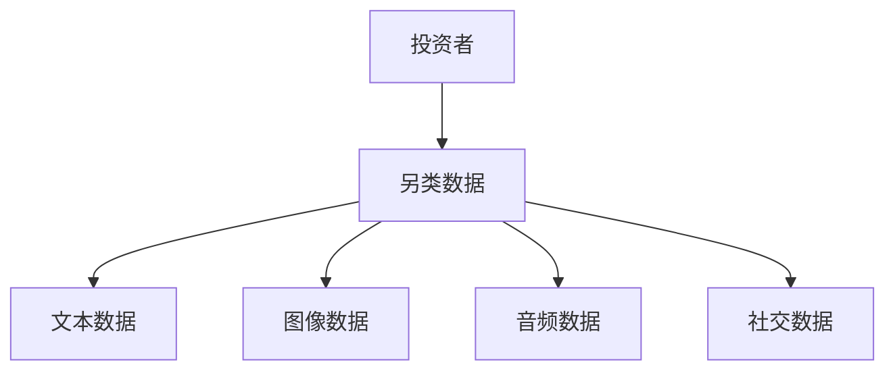
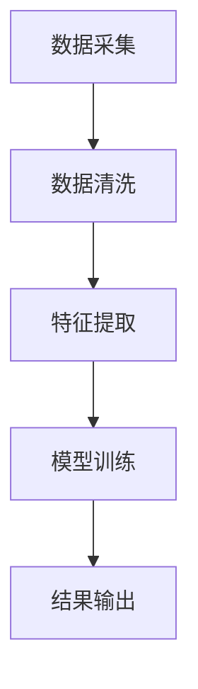
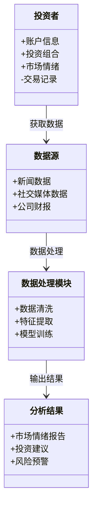
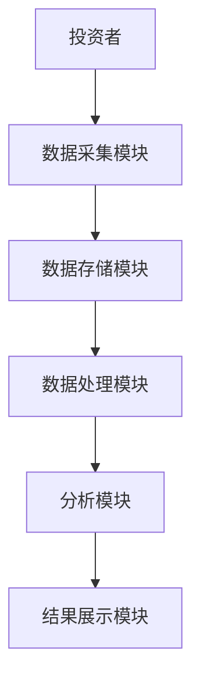
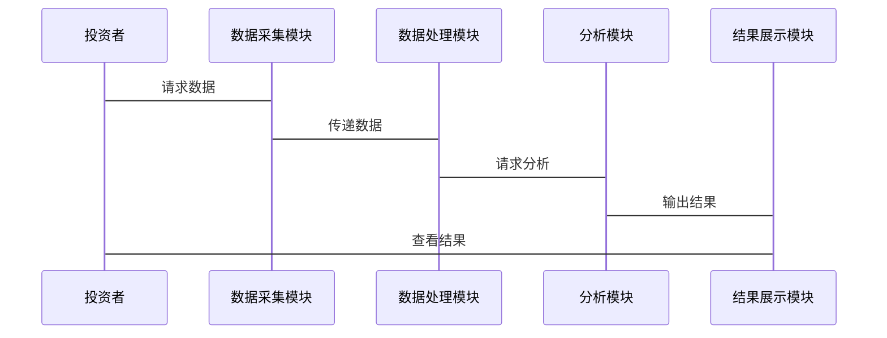

                 


# 另类数据在投资分析中的应用

> 关键词：另类数据，投资分析，文本数据，图像数据，社交数据，机器学习，数学模型

> 摘要：本文详细探讨了另类数据在投资分析中的应用，从数据的定义、分类、处理流程到算法原理、数学模型，再到系统架构和实际案例，全面解析了如何利用另类数据提升投资决策的准确性。

---

## 第1章: 另类数据的背景与概念

### 1.1 另类数据的定义与特点

#### 1.1.1 传统金融数据的局限性
传统金融数据（如股票价格、成交量、财务报表等）虽然提供了重要的市场信息，但其局限性日益明显：
- **信息滞后性**：传统数据通常基于历史表现，难以预测未来趋势。
- **单一维度**：传统数据主要关注数字指标，难以捕捉市场情绪和潜在风险。
- **信息稀疏性**：在复杂市场环境中，传统数据往往无法提供足够的洞察。

#### 1.1.2 另类数据的定义
另类数据是指那些传统金融数据之外的非结构化或半结构化数据，包括文本、图像、音频、社交媒体数据等。这些数据通常需要经过特定的处理和分析才能用于投资决策。

#### 1.1.3 另类数据的核心特点
- **实时性**：另类数据可以捕捉到市场情绪的实时变化。
- **多样性**：涵盖文本、图像、音频等多种形式，提供更多维度的市场信息。
- **复杂性**：非结构化数据的处理需要复杂的算法支持。

### 1.2 另类数据的分类与来源

#### 1.2.1 文本数据
- **新闻文章**：通过分析新闻标题和正文，提取市场情绪和关键词。
- **公司财报**：挖掘财务报告中的隐含信息。
- **行业报告**：获取行业趋势和专家观点。

#### 1.2.2 图像数据
- **市场图表**：通过图像识别技术分析K线图、成交量图等。
- **公司品牌**：通过图像识别分析品牌影响力。

#### 1.2.3 音频数据
- **电话会议**：分析公司高管的语气和关键词。
- **市场广播**：实时捕捉市场动态。

#### 1.2.4 社交媒体数据
- **社交媒体帖子**：分析投资者情绪和市场观点。
- **评论和讨论**：挖掘市场热点和潜在趋势。

#### 1.2.5 其他非结构化数据
- **专利数据**：分析技术创新对公司价值的影响。
- **法律文件**：挖掘公司法律风险。

### 1.3 另类数据在投资分析中的重要性

#### 1.3.1 提高投资决策的准确性
通过分析另类数据，投资者可以捕捉到市场情绪、行业趋势等传统数据无法提供的信息。

#### 1.3.2 发现传统数据无法捕捉的市场信号
另类数据可以帮助投资者发现市场拐点和潜在风险。

#### 1.3.3 降低投资风险
通过实时监测社交媒体和新闻，投资者可以更快地发现市场风险并采取应对措施。

### 1.4 本章小结
本章介绍了另类数据的定义、分类及其在投资分析中的重要性，为后续章节的分析奠定了基础。

---

## 第2章: 另类数据的核心概念与联系

### 2.1 另类数据的处理流程

#### 2.1.1 数据采集
- **文本数据**：爬取新闻网站、社交媒体等。
- **图像数据**：使用图像采集工具获取市场图表。
- **音频数据**：通过录音设备采集电话会议。

#### 2.1.2 数据清洗
- **文本清洗**：去除噪声、处理停用词。
- **图像清洗**：去除模糊图像、调整色彩平衡。
- **音频清洗**：去除背景噪音。

#### 2.1.3 数据转换与特征提取
- **文本特征提取**：使用TF-IDF提取关键词。
- **图像特征提取**：使用SIFT算法提取图像特征。
- **音频特征提取**：使用MFCC提取音频特征。

### 2.2 另类数据与传统数据的对比分析

#### 2.2.1 数据类型对比
| 数据类型 | 传统数据 | 另类数据 |
|----------|----------|----------|
| 类型     | 结构化数据 | 非结构化数据 |
| 示例     | 股价、成交量 | 新闻文章、社交媒体 |

#### 2.2.2 数据处理难度对比
| 数据类型 | 传统数据 | 另类数据 |
|----------|----------|----------|
| 处理难度 | 较低     | 较高     |

#### 2.2.3 数据应用范围对比
| 数据类型 | 传统数据 | 另类数据 |
|----------|----------|----------|
| 应用范围 | 有限     | 广泛     |

### 2.3 另类数据的实体关系图



### 2.4 本章小结
本章详细介绍了另类数据的处理流程及其与传统数据的对比，通过实体关系图展示了投资者与另类数据之间的关系。

---

## 第3章: 另类数据的算法原理

### 3.1 另类数据处理的算法流程



### 3.2 数据清洗算法

#### 3.2.1 基于规则的清洗算法
- **规则定义**：例如，去除包含特定关键词的评论。
- **实现步骤**：
  1. 定义清洗规则。
  2. 遍历数据集，应用规则。
  3. 输出清洗后的数据。

#### 3.2.2 基于统计的清洗算法
- **统计方法**：例如，去除出现频率过低的词汇。
- **实现步骤**：
  1. 统计数据分布。
  2. 确定清洗阈值。
  3. 应用统计方法清洗数据。

#### 3.2.3 基于机器学习的清洗算法
- **算法选择**：例如，使用聚类算法识别异常数据。
- **实现步骤**：
  1. 训练清洗模型。
  2. 应用模型清洗数据。
  3. 验证清洗效果。

### 3.3 特征提取算法

#### 3.3.1 文本特征提取（TF-IDF）
- **公式**：
  $$TF-IDF(t, d) = TF(t, d) \times ID(t, d)$$
  其中，$TF(t, d)$是词项$t$在文档$d$中的词频，$ID(t, d)$是逆文档频率。
- **实现步骤**：
  1. 统计词频。
  2. 计算逆文档频率。
  3. 计算TF-IDF值。

#### 3.3.2 图像特征提取（SIFT）
- **算法原理**：SIFT（Scale-Invariant Feature Transform）是一种图像特征提取算法，能够提取图像中稳定的特征点。
- **实现步骤**：
  1. 检测兴趣点。
  2. 描述特征向量。
  3. 匹配特征点。

#### 3.3.3 音频特征提取（MFCC）
- **算法原理**：MFCC（Mel-Frequency Cepstral Coefficients）是一种常用的音频特征提取方法，用于描述音频的音调和节奏。
- **实现步骤**：
  1. 预处理音频信号。
  2. 计算梅尔频谱。
  3. 提取 cepstral系数。

### 3.4 机器学习模型的应用

#### 3.4.1 分类模型（随机森林、神经网络）
- **分类任务**：例如，预测股票涨跌。
- **算法选择**：随机森林适用于中小规模数据，神经网络适用于大规模数据。
- **实现步骤**：
  1. 数据预处理。
  2. 训练分类模型。
  3. 评估模型性能。

#### 3.4.2 回归模型（线性回归、支持向量回归）
- **回归任务**：例如，预测股票价格。
- **算法选择**：线性回归适用于线性关系，支持向量回归适用于非线性关系。
- **实现步骤**：
  1. 数据预处理。
  2. 训练回归模型。
  3. 评估模型性能。

#### 3.4.3 聚类模型（K-means、DBSCAN）
- **聚类任务**：例如，将相似的市场情绪分组。
- **算法选择**：K-means适用于均匀分布的数据，DBSCAN适用于分布不均匀的数据。
- **实现步骤**：
  1. 数据预处理。
  2. 训练聚类模型。
  3. 分析聚类结果。

### 3.5 本章小结
本章详细介绍了另类数据处理的算法流程，包括数据清洗、特征提取和机器学习模型的应用，并通过公式和图表展示了相关算法的实现步骤。

---

## 第4章: 数学模型与公式

### 4.1 文本分析的数学模型

#### 4.1.1 TF-IDF公式
$$TF-IDF(t, d) = TF(t, d) \times ID(t, d)$$

#### 4.1.2 二元分类模型
- **逻辑回归**：
  $$P(y=1|x) = \frac{1}{1 + e^{-\beta x}}$$
- **损失函数**：交叉熵损失函数。
  $$L = -\frac{1}{n}\sum_{i=1}^{n} [y_i \ln p_i + (1 - y_i) \ln (1 - p_i)]$$

#### 4.1.3 例子分析
假设我们有一篇新闻文章，提取关键词“增长”、“市场”、“收益”，计算它们的TF-IDF值，判断其对市场情绪的影响。

### 4.2 图像分析的数学模型

#### 4.2.1 SIFT特征提取
- **关键点检测**：
  1. 计算图像的高斯金字塔。
  2. 检测兴趣点。
- **特征描述**：
  1. 计算特征向量。
  2. 标准化特征向量。

#### 4.2.2 例子分析
通过SIFT算法提取股票K线图中的关键点，判断市场趋势。

### 4.3 音频分析的数学模型

#### 4.3.1 MFCC提取
- **预处理**：去除背景噪音。
- **梅尔频谱计算**：
  $$M(t) = \sum_{k} w(k) \cos(2\pi f_k t)$$
- ** cepstral系数提取**：
  $$DCT(M(t))$$

#### 4.3.2 例子分析
通过MFCC提取电话会议中的情绪特征，判断高管信心指数。

### 4.4 本章小结
本章通过数学公式详细介绍了文本、图像和音频分析的数学模型，并通过例子分析展示了其在投资分析中的应用。

---

## 第5章: 系统分析与架构设计方案

### 5.1 问题场景介绍

#### 5.1.1 投资者需求
投资者希望通过另类数据获取市场情绪、行业趋势等信息，辅助决策。

#### 5.1.2 系统目标
构建一个基于另类数据的投资分析系统，提供实时市场监测、情绪分析和风险预警功能。

### 5.2 项目介绍

#### 5.2.1 项目名称
基于另类数据的投资分析系统。

#### 5.2.2 项目背景
随着市场竞争加剧，传统数据的局限性日益明显，另类数据的应用需求迫切。

### 5.3 系统功能设计

#### 5.3.1 领域模型


#### 5.3.2 系统架构设计



#### 5.3.3 系统接口设计
- **输入接口**：数据采集模块接收外部数据。
- **输出接口**：结果展示模块输出分析结果。

#### 5.3.4 系统交互


### 5.4 本章小结
本章通过系统分析与架构设计，展示了如何构建一个基于另类数据的投资分析系统，为后续的项目实现奠定了基础。

---

## 第6章: 项目实战

### 6.1 环境安装

#### 6.1.1 安装Python
- **安装命令**：`pip install python`

#### 6.1.2 安装依赖库
- **文本处理**：`pip install nltk`
- **图像处理**：`pip install opencv-python`
- **音频处理**：`pip install librosa`

#### 6.1.3 安装机器学习库
- **Scikit-learn**：`pip install scikit-learn`
- **XGBoost**：`pip install xgboost`

### 6.2 系统核心实现源代码

#### 6.2.1 数据采集模块

```python
import requests
from bs4 import BeautifulSoup

def fetch_news(url):
    response = requests.get(url)
    soup = BeautifulSoup(response.text, 'html.parser')
    articles = soup.find_all('article')
    return [article.text for article in articles]
```

#### 6.2.2 数据处理模块

```python
from sklearn.feature_extraction.text import TfidfVectorizer

def process_text(texts):
    vectorizer = TfidfVectorizer()
    tfidf_matrix = vectorizer.fit_transform(texts)
    return tfidf_matrix.toarray()
```

#### 6.2.3 机器学习模型

```python
from sklearn.ensemble import RandomForestClassifier

def train_model(X, y):
    model = RandomForestClassifier()
    model.fit(X, y)
    return model
```

### 6.3 代码应用解读与分析

#### 6.3.1 数据采集
使用`requests`库获取网页内容，使用`BeautifulSoup`提取新闻文章。

#### 6.3.2 数据处理
使用`TfidfVectorizer`提取文本特征，生成TF-IDF矩阵。

#### 6.3.3 模型训练
使用随机森林分类器训练模型，预测市场情绪。

### 6.4 实际案例分析

#### 6.4.1 案例背景
假设我们有若干新闻文章，目标是预测市场情绪（ bullish 或 bearish）。

#### 6.4.2 数据处理
```python
texts = fetch_news('http://example.com/news')
tfidf_matrix = process_text(texts)
```

#### 6.4.3 模型训练
```python
model = train_model(tfidf_matrix, labels)
```

#### 6.4.4 结果分析
使用混淆矩阵和准确率评估模型性能。

### 6.5 本章小结
本章通过实际案例展示了如何利用另类数据构建投资分析系统，并详细解读了核心代码的实现。

---

## 第7章: 最佳实践、小结、注意事项、拓展阅读

### 7.1 最佳实践

#### 7.1.1 数据处理
- **数据清洗**：确保数据质量。
- **特征提取**：选择合适的特征提取方法。

#### 7.1.2 模型选择
- **任务类型**：分类、回归、聚类。
- **数据规模**：小数据选择简单模型，大数据选择复杂模型。

#### 7.1.3 结果验证
- **交叉验证**：确保模型泛化能力。
- **实时监控**：动态调整模型参数。

### 7.2 小结
本章总结了另类数据在投资分析中的应用，通过实际案例展示了系统的构建过程，并提出了最佳实践建议。

### 7.3 注意事项

#### 7.3.1 数据隐私
- **合规性**：确保数据采集和处理符合法律法规。
- **隐私保护**：避免泄露个人隐私信息。

#### 7.3.2 系统性能
- **计算资源**：确保服务器有足够的计算能力。
- **数据存储**：选择合适的存储方案，确保数据高效访问。

#### 7.3.3 模型更新
- **定期更新**：根据市场变化调整模型。
- **持续优化**：优化模型性能和准确率。

### 7.4 拓展阅读

#### 7.4.1 推荐书籍
- 《Python机器学习实战》
- 《数据挖掘导论》

#### 7.4.2 推荐博客
- [KDNuggets](https://www.kdnuggets.com/)
- [Towards Data Science](https://towardsdatascience.com/)

### 7.5 本章小结
本章总结了另类数据在投资分析中的应用，并提出了最佳实践建议，同时推荐了相关阅读资料。

---

## 作者：AI天才研究院/AI Genius Institute & 禅与计算机程序设计艺术 /Zen And The Art of Computer Programming

---

以上是《另类数据在投资分析中的应用》的部分内容，您可以根据实际需求继续补充和扩展每一章节的具体内容。

