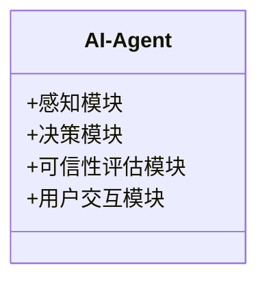
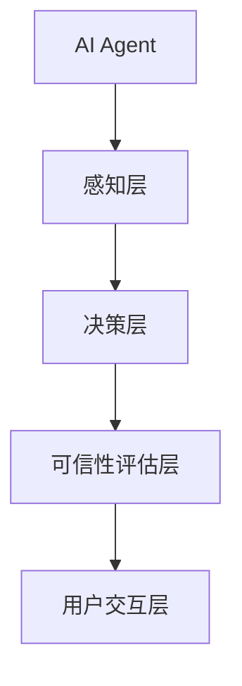
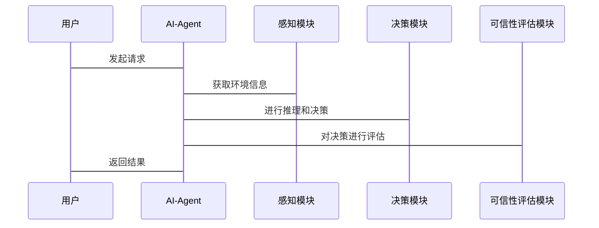

                 


# 可信AI：构建值得信赖的AI Agent系统

## 关键词
可信AI, AI Agent, 可信推理, 可信决策, 可信学习

## 摘要
可信AI是构建值得信赖的AI Agent系统的核心，它确保AI系统在决策和执行过程中具备可解释性、可控制性和可靠性。本文从可信AI的基本概念出发，详细探讨了AI Agent系统的架构设计、核心算法、数学模型、系统实现和实际案例，旨在为读者提供全面的理论与实践指导。

---

# 第一部分: 可信AI的背景与核心概念

## 第1章: 可信AI的背景与问题背景

### 1.1 可信AI的定义与核心概念

#### 1.1.1 什么是可信AI
可信AI是指在AI系统的设计、开发和应用过程中，确保系统的决策和行为能够被人类理解和信任。它强调系统的透明性、可解释性和可控性。

#### 1.1.2 可信AI的核心要素
可信AI的核心要素包括：
1. 可解释性：AI系统的决策过程必须能够被用户理解。
2. 可控性：用户能够控制AI系统的决策和行为。
3. 可靠性：AI系统在各种情况下都能稳定运行。

#### 1.1.3 可信AI的背景与问题背景
随着AI技术的快速发展，AI系统在各个领域的应用越来越广泛。然而，AI系统的不可解释性和潜在的偏见问题引发了人们对可信AI的关注。可信AI的构建不仅是技术挑战，也是社会和伦理的需要。

---

## 第2章: AI Agent系统的核心概念与联系

### 2.1 AI Agent的基本定义

#### 2.1.1 AI Agent的定义
AI Agent是一种能够感知环境并采取行动以实现目标的智能实体。它可以是一个软件程序、机器人或其他智能系统。

#### 2.1.2 AI Agent的核心属性
1. 感知能力：能够感知环境并获取信息。
2. 决策能力：能够基于感知的信息做出决策。
3. 行动能力：能够执行决策并采取行动。

#### 2.1.3 AI Agent的分类
AI Agent可以分为以下几类：
1. 简单反射型Agent：基于简单的规则做出反应。
2. 基于模型的反应型Agent：基于环境模型做出决策。
3. 目标驱动型Agent：基于目标进行规划和决策。
4. 学习型Agent：通过学习改进自身的决策能力。

### 2.2 可信AI Agent的构建要素

#### 2.2.1 可信性评估标准
可信AI Agent需要满足以下标准：
1. 可解释性：用户能够理解AI Agent的决策过程。
2. 可控性：用户能够干预或调整AI Agent的行为。
3. 可靠性：AI Agent在各种情况下都能稳定运行。

#### 2.2.2 可信AI Agent与传统AI Agent的区别
可信AI Agent的核心区别在于其强调可解释性、可控性和可靠性，而传统AI Agent可能更关注功能实现。

#### 2.2.3 可信AI Agent的系统架构
可信AI Agent的系统架构包括以下几个模块：
1. 感知模块：负责感知环境并获取信息。
2. 决策模块：基于感知信息进行推理和决策。
3. 可信性评估模块：对决策过程进行评估和验证。
4. 用户交互模块：与用户进行交互并提供反馈。

### 2.3 可信AI Agent的核心算法与联系

#### 2.3.1 可信推理算法
可信推理算法用于确保AI Agent的推理过程是透明和可解释的。常用的算法包括基于概率的推理和基于逻辑的推理。

#### 2.3.2 可信决策算法
可信决策算法用于确保AI Agent的决策过程是可控和可靠的。常用的算法包括基于风险评估的决策算法和基于多目标优化的决策算法。

#### 2.3.3 可信学习算法
可信学习算法用于确保AI Agent的学习过程是可解释和可控制的。常用的算法包括基于可信数据增强的学习算法和基于可信模型压缩的学习算法。

---

# 第二部分: 可信AI Agent的算法原理

## 第3章: 可信推理算法

### 3.1 基于概率的可信推理

#### 3.1.1 贝叶斯推理
贝叶斯推理是一种常用的概率推理方法，它通过计算条件概率来更新信念。

#### 3.1.2 证据推理
证据推理是一种基于逻辑的推理方法，它通过分析证据之间的关系来推导结论。

### 3.2 基于逻辑的可信推理

#### 3.2.1 一阶逻辑推理
一阶逻辑推理是一种基于逻辑符号的推理方法，它通过逻辑规则来推导结论。

#### 3.2.2 模糊逻辑推理
模糊逻辑推理是一种用于处理模糊信息的推理方法，它通过模糊逻辑规则来推导结论。

### 3.3 基于知识图谱的可信推理

#### 3.3.1 知识图谱的构建
知识图谱是一种用于表示知识的图结构，它通过实体和关系来描述知识。

#### 3.3.2 知识图谱推理
知识图谱推理是一种基于知识图谱的推理方法，它通过查询知识图谱来推导结论。

---

## 第4章: 可信决策算法

### 4.1 基于风险评估的决策算法

#### 4.1.1 风险评估方法
风险评估方法用于评估不同决策的风险，常用的包括期望损失法和概率风险评估法。

#### 4.1.2 风险控制方法
风险控制方法用于控制决策的风险，常用的包括风险规避和风险转移。

### 4.2 基于多目标优化的决策算法

#### 4.2.1 多目标优化问题
多目标优化问题是指在多个目标之间进行权衡，找到最优解。

#### 4.2.2 多目标优化算法
多目标优化算法包括遗传算法、粒子群优化算法等。

### 4.3 基于强化学习的决策算法

#### 4.3.1 强化学习的基本概念
强化学习是一种通过与环境交互来学习策略的方法。

#### 4.3.2 强化学习的应用
强化学习在游戏、机器人控制等领域有广泛应用。

---

## 第5章: 可信学习算法

### 5.1 基于可信数据增强的学习算法

#### 5.1.1 数据增强方法
数据增强方法用于增加数据的多样性和质量，常用的包括旋转、翻转和噪声添加。

#### 5.1.2 数据清洗方法
数据清洗方法用于去除数据中的噪声和错误，常用的包括去重和填补缺失值。

### 5.2 基于可信模型压缩的学习算法

#### 5.2.1 模型压缩方法
模型压缩方法用于减少模型的大小，常用的包括剪枝和知识蒸馏。

#### 5.2.2 模型压缩的优势
模型压缩可以提高模型的运行效率和部署能力。

### 5.3 基于可信模型解释性的学习算法

#### 5.3.1 模型解释性方法
模型解释性方法用于解释模型的决策过程，常用的包括特征重要性分析和可解释性模型。

#### 5.3.2 模型解释性的应用
模型解释性在金融、医疗等领域有广泛应用。

---

# 第三部分: 可信AI Agent的数学模型与公式

## 第6章: 可信推理的数学模型

### 6.1 基于概率的可信推理公式

#### 6.1.1 贝叶斯公式
贝叶斯公式用于计算条件概率，公式如下：
$$P(A|B) = \frac{P(B|A)P(A)}{P(B)}$$

#### 6.1.2 证据推理公式
证据推理公式用于计算联合概率，公式如下：
$$P(A \cap B) = P(A|B)P(B)$$

### 6.2 基于逻辑的可信推理公式

#### 6.2.1 一阶逻辑推理公式
一阶逻辑推理公式用于表示逻辑规则，例如：
$$\forall x (P(x) \rightarrow Q(x))$$

#### 6.2.2 模糊逻辑推理公式
模糊逻辑推理公式用于表示模糊关系，例如：
$$Q = \text{模糊算子}(P_1, P_2)$$

---

## 第7章: 可信决策的数学模型

### 7.1 基于风险评估的决策公式

#### 7.1.1 风险评估公式
风险评估公式用于计算决策的风险，例如：
$$\text{风险} = \text{概率} \times \text{损失}$$

#### 7.1.2 风险控制公式
风险控制公式用于计算最优决策，例如：
$$\min_{d} \text{风险}(d)$$

### 7.2 基于多目标优化的决策公式

#### 7.2.1 多目标优化公式
多目标优化公式用于找到最优解，例如：
$$\min_{x} f_1(x), f_2(x), \ldots, f_n(x)$$

#### 7.2.2 帕累托前沿
帕累托前沿用于表示多目标优化问题的最优解集，例如：
$$P = \{x | x \text{是 Pareto 有效解}\}$$

---

## 第8章: 可信学习的数学模型

### 8.1 基于可信数据增强的学习公式

#### 8.1.1 数据增强公式
数据增强公式用于生成新的数据，例如：
$$X' = f(X)$$
其中，$X$ 是原始数据，$X'$ 是增强后的数据，$f$ 是数据增强函数。

#### 8.1.2 数据清洗公式
数据清洗公式用于去除噪声，例如：
$$X_{\text{clean}} = g(X_{\text{noisy}})$$
其中，$X_{\text{noisy}}$ 是有噪声的数据，$X_{\text{clean}}$ 是清洗后的数据，$g$ 是清洗函数。

### 8.2 基于可信模型压缩的学习公式

#### 8.2.1 剪枝公式
剪枝公式用于减少模型的复杂度，例如：
$$\theta' = \arg\min_{\theta} \|\theta\|$$

#### 8.2.2 知识蒸馏公式
知识蒸馏公式用于将知识从大模型转移到小模型，例如：
$$P_{\text{student}}(y|x) = P_{\text{teacher}}(y|x)$$

---

# 第四部分: 可信AI Agent的系统分析与架构设计

## 第9章: 可信AI Agent的系统分析

### 9.1 问题场景介绍

#### 9.1.1 可信AI Agent的应用场景
可信AI Agent可以应用于金融、医疗、自动驾驶等领域。

#### 9.1.2 可信AI Agent的核心问题
可信AI Agent的核心问题是确保系统的可解释性、可控性和可靠性。

### 9.2 项目介绍

#### 9.2.1 项目目标
项目的目的是构建一个可信的AI Agent系统。

#### 9.2.2 项目范围
项目范围包括系统设计、算法实现和系统测试。

## 第10章: 可信AI Agent的系统架构设计

### 10.1 系统功能设计

#### 10.1.1 系统功能模块
系统功能模块包括感知模块、决策模块、可信性评估模块和用户交互模块。

#### 10.1.2 系统功能流程
系统功能流程如下：
1. 感知模块获取环境信息。
2. 决策模块基于感知信息进行推理和决策。
3. 可信性评估模块对决策过程进行评估和验证。
4. 用户交互模块与用户进行交互并提供反馈。

#### 10.1.3 系统功能设计的领域模型
领域模型是一个用于描述系统功能的类图，如下：


---

## 第11章: 可信AI Agent的系统架构设计

### 11.1 系统架构设计

#### 11.1.1 系统架构模块
系统架构模块包括感知层、决策层、可信性评估层和用户交互层。

#### 11.1.2 系统架构设计的流程图
系统架构设计的流程图如下：


---

## 第12章: 可信AI Agent的接口设计

### 12.1 系统接口设计

#### 12.1.1 接口描述
系统接口包括感知接口、决策接口、可信性评估接口和用户交互接口。

#### 12.1.2 接口实现
接口实现使用API的方式，例如：
$$\text{API} = \{ \text{接口名}, \text{输入}, \text{输出} \}$$

---

## 第13章: 可信AI Agent的交互设计

### 13.1 系统交互设计

#### 13.1.1 交互流程
交互流程如下：
1. 用户通过用户交互模块发起请求。
2. AI Agent通过感知模块获取环境信息。
3. AI Agent通过决策模块进行推理和决策。
4. AI Agent通过可信性评估模块对决策进行评估。
5. AI Agent通过用户交互模块返回结果。

#### 13.1.2 交互设计的序列图
交互设计的序列图如下：


---

# 第五部分: 可信AI Agent的项目实战

## 第14章: 可信AI Agent的环境安装

### 14.1 环境需求

#### 14.1.1 系统要求
系统要求包括操作系统、处理器、内存和存储。

#### 14.1.2 软件要求
软件要求包括编程语言、框架和工具。

### 14.2 环境安装步骤

#### 14.2.1 安装Python
安装Python的命令如下：
$$\text{命令}: \text{pip install python}$$

#### 14.2.2 安装框架
安装框架的命令如下：
$$\text{命令}: \text{pip install 框架名称}$$

---

## 第15章: 可信AI Agent的核心实现

### 15.1 系统核心实现

#### 15.1.1 感知模块的实现
感知模块的实现代码如下：
```python
def 感知环境():
    # 获取环境信息
    return 环境信息
```

#### 15.1.2 决策模块的实现
决策模块的实现代码如下：
```python
def 决策(环境信息):
    # 进行推理和决策
    return 决策结果
```

### 15.2 系统实现的关键代码

#### 15.2.1 可信性评估模块的实现
可信性评估模块的实现代码如下：
```python
def 评估决策(决策结果):
    # 对决策进行评估
    return 可信性评估结果
```

#### 15.2.2 用户交互模块的实现
用户交互模块的实现代码如下：
```python
def 用户交互():
    # 与用户进行交互
    return 用户反馈
```

---

## 第16章: 可信AI Agent的案例分析

### 16.1 案例介绍

#### 16.1.1 案例背景
案例背景介绍一个实际的应用场景，例如自动驾驶。

#### 16.1.2 案例分析
案例分析包括系统设计、算法实现和系统测试。

### 16.2 案例实现

#### 16.2.1 系统设计
系统设计包括感知模块、决策模块、可信性评估模块和用户交互模块。

#### 16.2.2 算法实现
算法实现包括可信推理算法、可信决策算法和可信学习算法。

#### 16.2.3 系统测试
系统测试包括单元测试、集成测试和性能测试。

---

## 第17章: 可信AI Agent的项目小结

### 17.1 项目总结

#### 17.1.1 项目成果
项目成果包括系统实现、算法实现和案例分析。

#### 17.1.2 项目经验
项目经验包括系统设计、算法实现和系统测试的经验。

---

# 第六部分: 可信AI的未来展望与最佳实践

## 第18章: 可信AI的未来展望

### 18.1 可信AI的未来趋势

#### 18.1.1 可信AI的核心技术
可信AI的核心技术包括可解释性、可控性和可靠性。

#### 18.1.2 可信AI的应用前景
可信AI的应用前景包括金融、医疗、教育和自动驾驶等领域。

---

## 第19章: 可信AI的最佳实践

### 19.1 可信AI的实践建议

#### 19.1.1 系统设计建议
系统设计建议包括模块划分、接口设计和交互设计。

#### 19.1.2 算法实现建议
算法实现建议包括可信推理算法、可信决策算法和可信学习算法的实现。

---

## 第20章: 可信AI的注意事项

### 20.1 可信AI的注意事项

#### 20.1.1 系统设计中的注意事项
系统设计中的注意事项包括模块划分、接口设计和交互设计。

#### 20.1.2 算法实现中的注意事项
算法实现中的注意事项包括可解释性、可控性和可靠性。

---

## 第21章: 可信AI的拓展阅读

### 21.1 可信AI的相关文献

#### 21.1.1 经典论文
可信AI的经典论文包括《可信赖的人工智能》和《可信AI的构建与应用》。

#### 21.1.2 经典书籍
可信AI的经典书籍包括《可信AI：理论与实践》和《AI Agent系统设计》。

---

## 作者信息

作者：AI天才研究院/AI Genius Institute & 禅与计算机程序设计艺术 /Zen And The Art of Computer Programming

