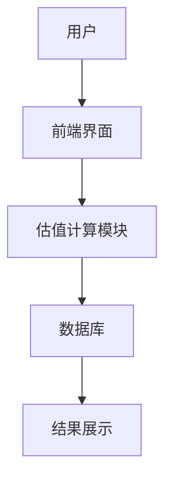

                 


# 可持续包装创新企业的市场估值方法

## 关键词：可持续包装，创新企业，市场估值，技术分析，投资决策，企业价值评估

## 摘要：  
本文系统探讨了可持续包装创新企业在市场估值中的关键方法。通过分析企业的技术创新、市场定位、品牌价值等核心因素，结合DCF模型和相对估值法，详细阐述了如何科学评估企业的市场价值。同时，文章提供了实际案例分析和代码实现，帮助读者掌握可持续包装企业的估值技巧，为投资决策提供有力支持。

---

# 第一部分: 可持续包装创新企业的市场估值背景与核心概念

## 第1章: 可持续包装创新企业的市场估值背景

### 1.1 可持续包装的定义与发展趋势
#### 1.1.1 可持续包装的定义
可持续包装是指在全生命周期内减少资源消耗、降低环境影响的包装方式，包括可回收、可降解、可再生等特性。其目标是减少对环境的负担，同时满足消费者对安全性和便利性的需求。

#### 1.1.2 可持续包装的发展趋势
近年来，随着环保意识的增强和政策法规的趋严，可持续包装市场需求持续增长。企业通过技术创新（如生物基材料、智能包装）和模式创新（如共享包装、逆向物流）不断提升市场竞争力。

#### 1.1.3 可持续包装对企业的战略意义
可持续包装不仅是企业社会责任的体现，更是获取竞争优势的关键。通过技术创新和可持续发展，企业能够提升品牌价值，吸引环保意识强的消费者和投资者。

### 1.2 创新企业的市场估值的重要性
#### 1.2.1 企业市场估值的基本概念
市场估值是衡量企业价值的重要指标，通常包括资产价值、收入、利润、市场份额等因素。准确的估值能够帮助企业制定合理的融资策略和投资决策。

#### 1.2.2 可持续包装创新企业的独特性
这类企业通过技术创新和可持续模式，具有较高的成长性和品牌溢价能力。其估值需要考虑技术壁垒、市场前景和政策支持等特殊因素。

#### 1.2.3 市场估值在企业融资与战略中的作用
市场估值直接影响企业的融资成本和投资吸引力。在可持续包装领域，合理的估值能够帮助企业吸引绿色投资者，推动技术创新和市场扩展。

---

## 第2章: 可持续包装创新企业的核心概念与联系

### 2.1 核心概念原理
#### 2.1.1 可持续包装的生命周期模型
可持续包装的生命周期包括原材料采购、生产、使用、回收再利用等阶段。企业需要在每个阶段优化资源利用，降低环境影响。

#### 2.1.2 创新企业的市场定位与竞争优势
通过技术创新和差异化策略，可持续包装企业能够在市场上占据领先地位。例如，采用可降解材料的企业可能吸引环保意识强的消费者。

#### 2.1.3 可持续包装与企业估值的关联性
可持续包装的技术创新和市场定位直接影响企业的收入、成本和利润，从而影响市场估值。投资者通常会给予具有可持续发展优势的企业更高的估值溢价。

### 2.2 核心概念属性特征对比表格
| 概念       | 环保性 | 可循环 | 成本优势 |
|------------|--------|--------|----------|
| 可持续包装 | 高     | 高     | 中到高   |
| 创新企业   | 高     | 高     | 中到高   |

### 2.3 ER实体关系图

```mermaid
erDiagram
    customer 购买行为
    investor 投资决策
    competitor 竞争分析
    company 可持续包装企业 {
        id : int
        name : string
        market_position : string
        innovation : string
        brand_value : float
    }
    relation 购买行为 {
        customer -> company : 购买产品
    }
    relation 投资决策 {
        investor -> company : 估值分析
    }
    relation 竞争分析 {
        competitor --> company : 行业分析
    }
    relation 供应链 {
        company <-供应商
    }
```

---

## 第3章: 可持续包装创新企业的市场估值算法与数学模型

### 3.1 市场估值的基本方法
市场估值通常采用以下方法：
1. **DCF模型**：基于未来现金流的现值计算企业价值。
2. **相对估值法**：通过比较同类企业的市盈率、市净率等指标进行估值。

### 3.2 DCF模型的数学公式
DCF模型的核心公式是计算未来现金流的现值：

$$
\text{企业价值} = \sum_{t=1}^{n} \frac{CF_t}{(1 + r)^t} + \frac{TV}{(1 + r)^n}
$$

其中：
- $CF_t$ 是第t年的自由现金流
- $r$ 是折现率
- $TV$ 是终值

### 3.3 Python代码实现DCF模型

```python
def discounted_cash_flow(FCF, WACC, horizon, terminal_value):
    """
    计算企业价值的DCF模型
    :param FCF: 自由现金流
    :param WACC: 加权平均资本成本
    :param horizon: 估值期间（年）
    :param terminal_value: 终值
    :return: 企业价值
    """
    value = 0
    for t in range(1, horizon + 1):
        value += FCF[t] / (1 + WACC) ** t
    value += terminal_value / (1 + WACC) ** horizon
    return value

# 示例数据
FCF = {1: 100, 2: 120, 3: 140}
WACC = 0.08
horizon = 3
terminal_value = 500

EV = discounted_cash_flow(FCF, WACC, horizon, terminal_value)
print(f"企业价值为: {EV}")
```

### 3.4 实际案例分析
假设某可持续包装企业未来三年的自由现金流分别为100万、120万、140万，终值为500万，WACC为8%。根据DCF模型，计算其企业价值：

$$
EV = \frac{100}{1.08} + \frac{120}{1.08^2} + \frac{140}{1.08^3} + \frac{500}{1.08^3}
$$

计算结果为约420.65万元。

---

## 第4章: 可持续包装创新企业的系统分析与架构设计

### 4.1 企业系统架构
系统架构包括前端（用户交互）、后端（数据处理）和数据库（存储）三个部分。前端负责展示估值结果，后端进行复杂计算，数据库存储企业数据。

### 4.2 功能设计
- 用户输入：企业基本信息、财务数据
- 计算模块：DCF模型、相对估值法
- 结果展示：企业价值、敏感性分析

### 4.3 系统架构图



### 4.4 接口设计
- API接口：用户输入数据
- 返回结果：企业价值、估值方法说明

---

## 第5章: 项目实战与案例分析

### 5.1 环境安装
需要安装Python、Pandas、NumPy等库。

### 5.2 核心实现代码
```python
import pandas as pd
import numpy as np

def relative_valuation(pe_ratio, industry_avg_pe, market_cap):
    """
    相对估值法计算
    :param pe_ratio: 企业PE比率
    :param industry_avg_pe: 行业平均PE
    :param market_cap: 市场资本化
    :return: 相对估值
    """
    relative_value = pe_ratio / industry_avg_pe * market_cap
    return relative_value

pe_ratio = 15
industry_avg_pe = 12
market_cap = 100000000

relative_value = relative_valuation(pe_ratio, industry_avg_pe, market_cap)
print(f"相对估值为: {relative_value}")
```

### 5.3 案例分析
某企业的PE比率为15，行业平均PE为12，市场资本化为1亿美元。相对估值为：

$$
\text{相对估值} = \frac{15}{12} \times 100,000,000 = 125,000,000
$$

---

## 第6章: 最佳实践与注意事项

### 6.1 小结
本文详细探讨了可持续包装创新企业的市场估值方法，结合DCF模型和相对估值法，提供了系统的分析框架和实际案例。

### 6.2 注意事项
1. 数据的准确性和完整性直接影响估值结果。
2. 选择合适的估值方法需结合企业特点和市场环境。
3. 考虑可持续包装的特殊性，如政策风险和技术壁垒。

### 6.3 拓展阅读
建议深入学习企业财务分析和绿色金融领域的知识，以更好地把握可持续包装企业的估值动态。

---

# 作者：AI天才研究院 & 禅与计算机程序设计艺术

